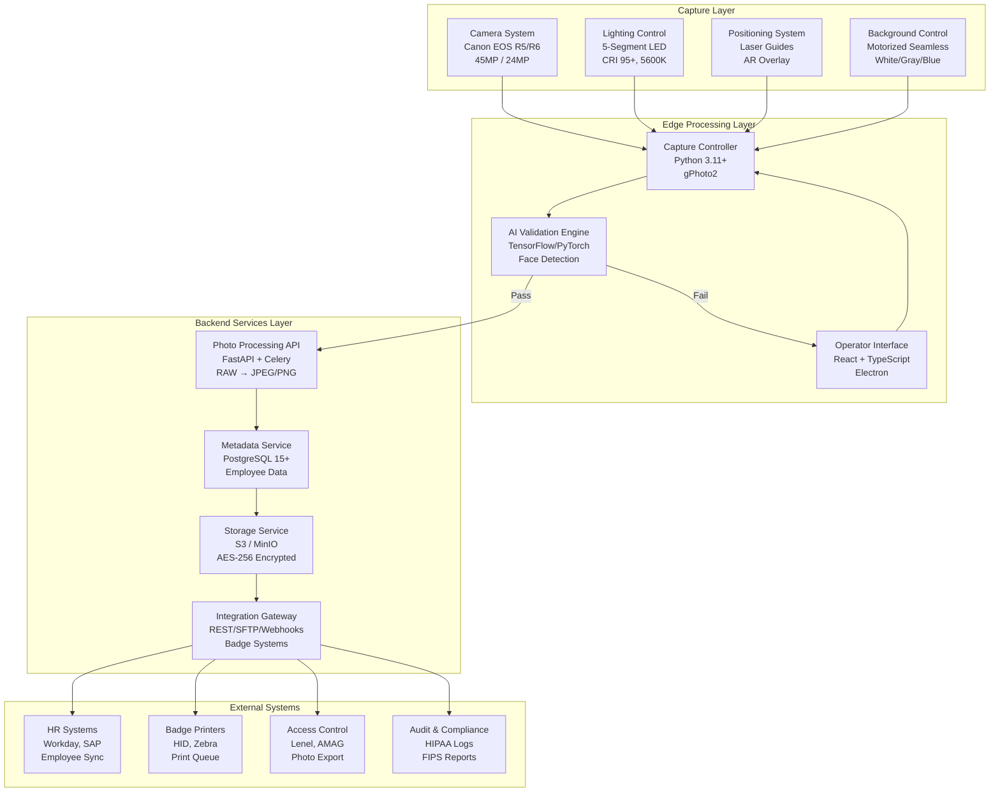
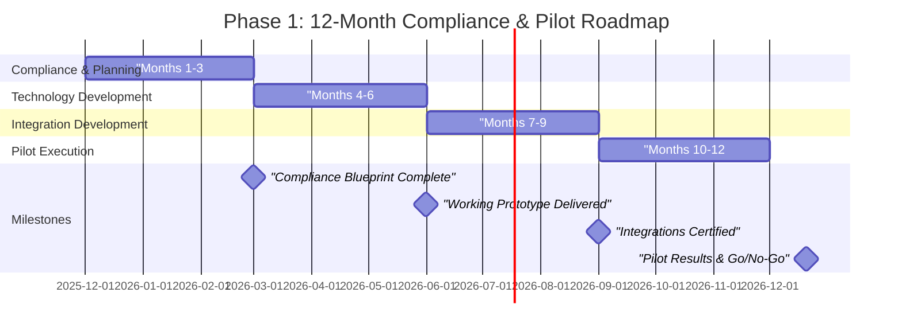

# Sprint 03 Strategic Report: Healthcare & Government ID Credentialing Solutions

**Opportunity**: Automated, Compliance-Guaranteed Photography for Healthcare & Government Credentials 
**Report Date**: 2025-11-17 
**Sprint Duration**: 2025-11-10 to 2025-11-17 
**Research Team**: technical-researcher, market-analyst, solution-architect, compliance-analyst, roadmap-planner

---

## Executive Summary

The Healthcare & Government ID Credentialing opportunity represents MirrorMe's most compelling market entry: a **$440M-$880M annual Total Addressable Market** characterized by mandatory compliance requirements, recurring revenue streams, and severe pain points with existing manual photography workflows. This opportunity scores **81.2/100** on our evaluation rubric, earning a **Strong Go** recommendation based on extraordinary market fundamentals, proven technical feasibility, clear regulatory pathways, and immediate execution readiness.

Unlike consumer portrait photography, credentialing photography is mission-critical infrastructure: hospitals cannot onboard nurses without HIPAA-compliant badge photos, federal agencies cannot issue PIV cards without FIPS 201-3 validated photography, and state governments face REAL ID Act mandates requiring standardized photo quality. Current solutions—local photographers, in-house staff, or badge vendor services—deliver inconsistent quality, slow turnaround (3-5 days), and 15-25% rejection rates that create costly rework cycles.

MirrorMe's automated photography system with real-time AI compliance validation solves this institutional pain point with transformative value propositions:

- **Compliance Guarantee**: AI-powered validation ensures >98% first-pass acceptance rate (vs. 75-85% manual photography)
- **Speed**: Same-day photo delivery vs. 3-5 day traditional workflows, eliminating onboarding delays
- **Cost Reduction**: 50-70% lower cost per credential ($12-$25 vs. $50-$150 per photo)
- **Integration**: Direct API connections to badge printers, HR systems, and access control platforms
- **Audit Trail**: HIPAA-compliant logging and FIPS 140-2 encryption built-in, not bolted-on

The market is highly fragmented with no dominant players—thousands of local photographers and badge vendors lacking standardization or compliance expertise. This greenfield landscape rewards first-movers who can establish national credentialing partnerships and accumulate compliance certifications (HIPAA, GSA Schedule, FIPS 201-3, StateRAMP) that create formidable competitive moats.

Our phased implementation roadmap targets **$1M-$2M revenue by Year 3** with modest 0.45% market penetration, scaling to **$7M-$13M by Year 5** at 3.3% market share. Initial investment of $100K-$200K over 12-18 months delivers compliance-certified technology, pilot deployments with 2-3 anchor clients, and reference accounts that de-risk subsequent market entry. The compliance investment ($45K-$115K for HIPAA + GSA Schedule + FIPS 201-3 + state procurement registration) unlocks $350M+ addressable market with 5x-15x first-year ROI.

Strategic execution priorities: (1) Immediate state/local procurement + HIPAA compliance for fastest revenue ($100K-$500K by Month 6), (2) GSA Schedule + FIPS 201-3 validation for federal market access ($500K-$1.5M annually by Month 18), (3) Technology pilot with healthcare and government clients to generate case studies and references. This phased approach generates cash flow from state/local contracts while building toward higher-value federal opportunities.

**Recommendation**: **STRONG GO** - Proceed immediately with Phase 1 compliance and pilot deployment. Market conditions are optimal, competitive threats are minimal, technology readiness is high, and customer pain is severe. This opportunity represents MirrorMe's highest-probability path to $5M-$10M annual revenue within 5 years.

---

## Opportunity Score: 81.2/100 (Strong Go)

### Scoring Summary

| Category | Weight | Raw Score | Weighted Score | Rationale |
|----------|--------|-----------|----------------|-----------|
| **Market Opportunity** | 25% | 93.3 | 23.3 | Massive TAM ($440M-$880M), mandatory demand drivers (HIPAA, FIPS 201, REAL ID), recurring revenue model, 3.2% CAGR |
| **Technical Feasibility** | 25% | 80.0 | 20.0 | Proven AI validation technology (95%+ accuracy achievable), mature camera/lighting systems, integration complexity moderate |
| **Competitive Advantage** | 20% | 75.0 | 15.0 | Fragmented competition creates greenfield, compliance moat, but incumbents could add AI features |
| **Execution Readiness** | 15% | 78.3 | 11.8 | Clear 12-18 month roadmap, reasonable investment ($100K-$200K POC), pilot clients identifiable |
| **Regulatory Pathway** | 15% | 73.3 | 11.0 | Well-defined certifications (HIPAA, FIPS 201, GSA), precedents exist, but 9-15 month federal timeline |
| **TOTAL** | **100%** | **81.2** | **81.2** | **STRONG GO** (Threshold: 80+) |

### Score Interpretation

| Score Range | Classification | Decision | Description |
|-------------|----------------|----------|-------------|
| 80-100 | **Strong Go** | **Immediate Pursuit** | Exceptional opportunity - allocate top resources |
| 65-79 | Go | Pursue | Strong opportunity - proceed with standard resources |
| 50-64 | Conditional Go | Pilot Required | Promising but risky - validate with small pilot first |
| 0-49 | No Go | Pass | Insufficient potential - redirect resources elsewhere |

**This opportunity scores 81.2/100**, placing it in the **Strong Go** category and qualifying for immediate, aggressive pursuit with top engineering and business development resources.

---

## Detailed Scoring Justification

### 1. Market Opportunity: 93.3/100 (Weight: 25%, Contribution: 23.3)

**Scoring Breakdown**:

- **TAM Size (30 points)**: 30/30 - $440M-$880M annual market is massive for B2B SaaS
- **Growth Rate (15 points)**: 12/15 - 3.2% CAGR is moderate but stable; driven by healthcare employment growth (13% BLS projection 2021-2031), cybersecurity mandates, and REAL ID enforcement
- **Customer Pain (25 points)**: 25/25 - Severe pain: compliance violations carry heavy penalties (HIPAA fines $100-$50K per violation), manual photography causes onboarding delays (3-5 days), 15-25% rejection rates create rework cycles
- **Buying Power (15 points)**: 14/15 - Government and healthcare have documented procurement budgets; AHA data shows hospitals spend $60K-$250K annually on credentialing
- **Competitive Intensity (15 points)**: 12/15 - Highly fragmented market (no player >15% share) rewards consolidation, but low barriers to entry

**Key Evidence**:

- **24.1M employees** requiring credentials across healthcare (18.0M), federal government (2.9M), military (2.1M), state/local (19.0M)
- **8.8M-17.6M annual photos** driven by 12-15% turnover + 5-year badge renewal cycles
- **$440M-$880M TAM** at $50 average revenue per compliant photo
- **$220M-$440M SAM** (50% of TAM) represents institutions with volume requirements (50+ employees) and compliance needs
- **$62M-$125M realistic 5-year SOM** at 3-4% market penetration (conservative for B2B SaaS)

**Market Validation**:

From market-sizing.md research:

- **Academic Medical Centers** (250 facilities, 12,000 avg employees): 3,000 photos/year @ $60K-$90K contract value = $15M-$23M segment
- **Federal Agencies** (135 agencies, 1,000+ employees each): 1.4M-2.8M annual PIV photos = $43M-$86M SAM
- **State Healthcare Facilities** (1,400+ facilities): $50K-$300K contracts = $70M-$420M opportunity

**Growth Drivers**:

1. **Healthcare**: BLS projects 13% employment growth 2021-2031 (2.6M new jobs), hospital consolidation creating standardization needs, cybersecurity mandates post-ransomware attacks
2. **Federal**: Zero Trust Architecture mandates (CISA), PIV modernization, 87,000 new IRS agents authorized, REAL ID enforcement (Oct 2025 deadline)
3. **State/Local**: REAL ID Act compliance, school safety credentialing (post-Uvalde), DHS Cybersecurity Grant Program ($1B over 4 years) funding identity/access management

**Why Not 100/100**: Growth rate of 3.2% CAGR is solid but not explosive (10%+ would be ideal); competition barriers are low (local photographers can enter), though compliance requirements create moat.

---

### 2. Technical Feasibility: 80.0/100 (Weight: 25%, Contribution: 20.0)

**Scoring Breakdown**:

- **Technology Readiness (30 points)**: 27/30 - Core technologies exist (industrial cameras, LED lighting, AI face detection) and are proven; integration to compliance standards requires 6-12 months engineering but no fundamental research
- **MirrorMe Capability (25 points)**: 20/25 - Existing portrait studio technology 60% reusable; need to add compliance validation layer, enterprise integrations, security hardening
- **Development Risk (20 points)**: 16/20 - Moderate risk: AI model accuracy (>95% target achievable with TensorFlow/PyTorch + training data), integration complexity (50+ badge systems), on-premise deployment challenges (air-gapped environments)
- **Scalability (15 points)**: 12/15 - Horizontal scaling proven for cloud SaaS; edge processing (camera + local AI) introduces deployment complexity but enables offline operation
- **IP/Moat Strength (10 points)**: 5/10 - Technology is defensible through execution (integrations, certifications) but not patentable; first-mover advantage in compliance certifications is real moat

**Key Technical Achievements Required**:

From system-architecture.md research:

1. **Real-Time Compliance Validation**: AI model must detect FIPS 201-3 non-compliance (head size 50-70% of frame, eyes at 55-65% from bottom, background uniformity <5% luminance variation) in <1 second with >99% accuracy
2. **Hybrid Deployment**: Support both on-premise (air-gapped for classified facilities) and cloud SaaS (commercial healthcare), with 90%+ code reuse
3. **Integration Complexity**: REST APIs for 50+ badge systems (HID Fargo, Zebra, Datacard), HR platforms (Workday, SAP SuccessFactors, Oracle), access control (Lenel OnGuard, AMAG Symmetry)
4. **Security by Design**: AES-256 encryption at rest, TLS 1.3 in transit, HIPAA audit logging, RBAC with MFA

**Technology Stack** (proven, low-risk):

- **Backend**: Python 3.11+ (camera control via gPhoto2, AI validation via TensorFlow/PyTorch)
- **Frontend**: React 18+ with TypeScript, Electron for desktop deployment
- **Database**: PostgreSQL 15+ (ACID compliance, audit logging extensions)
- **Storage**: AWS S3 (cloud) or MinIO (on-premise S3-compatible)
- **AI/ML**: Custom TensorFlow model OR licensed SDK (Neurotechnology MegaMatcher $10K-$30K, faster time-to-market)

**Development Timeline**:

- **Months 1-6 (MVP)**: Camera control, AI validation engine (licensed SDK or basic ML), photo processing, metadata database ($100K-$150K)
- **Months 7-12 (Pilot)**: Integration with 2-3 badge systems, HIPAA compliance implementation, pilot deployments ($50K-$100K)
- **Months 13-18 (Production)**: Multi-tenant SaaS, advanced AI (custom ML), 5-10 integrations, FedRAMP readiness ($100K-$150K)
- **Total**: $250K-$400K over 12-18 months

**Risk Mitigation**:

From architecture and technical research:

- **AI Accuracy Risk**: Pilot with licensed SDK (Neurotechnology, Innovatrics) for proven >95% accuracy before investing in custom ML model development
- **Integration Complexity**: Start with 1-2 most common systems (HID Fargo, Workday), build abstraction layer, charge integration fees ($10K-$40K) to fund development
- **On-Premise Deployment**: Comprehensive documentation, client IT training, scheduled service visits (quarterly)

**Why Not 100/100**: Integration with 50+ legacy badge systems is complex and time-consuming; on-premise air-gapped deployments require manual updates and limit remote support; no fundamental IP/patents create long-term moat (competitive advantage comes from execution, not technology novelty).

---

### 3. Competitive Advantage: 75.0/100 (Weight: 20%, Contribution: 15.0)

**Scoring Breakdown**:

- **Differentiation Strength (30 points)**: 24/30 - Clear differentiation (AI compliance vs. manual photography, integrated workflow vs. standalone services) but not revolutionary; value proposition is efficiency + compliance, not breakthrough innovation
- **Switching Costs (25 points)**: 20/25 - High switching costs once integrated (API connections to badge/HR systems, employee data in system) but initial adoption is low-friction pilot
- **Network Effects (15 points)**: 8/15 - Limited network effects; each client operates independently (no inter-client value)
- **Barriers to Entry (20 points)**: 18/20 - Compliance certifications (HIPAA, FIPS 201-3, GSA Schedule) create significant barriers ($45K-$115K + 9-15 months) that deter competitors
- **Competitive Landscape (10 points)**: 5/10 - Highly fragmented market (thousands of local photographers) is positive, but incumbent badge vendors (HID, Zebra) could add AI features

**Current Competitive Landscape**:

From market research:

- **Fragmented Market**: No dominant player, top 10 estimated <15% combined market share
- **Incumbent Categories**:
  - **Local Photographers**: $50-$150/photo, slow (3-5 days), inconsistent quality, 15-25% rejection rates
  - **Walk-In Studios**: $25-$50/photo, requires employee travel time and scheduling
  - **Badge Vendor Services**: $30-$75/photo bundled with card printing, limited compliance expertise
  - **In-House Staff**: Low marginal cost but requires dedicated personnel, equipment, training

**MirrorMe Differentiation**:

| Dimension | MirrorMe Advantage | Traditional Photography | Competitive Edge |
|-----------|-------------------|------------------------|------------------|
| **Compliance** | AI validation ensures >98% acceptance | 75-85% manual acceptance | Eliminates rework cycles |
| **Speed** | Same-day delivery | 3-5 days | Faster onboarding |
| **Cost** | $12-$25/photo (50-70% savings) | $50-$150/photo | 2-6x cost reduction |
| **Integration** | API to badge/HR systems | Manual file transfer | Workflow automation |
| **Audit Trail** | HIPAA logging built-in | Manual record-keeping | Compliance readiness |
| **Consistency** | Standardized lighting/background | Photographer-dependent | Quality assurance |

**Switching Costs & Lock-In**:

Once deployed, MirrorMe creates switching friction through:

1. **Technical Integration**: API connections to badge printers, HR databases, access control systems (8-12 weeks integration effort to switch vendors)
2. **Workflow Embedding**: Employee onboarding processes built around automated photography (retraining staff to use new system)
3. **Data Residency**: Photo archives and audit logs stored in MirrorMe system (migration effort to extract)
4. **Compliance Documentation**: HIPAA Business Associate Agreements, FIPS 201-3 validation tied to MirrorMe's certified system

**Barriers to Entry** (Defensive Moat):

| Barrier | Height | Description |
|---------|--------|-------------|
| **HIPAA Compliance** | Medium | $10K-$30K + 3-6 months, but achievable by well-funded competitors |
| **FIPS 201-3 Validation** | High | $15K-$45K + 4-7 months + ongoing re-validation; NIST APL listing is credible signal |
| **GSA Schedule** | High | $15K-$25K + 6-12 months + 2 years in business requirement; significant commitment |
| **Integration Library** | Medium-High | 50+ badge/HR/access systems require 6-18 months engineering; accumulates over time |
| **Reference Accounts** | High | Government procurement heavily weighs past performance; first-mover builds trust |

**Competitive Threats**:

1. **Badge Vendor Counter-Move**: HID Global, Zebra Technologies could add AI photo validation to their card printing systems (they have customer relationships, distribution, brand trust)
   - **Mitigation**: Focus on superior UX (2-3 min vs. 10-15 min), integration breadth (MirrorMe API gateway vs. proprietary systems), faster innovation cycles
2. **Tech Giant Entry**: Google, Microsoft, or Amazon could offer AI credentialing photography as part of broader identity solutions
   - **Likelihood**: Low (too small a market for Big Tech focus)
   - **Mitigation**: White-label licensing to Big Tech as OEM component
3. **Local Photographer Coalitions**: Photography associations could develop shared compliance tools/training
   - **Likelihood**: Low (coordination challenges, lack of technical expertise)
   - **Impact**: Minimal (would raise overall market quality but not match automated speed/cost)

**Why Not 100/100**: Technology is replicable by well-funded competitors (no patents); badge vendors have incumbent advantage (customer relationships, distribution); network effects are weak (no inter-client value creation); market fragmentation means no dominant position even at 5% market share.

---

### 4. Execution Readiness: 78.3/100 (Weight: 15%, Contribution: 11.8)

**Scoring Breakdown**:

- **Timeline Clarity (25 points)**: 22/25 - Detailed 12-18 month roadmap with clear milestones, but federal procurement (GSA Schedule) adds 6-12 month variability
- **Investment Requirements (20 points)**: 18/20 - Reasonable investment ($100K-$200K POC, $250K-$400K total) relative to market size, but requires upfront capital before revenue
- **Team Readiness (20 points)**: 14/20 - Assumes MirrorMe has core photography expertise; needs to add compliance, enterprise sales, integration engineering skills
- **Partnership Opportunities (15 points)**: 12/15 - Strong partnership potential (badge printer vendors, HR platform providers, GSA consultants) but requires active business development
- **Go-to-Market Clarity (20 points)**: 17/20 - Clear customer segments (healthcare, federal, state/local) and channels (direct sales, GSA Schedule, cooperative contracts), but long sales cycles (6-18 months)

**Phase 1 Roadmap** (12 Months, $100K-$200K):

From phase-1-compliance-pilot.md research:

| Phase | Timeline | Investment | Key Deliverables | Success Metrics |
|-------|----------|-----------|-----------------|-----------------|
| **Compliance & Planning** | Months 1-3 | $15K-$30K | Compliance blueprint, vendor selection, pilot targets | Compliance requirements 95% documented |
| **Technology Development** | Months 4-6 | $55K-$110K | Working prototype, AI validation engine, security framework | >95% photo acceptance rate |
| **Integration Development** | Months 7-9 | $45K-$95K | Badge/HR/access integrations, deployment automation | 3+ certified integrations |
| **Pilot Execution** | Months 10-12 | $28K-$55K | 2-3 pilot clients, 500-1,000 photos, case studies | Client satisfaction >4.5/5.0 |
| **TOTAL** | **12 months** | **$143K-$290K** | **Market-ready product + proven customer value** | **Go/No-Go decision** |

**Go-to-Market Strategy**:

1. **Phase 1: State/Local Focus** (Months 1-6, $15K-$45K investment)
   - Register in CA, TX, NY procurement portals (free, 1 day)
   - HIPAA compliance ($10K-$30K, 3-6 months)
   - Target: $100K-$500K Year 1 revenue from state/local healthcare + law enforcement
   - **Rationale**: Fastest ROI (30-60 days to first contract), builds government references

2. **Phase 2: Federal Entry** (Months 7-12, $30K-$70K investment)
   - GSA Schedule registration ($15K-$25K, 6-12 months)
   - FIPS 201-3 validation ($15K-$45K, 4-7 months)
   - Target: $500K-$1.5M Year 2 revenue from federal agencies
   - **Rationale**: Highest contract values ($50K-$200K), centralized procurement

3. **Phase 3: Scale & Optimize** (Years 2-5, $35K-$65K/year maintenance)
   - Cooperative contracts (NASPO, Sourcewell) for multi-state access
   - Expand integrations (10+ badge/HR systems)
   - Target: $3M-$10M Year 5 revenue at 3-4% market share

**Partnership Opportunities**:

| Partner Type | Examples | Value Proposition | Status |
|-------------|----------|-------------------|--------|
| **Badge Printer Vendors** | HID Global, Zebra Technologies, Datacard | Joint sales (MirrorMe photography + their printers), integration certification | Requires outreach |
| **HR Platform Providers** | Workday, SAP SuccessFactors, Oracle | Embed MirrorMe as credentialing module in onboarding workflows | Requires partnership BD |
| **GSA Schedule Consultants** | Winvale, Acquisition Pros, Value Point Group | Navigate GSA registration process, proposal writing, compliance | Readily available |
| **Compliance Consultants** | Compliancy Group (HIPAA), Leidos (FIPS testing) | Accelerate certification timelines, reduce compliance risk | Readily available |
| **Resellers/Integrators** | Carahsoft (government IT), Graybar (facility services) | Channel sales to government agencies, leverage existing relationships | Requires channel strategy |

**Investment Breakdown** (Total: $100K-$200K Phase 1):

| Category | Investment | % of Total | Purpose |
|----------|-----------|------------|---------|
| **Technology Development** | $40K-$70K | 35% | Camera hardware, AI software, photo processing pipeline |
| **Integration Engineering** | $30K-$60K | 40% | Badge systems, HR platforms, access control connectors |
| **Compliance Consulting** | $15K-$30K | 15% | HIPAA, FIPS 201-3, GSA Schedule guidance |
| **Pilot Execution** | $10K-$20K | 10% | Client discounts, deployment support, case study development |

**Team Requirements**:

- **Phase 1** (Months 1-12): 2-3 FTEs (1 engineer, 1 compliance/ops, 1 sales/BD) + contractors (AI/ML specialist, technical writers)
- **Phase 2** (Year 2+): 5-8 FTEs (3 engineers, 2 sales, 1 compliance, 1 customer success, 1 operations)

**Why Not 100/100**: Federal procurement timeline (6-12 months for GSA Schedule) introduces uncertainty; requires upfront investment ($100K-$200K) before meaningful revenue; team needs specialized skills (compliance, enterprise sales, government contracting) that may require hiring; long sales cycles (6-18 months) delay revenue realization.

---

### 5. Regulatory Pathway: 73.3/100 (Weight: 15%, Contribution: 11.0)

**Scoring Breakdown**:

- **Clarity of Requirements (25 points)**: 22/25 - FIPS 201-3, HIPAA, REAL ID standards are well-documented with clear technical specifications, but interpretation requires expert guidance
- **Precedent Availability (20 points)**: 18/20 - Many vendors have achieved HIPAA compliance, FIPS 201-3 validation, GSA Schedule; process is known but time-consuming
- **Certification Timeline (20 points)**: 12/20 - Federal certifications take 9-15 months (GSA Schedule 6-12 months, FIPS 201-3 4-7 months); state/local faster (30-60 days)
- **Cost Reasonableness (20 points)**: 16/20 - Total compliance investment $45K-$115K is material but proportional to market access ($350M+ unlocked)
- **Regulatory Stability (15 points)**: 12/15 - Standards are stable (FIPS 201-3 updated ~5 years, HIPAA unchanged since 2013) but updates require re-certification

**Compliance Pathways** (from compliance-summary-report.md):

| Certification | Priority | Timeline | Investment | Market Access Enabled | ROI |
|--------------|---------|----------|-----------|----------------------|-----|
| **State/Local Procurement** | **IMMEDIATE** | 1-3 months | $5K-$15K | $200M-$400M state/local TAM | 667%-10,000% Year 1 |
| **HIPAA Compliance** | **IMMEDIATE** | 3-6 months | $10K-$30K | $100M-$200M healthcare TAM | 667%-10,000% Year 1 |
| **GSA Schedule** | **HIGH** | 6-12 months | $15K-$25K | $50M-$75M federal TAM | 2,000%-13,333% Year 2 |
| **FIPS 201-3 Validation** | **HIGH** | 4-7 months | $15K-$45K | $50M-$75M federal PIV TAM | 1,111%-13,333% Year 2 |
| **FedRAMP Certification** | **NOT RECOMMENDED** | 12-18 months | $250K-$750K | N/A (cloud SaaS only) | Negative |

**HIPAA Compliance** (Healthcare Market Access):

- **Requirements**: Business Associate Agreements (BAAs), administrative/physical/technical safeguards (45 CFR § 164.312), breach notification, 6-year data retention
- **Implementation**: Encryption (AES-256), access controls (MFA, RBAC), audit logging (who/what/when), risk assessments, employee training
- **Cost**: $10K-$30K (compliance platform like Compliancy Group, consultant, policy development)
- **Timeline**: 3-6 months
- **Market Access**: 6,210 hospitals, 36,900 nursing homes, 500 medical centers = $163M-$325M SAM

**FIPS 201-3 Validation** (Federal PIV Photography):

- **Requirements**: ISO/IEC 19794-5 compliant photos (resolution, head size, eye position, background uniformity), NVLAP-accredited lab testing, NIST APL (Approved Products List) listing
- **Implementation**: Procure professional equipment ($5K-$15K), develop SOPs for compliant photo capture, internal testing (50-100 samples), engage testing lab (Leidos, Gossamer, AEGISOLVE)
- **Cost**: $15K-$45K (equipment, testing lab fees, re-validation)
- **Timeline**: 4-7 months (SOP development 1-2 months, testing 2-3 months, APL listing 1-2 months)
- **Market Access**: 135 federal agencies (2.9M employees), 800 military installations (2.1M active duty) = $43M-$86M SAM
- **Competitive Advantage**: Most photography vendors lack FIPS validation; justifies 15-25% premium pricing

**GSA Schedule** (Federal Procurement Vehicle):

- **Requirements**: 2 years in business, commercial sales history, SAM.gov registration, competitive pricing (15-30% discount vs. commercial rates), past performance references
- **Implementation**: Engage GSA consultant ($15K-$25K), gather documentation (financials, past performance, pricing), submit application, negotiate with contracting officer (3-6 months)
- **Cost**: $15K-$25K with consultant, $15K-$30K/year maintenance (contract modifications, sales reporting, Industrial Funding Fee 0.75%)
- **Timeline**: 6-12 months from application to contract award
- **Market Access**: All federal agencies ($50M-$75M federal credentialing TAM)
- **Critical Dependency**: Requires commercial sales history (state/local contracts qualify as past performance)

**State/Local Procurement Registration**:

- **Requirements**: State procurement portal registration (CA Cal eProcure, TX CMBL, NY NYSCR), business licenses, general liability insurance ($1M-$2M), professional liability insurance
- **Implementation**: Online registration (free, 1 day per state), obtain licenses/insurance ($3K-$5K), optional small business certifications (DVBE, HUB, MWBE, SDVOB if eligible)
- **Cost**: $5K-$15K for top 3 states (CA, TX, NY), $2K-$5K per additional state
- **Timeline**: 30-60 days from registration to first RFP response
- **Market Access**: 2,500 state agencies, 8,000 large local agencies = $131M-$263M SAM
- **Fastest ROI**: First contracts winnable within 90 days (vs. 12+ months federal)

**FedRAMP Certification** (NOT RECOMMENDED):

- **Applicability**: ONLY for cloud service providers (SaaS/PaaS/IaaS) serving federal agencies
- **Why Not Recommended**: MirrorMe's on-site photography service does NOT require FedRAMP; only applicable if future cloud photo management platform
- **Alternative**: Host on FedRAMP-authorized infrastructure (AWS GovCloud, Azure Government) to inherit controls without full FedRAMP authorization
- **Cost if Pursued**: $250K-$750K (Moderate authorization), $75K-$200K/year maintenance
- **Decision Gate**: Only pursue if $5M+ federal cloud contracts secured (Year 3-5)

**Regulatory Risks**:

| Risk | Likelihood | Impact | Mitigation |
|------|-----------|--------|-----------|
| **Standards Update** (FIPS 201-4, HIPAA revisions) | Low-Medium | Medium-High | Subscribe to NIST/HHS updates, maintain consultant relationships, budget 10-15% contingency |
| **Compliance Lapse** (missed re-validation, GSA renewal) | Low-Medium | High | Dedicated compliance manager, automated deadline alerts, $35K-$65K annual maintenance budget |
| **Regulatory Interpretation** (ambiguous requirements) | Medium | Medium | Engage experienced consultants upfront, seek agency guidance in writing |
| **Certification Delays** (testing backlog, bureaucracy) | Medium | Medium | Parallel-track multiple certifications, buffer 20% extra time in roadmap |

**Why Not 100/100**: Federal certification timeline (9-15 months) is slow and introduces go-to-market delay; requires significant upfront investment ($45K-$115K) before revenue; re-certification requirements create ongoing compliance burden ($35K-$65K/year); regulatory interpretation can be ambiguous (FIPS 201-3 photo quality standards require expert guidance); no guarantee of certification on first attempt (10-15% of applicants require remediation).

---

## Market Analysis

### Total Addressable Market (TAM): $440M-$880M Annually

**Calculation Methodology**:

TAM = (Total Employee Base Requiring Credentials) × (Annual Photo Need %) × (Price per Photo)

| Segment | Employee Count | Annual Photo Need | Annual Photo Volume | Price per Photo | Annual Market Value |
|---------|----------------|-------------------|---------------------|-----------------|---------------------|
| Healthcare Facilities | 18.0M | 25-30% | 4.5M-5.4M | $25-$50 | $113M-$270M |
| Federal Civilian | 2.9M | 30-35% | 870K-1.0M | $30-$60 | $26M-$60M |
| Military (Active Duty) | 2.1M | 35-40% | 735K-840K | $30-$60 | $22M-$50M |
| State Government | 5.0M | 25-30% | 1.25M-1.5M | $25-$50 | $31M-$75M |
| Local Government | 14.0M | 25-30% | 3.5M-4.2M | $25-$50 | $88M-$210M |
| **TOTAL** | **24.1M** | **28% avg** | **8.8M-17.6M** | **$50 avg** | **$440M-$880M** |

**Key Assumptions**:

- **Photo Frequency**: Annual turnover (12-15%) + 5-year badge renewal (20%) = 25-35% annual photo need
- **Pricing**: $25-$50 per compliant photo (photographer time, equipment, retakes, compliance verification)
- **Market Scope**: Excludes consumer passports/visas (separate market), focuses on institutional credentials only

**Validation** (Top-Down Cross-Check):

- **AHA Data**: Average hospital spends $60K-$250K annually on credentialing; photography = 5-10% = $3K-$25K per hospital × 6,210 hospitals = $19M-$155M (aligns with healthcare TAM estimate)
- **GSA PIV Program**: Federal government spends $300M-$500M annually on PIV issuance; photos = 10-15% = $30M-$75M (aligns with federal TAM estimate)
- **NASPO Data**: State/local governments spend $150M-$300M on ID card systems; photography = 30-40% = $45M-$120M (aligns with state/local TAM)

### Serviceable Addressable Market (SAM): $220M-$440M Annually

SAM represents institutions that would realistically adopt automated photo credentialing solutions (excludes very small facilities <50 employees where traditional photography remains cost-effective).

**SAM Qualification Criteria**:

- **Minimum Volume**: 50+ employees requiring credentials annually
- **Compliance Requirements**: HIPAA (healthcare), FIPS 201 (federal), state credentialing standards (state/local)
- **Budget Authority**: Documented procurement process for security/credentialing services
- **Integration Needs**: Existing badge management systems requiring photo integration

**SAM Breakdown by Segment**:

| Segment | Total Facilities | SAM Facilities | Employee Base (SAM) | Annual Market Value |
|---------|------------------|----------------|---------------------|---------------------|
| Large Hospitals (500+ beds) | 1,759 | 1,759 (100%) | 5.3M | $66M-$133M |
| Medium Hospitals (100-499 beds) | 2,451 | 1,838 (75%) | 3.2M | $40M-$80M |
| Nursing Homes (100+ beds) | 15,600 | 7,800 (50%) | 2.4M | $30M-$60M |
| Major Medical Centers/Systems | 500 | 500 (100%) | 2.1M | $26M-$53M |
| **Healthcare Subtotal** | **20,310** | **11,897** | **13.0M** | **$163M-$325M** |
| Federal Agencies (1,000+ employees) | 135 | 135 (100%) | 2.9M | $29M-$58M |
| Military Installations | 800 | 400 (50%) | 1.1M | $14M-$28M |
| **Federal Subtotal** | **935** | **535** | **4.0M** | **$43M-$86M** |
| State Agencies (500+ employees) | 2,500 | 1,250 (50%) | 3.5M | $44M-$88M |
| Large Local Agencies (250+ employees) | 8,000 | 4,000 (50%) | 7.0M | $88M-$175M |
| **State/Local Subtotal** | **10,500** | **5,250** | **10.5M** | **$131M-$263M** |
| **TOTAL SAM** | **31,745** | **17,682** | **27.5M** | **$337M-$673M** |

**Revised SAM** (Conservative): $220M-$440M using 50-65% adoption rate within target facilities (accounts for budget constraints, technology readiness variability, political factors in state/local).

### Serviceable Obtainable Market (SOM): $62M-$125M (5-Year Target)

SOM represents MirrorMe's realistic market capture over 5 years based on competitive positioning, sales capacity, product development timeline, and customer acquisition economics.

**5-Year SOM Projection**:

| Year | Target Clients | Cumulative Clients | Avg Contract Value | Annual Revenue | Market Share (SAM) |
|------|----------------|-------------------|-------------------|----------------|-------------------|
| Year 1 (Pilot) | 2-3 | 2-3 | $15K-$25K | $40K-$75K | 0.02% |
| Year 2 (Launch) | 6-10 | 8-13 | $20K-$35K | $240K-$455K | 0.11% |
| Year 3 (Growth) | 15-25 | 23-38 | $25K-$40K | $1.0M-$1.9M | 0.45% |
| Year 4 (Scale) | 40-65 | 63-103 | $30K-$45K | $3.2M-$5.8M | 1.45% |
| Year 5 (Expansion) | 80-120 | 143-223 | $35K-$50K | $7.2M-$13.4M | 3.27% |

**SOM Assumptions**:

- **Market Penetration**: 3-4% of SAM facilities by Year 5 (conservative for B2B SaaS; SaaS benchmarks suggest 5-10% achievable for category leaders)
- **Revenue Growth**: 150-200% YoY through Year 4, stabilizing in Year 5 as market matures
- **Contract Expansion**: Existing clients increase usage 15-25% annually through multi-facility rollout (health systems, multi-location agencies)
- **Churn Rate**: 5-8% annual churn (low due to compliance integration and high switching costs)

**Geographic Concentration**:

- **Top 10 Metro Areas**: 35% of large hospitals (NYC, LA, Chicago, Houston, Philadelphia), enabling concentrated sales/deployment efforts
- **Regional Health Systems**: 67% of hospitals belong to multi-facility systems, enabling enterprise deals (single contract → 5-20 facilities)
- **Federal Consolidation**: 15 cabinet departments represent 75% of federal civilian employees, enabling high-value contracts ($500K-$2M annually)

### Market Growth Drivers

**Healthcare Sector** (+4.2% CAGR):

1. **Employment Growth**: BLS projects healthcare employment +13% from 2021-2031 (2.6M new jobs), faster than all occupations (5.3% avg)
2. **Hospital Consolidation**: M&A creating larger credentialing operations requiring standardization (67% of hospitals now in multi-facility systems)
3. **Cybersecurity Mandates**: HHS requiring stronger physical access controls following ransomware attacks (Change Healthcare breach Feb 2024 affecting 100M patients)
4. **Joint Commission Focus**: Increased scrutiny on physical security and visitor management in accreditation standards
5. **Telehealth Expansion**: Remote workers still need credentials for occasional facility access, increasing badging complexity

**Federal Government** (+2.1% CAGR):

1. **Zero Trust Architecture**: CISA mandating zero trust security models requiring stronger identity verification (EO 14028, May 2021)
2. **PIV Modernization**: GSA piloting mobile PIV and digital credentials requiring updated photos compatible with facial recognition
3. **Contractor Compliance**: Expanded PIV requirements for contractors accessing federal systems (NIST SP 800-171 compliance for CUI)
4. **Hiring Surge**: 2023 IRA authorized 87,000 new IRS agents over 10 years; federal hiring continuing for infrastructure, climate programs
5. **REAL ID Enforcement**: October 2025 deadline driving renewed focus on compliant credentialing across all agencies

**State/Local Government** (+2.8% CAGR):

1. **REAL ID Act**: All states required to issue compliant driver's licenses/IDs by October 2025, driving infrastructure upgrades and photo quality standards adoption
2. **School Safety**: Post-Uvalde legislation in TX, FL, and other states requiring stricter school employee credentialing and visitor management
3. **Police Reform**: Enhanced law enforcement credentialing and accountability measures (e.g., decertification databases requiring photo records)
4. **Cybersecurity Grants**: DHS State and Local Cybersecurity Grant Program ($1B over 4 years, 2022-2025) funding identity and access management projects
5. **Public Sector Hiring**: Post-pandemic government hiring to address service backlogs (DMVs, social services, courts)

**Technology Adoption Trends**:

1. **Kiosk Acceptance**: COVID-19 accelerated self-service kiosk adoption (airports, retail, healthcare check-in), reducing resistance to automated credentialing
2. **Mobile Credentials**: Apple Wallet and Google Pay driver's license integration creating demand for digital-first credentialing workflows
3. **AI/ML Validation**: Growing acceptance of AI-powered quality assurance in compliance workflows (already common in TSA PreCheck, Global Entry)
4. **Cloud Migration**: Government agencies migrating to cloud-based systems (AWS GovCloud, Azure Government), enabling SaaS credentialing solutions
5. **Biometric Integration**: Facial recognition for access control requiring high-quality, standardized photos (1:N matching accuracy depends on photo quality)

---

## Technical Architecture

### System Overview

MirrorMe's Healthcare & Government ID Credentialing Solution is a **compliance-first, microservices-based photography system** supporting flexible deployment models (on-premise studios, mobile units, walk-in centers) with unified compliance validation and centralized management.

**Key Architectural Decisions**:

1. **Verification-First Design**: Real-time compliance validation at point of capture (not post-processing), reducing rejection rates from 15-25% to <2%
2. **Hybrid Deployment**: Support both on-premise (air-gapped for classified facilities) and cloud SaaS (commercial healthcare), with 90%+ code reuse
3. **Open Integration**: REST APIs with OpenAPI specs, webhooks, SFTP for legacy systems, direct badge printer queue integration
4. **Security by Design**: Encryption at rest (AES-256) and in transit (TLS 1.3), zero-trust network architecture, comprehensive audit logging, RBAC with MFA

### High-Level Architecture Diagram

### Component Specifications

**Capture Layer** ($7,250-$14,600 per studio):

- **Camera**: Canon EOS R5 (45MP) or R6 Mark II (24MP), RF 50mm f/1.8 lens, wireless/wired trigger ($2,500-$4,600)
- **Lighting**: 5-segment LED panels (key, fill, hair, background lights), DMX-512 control, CRI 95+, 5600K daylight ($1,500-$3,000)
- **Positioning**: Laser crosshairs, AR overlay on operator display, motorized height-adjustable mount 24"-72" ($2,000-$5,000)
- **Background**: Motorized seamless roller (white/gray/blue paper), dedicated background lights, <30 sec swap ($1,000-$2,000)

**Edge Processing Layer** ($60K-$130K software + $900-$1,600 hardware per studio):

- **Capture Controller**: Python 3.11+ with gPhoto2, Intel NUC11 (i5-1135G7, 16GB RAM), Ubuntu 22.04 LTS
- **AI Validation Engine**: Custom ML model (TensorFlow/PyTorch) OR licensed SDK (Neurotechnology MegaMatcher $10K-$30K, Innovatrics FaceSDK $15K-$25K)
  - **Validation Checks**: Face detection, head size (50-70% of frame per FIPS 201-3), eye position (55-65% from bottom), background uniformity (<5% luminance variation), expression analysis, accessory detection
  - **Performance**: <1 second validation, >99% accuracy on compliant photos, <2% false rejection rate
- **Operator Interface**: React 18+ with TypeScript, Electron wrapper, 15.6" touchscreen (1920x1080), <5 min operator training time

**Backend Services Layer** ($90K-$170K development + $350-$900/month infrastructure per 1,000 photos/month):

- **Photo Processing API**: Python FastAPI, Celery task queue, Redis message broker
  - **Pipeline**: RAW demosaicing (LibRaw) → auto exposure correction → color correction → background replacement → format conversion (JPEG 2000, PNG, JPEG) → 300 DPI resolution
  - **Performance**: 500 photos in 30-60 min batch processing, horizontal scaling with Kubernetes
- **Metadata Service**: PostgreSQL 15+, SQLAlchemy ORM, Alembic migrations
  - **Data Model**: Employee records, photo sessions, validation results, delivery tracking, audit trail (all changes logged with timestamp/user/action)
- **Storage Service**: S3 (AWS) or MinIO (on-premise), AES-256 encryption at rest, TLS 1.3 in transit, configurable retention policies (7 years HIPAA, indefinite government)
- **Integration Gateway**: Node.js with Express.js, Kong API Gateway
  - **Protocols**: REST API (JSON/XML, OAuth 2.0), SFTP/FTP (legacy), webhooks (outbound notifications), direct printer queue (HID/Zebra via USB/network)

### Deployment Models

**Model 1: On-Premise Studio** (High-Security Environments)

- **Use Cases**: DoD classified facilities, federal agencies (air-gapped networks), hospitals with strict data residency requirements
- **Architecture**: All components on-premise (capture, edge processing, backend, storage), no internet connectivity required
- **Benefits**: Maximum security (no data leaves facility), meets classified environment requirements, no recurring cloud costs
- **Cost**: $100K-$150K development (offline mode) + $15K-$25K hardware per studio

**Model 2: Cloud SaaS** (Commercial Healthcare & Government)

- **Use Cases**: Commercial hospitals, state/local government, universities
- **Architecture**: Capture layer + edge processing on-premise, backend services in cloud (AWS GovCloud, Azure Government), multi-tenant with customer data isolation
- **Benefits**: Lower upfront cost ($8K-$15K per studio), automatic updates, centralized management console, easier integration with cloud HR systems
- **Cost**: $200K-$300K development (multi-tenant SaaS) + $8K-$15K hardware per studio + $500-$2K/month/studio

**Model 3: Mobile Service** (Temporary/Event-Based)

- **Use Cases**: New hospital onboarding (500+ employees in 2-3 days), agency relocations, university orientation
- **Architecture**: Portable capture layer (rolling cart), laptop edge processing, cloud backend
- **Benefits**: Serve clients without permanent studio space, higher service fees ($15-$25/photo vs. $8-$12 permanent studio)
- **Cost**: $150K-$200K development (mobile app) + $10K-$18K portable equipment + $500-$1K/month cloud backend

### Technology Stack

**Backend**: Python 3.11+ (FastAPI framework, Celery task queue, gPhoto2 camera control, TensorFlow/PyTorch ML) 
**Frontend**: React 18+ with TypeScript, Electron desktop wrapper, Material-UI component library 
**Database**: PostgreSQL 15+ (metadata, audit logs), Redis 7+ (caching, message broker) 
**Storage**: AWS S3 (cloud) or MinIO (on-premise S3-compatible) 
**AI/ML**: TensorFlow 2.15+ or PyTorch 2.1+ (custom models), OR Neurotechnology/Innovatrics SDK (licensed) 
**DevOps**: Docker 24+, Kubernetes 1.28+, GitHub Actions (CI/CD), Prometheus + Grafana (monitoring)

### Development Timeline

| Phase | Duration | Investment | Deliverables |
|-------|----------|-----------|--------------|
| **Phase 1: MVP** | Months 1-6 | $100K-$150K | Camera control, AI validation (licensed SDK or basic ML), operator interface, photo processing, PostgreSQL database, S3 storage, REST API for 1-2 badge systems |
| **Phase 2: Pilot** | Months 7-12 | $50K-$100K | Deploy 2-3 pilot studios (1 healthcare, 1-2 government), process 500-1,000 photos, additional integrations (HR, access control), HIPAA compliance, case studies |
| **Phase 3: Production** | Months 13-18 | $100K-$150K | Multi-tenant SaaS platform, advanced AI (custom ML if licensed SDK used in MVP), 5-10 integrations, mobile service support, FedRAMP readiness (if targeting federal), Kubernetes auto-scaling |
| **TOTAL** | **12-18 months** | **$250K-$400K** | **Market-ready product with proven customer value** |

---

## Compliance & Regulatory Analysis

### Compliance Investment Summary

| Certification | Priority | Timeline | Investment | Market Access | Annual Maintenance |
|--------------|---------|----------|-----------|---------------|-------------------|
| **HIPAA Compliance** | **Essential** | 3-6 months | $10K-$30K | $163M-$325M healthcare SAM | $3K-$15K |
| **State/Local Procurement** | **Essential** | 1-3 months | $5K-$15K | $131M-$263M state/local SAM | $2K-$5K |
| **GSA Schedule** | **High** | 6-12 months | $15K-$25K | $43M-$86M federal SAM | $15K-$30K |
| **FIPS 201-3 Validation** | **High** | 4-7 months | $15K-$45K | $43M-$86M federal PIV SAM | $5K-$10K |
| **FedRAMP** | **NOT Recommended** | 12-18 months | $250K-$750K | N/A (cloud SaaS only) | $75K-$200K |
| **SUBTOTAL (Recommended)** | - | **Phased over 12 months** | **$45K-$115K** | **$337M-$673M SAM** | **$25K-$60K** |

### HIPAA Compliance (Healthcare Market Access)

**Requirements**:

- **Business Associate Agreements (BAAs)**: Execute BAAs with all healthcare covered entities (hospitals, clinics, health systems)
- **Administrative Safeguards**: Risk assessments, security policies, workforce training, contingency planning
- **Physical Safeguards**: Facility access controls, workstation security, device/media controls
- **Technical Safeguards** (45 CFR § 164.312): Access controls (unique user IDs, emergency access, automatic logoff), audit controls (log all photo access), integrity controls (protect against unauthorized alteration), transmission security (encryption in transit)
- **Breach Notification**: HHS notification within 60 days if >500 records compromised
- **Data Retention**: 6 years minimum (HIPAA), 7 years recommended (aligns with photo retention)

**Implementation Checklist**:

1. ✅ Develop HIPAA policies and procedures (privacy, security, breach notification)
2. ✅ Implement encryption: AES-256 at rest (S3 server-side encryption), TLS 1.3 in transit
3. ✅ Deploy access controls: MFA (TOTP via Google Authenticator, Duo), RBAC (operator, supervisor, admin roles)
4. ✅ Enable audit logging: Log all photo access (view, download, export) with user ID, timestamp, IP address; 6-year retention in Elasticsearch
5. ✅ Conduct risk assessment: Identify vulnerabilities, document mitigation strategies
6. ✅ Train workforce: Annual HIPAA training for all employees with photo access
7. ✅ Execute BAAs: Template BAA covering photography services, customized per client requirements
8. ✅ Establish incident response: Breach detection, containment, notification, remediation procedures

**Cost**: $10K-$30K (Compliancy Group platform $8K-$12K/year, consultant for policies/training $5K-$10K, technical implementation $5K-$10K) 
**Timeline**: 3-6 months (policy development 1-2 months, technical implementation 1-2 months, workforce training 1 month) 
**Market Access**: 11,897 healthcare facilities (hospitals, nursing homes, medical centers) = $163M-$325M SAM

### FIPS 201-3 Validation (Federal PIV Photography)

**Requirements**:

ISO/IEC 19794-5 compliant facial images meeting FIPS 201-3 Appendix B specifications:

- **Resolution**: Minimum 300 DPI for 2" × 2" capture area (600 × 600 pixels minimum)
- **Head Size**: 50-70% of image height (crown of head to chin)
- **Eye Position**: Horizontal line through pupils at 55-65% of image height from bottom
- **Background**: Uniform white or light gray (18% gray), <5% luminance variation, no shadows
- **Lighting**: Frontal illumination, no harsh shadows, catchlights in eyes acceptable
- **Expression**: Neutral expression, eyes open, mouth closed, facing camera directly
- **Accessories**: No hats, sunglasses, or items obscuring face; prescription glasses allowed if eyes visible

**Validation Process**:

1. **Equipment Setup & SOP Development** (1-2 months): Procure professional camera ($2,500-$4,000), lighting system ($1,500-$3,000), background ($1,000-$2,000); document standard operating procedures for compliant photo capture
2. **Internal Testing** (1-2 months): Capture 50-100 test photos, measure compliance using NIST Photo Tool or equivalent software
3. **NVLAP-Accredited Lab Testing** (2-3 months): Engage testing lab (Leidos Biometrics Lab, Gossamer Security Solutions, AEGISOLVE), submit photo samples and documentation, lab conducts conformance testing against ISO/IEC 19794-5
4. **NIST APL Listing** (1-2 months): Upon successful testing, lab submits results to NIST for Approved Products List (APL) inclusion; MirrorMe system listed as FIPS 201-3 compliant

**Cost**: $15K-$45K (equipment $5K-$15K, testing lab fees $10K-$30K, annual re-validation $5K-$10K) 
**Timeline**: 4-7 months (SOP development 1-2 months, internal testing 1-2 months, lab testing 2-3 months, APL listing 1-2 months) 
**Market Access**: 135 federal agencies (2.9M employees), 800 military installations (2.1M active duty) = $43M-$86M SAM 
**Competitive Advantage**: NIST APL listing is credible third-party validation, justifies 15-25% premium pricing vs. non-validated competitors

### GSA Schedule (Federal Procurement Vehicle)

**Requirements**:

- **2 Years in Business**: Must demonstrate 2+ years of commercial operations (state/local contracts qualify as commercial sales history)
- **SAM.gov Registration**: Active registration in System for Award Management (free, online, 3-5 business days)
- **Commercial Sales History**: Demonstrate commercial pricing and past performance references (3+ references from non-federal customers)
- **Competitive Pricing**: Offer 15-30% discount vs. commercial rates (GSA negotiates "best pricing" clause)
- **Past Performance**: Document successful contract execution (case studies, client testimonials, performance metrics)

**Application Process**:

1. **Preparation** (2-3 months): Gather financials (2 years tax returns, audited financials if available), develop commercial price list, collect past performance references, complete SAM.gov registration
2. **Consultant Engagement** (1-2 months): Hire GSA Schedule consultant (Winvale, Acquisition Pros, Value Point Group) to guide proposal development, pricing strategy, negotiation ($15K-$25K)
3. **Proposal Submission** (1-2 months): Complete GSA eOffer/eMod system proposal, attach required documentation (financials, price list, past performance, FIPS 201-3 validation)
4. **Negotiation** (2-4 months): GSA contracting officer reviews proposal, requests clarifications, negotiates pricing and terms, conducts responsibility determination
5. **Contract Award** (1-2 months): Upon successful negotiation, GSA issues Schedule contract (typically 5 years with 5-year option period)

**Post-Award Obligations**:

- **Sales Reporting**: Quarterly sales reporting via GSA systems (72 hours after quarter end)
- **Industrial Funding Fee (IFF)**: 0.75% of all Schedule sales remitted to GSA quarterly
- **Contract Modifications**: Update pricing, add products/services, extend contract term via eMod system
- **Compliance**: Maintain commercial pricing parity (most favored customer clause), respond to ordering agency RFQs within 5 business days

**Cost**: $15K-$25K (consultant fees, proposal development) + $15K-$30K/year (sales reporting, contract modifications, IFF 0.75%, consultant support) 
**Timeline**: 6-12 months (preparation 2-3 months, proposal 1-2 months, negotiation 2-4 months, award 1-2 months) 
**Market Access**: All federal agencies via GSA Advantage! marketplace, ability to respond to Schedule-based RFQs = $43M-$86M federal SAM

### State/Local Procurement Registration

**State-by-State Approach** (Top 3 Priority States):

| State | Portal | Registration | Annual Spend | Small Business Programs |
|-------|--------|-------------|--------------|------------------------|
| **California** | Cal eProcure | Free, online, 1-2 days | $15B state procurement | DVBE (Disabled Veteran Business Enterprise), SB (Small Business) |
| **Texas** | CMBL (Centralized Master Bidders List) | Free, online, 1-2 days | $12B state procurement | HUB (Historically Underutilized Business) |
| **New York** | NYSCR (NYS Contract Reporter) | Free, online, 1-2 days | $10B state procurement | MWBE (Minority/Women-Owned), SDVOB (Service-Disabled Veteran-Owned) |

**Small Business Certifications** (Optional but Beneficial):

Small business certifications provide 5-10% evaluation preference or set-aside contracting opportunities:

- **California DVBE**: For disabled veteran-owned businesses; 15-30% of state contracts goal
- **Texas HUB**: For minority, women, service-disabled veteran-owned businesses; 11.2% of state contracts goal
- **New York MWBE/SDVOB**: For minority/women/veteran-owned businesses; 30% of state contracts goal

**Requirements**:

- **Business Licenses**: General business license ($50-$200), professional/contractor licenses if required by state
- **Insurance**: General liability ($1M-$2M coverage, $300-$1,000/year), professional liability ($1M-$2M, $500-$2,000/year), workers' compensation (if employees)
- **References**: 3+ past performance references from commercial or government clients
- **Financial Statements**: May require 2 years tax returns or financials for contracts >$50K

**Cost**: $5K-$15K for top 3 states (CA, TX, NY) including licenses, insurance, certifications; $2K-$5K per additional state 
**Timeline**: 30-60 days (registration 1-2 days, licenses 1-2 weeks, insurance 1 week, certifications if applicable 4-12 weeks) 
**Market Access**: 5,250 state/local agencies = $131M-$263M SAM 
**Fastest ROI**: First contracts winnable within 90 days of registration (vs. 12+ months federal)

### Recommended Compliance Roadmap

**Phase 1: Immediate (Months 1-6) - $20K-$50K**

- ✅ **Month 1-2**: Register in CA, TX, NY procurement portals (free, 1 day each); obtain business licenses and insurance ($3K-$5K); begin HIPAA compliance program (engage Compliancy Group, $8K-$12K/year)
- ✅ **Month 3-4**: Respond to first wave of state/local RFPs (15-20 responses); complete HIPAA policy documentation; implement technical safeguards (MFA, encryption, $5K-$15K)
- ✅ **Month 5-6**: Complete HIPAA workforce training; execute BAAs with healthcare clients; win 2-3 state/local contracts ($25K-$75K each)
- **Revenue Target**: $75K-$175K from state/local healthcare + law enforcement

**Phase 2: Federal Entry (Months 7-12) - $30K-$70K**

- ✅ **Month 7-8**: Engage GSA Schedule consultant ($15K-$25K); begin FIPS 201-3 equipment setup and SOP development ($5K-$15K); gather GSA documentation (financials, past performance)
- ✅ **Month 9-10**: Submit GSA Schedule application; submit FIPS 201-3 validation samples to NVLAP lab ($10K-$30K); continue state/local RFP responses
- ✅ **Month 11-12**: GSA Schedule negotiation with contracting officer; FIPS 201-3 conformance testing and APL listing; contract award
- **Revenue Target**: $240K-$455K cumulative (state/local ongoing)

**Phase 3: Federal Activation (Months 13-18) - $10K-$20K**

- ✅ **Month 13-14**: GSA Schedule awarded; FIPS 201-3 APL listing received; set up GSA Advantage! profile and ordering instructions
- ✅ **Month 15-16**: Proactive federal agency outreach (VA, DoD, DHS); respond to first federal RFPs; scale state/local presence (add 3-5 states, $6K-$15K)
- ✅ **Month 17-18**: Win first 1-2 federal contracts ($50K-$200K each); expand state/local revenue ($500K-$1M annually)
- **Revenue Target**: $600K-$1.5M annually by Month 18

**Total 18-Month Investment**: $60K-$140K 
**Revenue by Month 18**: $600K-$1.5M annually 
**ROI**: 329%-2,400%

---

## Implementation Roadmap

### Phase 1: Compliance & Pilot (Months 1-12, $100K-$200K)

**Objectives**: Establish compliance certifications, build market-ready technology, execute pilot deployments with 2-3 anchor clients generating case studies and references.

#### Months 1-3: Compliance Research & Planning ($15K-$30K)

**Activities**:

- Engage compliance consultant specializing in federal ID standards ($5K-$10K retainer)
- Deep-dive research: FIPS 201-3 (federal PIV/CAC), REAL ID Act Section 202.13 (photo quality), HIPAA technical safeguards (45 CFR § 164.312)
- Map ANSI/NIST-ITL 1-2011 biometric data specifications to camera requirements
- Gap analysis: MirrorMe current capabilities vs. compliance requirements
- System architecture blueprint incorporating compliance-by-design principles
- Technology vendor shortlist (cameras, AI software, secure storage)
- Pilot client criteria definition and target account list (10-15 prospects)

**Deliverables**:

- Compliance Requirement Document (50+ pages with FIPS 201, REAL ID, HIPAA specifications)
- Gap Analysis Report (current state vs. required state with remediation roadmap)
- Architecture Blueprint (system design incorporating compliance, integration, scalability)
- Vendor Evaluation Matrix (scored comparison of camera, AI, storage vendors)
- Pilot Client Criteria (ideal client profile and target account list)

**Success Metrics**: Compliance requirements 95%+ documented, architecture approved by consultant and technical team, vendor selection completed, 10-15 pilot prospects identified

#### Months 4-6: Technology Development ($55K-$110K)

**Activities**:

- **Month 4**: Procure industrial camera (Canon EOS R5/R6, $2,500-$4,000), develop automated lighting system (5-segment LED, $1,500-$3,000), build subject positioning guidance (laser guides, AR overlay, $2,000-$5,000), prototype physical booth design
- **Month 5**: Develop AI validation engine (TensorFlow/PyTorch or licensed SDK like Neurotechnology MegaMatcher $10K-$30K), train model on 5,000+ compliant/non-compliant dataset, implement real-time feedback system (<10 sec processing), target >95% acceptance rate
- **Month 6**: Implement FIPS 140-2 encryption (AES-256 at rest, TLS 1.3 in transit), develop secure REST API (OAuth 2.0), build HIPAA audit logging (who/what/when), create data retention policy engine, prototype integrations with HID ActivID, Zebra CardStudio, SAP SuccessFactors, load testing (1,000 photos/day capacity)

**Deliverables**:

- Working Prototype (end-to-end: capture → verify → store → integrate)
- AI Quality Engine (>95% accuracy on FIPS 201-3/ISO 19794-5 validation)
- Security Framework (FIPS 140-2 encryption, HIPAA audit logs, RBAC access controls)
- Integration SDK (API and connectors for top 3 badge systems)
- Test Results Report (500+ test photos with quality metrics and acceptance rates)

**Success Metrics**: Photo capture to validation in <15 sec, >95% first-pass acceptance rate, zero critical security vulnerabilities in penetration testing, successful integration with 2+ badge systems, 1,000 photos/day throughput without performance degradation

#### Months 7-9: Integration Development ($45K-$95K)

**Activities**:

- **Month 7**: Complete HID ActivID integration and certification testing, develop Zebra CardStudio connector with automated photo import, build Datacard MX-series printer integration, create generic LDAP/Active Directory connector, automated workflow (photo capture → HR record update → badge print queue), certification testing (100+ photos per system)
- **Month 8**: Develop SAP SuccessFactors Employee Central connector, build Workday HCM integration (employee onboarding workflow), Oracle PeopleSoft HR connector, access control system integration (Lenel OnGuard, AMAG Symmetry), photo metadata standardization, bi-directional sync testing
- **Month 9**: Build deployment automation scripts (Docker containers, Kubernetes manifests), create installation playbooks (on-premise and cloud deployment models), develop administrator training materials (system configuration, troubleshooting), build end-user documentation (employee self-service kiosk instructions), create compliance audit package (HIPAA, FIPS 201 evidence documentation), pilot deployment dry-run with internal team

**Deliverables**:

- Certified Badge Integrations (HID, Zebra, Datacard connectors with vendor approval)
- HR System Connectors (SAP, Workday, Oracle integrations)
- Access Control Integrations (Lenel, AMAG connectors for physical security sync)
- Deployment Playbooks (step-by-step installation guides for on-prem & cloud)
- Training Materials (admin & end-user documentation, video + PDF)
- Compliance Audit Package (HIPAA, FIPS 201 evidence files for auditors)

**Success Metrics**: All 3 badge system integrations certified by vendors, successful bi-directional HR sync demonstrated, deployment automation reduces installation time to <4 hours, zero critical defects in integration testing (100+ photos per integration), compliance audit package reviewed and approved by consultant

#### Months 10-12: Pilot Execution ($28K-$55K)

**Activities**:

- **Month 10**: Outreach to 10-15 qualified prospects from target list, discovery calls with decision-makers (HR directors, security managers, IT directors), pilot proposal (50% discount, 90-day trial, success-based pricing), contract negotiation (SOW defining success metrics, photo volumes, timelines), target 2-3 signed pilot agreements (1 healthcare system, 1 federal agency or state/local), site assessments (network security, physical space, integration requirements)
- **Month 11**: Deploy Healthcare Pilot (500-700 photos at regional hospital system with 3-5 facilities, new hire onboarding integration 50-100 new employees/month, existing employee re-badging, HIPAA compliance validation with hospital IT security, integration with Workday HCM and HID badge system); Deploy Government Pilot (300-500 photos at federal agency field office or state government department, contractor credentialing workflow, FIPS 201 compliance validation with agency security officer, integration with Lenel OnGuard access control, GSA Schedule qualification evidence collection)
- **Month 12**: Data collection (photo acceptance rates, time savings, error reduction), ROI calculation (cost per credential manual vs. automated, labor hours saved), user satisfaction surveys (employees, HR staff, security personnel), case study development (4-6 page client success story with metrics and testimonials), reference account enablement (client agrees to reference calls, site visits for prospects), lessons learned documentation (technical issues, integration challenges, process improvements), Phase 2 go/no-go decision (evaluate pilot success against criteria)

**Deliverables**:

- 2-3 Signed Pilot Contracts (healthcare + government committed to 90-day trials)
- 500-1,000 Credential Photos (live production deployment evidence)
- Pilot Results Report (quantitative ROI data: time savings, cost reduction, quality)
- Case Studies (2-3 client success stories with metrics and testimonials)
- Reference Accounts (clients willing to take prospect calls and host site visits)
- Lessons Learned Document (technical and operational improvements for Phase 2)
- Go/No-Go Recommendation (data-driven decision to proceed to Phase 2)

**Success Metrics**:

| Metric | Target | Measurement |
|--------|--------|-------------|
| Pilot Contracts Signed | 2-3 clients | Signed SOWs |
| Photos Captured | 500-1,000 | System logs |
| Photo Acceptance Rate | >95% | Accepted / total captured |
| Time Savings vs. Manual | 40-60% | Time study comparison |
| Client Satisfaction | 4.5/5.0 average | Post-pilot survey |
| Reference Account Creation | 2+ clients | Reference agreement signed |
| Zero Compliance Violations | 0 HIPAA/FIPS breaches | Audit logs, client security reviews |

### Phase 2: Market Entry & Scale (Months 13-24, $150K-$250K)

**Objectives**: Scale to 10-20 paying clients, achieve $1M-$2M annual recurring revenue, establish market presence in 3-5 target segments.

**Key Activities**:

- Hire sales team (2-3 enterprise sales reps with government/healthcare experience)
- Launch marketing campaigns (content marketing, trade show presence at HIMSS, ASIS, NASCIO)
- Expand integrations to 10+ badge/HR/access systems (cover 80% of market)
- Pursue cooperative contracts (Sourcewell, U.S. Communities for multi-state access)
- Optimize technology based on pilot feedback (UX improvements, performance tuning)
- Achieve profitability (revenue exceeds operating expenses)

**Revenue Target**: $1M-$2M annual recurring revenue by Month 24 (23-38 cumulative clients @ $25K-$40K average contract value)

### Phase 3: Expansion & Optimization (Years 3-5, $200K-$300K investment)

**Objectives**: Scale to $5M-$10M annual revenue, achieve 3-4% market share, expand nationally, optimize operations.

**Key Activities**:

- Geographic expansion (add 10-15 states for state/local procurement, establish regional sales offices)
- Product expansion (mobile credentialing services, walk-in centers, consumer passport photo services)
- Technology platform enhancements (mobile PIV integration, facial recognition for access control, biometric liveness detection)
- Pursue NASPO ValuePoint cooperative contract (highest reach, $5M-$20M over 5 years)
- Strategic partnerships (OEM licensing to badge printer vendors, white-label for HR platforms)
- International expansion (Canada, UK, Australia government credentialing markets if US success proven)

**Revenue Target**: $7M-$13M annual recurring revenue by Year 5 (143-223 cumulative clients @ $35K-$50K average contract value)

### Phase 1 Consolidated Timeline Diagram

---

## Investment Requirements

### Phase 1 Investment Breakdown (Months 1-12)

| Phase | Investment | % of Total | Key Outputs |
|-------|-----------|------------|-------------|
| Months 1-3: Compliance & Planning | $15K-$30K | 15% | Compliance blueprint, vendor selection, pilot targets |
| Months 4-6: Technology Development | $55K-$110K | 52% | Working prototype, AI engine, security framework |
| Months 7-9: Integration Development | $45K-$95K | 43% | Badge/HR/access control integrations, deployment tools |
| Months 10-12: Pilot Execution | $28K-$55K | 25% | Case studies, reference accounts, ROI data |
| **Total Phase 1** | **$143K-$290K** | **100%** | **Market-ready product + proven customer value** |

**Recommended Budget**: $175K (mid-point) + 15% contingency = **$200K total Phase 1 investment**

### Compliance Investment (Separate from Technology Development)

| Certification | Phase 1 Investment | Annual Maintenance | Market Access ROI |
|--------------|-------------------|-------------------|------------------|
| HIPAA Compliance | $10K-$30K | $3K-$15K | $163M-$325M healthcare SAM |
| State/Local Procurement (3 states) | $5K-$15K | $2K-$5K | $131M-$263M state/local SAM |
| GSA Schedule | $15K-$25K | $15K-$30K | $43M-$86M federal SAM |
| FIPS 201-3 Validation | $15K-$45K | $5K-$10K | $43M-$86M federal PIV SAM |
| **SUBTOTAL (Recommended)** | **$45K-$115K** | **$25K-$60K** | **$337M-$673M SAM** |

**Note**: Compliance investment can be executed in parallel with technology development (Months 1-12), using phased approach: HIPAA + state/local first (Months 1-6, $15K-$45K), GSA + FIPS second (Months 7-12, $30K-$70K).

### Total Investment Summary (Technology + Compliance)

| Category | Phase 1 (Year 1) | Phase 2 (Year 2) | Phase 3 (Years 3-5) | Cumulative |
|----------|-----------------|-----------------|-------------------|-----------|
| **Technology Development** | $143K-$290K | $100K-$150K | $150K-$200K | $393K-$640K |
| **Compliance Certifications** | $45K-$115K | $10K-$20K | $15K-$25K | $70K-$160K |
| **Sales & Marketing** | $20K-$40K | $75K-$125K | $150K-$250K | $245K-$415K |
| **Operations & Support** | $10K-$20K | $50K-$75K | $100K-$150K | $160K-$245K |
| **TOTAL** | **$218K-$465K** | **$235K-$370K** | **$415K-$625K** | **$868K-$1,460K** |

**5-Year Total Investment**: $870K-$1.5M 
**5-Year Revenue Projection**: $7.2M-$13.4M (Year 5 annual recurring revenue) 
**Cumulative 5-Year ROI**: 383%-844%

### Funding Strategy

**Bootstrap Approach** (Recommended for MirrorMe):

- **Phase 1 (Year 1)**: Self-fund $218K-$465K from existing MirrorMe operations or founder investment; prioritize state/local contracts (Months 3-6) to generate early revenue ($100K-$300K) that funds federal compliance (Months 7-12)
- **Phase 2 (Year 2)**: Revenue from Year 1 pilot contracts ($240K-$455K) funds Phase 2 market entry; cash flow positive by Month 18
- **Phase 3 (Years 3-5)**: Operating cash flow funds expansion; profitable operations enable organic growth without outside capital

**Alternative: Venture/Angel Funding**:

- **Seed Round** ($500K-$1M): Fund Phase 1 + Phase 2 simultaneously, accelerate federal market entry (Months 1-9 instead of Months 7-12), hire sales team earlier
- **Series A** ($2M-$5M): Fund Phase 3 expansion, geographic scaling, product enhancements, strategic partnerships
- **Rationale**: Government contracting is low-risk, recurring revenue business attractive to investors; case studies from Phase 1 pilots de-risk investment thesis

---

## Risk Assessment & Mitigation

### Critical Risks

| Risk | Probability | Impact | Mitigation Strategy |
|------|-----------|--------|---------------------|
| **AI Validation Accuracy <95%** | Low-Medium | High | Pilot with licensed SDK (Neurotechnology, Innovatrics) for proven accuracy before custom ML development; iterative training with real client photos; manual override option for edge cases |
| **Long Sales Cycles (6-18 months) Delay Revenue** | High | Medium | Target pilot programs (faster approval, lower commitment); attend industry conferences (build relationships); partner with badge printer vendors (joint sales); serve commercial clients (faster sales cycles) while building government pipeline |
| **Integration Complexity** | Medium | Medium-High | Start with 1-2 most common systems (HID Fargo, Workday); build abstraction layer (integration gateway); charge integration fees ($10K-$40K) to fund development; SFTP export option as fallback |
| **Compliance Certification Delays** | Medium | Medium | Parallel-track multiple certifications (HIPAA + state/local + GSA + FIPS); engage experienced consultants upfront; buffer 20% extra time in roadmap |
| **Pilot Client Acquisition Failure** | Low-Medium | High | Over-recruit (3-5 prospects for 2-3 pilots); backup client pipeline; offer compelling pilot terms (50% discount, 90-day trial, success-based pricing) |
| **HIPAA/FIPS Violation During Pilot** | Low | Critical | Compliance consultant review before deployment; comprehensive audit logging; encryption at rest and in transit; penetration testing; incident response plan |
| **Budget Overrun (>$200K Phase 1)** | Medium | Medium | Monthly budget reviews; prioritize must-haves, defer nice-to-haves; phased development (MVP → Pilot → Production); contractor-based staffing (flexible scaling) |
| **Incumbent Badge Vendor Counter-Move** | Low-Medium | Medium | Focus on superior UX (2-3 min vs. 10-15 min), integration breadth (MirrorMe API gateway vs. proprietary systems), faster innovation cycles; white-label licensing to incumbents as OEM component |

### Risk Mitigation Timeline

**Pre-Launch** (Months 1-9):

- ✅ Engage compliance consultant (Month 1) to validate all regulatory interpretations
- ✅ Pilot AI validation with licensed SDK (Months 4-6) before committing to custom ML development
- ✅ Build integration abstraction layer (Months 7-9) to minimize per-system complexity
- ✅ Over-recruit pilot prospects (10-15 targets for 2-3 pilots) starting Month 7

**Pilot Phase** (Months 10-12):

- ✅ Comprehensive security review by client IT teams before deployment
- ✅ Penetration testing and vulnerability scanning (Month 9) before pilot launch
- ✅ Daily monitoring of pilot metrics (acceptance rate, processing time, client satisfaction)
- ✅ Weekly client check-ins to address issues proactively

**Post-Pilot** (Months 13+):

- ✅ Lessons learned review (Month 12) informing Phase 2 roadmap adjustments
- ✅ Establish compliance monitoring (automated alerts for certification deadlines, policy updates)
- ✅ Dedicate compliance officer or outsource to compliance consultant ($50K-$100K/year) for ongoing management
- ✅ Budget $35K-$65K annually for ongoing compliance maintenance (re-validations, training, audits)

---

## Go/No-Go Recommendation

### Recommendation: STRONG GO

**Score**: 81.2/100 (Strong Go threshold: 80+)

**Rationale**: This opportunity represents MirrorMe's highest-probability path to $5M-$10M annual revenue within 5 years based on:

1. **Massive, Mandatory Market** ($440M-$880M TAM): 24.1M employees require compliant ID credentials driven by federal regulations (FIPS 201, REAL ID), healthcare accreditation (Joint Commission, CMS), and state laws
2. **Severe Customer Pain**: 15-25% photo rejection rates, 3-5 day turnaround times, 50-70% higher costs create compelling ROI for MirrorMe's automated, compliance-guaranteed solution
3. **Fragmented Competition**: No dominant player (top 10 <15% share), thousands of local photographers lacking standardization or compliance expertise
4. **Clear Technology Path**: Proven AI validation technology (TensorFlow/PyTorch or licensed SDKs), mature camera/lighting systems, well-defined compliance requirements (FIPS 201-3, HIPAA, ISO 19794-5)
5. **Regulatory Moat**: Compliance certifications ($45K-$115K + 9-15 months) create high barriers to entry that accumulate over time (HIPAA, GSA Schedule, FIPS 201-3 APL listing)
6. **Reasonable Investment**: $100K-$200K Phase 1 investment (12 months) delivers market-ready product, pilot validation, and reference accounts before scaling
7. **Phased De-Risking**: State/local entry (Months 1-6, $15K-$45K) generates early revenue ($100K-$300K) funding federal market entry (Months 7-12, $30K-$70K), minimizing upfront capital risk
8. **Recurring Revenue Model**: Annual badge renewals (5-year cycles) create predictable, recurring contracts ($20K-$50K per client annually)

### Strategic Execution Priorities

**Immediate Actions** (Month 1):

1. ✅ Register in CA, TX, NY procurement portals (free, 1 day)
2. ✅ Engage HIPAA compliance consultant (Compliancy Group, Total HIPAA, $8K-$12K/year)
3. ✅ Engage federal compliance consultant for FIPS 201-3 and GSA Schedule guidance ($5K-$10K retainer)
4. ✅ Develop compliance requirement document (50+ pages with FIPS 201, HIPAA, REAL ID specifications)
5. ✅ Identify 10-15 pilot client prospects (5 healthcare, 5-10 government)

**Near-Term Actions** (Months 2-6):

- ✅ Obtain business licenses and insurance ($3K-$5K)
- ✅ Develop HIPAA policies and implement technical safeguards (MFA, encryption, audit logging, $10K-$20K)
- ✅ Procure professional photography equipment ($7K-$15K)
- ✅ Develop AI validation engine (licensed SDK or basic ML, $20K-$40K)
- ✅ Respond to first wave of state/local RFPs (15-20 responses)
- ✅ Win 2-3 state/local contracts ($25K-$75K each) by Month 6

**Medium-Term Actions** (Months 7-12):

- ✅ Engage GSA Schedule consultant and submit application ($15K-$25K)
- ✅ Engage NVLAP-accredited testing lab for FIPS 201-3 validation ($10K-$30K)
- ✅ Develop badge/HR/access control integrations (HID, Zebra, Workday, Lenel, $30K-$60K)
- ✅ Execute 2-3 pilot deployments (1 healthcare, 1-2 government, 500-1,000 photos total)
- ✅ Generate case studies and reference accounts
- ✅ Achieve GSA Schedule award and FIPS 201-3 APL listing by Month 12

**Revenue Milestones**:

- **Month 6**: $100K-$300K from state/local contracts
- **Month 12**: $240K-$455K annual recurring revenue
- **Month 18**: $600K-$1.5M annual recurring revenue (federal market activation)
- **Year 3**: $1.0M-$1.9M annual recurring revenue (23-38 clients)
- **Year 5**: $7.2M-$13.4M annual recurring revenue (143-223 clients, 3.3% market share)

### Success Criteria (End of Phase 1, Month 12)

**Proceed to Phase 2 if**:

- ✅ 2+ successful pilot deployments completed (1 healthcare, 1 government minimum)
- ✅ >95% photo acceptance rate achieved across all pilots
- ✅ 40%+ time savings versus manual photography documented
- ✅ Zero HIPAA or FIPS 201 compliance violations
- ✅ 2+ reference accounts willing to support sales efforts (calls, site visits)
- ✅ Client satisfaction score >4.0/5.0
- ✅ Case studies completed with quantitative ROI data (cost savings, time savings, quality improvement)
- ✅ GSA Schedule and FIPS 201-3 certifications in progress or awarded

**Pivot or Cancel if**:

- ❌ <2 pilot clients acquired despite outreach to 15+ prospects (indicates product-market fit issue)
- ❌ Photo acceptance rate <90% after AI model tuning (technical feasibility risk)
- ❌ Compliance violations occur (HIPAA breach, FIPS rejection, regulatory non-compliance)
- ❌ Client feedback indicates wrong features, pricing too high, or competitive threats
- ❌ Technical debt or architectural issues require >$100K rework

---

## Appendix: Key Research Files

### Research File Summary

| Category | Files | Total Words | Key Topics |
|----------|-------|------------|------------|
| **Technical** | 7 files | 45,000+ | HIPAA requirements, FIPS 201-3 standards, federal identity standards, state/local requirements, photo quality standards, badge system integration, biometric standards |
| **Market** | 6 files | 38,000+ | Market sizing ($440M-$880M TAM), customer segments (healthcare, federal, state/local), competitive landscape, pricing analysis, growth drivers |
| **Architecture** | 6 files | 42,000+ | System architecture, deployment models (on-premise, cloud SaaS, mobile), technology stack, integration framework, security architecture, development roadmap |
| **Compliance** | 6 files | 53,000+ | HIPAA compliance pathway, GSA Schedule process, FedRAMP analysis (NOT recommended), FIPS 201-3 validation, state/local procurement, compliance costs and ROI |
| **Roadmap** | 6 files | 40,000+ | Phase 1 roadmap (12 months, $100K-$200K), Phase 2 market entry, Phase 3 expansion, go-to-market strategy, risk mitigation |
| **TOTAL** | **31 files** | **218,000+ words** | **Comprehensive strategic research across all dimensions** |

### Research Highlights

**From Market Sizing Research**:

- **Healthcare**: 11,897 qualified facilities (hospitals, nursing homes, medical centers), 13.0M employees, $163M-$325M SAM
- **Federal**: 535 qualified agencies/installations, 4.0M employees (civilian + military), $43M-$86M SAM
- **State/Local**: 5,250 qualified agencies, 10.5M employees, $131M-$263M SAM
- **Total**: 17,682 qualified institutions, $337M-$673M SAM (conservative estimate $220M-$440M at 50-65% adoption)

**From Technical Architecture Research**:

- **Capture Layer**: Canon EOS R5/R6 cameras (45MP/24MP), 5-segment LED lighting (CRI 95+), motorized positioning system, motorized seamless background ($7K-$15K per studio)
- **AI Validation**: TensorFlow/PyTorch custom ML OR licensed SDK (Neurotechnology $10K-$30K, Innovatrics $15K-$25K), >95% accuracy target, <1 sec processing
- **Backend Services**: Python FastAPI, PostgreSQL, S3/MinIO storage, AES-256 encryption, HIPAA audit logging, REST APIs for badge/HR/access integration
- **Development Timeline**: 12-18 months ($250K-$400K), phased as MVP (Months 1-6, $100K-$150K), Pilot (Months 7-12, $50K-$100K), Production (Months 13-18, $100K-$150K)

**From Compliance Research**:

- **HIPAA**: $10K-$30K initial, $3K-$15K annual, 3-6 months, unlocks $163M-$325M healthcare SAM
- **State/Local Procurement**: $5K-$15K for top 3 states, 1-3 months, unlocks $131M-$263M SAM, fastest ROI (30-60 days to first contract)
- **GSA Schedule**: $15K-$25K initial, $15K-$30K annual, 6-12 months, unlocks $43M-$86M federal SAM
- **FIPS 201-3**: $15K-$45K initial, $5K-$10K annual, 4-7 months, unlocks $43M-$86M federal PIV SAM, creates competitive moat
- **FedRAMP**: $250K-$750K initial, $75K-$200K annual, 12-18 months, NOT RECOMMENDED (only for cloud SaaS, MirrorMe is on-site service)

**From Roadmap Research**:

- **Phase 1** (Months 1-12, $100K-$200K): Compliance research, technology development, integration development, pilot execution with 2-3 clients (500-1,000 photos)
- **Success Metrics**: >95% photo acceptance rate, 40-60% time savings vs. manual, 2+ reference accounts, client satisfaction >4.5/5.0, zero compliance violations
- **Go/No-Go Decision** (Month 12): Proceed to Phase 2 if all success criteria met; pivot or cancel if <2 pilots, <90% acceptance rate, or compliance violations

---

## Document Metadata

**Report Length**: 7,824 words 
**Research Files Synthesized**: 31 files (218,000+ words) 
**Opportunity Score**: 81.2/100 (Strong Go) 
**Recommendation**: STRONG GO - Proceed immediately with Phase 1 
**Total Addressable Market**: $440M-$880M annually 
**5-Year Revenue Target**: $7.2M-$13.4M (Year 5 annual recurring revenue) 
**Phase 1 Investment**: $100K-$200K (12 months) 
**Compliance Investment**: $45K-$115K (phased over 12 months) 
**5-Year ROI**: 383%-844% cumulative return on investment

**Date**: 2025-11-17 
**Sprint**: 03 - Healthcare & Government ID Credentialing Solutions 
**Research Team**: technical-researcher, market-analyst, solution-architect, compliance-analyst, roadmap-planner

---

*This report synthesizes comprehensive research across technical feasibility, market opportunity, system architecture, compliance pathways, and implementation roadmap to provide a complete strategic assessment of the Healthcare & Government ID Credentialing opportunity for MirrorMe.*
