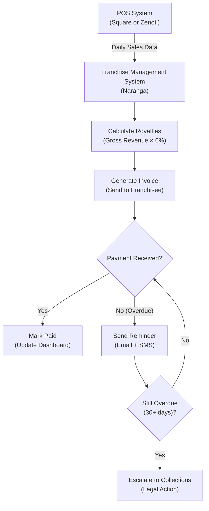
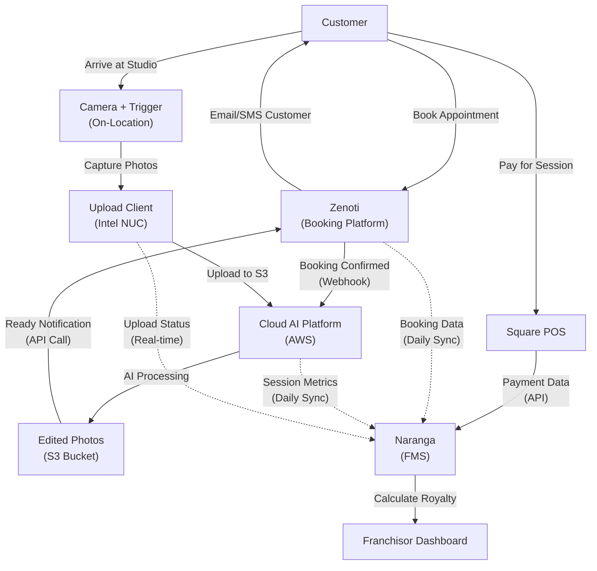

# Franchise Technology Stack: Multi-Location Booking, Portal & Equipment Systems

**Sprint**: 02 - Franchise Development & Multi-Location Expansion 
**Task**: 01 - Technical & Regulatory Landscape 
**Date**: 2025-11-17 
**Author**: Technical Researcher

---

## Executive Summary

Transitioning MirrorMe from a single-location automated portrait studio to a 50-100 location franchise system requires replacing Square Appointments and Google Drive with enterprise-grade, multi-location technology infrastructure. This research identifies the required technology stack across five critical domains: (1) multi-location booking and scheduling, (2) franchise management portal, (3) customer relationship management, (4) payment processing and financial reporting, and (5) on-location equipment standardization.

The recommended technology stack prioritizes franchise-specific solutions with proven multi-location management capabilities, centralized oversight for the franchisor, and operational simplicity for franchisees. Key investments include a franchise-grade booking platform ($200-$500/location/month), comprehensive franchise management system ($15,000-$50,000 initial + $300-$1,000/month per location), unified POS and payment processing, and standardized equipment packages.

Total technology investment: **$150,000-$300,000** initial setup + **$750-$1,500 per location/month** operational costs for a 50-location system.

---

## Key Findings

- **Square Appointments is insufficient** for franchise operations; lacks centralized franchisor oversight and multi-location analytics
- **Enterprise booking platforms** (Zenoti, Boulevard, Vagaro) cost $200-$500/location/month but provide essential franchise features
- **Franchise management systems** (FranConnect, Naranga) cost $300-$1,000/location/month; essential for operations manual delivery, training, and compliance
- **Unified POS across all locations** enables centralized financial reporting and royalty calculation
- **Standardized equipment packages** ($15,000-$25,000 per location) ensure brand consistency and simplify support
- **Franchisor dashboard** providing real-time visibility into all locations' bookings, revenue, and performance is non-negotiable
- **Technology support costs** (help desk, training, updates) add $150-$300/location/month
- **Total monthly per-location cost**: $750-$1,500 for complete technology stack

---

## 1. Multi-Location Booking & Scheduling Platforms

### 1.1 Limitations of Square Appointments for Franchising

MirrorMe currently uses Square Appointments for booking at its San Francisco location. While adequate for a single location, Square Appointments has critical limitations for franchise operations:

**Missing Franchise Features**:
- **No franchisor dashboard**: Cannot view bookings across all franchise locations from a single interface
- **Limited multi-location analytics**: No consolidated reporting on booking patterns, peak times, or capacity utilization
- **No centralized configuration**: Each location operates independently; no way to push standardized booking rules
- **Weak brand control**: Each franchisee can customize their booking page appearance and policies
- **No royalty reporting integration**: Cannot automatically calculate royalties based on bookings or revenue
- **Limited CRM integration**: Basic customer data; no sophisticated marketing automation

**When Square Appointments Works**:
- Small franchise systems (5-10 locations) where manual oversight is feasible
- Franchisees with strong technical competence who can self-manage
- Franchisors willing to sacrifice centralized control for lower costs

**Verdict**: Square Appointments is not recommended for a 50-100 location franchise system. Upgrade to enterprise franchise booking platform.

### 1.2 Enterprise Franchise Booking Platforms

| Platform | Best For | Pricing | Key Features | Franchise-Specific |
|----------|----------|---------|--------------|-------------------|
| **Zenoti** | Large franchises (50+ locations) | $200-$500/location/month | Multi-location booking Centralized reporting Integrated POS Marketing automation Inventory management | ✓ Franchisor dashboard ✓ Centralized configuration ✓ Royalty reporting ✓ Brand consistency enforcement |
| **Boulevard** | Mid-size franchises (10-50 locations) | $295-$495/location/month | Modern UI/UX Mobile apps (iOS/Android) Online booking Client management Reporting & analytics | ✓ Multi-location view ✓ Centralized settings ○ Limited franchise-specific features |
| **Vagaro** | Cost-conscious franchises | $25-$100/location/month | Affordable pricing Online booking Calendar management Marketing tools Payment processing | ○ Multi-location support ○ Basic franchisor view ✗ Limited enterprise features |
| **Booker (Mindbody)** | Fitness & wellness franchises | $129-$349/location/month | Industry focus (fitness/salon) Multi-location booking Retail POS Marketing automation | ✓ Franchise management ✓ Centralized reporting ✓ Brand control |
| **Acuity (Squarespace)** | Small franchises | $16-$61/location/month | Simple setup Online booking Payment processing Calendar sync | ○ Multi-location calendar ✗ No franchisor dashboard ✗ No franchise features |

### 1.3 Recommended Platform: Zenoti

**Why Zenoti**:

Zenoti is the market leader for multi-location service businesses, with proven franchise deployment at scale (clients include European Wax Center, Massage Envy, and similar franchise chains).

**Key Features for MirrorMe**:

1. **Franchisor Dashboard**:
   - Real-time view of bookings across all 50-100 locations
   - Consolidated revenue reporting
   - Capacity utilization analytics (identify underperforming locations)
   - Customer lifetime value tracking across locations (if customer visits multiple locations)

2. **Centralized Configuration**:
   - Push standardized booking rules (e.g., 60-minute portrait sessions only)
   - Enforce pricing consistency (or allow regional variance)
   - Control service menu (prevent franchisees from adding unauthorized services)
   - Manage promotions and discounts centrally

3. **Automated Royalty Calculation**:
   - Calculate royalties based on gross revenue (typically 5-8% for franchises)
   - Generate monthly royalty reports per location
   - Flag locations with late or missing payments

4. **Customer Experience**:
   - Branded booking website (mirrorme.com/book → location selection → appointment)
   - Mobile app for customers to book, reschedule, view photos
   - SMS/email appointment reminders (reduces no-shows by 30-40%)
   - Post-session review requests (builds online reputation)

5. **Integration with Cloud Photo Platform**:
   - API integration: When booking confirmed → trigger camera setup and photo session ID
   - Post-session: Mark session complete → trigger AI editing pipeline
   - Delivery notification: When photos ready → send customer download link via Zenoti's email/SMS

**Pricing for MirrorMe** (50 locations):
- Per-location cost: $300-$400/month (negotiated enterprise pricing)
- Franchisor dashboard: Included
- Implementation fee: $25,000-$50,000 (one-time)
- Training: $5,000-$10,000 (train-the-trainer model)
- **Total first-year cost** (50 locations): $230,000-$290,000
- **Annual recurring cost** (years 2+): $180,000-$240,000 ($300-$400/location × 12 months)

**Alternative: Boulevard** (if budget-conscious or prioritizing modern UX):
- More affordable: $295/location/month
- Excellent customer experience (important for premium brand positioning)
- Less robust franchise-specific features (may need custom development)
- **Total first-year cost** (50 locations): $195,000 (lower implementation costs)

### 1.4 Booking Platform Decision Matrix

| Criterion | Weight | Zenoti | Boulevard | Vagaro | Square Appointments |
|-----------|--------|--------|-----------|--------|---------------------|
| Franchisor Dashboard | 25% | 10 | 7 | 5 | 3 |
| Multi-Location Analytics | 20% | 10 | 8 | 6 | 4 |
| Brand Consistency Control | 15% | 10 | 7 | 5 | 3 |
| Cost (per location/month) | 15% | 5 ($350) | 6 ($295) | 9 ($75) | 10 ($0-$50) |
| Ease of Use (franchisee) | 10% | 7 | 9 | 8 | 10 |
| API Integration | 10% | 9 | 8 | 6 | 7 |
| Customer Experience | 5% | 8 | 10 | 7 | 8 |
| **WEIGHTED SCORE** | | **8.35** | **7.55** | **6.25** | **5.15** |

**Recommendation**: **Zenoti** for franchises targeting 50-100 locations. **Boulevard** for 10-30 locations prioritizing customer experience over franchise management depth.

---

## 2. Franchise Management System (FMS)

### 2.1 What is a Franchise Management System?

A Franchise Management System (FMS) is enterprise software that helps franchisors manage operations across all franchise locations. Core functions include:

- **Operations manual delivery**: Digital operations manual with version control
- **Training management**: Onboarding courses, certifications, ongoing training
- **Communication hub**: Announcements, updates, document sharing
- **Compliance tracking**: Ensure franchisees follow brand standards
- **Task management**: Assign and track tasks (e.g., "Complete health inspection by Dec 1")
- **Reporting & analytics**: Performance dashboards, financial reporting
- **Support ticketing**: Franchisees submit support requests; franchisor tracks resolution

**Why MirrorMe Needs an FMS**:

With 50-100 locations, email and phone calls are insufficient for franchisor-franchisee communication. An FMS provides:
- **Single source of truth** for operations manual (always current version)
- **Training accountability** (track which franchisees completed required training)
- **Audit trail** (prove compliance with franchise agreement and FTC requirements)
- **Scalability** (onboard 10 new franchisees per year without overwhelming HQ staff)

### 2.2 Leading Franchise Management Systems

| Platform | Best For | Pricing | Key Features | Strengths |
|----------|----------|---------|--------------|-----------|
| **FranConnect** | Large franchises (50+ locations) | $500-$1,000/location/month | Operations manual Training (LMS) Marketing hub Field audits Lead management Analytics dashboard | Industry leader Comprehensive features Proven at scale |
| **Naranga** | Mid-size franchises (20-100 locations) | $300-$600/location/month | Operations manual Communication hub Task management Compliance tracking Document library | Strong operations focus Easier to implement than FranConnect |
| **Rallio** | Marketing-focused franchises | $100-$300/location/month | Social media management Local marketing Reputation management Content library | Best for local marketing Lacks operations features |
| **Findly** | Small franchises | $5,000-$15,000/year (flat) | Operations manual Training Communication | Affordable flat rate Limited scalability |
| **Zoho CRM + Zoho Workplace** (DIY) | Budget-conscious startups | $50-$150/location/month | Customizable Document management Task tracking | Most affordable Requires heavy customization |

### 2.3 Recommended FMS: Naranga

**Why Naranga**:

Naranga strikes the best balance of franchise-specific features, cost, and ease of implementation for a 50-100 location franchise system. FranConnect is more robust but overkill (and 50-100% more expensive) for MirrorMe's needs in Years 1-3.

**Key Features for MirrorMe**:

1. **Digital Operations Manual**:
   - Hosted on Naranga platform (no PDF distribution)
   - Version control: Automatically update all locations when manual changes
   - Searchable: Franchisees can quickly find procedures
   - Acknowledgment tracking: Franchisees must acknowledge updates

2. **Training & Certification**:
   - Onboarding courses: "Setting Up Your MirrorMe Studio" (10 modules)
   - Equipment training: "Camera and Trigger Setup" (video tutorials)
   - AI platform training: "Using the Franchisor Dashboard" (for monitoring sessions)
   - Certifications: Franchisees must pass quiz before opening
   - Ongoing training: Monthly "lunch and learn" webinars on best practices

3. **Communication Hub**:
   - Announcements: Push urgent updates (e.g., "New AI model version deployed")
   - Discussion forums: Franchisees share tips and troubleshoot together
   - Direct messaging: Franchisee can message franchisor support team
   - Newsletter: Monthly franchise system newsletter

4. **Task Management**:
   - Franchisor assigns tasks (e.g., "Submit Q3 financial report by Oct 15")
   - Automated reminders: Email/SMS if task overdue
   - Completion tracking: Dashboard shows which locations completed vs. overdue

5. **Compliance Audits**:
   - Checklist-based audits: Franchisor field rep visits location, completes checklist via mobile app
   - Photo evidence: Upload photos of store layout, equipment, branding compliance
   - Corrective action plans: If location fails audit, assign tasks to remediate
   - Trend analysis: Identify common compliance issues across system

**Pricing for MirrorMe** (50 locations):
- Per-location cost: $400-$500/month
- Implementation fee: $15,000-$30,000 (one-time)
- Training: $5,000 (train-the-trainer)
- **Total first-year cost** (50 locations): $270,000-$330,000
- **Annual recurring cost** (years 2+): $240,000-$300,000

**Budget Alternative: Custom-Built on Zoho**:

For early-stage franchises (Years 1-2 with 10-20 locations), consider building a lightweight FMS using Zoho:

- **Zoho CRM**: Franchisee management, task tracking ($50/user/month)
- **Zoho WorkDrive**: Document library for operations manual ($3/user/month)
- **Zoho Learn**: Learning management system for training ($1/user/month)
- **Zoho Desk**: Support ticketing ($20/agent/month)
- **Total cost**: ~$100/location/month + $20,000-$30,000 custom development

**Tradeoff**: 80% cost savings but requires internal technical resources to build and maintain. Not scalable beyond 20-25 locations.

---

## 3. Customer Relationship Management (CRM)

### 3.1 CRM Requirements for MirrorMe Franchise

A CRM system tracks customer interactions across all franchise locations:

**Core Functions**:
- **Customer database**: Centralized database of all customers across all locations
- **Booking history**: Track which location(s) customer visited, when, how often
- **Marketing automation**: Email campaigns, SMS promotions, referral programs
- **Lifetime value tracking**: Calculate total revenue per customer (important if customers visit multiple locations)
- **Loyalty programs**: Reward repeat customers (e.g., "5th session free")
- **Referral tracking**: Attribute new customers to existing customers who referred them

**Key Consideration**: If using Zenoti for booking, CRM functionality may be built-in (reducing need for separate CRM).

### 3.2 CRM Options

| Option | Best For | Pricing | Integration with Booking Platform |
|--------|----------|---------|-----------------------------------|
| **Zenoti (Built-in CRM)** | If using Zenoti | Included in $300-$400/location | Seamless (native) |
| **HubSpot** | Marketing-focused franchises | $0-$500/month (for franchisor) | API integration (moderate effort) |
| **Salesforce** | Enterprise franchises | $25-$300/user/month | API integration (complex) |
| **Klaviyo** | E-commerce/email marketing | $20-$100/month (for franchisor) | API integration (easy) |

**Recommendation**: If using Zenoti, rely on its built-in CRM to minimize technology stack complexity. If using Boulevard or another booking platform without robust CRM, add **HubSpot** ($500/month for franchisor + $0 for franchisees; centralized management).

### 3.3 Marketing Automation Workflows

Once MirrorMe has centralized customer database, automate key marketing workflows:

**1. Post-Session Follow-Up**:
- Day 0: Session complete → Send download link via email/SMS (Zenoti automated)
- Day 1: Email: "Love your photos? Share on social media!" (with social sharing buttons)
- Day 7: Email: "Rate your experience" (request Google/Yelp review)
- Day 30: SMS: "Book your next session today! 10% off" (drive repeat bookings)

**2. Abandoned Booking Recovery**:
- Customer starts booking but doesn't complete → Email 1 hour later: "Finish your booking" (with direct link)
- 50% of abandoned bookings can be recovered with timely follow-up

**3. Birthday/Anniversary Campaigns**:
- Email 2 weeks before customer birthday: "Celebrate with a photo session! 20% off"
- Customers love birthday promotions; high conversion rate (15-25%)

**4. Re-Engagement (Lapsed Customers)**:
- Customer hasn't booked in 6 months → Email: "We miss you! Here's $20 off your next session"
- Identify churn risk and proactively win back lapsed customers

**5. Referral Program**:
- After successful session, email: "Refer a friend, both get $25 off"
- Track referrals in CRM; attribute new customers to referrers
- Referral customers have 30-50% higher lifetime value (strong trust signal)

**ROI**: Marketing automation increases repeat bookings by 20-30% and reduces customer acquisition cost by 15-25%.

---

## 4. Payment Processing & Financial Reporting

### 4.1 Unified POS Across All Locations

**Why Unified POS Matters**:

For franchisors, having all franchise locations on the **same POS system** is critical for:
- **Royalty calculation**: Automatically calculate royalties based on gross revenue (no reliance on franchisee-reported numbers)
- **Fraud prevention**: Detect franchisees underreporting revenue (compare POS data to bank deposits)
- **Consolidated reporting**: View total system revenue, average transaction size, payment methods
- **Operational insights**: Identify best practices from top-performing locations; share with underperformers

**Current State**: MirrorMe uses Square for payment processing. Square is franchise-compatible but has limitations.

### 4.2 POS Options for Franchises

| POS System | Best For | Pricing | Franchise Features |
|------------|----------|---------|-------------------|
| **Square** | Small franchises (5-20 locations) | 2.6% + $0.10 per transaction | Multi-location dashboard Consolidated reporting Affordable Easy setup |
| **Clover** | Mid-size franchises | 2.3% + $0.10 + $14.95/month hardware rental | Franchise management tools Advanced reporting Customizable |
| **Shopify POS** | Retail-heavy franchises | 2.6% + $0.10 + $89/month | E-commerce integration Inventory management |
| **Integrated with Zenoti** | Large franchises using Zenoti | 2.5-2.9% + $0.15 | Seamless booking-to-payment No duplicate data entry |

**Recommendation**:

- **If using Zenoti**: Use Zenoti's integrated payment processing (one less system to manage)
- **If using Boulevard or other booking platform**: Continue with **Square** but upgrade to **Square for Restaurants/Retail** with multi-location management ($60/location/month for advanced features)

### 4.3 Royalty Calculation Automation

**Franchise Royalty Structure** (typical):
- **6-8% of gross revenue** paid monthly to franchisor
- **2-3% marketing fund contribution** (national advertising)
- **Technology fee**: $800/month (covers cloud AI platform, booking system access)

**Automated Royalty Workflow**:

**Benefits**:
- **Accuracy**: No manual calculation errors
- **Transparency**: Franchisees see real-time royalty accrual in dashboard
- **Speed**: Invoices sent automatically on 1st of each month
- **Compliance**: Audit trail for FTC compliance (Item 6 disclosure)

**Technology Required**:
- POS system with API access (Square, Zenoti, Clover all support)
- Franchise management system with royalty module (Naranga, FranConnect)
- Accounting integration: QuickBooks or Xero (for franchisor bookkeeping)

---

## 5. On-Location Equipment Standardization

### 5.1 Why Equipment Standardization Matters

For franchise brand consistency and operational simplicity:

**Benefits of Standardization**:
- **Brand consistency**: Every location delivers identical photo quality
- **Simplified training**: All franchisees learn same equipment
- **Bulk purchasing**: Negotiate volume discounts (15-25% savings)
- **Easier support**: Franchisor support team knows exactly what equipment each location has
- **Faster setup**: New franchisees receive "MirrorMe Studio Kit" and follow standardized setup guide

**Risks of Non-Standardization**:
- Franchisee buys incompatible camera → photos don't work with AI editing pipeline
- Franchisee uses different lighting → inconsistent photo quality across locations
- Franchisor can't provide technical support (too many equipment variations)

### 5.2 MirrorMe Studio Equipment Package

**Recommended Standard Equipment Package** (per location):

| Category | Equipment | Specifications | Quantity | Cost per Unit | Total Cost |
|----------|-----------|----------------|----------|---------------|------------|
| **Camera** | Canon EOS R6 Mark II | 24MP, Mirrorless, 4K | 1 | $2,499 | $2,499 |
| **Lens** | Canon RF 24-70mm f/2.8L | Portrait zoom lens | 1 | $2,299 | $2,299 |
| **Wireless Trigger** | Pocket Wizard Plus IV | Reliable trigger system | 1 | $199 | $199 |
| **Lighting** | Godox SL-60W LED (2x) | Continuous LED, 5600K | 2 | $169 | $338 |
| **Light Stands** | Neewer Light Stand (2x) | Adjustable, sturdy | 2 | $35 | $70 |
| **Softboxes** | Neewer 32" Octagon (2x) | Soft portrait lighting | 2 | $45 | $90 |
| **Backdrop** | Savage Seamless Paper | White, Gray, Black (3 rolls) | 3 | $40 | $120 |
| **Backdrop Stand** | Neewer T-Stand | 10ft wide | 1 | $80 | $80 |
| **Full-Length Mirror** | Custom branded mirror | 6ft tall, MirrorMe logo | 1 | $300 | $300 |
| **Upload Station** | Intel NUC 13 Pro | i5, 16GB RAM, 512GB SSD | 1 | $699 | $699 |
| **Network Storage** | Synology DS220+ NAS | 2-bay, RAID 1, backup | 1 | $299 | $299 |
| **Storage Drives** | WD Red Plus 4TB (2x) | NAS-optimized drives | 2 | $99 | $198 |
| **WiFi Router** | Ubiquiti Dream Machine | Reliable, fast uploads | 1 | $379 | $379 |
| **UPS Backup** | APC 1500VA UPS | Power protection | 1 | $249 | $249 |
| **Misc** | Cables, SD cards, etc. | | | | $500 |
| **TOTAL EQUIPMENT COST** | | | | | **$8,319** |

**Note**: This is the **photography equipment only**. Does not include studio build-out (mirrors, flooring, paint, furniture). See file `05-equipment-supply-chain.md` for complete build-out costs.

### 5.3 Equipment Sourcing Strategy

**Option 1: Franchisor as Equipment Supplier** (Recommended)

Franchisor negotiates bulk pricing with vendors, purchases equipment, and resells to franchisees at cost + 10-15% markup:

- **Pros**:
  - Guaranteed standardization (franchisor controls spec)
  - Simplified procurement (franchisee orders from franchisor)
  - Franchisor generates ancillary revenue ($800-$1,200 per location)
  - Quality assurance (franchisor inspects equipment before shipping)

- **Cons**:
  - Franchisor must manage inventory and fulfillment
  - Upfront capital required ($250,000 for 30 equipment kits)
  - Warranty and support responsibility

**Option 2: Approved Vendor List**

Franchisor provides list of approved vendors and exact specifications; franchisee purchases directly:

- **Pros**:
  - No inventory management for franchisor
  - No capital requirement
  - Franchisee has purchasing flexibility (can negotiate own discounts)

- **Cons**:
  - Risk of franchisee buying wrong equipment
  - Less quality control
  - Franchisee may overpay (no bulk pricing)

**Option 3: Third-Party Franchise Supplier**

Partner with franchise supply company (e.g., FranChoice Supply, NationalLink) to fulfill equipment:

- **Pros**:
  - No inventory management for franchisor
  - Bulk pricing negotiated by supplier
  - Supplier handles warranties and support

- **Cons**:
  - Less control over quality
  - Supplier takes margin (increases cost to franchisee)

**Recommendation**: **Option 1** (Franchisor as Equipment Supplier) for first 20-30 locations to ensure quality and standardization. Transition to **Option 2** (Approved Vendor List) after proven equipment package and vendor relationships established.

### 5.4 Equipment Financing for Franchisees

Equipment package cost ($8,300) may be a barrier for some franchisees. Offer financing options:

**In-House Financing** (if franchisor has capital):
- Franchisee pays 20% down ($1,660)
- Franchisor finances remaining $6,640 over 36 months
- Interest rate: 6-8% APR
- Monthly payment: $203-$213
- Franchisor benefit: Generates interest income; strengthens franchisee relationship

**Third-Party Financing** (partner with equipment lender):
- Partner with franchise lender (e.g., FranFund, Benetrends)
- Franchisee applies for equipment loan directly
- Franchisor receives full payment upfront
- Lender handles collections

**Lease Option**:
- Lease equipment to franchisee ($250-$350/month for 36 months)
- At end of lease, franchisee owns equipment
- Benefits: Lower monthly cost; franchisor retains ownership until paid off (reduces default risk)

---

## 6. Technology Support & Help Desk

### 6.1 Support Scope

With 50-100 franchise locations using multiple technology systems, franchisees will require ongoing technical support:

**Common Support Requests**:
- Booking platform: "How do I block off vacation dates?"
- Cloud AI platform: "Photos aren't uploading from my location"
- Equipment: "Camera isn't triggering when customer presses button"
- Portal access: "I forgot my password to the franchise management system"
- Payment processing: "Customer's card was declined, now what?"

### 6.2 Support Delivery Model

**Tier 1: Self-Service Knowledge Base**
- Hosted on franchise management system (Naranga)
- 100+ articles covering common questions
- Video tutorials for equipment setup
- Searchable and tagged
- Cost: $0 (franchisees self-serve)

**Tier 2: Email/Chat Support** (Business Hours)
- Email: support@mirrorme.com
- Live chat: Available 8am-6pm PT Monday-Friday
- Response SLA: 4 hours for non-urgent, 1 hour for urgent
- Staffing: 1 support specialist per 25 locations (2 specialists for 50 locations)
- Cost: $50,000-$70,000/year per specialist ($100,000-$140,000 total for 50 locations)

**Tier 3: Phone Support** (Business Hours)
- Phone: 1-800-MIRRORME
- Available 8am-6pm PT Monday-Friday
- For urgent issues (e.g., system down, customer waiting)
- Same staffing as Tier 2 (support specialists handle both email and phone)

**Tier 4: After-Hours Emergency Support** (Optional)
- For critical issues outside business hours (e.g., booking system down on Friday night)
- Outsourced to 24/7 answering service (AnswerFirst, etc.)
- Basic troubleshooting only; escalate to internal team if needed
- Cost: $1,000-$2,000/month for 24/7 coverage

### 6.3 Support Ticketing System

Use integrated ticketing system within franchise management system (Naranga) or standalone help desk software:

**Options**:
- **Naranga (built-in)**: Included in $400-$500/location/month cost
- **Zendesk**: $55/agent/month (2 agents = $110/month)
- **Freshdesk**: $15/agent/month (2 agents = $30/month)
- **Zoho Desk**: $20/agent/month (2 agents = $40/month)

**Recommendation**: Use Naranga's built-in ticketing if available (one less system). Otherwise, **Freshdesk** (affordable, feature-rich).

### 6.4 Support Cost Summary (50 locations)

| Support Component | Cost | Cost per Location/Month |
|-------------------|------|-------------------------|
| Knowledge base (self-service) | $0 | $0 |
| Email/chat/phone support (2 specialists) | $120,000/year = $10,000/month | $200 |
| Ticketing system (if not included) | $500/month | $10 |
| After-hours emergency (optional) | $1,500/month | $30 |
| **TOTAL SUPPORT COST** | **$12,000/month** | **$240/month** |

---

## 7. Technology Stack Cost Summary

### 7.1 Initial Setup Costs (One-Time)

| Component | Cost | Notes |
|-----------|------|-------|
| Zenoti implementation | $35,000 | Booking platform setup |
| Naranga implementation | $22,500 | Franchise management system setup |
| Custom integrations (APIs) | $50,000 | Connect Zenoti, Naranga, POS, Cloud AI platform |
| Franchisor hardware (NUC for each location, bulk order) | $35,000 | 50 locations × $700 |
| Training & onboarding | $15,000 | Train franchisor staff and first cohort of franchisees |
| **TOTAL INITIAL SETUP** | **$157,500** | For 50-location system |

### 7.2 Monthly Operational Costs (Recurring)

**Per Location** (50 locations total):

| Component | Cost per Location/Month | Notes |
|-----------|------------------------|-------|
| Zenoti (booking platform) | $350 | Negotiated enterprise pricing |
| Naranga (franchise management) | $450 | Operations manual, training, communication |
| Square (payment processing) | ~$300 | 2.6% of $11,500 avg monthly revenue |
| Cloud AI platform (from File 03) | $534 | AI editing, storage, bandwidth |
| Technology support | $240 | Help desk, phone support |
| **TOTAL PER LOCATION** | **$1,874/month** | |
| **TOTAL (50 LOCATIONS)** | **$93,700/month** | = $1,124,400/year |

**Note**: Franchisees typically pay most of these costs directly (Zenoti, Square fees) or via technology fee charged by franchisor.

### 7.3 Franchisor Cost Allocation

**Costs Paid by Franchisor** (absorbed in royalties and technology fees):

| Cost Category | Monthly Cost | Annual Cost |
|---------------|--------------|-------------|
| Naranga (centralized) | $22,500 | $270,000 |
| Cloud AI platform infrastructure | $26,694 | $320,328 |
| Technology support (2 specialists) | $10,000 | $120,000 |
| **TOTAL FRANCHISOR COST** | **$59,194/month** | **$710,328/year** |

**Revenue to Cover Costs** (from technology fee charged to franchisees):

- Technology fee: $800/location/month × 50 locations = $40,000/month
- Shortfall: $19,194/month (covered by royalties or increased technology fee)

**Alternative**: Increase technology fee to $1,200/location/month → $60,000/month revenue → covers all technology costs + $800/month margin

**Costs Paid by Franchisees** (directly):

| Cost Category | Monthly Cost per Location |
|---------------|--------------------------|
| Zenoti (booking platform) | $350 |
| Square (payment processing) | ~$300 |
| Internet (high-speed for photo uploads) | $100-$150 |
| **TOTAL FRANCHISEE DIRECT COSTS** | **$750-$800/month** |

---

## 8. Integration Architecture

### 8.1 System Integration Map

MirrorMe's franchise technology stack consists of multiple systems that must integrate:

### 8.2 Key Integrations Required

| Integration | Systems | Method | Complexity | Cost | Priority |
|-------------|---------|--------|------------|------|----------|
| Booking → AI Platform | Zenoti → AWS Lambda | Webhook | Low | $5,000 | High |
| AI Platform → Booking | AWS SNS → Zenoti API | API call | Low | $5,000 | High |
| POS → FMS | Square → Naranga | Daily API sync | Medium | $15,000 | High |
| Booking → FMS | Zenoti → Naranga | Daily API sync | Medium | $15,000 | Medium |
| Upload Client → FMS | NUC → Naranga | Real-time webhook | Medium | $10,000 | Medium |
| FMS → Accounting | Naranga → QuickBooks | Daily API sync | Low | $5,000 | Low |
| **TOTAL INTEGRATION COST** | | | | **$55,000** | |

### 8.3 Integration Timeline

- **Phase 1** (Months 1-3): Booking → AI Platform (critical for operations)
- **Phase 2** (Months 4-6): POS → FMS (critical for royalty automation)
- **Phase 3** (Months 7-9): All remaining integrations

---

## 9. Recommendations

### 9.1 Technology Stack Summary

**Recommended Stack for 50-Location Franchise**:

| Component | Platform | Monthly Cost | Initial Setup |
|-----------|----------|--------------|---------------|
| **Booking & Scheduling** | Zenoti | $350/location | $35,000 |
| **Franchise Management** | Naranga | $450/location | $22,500 |
| **Payment Processing** | Square | ~$300/location (variable) | $0 |
| **Cloud AI Platform** | AWS (hybrid architecture) | $534/location | $318,000 |
| **Technology Support** | In-house (2 specialists) | $240/location | $15,000 |
| **CRM/Marketing** | Zenoti (built-in) | Included | $0 |
| **Equipment** | Standardized package | N/A | $8,300/location |
| **Integrations** | Custom APIs | N/A | $55,000 |
| **TOTAL PER LOCATION** | | **$1,874/month** | |
| **TOTAL (50 LOCATIONS)** | | **$93,700/month** | **$445,800** |

### 9.2 Phased Rollout Strategy

**Phase 1: Pilot (Months 1-6, 5 locations)**
- Deploy Zenoti, Naranga, Cloud AI platform to 5 pilot locations
- Test integrations and workflows
- Train pilot franchisees; gather feedback
- Refine operations manual based on pilot learnings
- **Cost**: $150,000 setup + $47,000/month operating

**Phase 2: Initial Rollout (Months 7-12, 20 locations)**
- Add 15 more locations (total 20)
- Onboard in cohorts of 5 locations per month
- Scale support team (hire 1st specialist)
- **Cost**: $100,000 incremental setup + $187,000/month operating

**Phase 3: Expansion (Months 13-24, 50 locations)**
- Add 30 more locations (total 50)
- Onboard in cohorts of 5-10 locations per month
- Scale support team (hire 2nd specialist)
- **Cost**: $195,800 incremental setup + $468,500/month operating

**Total 2-Year Investment**: $445,800 setup + $5,618,000 operating = **$6,063,800**

### 9.3 Technology Fee Structure for Franchisees

**Recommended Franchisee Technology Fee**: $1,200/month per location

**What It Covers**:
- Cloud AI photo editing (unlimited sessions)
- Franchise management system access (training, operations manual, support)
- Booking platform access (franchisee view)
- Technology support (email, phone, chat)
- Software updates and new features

**What Franchisee Pays Separately**:
- Zenoti booking platform: $350/month (billed directly by Zenoti)
- Square payment processing: 2.6% + $0.10 per transaction
- Internet service: $100-$150/month
- Equipment maintenance/replacement: As needed

**Franchisee Total Technology Costs**: $1,200 + $350 + $300 (Square) + $125 (internet) = **$1,975/month**

**Franchisee Perspective**:
- Avg monthly revenue: $45,000 (10 sessions/day × $150/session × 30 days)
- Technology costs: $1,975 (4.4% of revenue)
- **Very affordable** for value delivered (AI editing, enterprise booking, support)

---

## 10. Conclusion

Building a franchise-ready technology stack for MirrorMe requires replacing single-location tools (Square Appointments, Google Drive) with enterprise platforms designed for multi-location management. The recommended stack—Zenoti for booking, Naranga for franchise management, Square for POS, and AWS for cloud AI—provides the franchisor with centralized oversight, automated royalty calculation, and brand consistency enforcement while offering franchisees intuitive tools and comprehensive support.

**Key Takeaways**:

- **Investment**: $445,800 initial setup + $93,700/month for 50 locations
- **Franchisee technology fee**: $1,200/month (covers most franchisor-managed systems)
- **Franchisee direct costs**: $775/month (Zenoti, Square, internet)
- **Total franchisee technology costs**: $1,975/month (4.4% of revenue)
- **Scalability**: Architecture supports 100+ locations without major changes
- **Timeline**: 6 months pilot + 6 months initial rollout + 12 months expansion = 24 months to 50 locations

With this technology foundation, MirrorMe can confidently scale to 50-100 franchise locations while maintaining operational excellence and brand consistency across the entire system.

---

## References

Zenoti. (2024). *Enterprise Software for Multi-Location Service Businesses*. Retrieved from https://www.zenoti.com/

Boulevard. (2024). *Modern Client Experience Platform*. Retrieved from https://www.joinblvd.com/

Vagaro. (2024). *Business Management Software for Salons and Spas*. Retrieved from https://www.vagaro.com/

FranConnect. (2024). *Franchise Management Software*. Retrieved from https://www.franconnect.com/

Naranga. (2024). *Franchise Operations Platform*. Retrieved from https://www.naranga.com/

Square. (2024). *Multi-Location Point of Sale*. Retrieved from https://squareup.com/us/en/point-of-sale/multi-location

Clover. (2024). *POS Systems for Franchises*. Retrieved from https://www.clover.com/

AnswerFirst. (2024). *Technical Support Call Center*. Retrieved from https://answerfirst.com/technical-support/

Zendesk. (2024). *Help Desk Software Pricing*. Retrieved from https://www.zendesk.com/pricing/

Freshdesk. (2024). *Customer Support Software*. Retrieved from https://freshdesk.com/

B&H Photo Video. (2024). *Professional Photography Equipment*. Retrieved from https://www.bhphotovideo.com/

Canon. (2024). *EOS R6 Mark II*. Retrieved from https://www.usa.canon.com/

Godox. (2024). *Professional Photography Lighting*. Retrieved from https://www.godox.com/
