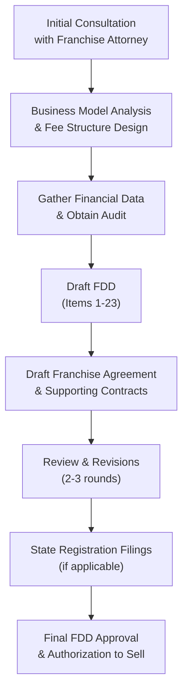

# Franchise Legal Requirements: FTC Compliance & State Registration

**Sprint**: 02 - Franchise Development & Multi-Location Expansion 
**Task**: 01 - Technical & Regulatory Landscape 
**Date**: 2025-11-17 
**Author**: Technical Researcher

---

## Executive Summary

Franchising MirrorMe's automated portrait studio business requires comprehensive legal compliance at both federal and state levels. The Federal Trade Commission's Franchise Rule (16 CFR Part 436) mandates preparation of a Franchise Disclosure Document (FDD) containing 23 specific items of information, which must be provided to prospective franchisees at least 14 calendar days before signing any agreement or accepting payment. Additionally, 13-15 states require franchise registration before offering or selling franchises within their jurisdictions.

Legal costs for franchise development range from $40,000-$100,000+ for initial FDD preparation and state registrations, with annual maintenance costs of $15,000-$30,000 for updates and renewals. The timeline from initiating franchise development to being legally authorized to sell franchises typically spans 6-12 months, with audited financial statements representing a critical requirement that may extend this timeline for newer businesses.

For MirrorMe, this represents a significant but necessary investment to ensure legal compliance and protect both the franchisor and franchisees through proper disclosure and documentation.

---

## Key Findings

- **FTC Franchise Rule** mandates 23-item FDD disclosure at least 14 days before signing or payment
- **13-15 registration states** require pre-sale franchise registration (CA, IL, IN, MD, MI, MN, NY, ND, RI, SD, VA, WA, WI)
- **Initial legal costs**: $40,000-$100,000 for FDD preparation, trademark registration, and state filings
- **Annual maintenance costs**: $15,000-$30,000 for FDD updates and state renewals
- **Audited financial statements** required (3 years) - phase-in allowed federally but not in registration states
- **14-day waiting period** mandatory between FDD disclosure and franchise agreement signing
- **Timeline**: 6-12 months from initiation to legal authorization to sell franchises
- **Penalties for non-compliance**: FTC civil penalties up to $51,744 per violation; state penalties vary
- **Trademark registration** essential: USPTO federal registration costs $250-$750 per class

---

## 1. Federal Franchise Rule Requirements

### 1.1 Overview of FTC Franchise Rule (16 CFR Part 436)

The Federal Trade Commission's Franchise Rule, codified at 16 CFR Part 436, governs franchise sales throughout the United States. The Rule requires franchisors to provide all potential franchisees with a disclosure document containing 23 specific items of information about the offered franchise, its officers, and other franchisees [FTC, 2024].

**Key Requirements**:

- **14-day minimum waiting period**: FDD must be provided at least 14 calendar days before the prospective franchisee signs any binding agreement or pays any consideration to the franchisor
- **No waiver provision**: Franchisees cannot waive their rights under the Franchise Rule
- **Electronic delivery permitted**: FDD can be delivered electronically with proper acknowledgment
- **Annual updates required**: FDD must be updated within 120 days of franchisor's fiscal year-end

### 1.2 The 23 Required FDD Items

The Franchise Disclosure Document must contain the following 23 items:

| Item | Category | Description |
|------|----------|-------------|
| **Item 1** | The Franchisor and Parents | Background information on franchisor, parents, predecessors, affiliates |
| **Item 2** | Business Experience | Business experience of directors and principal officers (past 5 years) |
| **Item 3** | Litigation | Disclosure of certain lawsuits involving franchisor and key personnel |
| **Item 4** | Bankruptcy | Bankruptcy history of franchisor, affiliates, and key personnel (past 10 years) |
| **Item 5** | Initial Fees | Initial franchise fee and other initial payments |
| **Item 6** | Other Fees | Ongoing fees, royalties, advertising contributions, transfer fees |
| **Item 7** | Estimated Initial Investment | Comprehensive breakdown of franchisee's total initial investment |
| **Item 8** | Restrictions on Sources | Requirements to purchase from franchisor or approved suppliers |
| **Item 9** | Franchisee's Obligations | Table referencing franchisee obligations throughout the agreement |
| **Item 10** | Financing | Terms and conditions of any financing arrangements offered |
| **Item 11** | Franchisor's Assistance | Pre-opening obligations and continuing obligations of franchisor |
| **Item 12** | Territory | Information about territorial rights and restrictions |
| **Item 13** | Trademarks | Principal trademarks, registration status, and limitations |
| **Item 14** | Patents, Copyrights | Information about proprietary systems and technology |
| **Item 15** | Obligation to Participate | Requirements for franchisee's personal participation in operations |
| **Item 16** | Restrictions on What May Be Sold | Restrictions on products/services franchisee may offer |
| **Item 17** | Renewal, Termination, Transfer | Detailed table of contract terms and conditions |
| **Item 18** | Public Figures | Compensation arrangements with public figures |
| **Item 19** | Financial Performance | Optional but must have reasonable basis if included |
| **Item 20** | Outlets and Franchisee Information | Statistical data on system growth, closures, transfers (3 years) |
| **Item 21** | Financial Statements | Audited financial statements of franchisor (3 years) |
| **Item 22** | Contracts | Copies of all agreements franchisee will be required to sign |
| **Item 23** | Receipts | Two copies of receipt page for prospective franchisee to sign |

### 1.3 Item 21: Audited Financial Statements Requirement

One of the most significant requirements for new franchisors is **Item 21**, which mandates audited financial statements for the past three fiscal years.

**Federal Phase-In Exception**:
- Year 1: Audited balance sheet only
- Year 2: Audited balance sheet and income statement
- Year 3 and beyond: Full audited financials (balance sheet, income statement, cash flow statement)

**CRITICAL**: This phase-in exception does NOT apply in franchise registration states (California, Illinois, Indiana, Maryland, Michigan, Minnesota, New York, North Dakota, Rhode Island, South Dakota, Virginia, Washington, Wisconsin). These states require full audited financials from day one [NASAA, 2024].

**Cost Implications**:
- First-time audit: $10,000-$25,000 depending on company size and complexity
- Annual audits thereafter: $8,000-$20,000
- More complex entities with multiple subsidiaries: $25,000-$50,000+

For MirrorMe, if the company does not currently maintain audited financials, obtaining the first audit will add 2-4 months to the franchise development timeline and represents a significant upfront cost.

---

## 2. State Franchise Registration Requirements

### 2.1 Registration States Overview

Fifteen states require franchisors to register with state franchise administrators before offering or selling franchises within their jurisdictions. These "registration states" impose additional disclosure requirements and filing fees beyond the federal FTC Rule.

**Registration States (as of 2024)**:

1. California
2. Hawaii
3. Illinois
4. Indiana
5. Maryland
6. Michigan
7. Minnesota
8. New York
9. North Dakota
10. Rhode Island
11. South Dakota
12. Virginia
13. Washington
14. Wisconsin
15. Oregon (limited registration for certain franchise types)

### 2.2 State Filing Systems

**NASAA Electronic Filing System**:

Seven states have adopted NASAA's Electronic Filing System:
- Illinois
- Maryland
- New York
- North Dakota
- Rhode Island
- South Dakota
- Virginia

**Separate State Systems**:
- **California**: Maintains its own system via California Department of Financial Protection and Innovation (DFPI)
- **Other states**: Individual filing systems

### 2.3 State Registration Fees

State filing fees vary significantly by jurisdiction:

| State | Initial Filing Fee | Annual Renewal Fee | Notes |
|-------|-------------------|-------------------|-------|
| **California** | $1,865 | $1,245 | Highest volume franchise state |
| **Illinois** | $100 (system fee) | $50 (system fee) | NASAA electronic system |
| **New York** | $100 (system fee) | $50 (system fee) | NASAA electronic system |
| **Maryland** | $100 (system fee) | $50 (system fee) | NASAA electronic system |
| **Minnesota** | Varies | Varies | Individual filing |
| **Washington** | Varies | Varies | Individual filing |
| **Wisconsin** | Varies | Varies | Individual filing |

**Estimated Total State Registration Costs**:
- Initial registrations (13-15 states): $5,000-$15,000 in filing fees alone
- Annual renewals (all states): $3,000-$8,000
- Legal fees for state registrations: $10,000-$25,000 (initial), $5,000-$10,000 (annual)

### 2.4 State-Specific Requirements

California, as the largest franchise market, imposes particularly stringent requirements:

- Full audited financials (no phase-in)
- Detailed escrow requirements for initial franchise fees (for undercapitalized franchisors)
- Specific advertising restrictions
- Mandatory state-specific amendments to FDD
- "Impounding" of franchise fees until franchisee opens for business (if franchisor doesn't meet financial thresholds)

**MirrorMe Consideration**: If targeting California early (as a San Francisco-based company), full audited financials will be required immediately, eliminating any federal phase-in benefit.

---

## 3. FDD Preparation Process & Timeline

### 3.1 FDD Development Stages

The process of creating a compliant FDD typically follows these stages:

### 3.2 Timeline Breakdown

| Phase | Duration | Key Activities |
|-------|----------|---------------|
| **1. Initial Planning** | 2-4 weeks | Franchise attorney consultation Business model refinement Fee structure design |
| **2. Financial Audit** | 6-12 weeks | First-time audit (if not already audited) Gather 3 years of financial data CPA engagement |
| **3. FDD Drafting** | 6-8 weeks | Complete Items 1-23 Draft franchise agreement Create operations manual outline |
| **4. Review & Revision** | 3-4 weeks | Internal review 2-3 revision rounds Finalize all documents |
| **5. State Registrations** | 8-16 weeks | Prepare state-specific filings Submit to registration states Respond to examiner comments |
| **6. Final Approval** | 1-2 weeks | Receive state approvals Final review Authorization to sell |
| **TOTAL** | **6-12 months** | From initiation to legal authorization |

**Critical Path Items**:
- **Audited financials**: Often the longest lead-time item
- **State registration**: California and New York typically take 3-4 months for initial approval
- **Trademark registration**: Should be initiated early; federal registration takes 8-12 months

---

## 4. Trademark & Intellectual Property Requirements

### 4.1 Federal Trademark Registration

Item 13 of the FDD requires disclosure of all principal trademarks used in the franchise system. Federal trademark registration with the U.S. Patent and Trademark Office (USPTO) provides the strongest legal protection.

**Registration Process**:
- **Application filing**: $250-$750 per trademark class (using TEAS system)
- **Examination period**: 4-8 months
- **Publication for opposition**: 30 days
- **Registration**: 2-4 months after publication
- **Total timeline**: 8-12 months for straightforward applications

**Classes Relevant to MirrorMe**:
- **Class 41**: Photography services, portrait photography
- **Class 42**: Software as a service (SaaS) for photo editing
- **Class 35**: Franchising services

**Costs**:
- Filing fees: $750-$2,250 (for 3 classes)
- Attorney fees: $1,500-$3,500 per trademark
- Total: $2,250-$5,750 for comprehensive trademark protection

### 4.2 Trademark Maintenance

Once registered, trademarks require ongoing maintenance:

- **Years 5-6**: Declaration of Use ($225-$425 per class)
- **Years 9-10**: Renewal ($300-$500 per class)
- **Every 10 years thereafter**: Renewal

### 4.3 Technology & Software IP

MirrorMe's AI editing pipeline represents valuable intellectual property that must be properly protected:

**Copyright Protection**:
- Software code: Automatically copyrighted upon creation
- AI training datasets: Copyright protection for original compilations
- Marketing materials: Copyright registration recommended ($65 per work)

**Trade Secrets**:
- AI algorithms and editing techniques
- Customer database and business methods
- Operational procedures
- Requires robust confidentiality agreements in franchise documentation

---

## 5. Compliance & Ongoing Legal Obligations

### 5.1 Annual FDD Updates

The FTC Franchise Rule requires annual updates to the FDD within 120 days of the franchisor's fiscal year-end.

**Required Updates**:
- Item 2: Update business experience of officers
- Item 3/4: New litigation or bankruptcy disclosures
- Item 19: Updated financial performance representations (if applicable)
- Item 20: Updated system statistics (openings, closings, transfers)
- Item 21: Current year audited financials

**Costs**:
- Legal fees: $5,000-$15,000 per year
- Audit fees: $8,000-$20,000 per year
- State renewal fees: $3,000-$8,000 per year
- **Total annual maintenance**: $16,000-$43,000

### 5.2 Material Changes & Amendments

Between annual updates, certain "material changes" require immediate disclosure:

- Changes in management
- New litigation
- Bankruptcy filing
- Changes to franchise fee structure
- Significant business changes

**Costs for Material Change Amendments**:
- Legal fees: $2,000-$7,500 per amendment
- State filing fees: $0-$500 per state

### 5.3 Franchise Agreement Renewals & Transfers

Franchise agreements typically last 10 years with renewal options. Legal review is required for:

- **Renewals**: $1,000-$3,000 per renewal (legal review)
- **Transfers**: $2,500-$5,000 per transfer (due diligence and documentation)
- **Terminations**: $5,000-$25,000 (if contested)

---

## 6. Penalties for Non-Compliance

### 6.1 FTC Penalties

Violations of the FTC Franchise Rule can result in severe penalties:

- **Civil penalties**: Up to $51,744 per violation (as of 2024)
- **Injunctive relief**: FTC can seek court orders prohibiting franchise sales
- **Restitution**: Required to repay franchisees for losses due to violations
- **Corrective advertising**: May be required to correct misleading claims

**Common Violations**:
- Failure to provide FDD 14 days before signing
- Making earnings claims without Item 19 disclosure
- Misleading or incomplete FDD disclosures
- Failure to update FDD annually

### 6.2 State Penalties

State penalties vary but can include:

- **Franchise registration violations**: $10,000-$50,000 per violation in California
- **Private right of action**: Franchisees can sue for rescission and damages
- **Criminal penalties**: In some states for willful violations
- **Stop orders**: Immediate cessation of franchise sales in the state

### 6.3 Private Litigation Risk

Beyond government enforcement, non-compliant franchisors face litigation from franchisees:

- **Rescission**: Franchisee can void agreement and recover all payments
- **Damages**: Compensatory and sometimes punitive damages
- **Attorney fees**: Franchisee may recover attorney fees
- **Class actions**: Multiple franchisees may join together

**Average defense costs**: $50,000-$500,000+ for franchise litigation

---

## 7. NASAA Guidelines & Best Practices

### 7.1 NASAA Franchise Registration and Disclosure Guidelines

The North American Securities Administrators Association (NASAA) provides detailed guidelines that registration states follow for FDD review.

**Key NASAA Policies**:

- **Statement of Policy on Franchise Questionnaires**: Effective January 1, 2023, NASAA banned most franchise questionnaires and acknowledgments that ask franchisees to contradict FDD disclosures [NASAA, 2022]
- **Cover Page Requirements**: As of January 1, 2020, three new cover pages must be incorporated into all FDDs
- **Electronic Disclosure**: Guidelines for electronic delivery of FDDs

### 7.2 Emerging Issue: Franchise Broker Registration

NASAA is currently considering a Model Franchise Broker Registration Act, which could impose registration requirements on franchise brokers and franchise sales organizations.

**Timeline**:
- Draft circulated: May 2024
- Comment period: Through August 2025
- Potential adoption: 2026

**Implication for MirrorMe**: If using franchise brokers or sales organizations, additional compliance requirements may be forthcoming.

---

## 8. Cost Summary: Legal Compliance Investment

### 8.1 Initial Investment (Year 1)

| Category | Cost Range | Notes |
|----------|-----------|-------|
| **FDD Preparation** | $25,000 - $50,000 | Franchise attorney fees |
| **Franchise Agreement & Contracts** | $10,000 - $25,000 | Legal document drafting |
| **Audited Financial Statements** | $10,000 - $25,000 | First-time audit |
| **Trademark Registration** | $2,250 - $5,750 | USPTO filing + attorney fees |
| **State Registrations (13-15 states)** | $15,000 - $40,000 | Filing fees + legal fees |
| **Operations Manual Outline** | $5,000 - $10,000 | Initial framework |
| **Misc. (entity formation, etc.)** | $2,000 - $5,000 | Business filings |
| **TOTAL INITIAL INVESTMENT** | **$69,250 - $160,750** | Average: $115,000 |

### 8.2 Annual Maintenance (Years 2+)

| Category | Cost Range | Notes |
|----------|-----------|-------|
| **FDD Annual Update** | $5,000 - $15,000 | Legal fees for update |
| **Audited Financial Statements** | $8,000 - $20,000 | Annual audit |
| **State Registration Renewals** | $8,000 - $18,000 | Filing fees + legal fees |
| **Trademark Maintenance** | $500 - $2,000 | Varies by filing year |
| **Legal Compliance Review** | $2,000 - $5,000 | Ongoing counsel |
| **TOTAL ANNUAL MAINTENANCE** | **$23,500 - $60,000** | Average: $41,750 |

### 8.3 Per-Franchise Transaction Costs

| Transaction Type | Cost Range | Frequency |
|-----------------|-----------|-----------|
| **Franchise Sale (legal review)** | $500 - $2,000 | Per franchise sold |
| **Franchise Renewal** | $1,000 - $3,000 | Every 10 years |
| **Franchise Transfer** | $2,500 - $5,000 | As needed |
| **Franchise Termination (uncontested)** | $1,500 - $5,000 | As needed |
| **Franchise Litigation Defense** | $50,000 - $500,000+ | If contested |

---

## 9. Recommendations for MirrorMe

### 9.1 Immediate Actions (Months 1-3)

1. **Engage experienced franchise attorney**: Select attorney with photo/retail franchise experience
2. **Initiate financial audit**: If not already audited, begin audit process immediately (longest lead time)
3. **Trademark search & filing**: Conduct comprehensive trademark search; file federal applications
4. **Business model refinement**: Finalize franchise fee structure, royalty rates, territory definitions

### 9.2 Strategic Decisions

**Phased State Registration Approach**:

Rather than registering in all 15 states immediately, consider phased approach:

**Phase 1 (Year 1)**:
- California (home state, largest market)
- New York (major metro market)
- Illinois (Midwest hub)
- Cost: ~$10,000 for 3 states

**Phase 2 (Year 2)**:
- Add 5-7 additional states based on franchise development leads
- Cost: ~$15,000-$25,000

**Phase 3 (Year 3)**:
- Complete registration in all remaining states as system scales
- Cost: ~$10,000-$15,000

**Total savings**: $20,000-$30,000 in initial legal costs by phasing registrations

### 9.3 Risk Mitigation

1. **Comprehensive FDD disclosure**: Over-disclose rather than under-disclose to minimize litigation risk
2. **Item 19 earnings claims**: Consider including Item 19 financial performance representations with solid data backing (increases franchisee confidence)
3. **Operations manual completeness**: Robust operations manual protects both franchisor and franchisee
4. **Compliance calendar**: Establish internal calendar for FDD updates, state renewals, trademark maintenance
5. **Legal budget allocation**: Reserve $50,000-$75,000 annually for legal compliance and contingencies

### 9.4 Timeline Expectations

**Realistic Timeline for MirrorMe**:

- **Month 0**: Engage franchise attorney
- **Months 1-3**: Financial audit; business model finalization; trademark filing
- **Months 4-6**: FDD drafting; franchise agreement drafting
- **Months 7-9**: State registrations (CA, NY, IL)
- **Months 10-12**: State approval; final review; authorization to sell
- **Month 12+**: Begin franchise sales

**Fast-track option** (if audited financials already exist): 6-8 months

---

## 10. Conclusion

Franchise legal compliance represents a substantial but essential investment for MirrorMe's multi-location expansion strategy. With initial costs of $69,000-$161,000 and annual maintenance of $24,000-$60,000, legal compliance is a significant line item in the franchise development budget.

However, these costs are non-negotiable for legal franchise sales in the United States. Attempting to franchise without proper legal compliance exposes MirrorMe to severe penalties, litigation risk, and potential shutdown of franchise operations by federal and state regulators.

**Key Takeaways**:

- Budget $115,000 for initial legal compliance (Year 1)
- Budget $42,000 annually for ongoing compliance (Years 2+)
- Expect 6-12 month timeline before authorization to sell franchises
- Prioritize audited financials and California registration as critical path items
- Engage experienced franchise counsel early to avoid costly mistakes

With proper legal foundation, MirrorMe can confidently offer franchises knowing that all federal and state requirements are satisfied, protecting both the company and future franchisees.

---

## References

Federal Trade Commission. (2024). *Franchise Rule – 16 CFR Part 436*. Retrieved from https://www.ftc.gov/legal-library/browse/rules/franchise-rule

Federal Trade Commission. (2024). *Disclosure Requirements and Prohibitions Concerning Franchising*. Federal Register, Vol. 89, No. 134. Retrieved from https://www.federalregister.gov/documents/2024/07/12/2024-15338/disclosure-requirements-and-prohibitions-concerning-franchising

North American Securities Administrators Association. (2024). *Franchise Registration and Disclosure Guidelines*. Retrieved from https://www.nasaa.org/industry-resources/franchise-registration-and-disclosure-guidelines/

North American Securities Administrators Association. (2022). *Statement of Policy Regarding Franchise Questionnaires and Acknowledgments* (Effective January 1, 2023). Retrieved from https://www.nasaa.org/

Drumm Law. (2024). *Franchise Attorney Fees & Legal Costs Explained*. Retrieved from https://drummlaw.com/what-are-the-ongoing-legal-costs-to-franchise-your-business/

Huck Bouma, P.C. (2023). *Annual FDD Update and State Franchise Registration Renewals in 2024*. Retrieved from https://www.huckbouma.com/blog/2023/12/annual-fdd-update-and-state-franchise-registration-renewals-in-2024/

Dr. Franchises. (2024). *The Franchise Registration States List 2024*. Retrieved from https://drfranchises.com/franchise-registration-states/

QMK Consulting. (2024). *FTC Franchise Rule Compliance Guide 2025*. Retrieved from https://qmkconsulting.com/blogs/ftc-franchise-rule-compliance-guide/

Spadea Lignana. (2024). *What is the FTC Franchise Rule?* Retrieved from https://www.spadealaw.com/field-guide/franchise-foundations/1-1-the-ftc-franchise-rule

U.S. Patent and Trademark Office. (2024). *Trademark Electronic Application System (TEAS)*. Retrieved from https://www.uspto.gov/
