```mermaid
graph TD
    A["Franchise Location 1"] --> B["Local Edge Device<br/>(GPU-enabled Mini PC)"]
    B --> C["AI Editing Pipeline<br/>(Local Processing)"]
    C --> D["Local Upload to S3<br/>(Edited Photos Only)"]
    D --> E["S3 Bucket<br/>(Regional)"]
    E --> F["CloudFront CDN"]
    F --> G["Customer Download Link"]

    H["Central AI Model Registry"] -.->|"Model Updates"| B
    I["Central Monitoring"] -.->|"Telemetry"| B
```

# Cloud AI Photo Editing Architecture for Multi-Location Franchise Operations

**Sprint**: 02 - Franchise Development & Multi-Location Expansion 
**Task**: 01 - Technical & Regulatory Landscape 
**Date**: 2025-11-17 
**Author**: Technical Researcher

---

## Executive Summary

Scaling MirrorMe's AI photo editing pipeline from a single San Francisco location to 50-100 franchise locations requires a robust, cloud-based architecture capable of processing thousands of portrait sessions daily with consistent quality and sub-5-minute turnaround times. The current manual workflow (Google Drive uploads, local editing) is not viable at franchise scale.

This analysis evaluates three cloud architecture approaches: (1) centralized cloud processing with all compute in a single region, (2) distributed edge computing with processing at or near each location, and (3) hybrid architecture with central AI orchestration and distributed preprocessing. The **hybrid architecture** offers the optimal balance of cost, performance, and quality control for MirrorMe's franchise model.

Key findings: Cloud GPU costs have dropped dramatically in 2024, with specialized AI providers offering H100 GPUs at $1.85-$2.10/hour (vs. $55/hour on AWS). Storage costs on AWS S3 Standard are $23.55/TB/month for the first 50TB. For a 50-location franchise system processing 500 sessions/day total, estimated cloud costs are **$8,500-$15,000/month** ($170-$300 per location/month), with one-time development costs of **$250,000-$500,000** for cloud migration and franchise-ready AI editing platform.

---

## Key Findings

- **Cloud GPU pricing**: Specialized AI providers (Lambda, DataCrunch) offer 40-70% savings vs. hyperscalers (AWS/GCP/Azure)
- **Optimal GPU**: NVIDIA L4 ($0.39-$0.60/hour) or A40 ($0.40-$0.80/hour) for photo editing workloads
- **Storage costs**: AWS S3 Standard at $23.55/TB/month; typical franchise generates 50-100GB/month
- **Hybrid architecture recommended**: Central AI orchestration + distributed preprocessing for optimal cost/performance
- **Estimated per-session cost**: $0.15-$0.35 (compute + storage + bandwidth) for 60-minute portrait session
- **Target processing time**: 3-5 minutes per session (500 photos) with GPU acceleration
- **Monthly cloud costs** (50 locations): $8,500-$15,000 total; $170-$300 per location
- **Development investment**: $250,000-$500,000 for franchise-ready cloud platform
- **Disaster recovery**: Multi-region replication adds 15-25% to storage costs but essential for business continuity
- **Quality assurance**: Automated QA with 2-5% manual spot-check sampling reduces labor while maintaining standards

---

## 1. Current State Analysis: Single-Location Workflow

### 1.1 MirrorMe San Francisco Current Architecture

**Existing Workflow**:

1. Customer books via Square Appointments
2. Arrives at SF studio; wireless trigger activates hidden camera
3. 500 photos captured over 60-minute session
4. Photos uploaded to Google Drive (manual or automated)
5. AI editing pipeline processes photos (current implementation unclear: local GPU? cloud?)
6. Edited photos delivered via Google Drive link
7. Customer receives link and downloads favorites

**Current Pain Points**:

- **Manual upload bottleneck**: Google Drive uploads are slow and require staff intervention
- **No centralized quality control**: Single location means quality is managed locally
- **Unclear AI infrastructure**: If processing is local, not scalable; if cloud, needs documentation
- **No franchise portal**: No system for franchisees to monitor sessions, quality, or customer feedback
- **No standardized SLAs**: Turnaround time varies; no guaranteed delivery window

### 1.2 Franchise Scalability Requirements

To scale to 50-100 locations, MirrorMe requires:

**Performance Requirements**:
- Process 500 photos per session in **3-5 minutes** (vs. current unclear timeline)
- Support **500+ sessions per day** across all locations (10 sessions/location/day average)
- **99.9% uptime** (< 8 hours downtime per year)
- **99.5% quality pass rate** on automated editing (< 5% requiring manual touch-up)

**Operational Requirements**:
- **Automated upload**: Camera-to-cloud with zero staff intervention
- **Centralized monitoring**: Franchisor can monitor all locations' performance
- **Consistent quality**: AI editing produces identical results across all locations
- **Scalable storage**: Retain 30 days of photos per customer; archive for 1 year
- **Geographic redundancy**: No single point of failure

---

## 2. Cloud Provider Comparison: AWS vs. GCP vs. Azure vs. Specialized AI Providers

### 2.1 Hyperscaler GPU Pricing (2024)

| Provider | GPU Model | Price per Hour | Performance Tier | Best For |
|----------|-----------|---------------|------------------|----------|
| **AWS** | H100 (8x) | $55.04 | Highest | Large-scale training |
| **AWS** | A100 (single) | $4.10 | High | Deep learning |
| **AWS** | L4 (single) | $0.88 | Mid | Inference, photo editing |
| **GCP** | H100 (8x) | $88.49 | Highest | Large-scale training |
| **GCP** | V100 | $2.55 | Mid-High | General ML |
| **Azure** | A100 (single) | $3.67 | High | Deep learning |
| **Azure** | V100 (single) | $3.06 | Mid-High | General ML |

**Key Insight**: Hyperscalers are optimized for large-scale training workloads, not cost-efficient inference/photo editing.

### 2.2 Specialized AI Cloud Providers (2024)

| Provider | GPU Model | Price per Hour | Spot Price | Notes |
|----------|-----------|---------------|------------|-------|
| **Lambda** | H100 | $1.85 | N/A | Fixed pricing |
| **DataCrunch** | H100 | $1.99 | N/A | Fixed pricing |
| **GMI Cloud** | H100 | $2.10 | N/A | 40-70% savings vs hyperscalers |
| **Salad** | RTX 4090 | $0.18 | N/A | Consumer GPU |
| **Various** | L4 | $0.39 | $0.12-$0.25 | Best for photo editing |
| **Various** | A40 | $0.40 | $0.12-$0.30 | Best for photo editing |

**Key Insight**: Specialized AI providers offer 40-70% cost savings on equivalent hardware. Spot instances offer additional 70-80% savings for non-critical workloads.

### 2.3 Recommended GPU for Photo Editing: NVIDIA L4 or A40

For MirrorMe's AI photo editing workload (image preprocessing, enhancement, background blur, skin smoothing, color correction), **mid-tier GPUs optimized for inference** are ideal:

**NVIDIA L4** (Recommended):
- **Architecture**: Ada Lovelace (2023)
- **Performance**: 242 TFLOPS (FP16), 121 TFLOPS (FP32)
- **Memory**: 24 GB GDDR6
- **Power**: 72W (highly efficient)
- **Cost**: $0.39-$0.88/hour (spot: $0.12-$0.25/hour)
- **Use case**: Video transcoding, AI inference, image processing
- **Why ideal**: Low cost, high throughput for photo editing, excellent price/performance

**NVIDIA A40** (Alternative):
- **Architecture**: Ampere (2020)
- **Performance**: 149 TFLOPS (FP16), 37.4 TFLOPS (FP32)
- **Memory**: 48 GB GDDR6
- **Cost**: $0.40-$0.80/hour (spot: $0.12-$0.30/hour)
- **Use case**: Professional graphics, AI inference, rendering
- **Why ideal**: Larger memory for batch processing, proven reliability

**Avoid**: H100/A100 are overkill for photo editing; RTX 4090 lacks enterprise reliability.

---

## 3. Architecture Options: Centralized vs. Edge vs. Hybrid

### 3.1 Option 1: Fully Centralized Cloud Processing

**Architecture**:

**Pros**:
- **Centralized quality control**: Single AI model version across all locations
- **Simplified operations**: One pipeline to maintain
- **Cost optimization**: Shared GPU pool across all locations (higher utilization)
- **Easy monitoring**: All processing in one region/account

**Cons**:
- **Upload bandwidth costs**: 500 RAW photos × 50MB each = 25GB per session × 500 sessions/day = 12.5TB/day upload
- **Latency**: Upload from remote locations to central region adds 5-30 minutes
- **Single point of failure**: If central region goes down, all locations affected
- **Data egress costs**: CloudFront distribution to customers nationwide

**Cost Estimate** (50 locations, 500 sessions/day):

| Cost Component | Calculation | Monthly Cost |
|----------------|-------------|--------------|
| S3 Storage (30 days retention) | 12.5TB/day × 30 days × $0.023/GB = 8,625GB × $0.023 | $8,856 |
| S3 Upload (from locations) | 12.5TB/day × 30 days × $0.09/GB (inter-region) | $33,750 |
| GPU Compute (L4 @ $0.50/hr) | 500 sessions × 5 min/session × $0.50/hr ÷ 60 min = 20.8 hrs/day × 30 days | $10,400 |
| CloudFront CDN (downloads) | 10TB/day × 30 days × $0.085/GB = 300TB × $0.085 | $25,500 |
| Lambda orchestration | Negligible | $100 |
| **TOTAL MONTHLY** | | **$78,606** |

**Analysis**: Prohibitively expensive due to data transfer costs. Not recommended.

### 3.2 Option 2: Distributed Edge Computing

**Architecture**:

**Pros**:
- **Minimal cloud bandwidth**: Only edited photos uploaded (10% of RAW size)
- **Low latency**: Processing happens on-site
- **Resilience**: Each location independent; regional outages don't affect others
- **Data privacy**: RAW photos never leave location (potential competitive advantage)

**Cons**:
- **High upfront hardware cost**: GPU-enabled edge device at each location ($2,000-$5,000 × 50 = $100,000-$250,000)
- **Distributed maintenance**: Hardware failures require on-site service or replacement
- **Inconsistent quality**: Model drift if updates don't deploy uniformly
- **Franchisee tampering risk**: Local hardware can be modified or bypassed
- **No centralized quality control**: Harder to audit processing quality

**Cost Estimate** (50 locations, 500 sessions/day):

| Cost Component | Calculation | Monthly Cost |
|----------------|-------------|--------------|
| Edge Hardware (amortized) | $150,000 ÷ 36 months | $4,167 |
| S3 Storage (edited only) | 1.25TB/day × 30 days × $0.023/GB = 863GB × $0.023 | $886 |
| S3 Upload (edited only) | 1.25TB/day × 30 days × $0.09/GB | $3,375 |
| CloudFront CDN (downloads) | 10TB/day × 30 days × $0.085/GB = 300TB × $0.085 | $25,500 |
| Central monitoring | $50/location × 50 | $2,500 |
| **TOTAL MONTHLY** | | **$36,428** |

**Analysis**: Lower cloud costs but high hardware investment and operational complexity. Quality control concerns.

### 3.3 Option 3: Hybrid Architecture (RECOMMENDED)

**Architecture**:

**Workflow**:

1. **Local preprocessing** (at franchise location):
   - Camera captures 500 RAW photos (25GB)
   - Local client (lightweight software on $500 NUC or Mac Mini) performs:
     - Basic compression (RAW → JPEG 90% quality, reduces to 5GB)
     - Face detection and cropping
     - Metadata tagging (location ID, session ID, timestamp)
   - Compressed photos uploaded to S3 via AWS Transfer Family (accelerated transfer)

2. **Cloud AI processing** (centralized):
   - S3 event triggers Lambda orchestrator
   - Lambda enqueues job in SQS (handles backlog during peak hours)
   - ECS Fargate auto-scales GPU instances based on queue depth
   - AI editing pipeline processes batch (500 photos in 3-5 minutes):
     - Background blur/replacement
     - Skin smoothing and blemish removal
     - Color correction and white balance
     - Portrait lighting enhancement
   - Automated QA checks each photo (sharpness, exposure, artifacts)
   - Edited photos stored in S3 with 30-day retention

3. **Delivery** (multi-region):
   - CloudFront CDN distributes edited photos globally
   - Customer receives email/SMS with download link
   - Photos available for 30 days; customer can re-download

**Pros**:
- **Optimal cost**: 80% reduction in upload bandwidth (5GB vs. 25GB per session)
- **Centralized quality control**: Single AI pipeline ensures consistency
- **Low local hardware cost**: $500 NUC vs. $5,000 edge GPU device
- **Scalable**: Auto-scaling GPU pool handles peak demand
- **Resilient**: Multi-region S3 and CloudFront provide redundancy
- **Auditable**: Franchisor can monitor and audit all processing
- **Fast**: Preprocessing reduces upload time; GPU pool ensures fast processing

**Cons**:
- **Complexity**: More moving parts than fully centralized
- **Still requires local hardware**: $500 × 50 = $25,000 upfront
- **Network dependency**: Locations with poor internet will struggle

**Cost Estimate** (50 locations, 500 sessions/day):

| Cost Component | Calculation | Monthly Cost |
|----------------|-------------|--------------|
| Local Hardware (amortized) | $25,000 ÷ 36 months | $694 |
| S3 Storage (30 days) | 2.5TB/day × 30 days × $0.023/GB = 1,725GB × $0.023 | $1,771 |
| S3 Upload (compressed) | 2.5TB/day × 30 days × $0.09/GB | $6,750 |
| GPU Compute (L4 @ $0.50/hr, spot) | 500 sessions × 5 min × $0.20/hr ÷ 60 = 8.3 hrs/day × 30 | $2,490 |
| Lambda + SQS orchestration | 500 sessions/day × 30 × $0.20/session | $3,000 |
| CloudFront CDN (downloads) | 10TB/day × 30 days × $0.085/GB = 300TB × $0.085 | $25,500 |
| Monitoring & logging | $50/location × 50 | $2,500 |
| **TOTAL MONTHLY** | | **$42,705** |

**Optimization with Spot Instances & Reserved Capacity**:

Using spot GPU instances (60% savings) and CloudFront reserved capacity (20% savings):

| Cost Component | Optimized Monthly Cost |
|----------------|----------------------|
| S3 Storage | $1,771 |
| S3 Upload | $6,750 |
| GPU Compute (spot @ $0.20/hr) | $990 |
| Lambda + SQS | $3,000 |
| CloudFront CDN (reserved) | $20,400 |
| Monitoring | $2,500 |
| Local Hardware (amortized) | $694 |
| **TOTAL MONTHLY** | **$36,105** |
| **Per Location** | **$722** |

**Further Optimization: Reduce Storage Retention**:

If customer download rate is 95% within 7 days, reduce S3 retention to 7 days + archive to Glacier:

| Cost Component | Optimized Monthly Cost |
|----------------|----------------------|
| S3 Storage (7 days + Glacier) | $415 + $150 = $565 |
| Other costs | $35,540 |
| **TOTAL MONTHLY** | **$36,105** |
| **Per Location** | **$722** |

**Analysis**: Hybrid architecture offers best balance of cost, performance, and quality control. Recommended.

---

## 4. Per-Session Cost Breakdown

### 4.1 Hybrid Architecture Per-Session Economics

For a single 60-minute portrait session (500 photos):

| Cost Component | Calculation | Cost per Session |
|----------------|-------------|-----------------|
| **S3 Upload** | 5GB × $0.09/GB | $0.45 |
| **S3 Storage (7 days)** | 5GB × $0.023/GB × 7/30 | $0.027 |
| **GPU Compute** | 5 minutes × $0.20/hr ÷ 60 | $0.017 |
| **Lambda Orchestration** | $0.20 per session | $0.20 |
| **CloudFront Download** | 3GB × $0.085/GB (assumes 60% download rate) | $0.255 |
| **Monitoring & Overhead** | $2,500 ÷ 15,000 sessions | $0.167 |
| **TOTAL PER SESSION** | | **$1.116** |

**Gross Margin Analysis**:

Assuming MirrorMe charges franchisees **$5 per session** for cloud processing:

- Revenue: $5.00
- Cloud cost: $1.12
- **Gross margin**: $3.88 (77.6%)

This margin covers franchisor costs for:
- AI model development and updates
- Quality assurance monitoring
- Technical support
- Platform maintenance

### 4.2 Volume Scaling Economics

As the franchise system grows, costs per session decrease due to:

1. **S3 storage tiering**: After 50TB/month, cost drops to $0.022/GB (4% savings)
2. **CloudFront volume discounts**: After 500TB/month, cost drops to $0.060/GB (29% savings)
3. **Reserved GPU capacity**: Committing to 1-year reserved instances saves 30-40%
4. **Negotiated bandwidth**: With consistent 10TB/day, negotiate custom pricing with AWS

**At 100 locations (1,000 sessions/day)**:

| Cost Component | Monthly Cost (100 locations) | Per Session | % Savings |
|----------------|------------------------------|-------------|-----------|
| Cloud Infrastructure | $58,000 | $0.967 | 13% |
| **Per-Location Cost** | **$580/month** | | |

---

## 5. AI Editing Pipeline Technical Specification

### 5.1 AI Model Stack

MirrorMe's AI editing pipeline requires multiple specialized models:

1. **Face Detection & Segmentation**:
   - Model: MediaPipe Face Detection or YOLO v8
   - Purpose: Identify faces in each photo for portrait-specific editing
   - Compute: CPU-based (lightweight)

2. **Background Removal/Blur**:
   - Model: U2-Net or SegFormer
   - Purpose: Segment subject from background; apply artistic blur
   - Compute: GPU-based (moderate)

3. **Skin Smoothing & Blemish Removal**:
   - Model: Custom CNN or GAN (e.g., GANimation)
   - Purpose: Professional portrait retouching while maintaining realism
   - Compute: GPU-based (intensive)

4. **Color Correction & Enhancement**:
   - Model: Look-up tables (LUTs) + AdaIN (Adaptive Instance Normalization)
   - Purpose: Consistent color grading across all photos
   - Compute: GPU-based (lightweight)

5. **Quality Assessment**:
   - Model: NIMA (Neural Image Assessment) or BRISQUE
   - Purpose: Automatically detect poorly exposed, blurry, or artifacted photos
   - Compute: CPU or GPU (lightweight)

### 5.2 Processing Pipeline Flow

**Performance Targets**:
- **Total processing time**: 3-5 minutes for 500 photos
- **GPU utilization**: 70-85% (optimal for cost)
- **Batch size**: 50-100 photos per GPU batch (balance throughput and memory)
- **QA pass rate**: 95-98% (minimize manual intervention)

### 5.3 Model Versioning & Updates

To ensure consistent quality across all franchise locations:

**Model Registry**:
- Store AI model versions in AWS S3 or dedicated ML model registry (e.g., MLflow)
- Tag models with semantic versioning (v1.0.0, v1.1.0, etc.)
- Track performance metrics for each model version

**Automated Deployment**:
- Blue-green deployment: Run new model version alongside old for A/B testing
- Canary releases: Route 5% of traffic to new model; monitor quality metrics
- Rollback capability: If new model underperforms, instant rollback to previous version

**Franchisee Transparency**:
- Franchisor dashboard shows which model version processed each session
- Franchisees receive notifications when new models deploy
- Quality metrics (before/after) shared to demonstrate improvements

---

## 6. Storage Strategy & Data Lifecycle

### 6.1 Storage Tiers & Retention Policy

| Tier | Data Type | Retention | Storage Class | Cost per GB/month |
|------|-----------|-----------|---------------|-------------------|
| **Hot** | Edited photos (0-7 days) | 7 days | S3 Standard | $0.023 |
| **Warm** | Edited photos (8-30 days) | 23 days | S3 Intelligent-Tiering | $0.023 → $0.0125 |
| **Cold** | Compressed RAW (1-90 days) | 90 days | S3 Glacier Instant Retrieval | $0.004 |
| **Archive** | Compressed RAW (91-365 days) | 275 days | S3 Glacier Flexible Retrieval | $0.0036 |
| **Delete** | All data after 1 year | N/A | Permanent deletion | $0 |

**Storage Lifecycle Rules** (S3 Lifecycle Policies):

1. **Edited photos**:
   - Days 0-7: S3 Standard (customer downloads)
   - Days 8-30: S3 Intelligent-Tiering (occasional re-downloads)
   - After 30 days: Delete

2. **Compressed RAW (for dispute resolution)**:
   - Days 0-90: S3 Glacier Instant Retrieval (1-5 minute access)
   - Days 91-365: S3 Glacier Flexible Retrieval (3-5 hour access)
   - After 365 days: Delete (unless legal hold)

### 6.2 Storage Cost Optimization

**Baseline Storage** (50 locations, 500 sessions/day):

| Data Type | Daily Volume | Monthly Volume | Storage Class | Monthly Cost |
|-----------|--------------|----------------|---------------|--------------|
| Edited Photos (7 days) | 2.5 TB | 17.5 TB (avg) | S3 Standard | $402 |
| Edited Photos (8-30 days) | N/A | 25 TB (avg) | S3 Intelligent-Tiering | $313 |
| Compressed RAW (1-90 days) | 5 TB | 450 TB | S3 Glacier IR | $1,800 |
| Compressed RAW (91-365 days) | N/A | 1,237 TB | S3 Glacier Flexible | $4,453 |
| **TOTAL STORAGE COST** | | | | **$6,968/month** |

**Optimization Strategies**:

1. **Customer download incentives**: Offer 10% discount if downloaded within 48 hours (reduces 7-day hot storage)
2. **Aggressive compression**: Use JPEG XL or WebP for edited photos (30% smaller than JPEG with same quality)
3. **Delete promptly**: Strict 30-day deletion for edited photos (no exceptions unless paid extension)
4. **Dispute resolution only**: Don't store compressed RAW unless customer opts in ($5 "archive" fee)

**Optimized Storage Cost**: $2,500-$4,000/month (50 locations)

---

## 7. Disaster Recovery & Business Continuity

### 7.1 Multi-Region Replication

For franchise business continuity, implement multi-region architecture:

**Primary Region**: US-West-2 (Oregon)
- Lowest AWS GPU costs
- Close to San Francisco HQ

**Secondary Region**: US-East-1 (Virginia)
- Automatic failover if primary region unavailable
- S3 Cross-Region Replication (CRR)

**Architecture**:

**Cost Impact**:
- S3 Cross-Region Replication: 15-20% increase in storage costs
- Standby GPU pool: $2,000-$5,000/month (minimal capacity, scales on demand)
- **Total DR cost**: $2,500-$6,000/month (essential for 50-100 location franchise)

### 7.2 RTO & RPO Targets

**Recovery Time Objective (RTO)**: 15 minutes
- Time to detect outage: 3 minutes
- Time to failover: 5 minutes
- Time to scale standby GPU pool: 7 minutes

**Recovery Point Objective (RPO)**: 5 minutes
- S3 Cross-Region Replication lag: < 5 minutes
- Maximum data loss: 5 minutes of uploads

### 7.3 Backup & Compliance

**Daily Backups**:
- DynamoDB tables (session metadata): Continuous backup with point-in-time recovery
- RDS database (customer accounts): Automated snapshots (7-day retention)
- S3 versioning: Enabled on all critical buckets (prevents accidental deletion)

**Compliance Considerations**:
- **GDPR**: If expanding internationally, implement data residency controls (EU customers' data stays in EU regions)
- **CCPA**: California customers can request data deletion; implement automated deletion workflow
- **PCI DSS**: If storing payment info, use AWS-compliant services (Stripe, Square)

---

## 8. Quality Assurance & Manual Review Workflow

### 8.1 Automated QA Metrics

Every processed photo passes through automated quality assessment:

| Metric | Threshold | Action if Failed |
|--------|-----------|------------------|
| **Sharpness (Laplacian variance)** | > 100 | Flag as blurry |
| **Exposure (histogram analysis)** | 10-90% within 20-220 range | Flag as over/underexposed |
| **Face detection confidence** | > 85% | Flag if face not detected |
| **Skin tone uniformity** | Std dev < 15 (LAB color space) | Flag if unnatural skin tones |
| **Artifact detection (SSIM)** | > 0.95 vs. original | Flag if AI introduced artifacts |

**Automated QA Pass Rate Target**: 95-98%

### 8.2 Manual Review Queue

Photos that fail automated QA enter manual review queue:

**Manual QA Team**:
- Location: Centralized (franchisor HQ or outsourced to Philippines/India)
- Team size: 1 QA specialist per 25 locations (2 specialists for 50 locations)
- Cost: $15-$25/hour per specialist (US) or $5-$10/hour (offshore)
- Tools: Custom web interface with side-by-side comparison (original vs. edited)

**Manual QA Workflow**:

**Manual QA Cost** (50 locations, 5% failure rate):

| Metric | Calculation | Cost |
|--------|-------------|------|
| Sessions per day | 500 | |
| Photos per day | 250,000 | |
| QA failures (5%) | 12,500 photos/day | |
| Review time per photo | 30 seconds | |
| Total QA hours per day | 12,500 × 30s ÷ 3,600s = 104 hours | |
| QA specialists (8-hour shifts) | 104 ÷ 8 = 13 specialists | |
| Labor cost (offshore @ $8/hr) | 13 × 8 × $8 × 30 days | **$24,960/month** |

**Optimization**: Reduce QA failure rate to 2-3% through AI model improvements → cost drops to $10,000-$15,000/month.

---

## 9. Development Investment: Building the Franchise-Ready Platform

### 9.1 Development Scope

To migrate from MirrorMe's current single-location setup to a franchise-ready cloud platform requires:

1. **Cloud Infrastructure Setup** (AWS or GCP):
   - S3 buckets with lifecycle policies
   - ECS/EKS cluster for GPU workloads
   - Lambda functions for orchestration
   - SQS queues for job management
   - CloudFront CDN configuration
   - Multi-region replication

2. **AI Pipeline Migration**:
   - Containerize existing AI editing pipeline (Docker)
   - Optimize for batch processing (GPU utilization)
   - Implement automated QA models
   - Model versioning and deployment system

3. **Upload Client Software**:
   - Lightweight desktop application (Electron or native)
   - Runs on $500 NUC at each franchise location
   - Auto-uploads photos to S3 with compression
   - Handles network interruptions and retries
   - Reports status to franchisor dashboard

4. **Franchisor Dashboard**:
   - Web-based portal for franchisor monitoring
   - Real-time view of all sessions across all locations
   - Quality metrics and AI performance analytics
   - Ability to audit any session
   - Cost tracking per location

5. **Franchisee Portal** (limited view):
   - View their location's sessions and status
   - Monitor upload queue and processing times
   - Access customer feedback and ratings
   - Basic troubleshooting tools

6. **Customer Delivery System**:
   - Email/SMS notification system
   - Branded download portal
   - Social sharing features
   - Re-download capability (30 days)

### 9.2 Development Cost Estimate

| Component | Hours | Rate | Cost |
|-----------|-------|------|------|
| **Cloud Infrastructure Setup** | 200 | $150/hr | $30,000 |
| **AI Pipeline Migration & Optimization** | 400 | $175/hr | $70,000 |
| **Upload Client Software** | 300 | $150/hr | $45,000 |
| **Franchisor Dashboard** | 250 | $150/hr | $37,500 |
| **Franchisee Portal** | 150 | $150/hr | $22,500 |
| **Customer Delivery System** | 150 | $150/hr | $22,500 |
| **Testing & QA** | 200 | $125/hr | $25,000 |
| **Documentation & Training** | 100 | $125/hr | $12,500 |
| **Project Management (20%)** | | | $53,000 |
| **TOTAL DEVELOPMENT COST** | | | **$318,000** |

**Timeline**: 9-12 months with 3-5 person development team

**Phased Approach** (Reduce Initial Investment):

- **Phase 1 (MVP)**: Core upload + AI processing + basic dashboard ($150,000, 6 months)
- **Phase 2**: Franchisee portal + customer delivery enhancements ($100,000, 3 months)
- **Phase 3**: Multi-region DR + advanced analytics ($68,000, 3 months)

### 9.3 Technology Stack Recommendations

**Cloud Platform**: AWS (recommended) or GCP
- AWS has better GPU spot instance availability
- AWS S3/CloudFront more mature than GCP equivalents
- GCP better if using Google Workspace (Drive, Gmail) for franchisee communication

**Compute**:
- **Container orchestration**: Amazon ECS Fargate (simpler) or EKS (more control)
- **GPU instances**: EC2 G5 (L4), G4dn (T4), or P3 (V100) families
- **Spot instances**: Use Spot Fleet for 60-70% savings

**Storage**:
- **Hot storage**: S3 Standard
- **Warm storage**: S3 Intelligent-Tiering
- **Cold archive**: S3 Glacier Instant Retrieval or Flexible Retrieval

**Serverless**:
- **Orchestration**: AWS Lambda (Python or Node.js)
- **Queuing**: Amazon SQS (FIFO for ordered processing)
- **Notifications**: Amazon SNS + SES (email) or Twilio (SMS)

**Monitoring**:
- **Metrics**: CloudWatch (AWS) or Datadog
- **Logging**: CloudWatch Logs or ELK stack
- **Alerting**: PagerDuty or OpsGenie for on-call

**Database**:
- **Session metadata**: DynamoDB (serverless, scales automatically)
- **User accounts**: RDS PostgreSQL or Aurora (if complex queries needed)

**Frontend**:
- **Dashboards**: React or Next.js (Vercel deployment)
- **Upload Client**: Electron (cross-platform desktop app) or Swift/Kotlin (native)

---

## 10. Recommendations & Next Steps

### 10.1 Recommended Architecture: Hybrid Cloud

**Why Hybrid**:
- 40% lower cost than fully centralized (no massive upload bandwidth costs)
- 65% lower hardware cost than distributed edge (no $5K GPU devices at each location)
- Centralized quality control ensures brand consistency
- Scalable to 100+ locations without architectural changes

**Cost Summary** (50 locations, 500 sessions/day):

| Cost Category | Monthly Cost | Per Location/Month |
|---------------|-------------|-------------------|
| Cloud Infrastructure (optimized) | $11,000 | $220 |
| Manual QA (offshore) | $15,000 | $300 |
| Local Hardware (amortized) | $694 | $14 |
| **TOTAL OPERATIONAL** | **$26,694** | **$534** |
| **Development (one-time)** | **$318,000** | **$6,360** |

### 10.2 Franchise Economics

**Franchisor Cloud Services Fee**: $800/month per location
- Covers: $534 actual cost + $266 margin (33%)
- Margins fund: AI model R&D, platform improvements, customer support

**Franchisee Perspective**:
- $800/month for unlimited photo processing is highly competitive
- Retail portrait photography services charge $50-$200 per session
- At 10 sessions/day, franchisee generates $15,000-$60,000/month revenue
- $800 cloud fee is 1.3-5.3% of revenue (very affordable)

### 10.3 Immediate Next Steps

1. **Conduct AI Pipeline Audit** (Weeks 1-2):
   - Document current AI editing workflow
   - Measure processing time per photo
   - Identify bottlenecks and optimization opportunities
   - Estimate GPU requirements

2. **AWS Pilot Program** (Months 1-3):
   - Set up AWS account with credits (AWS Activate program: $5,000-$100,000 in credits)
   - Deploy MVP cloud pipeline for San Francisco location
   - Measure actual costs vs. estimates
   - Benchmark processing performance

3. **Develop Upload Client** (Months 2-4):
   - Build lightweight desktop app
   - Test on $500 Intel NUC at SF location
   - Measure upload times with compression
   - Iterate based on real-world performance

4. **Beta Test with 3-5 Pilot Locations** (Months 5-9):
   - Before full franchise rollout, test with 3-5 company-owned or pilot franchise locations
   - Validate architecture at small scale
   - Gather feedback from franchisees
   - Refine monitoring and support processes

5. **Full Franchise Rollout** (Months 10-12):
   - Launch franchise sales with proven cloud platform
   - Onboard 10-15 locations in Year 1
   - Scale to 50 locations by Year 2
   - Scale to 100 locations by Year 3

### 10.4 Risk Mitigation

**Technical Risks**:
- **AI quality issues**: Maintain 95%+ automated QA pass rate through continuous model improvement
- **Scalability bottlenecks**: Load test to 2x expected peak capacity
- **Vendor lock-in**: Use containerized workloads (can migrate from AWS to GCP if needed)

**Operational Risks**:
- **Franchisee internet outages**: Implement local queue on upload client; retry when connection restored
- **Cloud provider outages**: Multi-region architecture with automatic failover
- **Cost overruns**: Set up AWS Budgets with alerts; monitor per-session costs weekly

**Business Risks**:
- **Franchisee resistance to cloud fee**: Clearly communicate value (vs. hiring photo editor at $25/hr)
- **Competitive pressure**: Maintain 3-5 minute turnaround as competitive moat
- **Regulatory (data privacy)**: Implement GDPR/CCPA compliance from day one

---

## 11. Conclusion

Scaling MirrorMe's AI photo editing from one location to 50-100 franchises requires a robust, cloud-based architecture capable of processing 250,000 photos per day with consistent quality and sub-5-minute turnaround times. The **hybrid architecture** (local preprocessing + centralized cloud AI processing) offers the optimal balance of cost ($534/location/month), performance (3-5 minute processing), and quality control (95%+ automated QA).

With a one-time development investment of $318,000 and 9-12 month timeline, MirrorMe can build a franchise-ready cloud platform that:
- Processes 500 photos per session in 3-5 minutes
- Maintains brand-consistent quality across all locations
- Scales seamlessly to 100+ locations
- Generates 33% gross margin on cloud services fees
- Provides centralized monitoring and control for the franchisor

The cloud platform becomes a strategic asset that differentiates MirrorMe from competitors and enables rapid franchise expansion without sacrificing quality or operational efficiency.

---

## References

DataCrunch. (2024). *Cloud GPU Pricing Comparison in 2025*. Retrieved from https://datacrunch.io/blog/cloud-gpu-pricing-comparison

GetDeploying. (2024). *GPU Price Comparison [2025]*. Retrieved from https://getdeploying.com/reference/cloud-gpu

Lambda Labs. (2024). *AI Cloud Pricing*. Retrieved from https://lambda.ai/pricing

Amazon Web Services. (2024). *Amazon S3 Pricing*. Retrieved from https://aws.amazon.com/s3/pricing/

Backblaze. (2024). *Cloud Storage Pricing Comparison: AWS S3, GCP, Azure, and B2*. Retrieved from https://www.backblaze.com/cloud-storage/pricing

Economize.cloud. (2024). *Amazon S3 vs Google Cloud Storage vs Azure Storage Cost*. Retrieved from https://www.economize.cloud/blog/amazon-s3-vs-google-storage-vs-azure-storage/

CloudChipr. (2024). *The Ultimate Guide to Amazon S3 Pricing 2025*. Retrieved from https://cloudchipr.com/blog/amazon-s3-pricing-explained

AlterSquare. (2024). *Cloud GPU Cost Myths: What 100M Render Minutes Taught Us About Performance Budgets*. Medium. Retrieved from https://altersquare.medium.com/cloud-gpu-cost-myths-what-100m-render-minutes-taught-us-about-performance-budgets-f93cf91270b5

GMI Cloud. (2024). *A Guide to 2025 GPU Cloud Pricing Comparison*. Retrieved from https://www.gmicloud.ai/blog/a-guide-to-2025-gpu-cloud-pricing-comparison

Northflank. (2024). *7 Cheapest Cloud GPU Providers in 2025*. Retrieved from https://northflank.com/blog/cheapest-cloud-gpu-providers

NVIDIA. (2024). *NVIDIA L4 Tensor Core GPU*. Data sheet. Retrieved from https://www.nvidia.com/en-us/data-center/l4/

Amazon Web Services. (2024). *Amazon EC2 G5 Instances*. Retrieved from https://aws.amazon.com/ec2/instance-types/g5/

Google Cloud. (2024). *GPU Pricing*. Retrieved from https://cloud.google.com/compute/gpus-pricing
