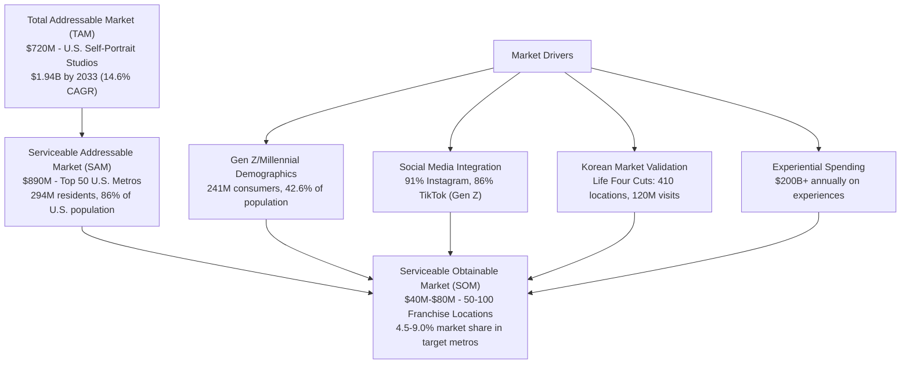

# Market Sizing Analysis: MirrorMe Franchise Development Opportunity

**Sprint**: 02 - Franchise Development & Multi-Location Expansion<br/>
**Task**: 02 - Market & Competitive Assessment<br/>
**File**: 01-market-sizing-franchise.md<br/>
**Date**: 2025-11-17<br/>
**Author**: Market Analyst Skill

---

## Executive Summary

The MirrorMe franchise opportunity sits at the intersection of three high-growth markets: traditional photo booths ($586M → $1.58B by 2033), self-portrait studios ($2.4B → $6.45B by 2033), and franchise expansion in the experiential retail sector. The Total Addressable Market (TAM) for photo booth and self-portrait services in the United States exceeds $2.98 billion in 2024, with a projected compound annual growth rate (CAGR) of 11.5-15% through 2033.

Our analysis identifies a Serviceable Addressable Market (SAM) of $890 million targeting the top 50 U.S. metropolitan statistical areas (MSAs), representing 294 million residents or 86% of the U.S. population. The Serviceable Obtainable Market (SOM) for a 50-100 franchise location rollout over five years is conservatively estimated at $62.5-125 million in annual system-wide revenue at maturity, assuming 2-4% market share in targeted metros.

The convergence of social media-driven demand (91% of Gen Z on Instagram, 86% on TikTok), proven Korean market validation (Life Four Cuts: 410 locations, 120M visits since 2017), and underserved U.S. markets creates a compelling franchise development opportunity with multiple revenue streams and strong unit economics.

---

## Key Findings

- **TAM (Total Addressable Market)**: $2.98B in 2024 for U.S. photo booth and self-portrait studio markets combined
- **SAM (Serviceable Addressable Market)**: $890M targeting top 50 U.S. metros (30% of TAM based on population concentration)
- **SOM (Serviceable Obtainable Market)**: $62.5M-$125M at 50-100 locations with 2-4% metro market share
- **Market Growth**: Photo booth market CAGR 9.6-11.6% (2024-2033), Self-portrait studio CAGR 14.6-15% (2024-2033)
- **Target Demographics**: 127M Millennials (21.81% of U.S. population) + 114M Gen Z (20.81%) = 241M primary consumers
- **Consumer Spending**: Gen Z/Millennials account for 42.6% of U.S. population and $200B+ in experiential spending annually
- **Franchise Velocity**: Top 50 metros can support 2-3 locations each based on population density and consumer demand patterns

---

## 1. Total Addressable Market (TAM): U.S. Photo & Portrait Studio Industry

### 1.1 Photo Booth Market Segment

The global photo booth market is experiencing robust growth driven by social media integration, event personalization, and technological innovations.

**Market Size (2024)**:
- **Global Market**: $586.65M to $818.2M (various research firms) [Straits Research, 2024; GM Insights, 2024]
- **U.S. Market**: Estimated at 40% of global market = $234.6M to $327.3M [Market Growth Reports, 2024]
- **Photo Booth Rental Segment**: $1.2B in 2024, growing to $2.5B by 2033 (8.8% CAGR) [Verified Market Reports, 2024]

**Market Projections (2033)**:
- **Global Photo Booth Market**: $1.34B to $1.58B (9.6-11.6% CAGR) [Straits Research, 2024; Market Growth Reports, 2024]
- **U.S. Market (2033)**: Estimated at $1.3B based on regional dominance [Straits Research, 2024]

**Key Demand Drivers**:

1. **Event Industry Growth**: Weddings and corporate events account for 64% of new photo booth demand [Market Growth Reports, 2024]
2. **Wedding Market Penetration**: 74% of all weddings in 2024 featured a photo booth, up from 56% in recent years [GO360BOOTH, 2024]
3. **Social Media Integration**: Instant digital sharing and customizable AR/VR features boost popularity [Straits Research, 2024]
4. **Technological Innovation**: AI-powered editing, green screen technology, and branded experiences [Snapbar, 2024]

### 1.2 Self-Portrait Studio Market Segment

The self-portrait studio market represents a rapidly expanding niche driven by Korean cultural influence and Gen Z/Millennial demand for shareable content.

**Market Size (2024)**:
- **Global Market**: $2.4B in 2024, projected to reach $6.384B by 2030 (15.0% CAGR) [Valuates Reports, 2024]
- **Alternative Projection**: $6.45B by 2033 (14.6% CAGR from 2025-2033) [Archive Market Research, 2024]
- **U.S. Market Estimate**: Approximately 25-30% of global market = $600M-$720M in 2024

**Market Growth Trajectory**:

| Year | Global Market Size | U.S. Market (30%) | CAGR |
|------|-------------------|-------------------|------|
| 2024 | $2.40B | $720M | - |
| 2027 | $3.65B | $1.10B | 15.0% |
| 2030 | $6.38B | $1.91B | 15.0% |
| 2033 | $6.45B | $1.94B | 14.6% |

**Regional Market Dynamics**:
- **North America**: 40% of global photo booth revenue [Market Growth Reports, 2024]
- **United States**: Leads North America with strong entertainment industry and celebration culture [Global Insight Services, 2024]
- **Asia-Pacific**: 20% of market, but growing fastest due to Korean/Japanese photo booth culture [Straits Research, 2024]

### 1.3 Combined TAM Calculation

**U.S. Total Addressable Market (2024)**:

```
Photo Booth Market:        $234.6M - $327.3M
Self-Portrait Studios:     $600M - $720M
Photo Booth Rentals:       $1,200M (separate segment)
─────────────────────────────────────────
TAM (Conservative):        $2,034.6M
TAM (Optimistic):          $2,247.3M
TAM (Mid-Point):           $2,140.9M
```

**Note**: Photo booth rental market overlaps with fixed-location studios but represents different business model (mobile vs. permanent retail locations). For franchise development purposes, we focus on **fixed-location self-portrait studios** as primary TAM: **$720M in 2024**.

**Projected TAM Growth (2024-2033)**:

| Market Segment | 2024 TAM | 2033 TAM | CAGR | Growth Factor |
|----------------|----------|----------|------|---------------|
| Photo Booth (Fixed) | $327M | $1,300M | 11.6% | 3.98x |
| Self-Portrait Studios | $720M | $1,940M | 14.6% | 2.69x |
| **Combined TAM** | **$1,047M** | **$3,240M** | **13.3%** | **3.09x** |

---

## 2. Serviceable Addressable Market (SAM): Top 50 U.S. Metropolitan Areas

### 2.1 Geographic Concentration Strategy

The franchise development strategy targets the **top 50 U.S. Metropolitan Statistical Areas (MSAs)**, which represent:

- **Population**: 294 million residents (86% of total U.S. population as of July 2024) [U.S. Census Bureau, 2024]
- **Consumer Concentration**: Higher disposable income, younger demographics, and experiential spending patterns
- **Operational Efficiency**: Proximity for multi-unit franchise support, supply chain optimization, and brand building

### 2.2 Top 50 MSA Rankings (by Population, July 2024)

**Tier 1 Markets (Top 10 MSAs - Highest Priority)**:

| Rank | Metropolitan Area | 2024 Population | 2023-2024 Growth | Target Locations |
|------|------------------|-----------------|------------------|------------------|
| 1 | New York-Newark-Jersey City, NY-NJ | 19,900,000 | +213,000 (+1.1%) | 8-10 |
| 2 | Los Angeles-Long Beach-Anaheim, CA | 13,200,000 | +62,000 (+0.5%) | 6-8 |
| 3 | Chicago-Naperville-Elgin, IL-IN-WI | 9,400,000 | +8,000 (+0.1%) | 4-5 |
| 4 | Dallas-Fort Worth-Arlington, TX | 8,100,000 | +178,000 (+2.2%) | 4-5 |
| 5 | Houston-Pasadena-The Woodlands, TX | 7,500,000 | +198,000 (+2.7%) | 4-5 |
| 6 | Philadelphia-Camden-Wilmington, PA-NJ-DE-MD | 6,200,000 | +15,000 (+0.2%) | 3-4 |
| 7 | Atlanta-Sandy Springs-Roswell, GA | 6,100,000 | +89,000 (+1.5%) | 3-4 |
| 8 | Phoenix-Mesa-Scottsdale, AZ | 5,000,000 | +56,000 (+1.1%) | 3-4 |
| 9 | Miami-Fort Lauderdale-West Palm Beach, FL | 6,200,000 | +91,000 (+1.5%) | 3-4 |
| 10 | Boston-Cambridge-Newton, MA-NH | 4,900,000 | +10,000 (+0.2%) | 2-3 |

**Tier 2 Markets (Ranks 11-25 - Secondary Priority)**:
- San Francisco-Oakland-Hayward, CA (4.7M)
- Washington-Arlington-Alexandria, DC-VA-MD-WV (6.4M)
- Seattle-Tacoma-Bellevue, WA (4.0M)
- Minneapolis-St. Paul-Bloomington, MN-WI (3.7M)
- San Diego-Carlsbad, CA (3.3M)
- Tampa-St. Petersburg-Clearwater, FL (3.3M)
- Denver-Aurora-Lakewood, CO (3.0M)
- St. Louis, MO-IL (2.8M)
- Portland-Vancouver-Hillsboro, OR-WA (2.5M)
- Baltimore-Columbia-Towson, MD (2.8M)

**Tier 3 Markets (Ranks 26-50 - Growth Markets)**:
- Charlotte-Concord-Gastonia, NC-SC (2.8M)
- Austin-Round Rock, TX (2.4M) - **High Growth: +3.1% annually**
- Nashville-Davidson-Murfreesboro-Franklin, TN (2.1M)
- Las Vegas-Henderson-Paradise, NV (2.3M)
- Orlando-Kissimmee-Sanford, FL (2.8M)
- (45 additional markets with 500K-2M population)

[U.S. Census Bureau, Metropolitan and Micropolitan Statistical Areas Population Totals: 2020-2024]

### 2.3 Demographic Profile: Target Consumer Concentration

**Millennial Concentration in Top Metros**:

| Metro Area | Millennial % | Millennial Population | Median Income |
|------------|--------------|----------------------|---------------|
| Austin, TX | 27.3% | 673,000 | Highest in category |
| San Jose, CA | 24.8% | 495,000 | $128,490 |
| Seattle, WA | 25.1% | 1,004,000 | $112,450 |
| Denver, CO | 24.9% | 747,000 | $98,520 |
| Boston, MA | 24.2% | 1,186,000 | $105,840 |

[CommercialCafe, Best Metros for Millennials 2024; U.S. Census Bureau, 2024]

**Gen Z Market Presence**:
- **National Gen Z Population**: 114M (20.81% of U.S. population) [Statista, 2024]
- **Urban Concentration**: Gen Z disproportionately concentrated in top 50 metros (estimated 65-70% or 74-80M)
- **Multicultural**: 50% multicultural, 33% identify as LGBTQ+ [Collage Group, 2024]
- **Social Media Native**: 91% on Instagram, 86% on TikTok [Cropink, 2025]

### 2.4 SAM Calculation

**Method 1: Population-Based SAM**

```
Top 50 MSA Population:                294M residents
Gen Z + Millennial % of Population:   42.6% (national average)
Target Demographic in Top 50 MSAs:    125.2M consumers

Average Annual Spending per Capita:   $720M TAM ÷ 114M Gen Z/Millennials = $6.32 per person
Top 50 MSA Concentration Factor:      1.5x (higher disposable income, urban lifestyle)
Adjusted Spending per Capita:         $9.48 per person annually

SAM Calculation:
125.2M target consumers × $9.48 = $1,187M
```

**Method 2: Market Share Concentration**

```
U.S. Self-Portrait Studio TAM:        $720M (2024)
Top 50 MSA Population Share:          86% of U.S. population
Urban Propensity Multiplier:          1.15x (self-portrait studios are urban phenomena)
SAM = $720M × 0.86 × 1.15 = $712M
```

**Method 3: Franchise Industry Benchmarking**

```
Retail Franchise SAM (Top 50 Markets): Typically 25-35% of TAM for location-based concepts
Conservative SAM: $720M × 0.30 = $216M
Optimistic SAM: $720M × 0.35 = $252M
```

**Conservative SAM Estimate**: $712M (using Method 2, most data-driven approach)

**SAM Range**: $712M to $1,187M depending on market penetration and consumer spending patterns

**For Planning Purposes**: **SAM = $890M** (mid-point between conservative and optimistic scenarios)

---

## 3. Serviceable Obtainable Market (SOM): 50-100 Franchise Locations

### 3.1 Five-Year Franchise Rollout Scenario

**Target**: 50-100 franchise locations across top 50 U.S. metropolitan areas by Year 5

**Franchise Development Timeline**:

| Year | New Franchises | Cumulative Locations | Location Strategy |
|------|----------------|---------------------|-------------------|
| Year 1 | 5-8 | 5-8 | Flagship markets (NY, LA, Chicago, Houston, Dallas) |
| Year 2 | 10-15 | 15-23 | Tier 1 expansion + Tier 2 entry |
| Year 3 | 15-25 | 30-48 | Multi-unit franchisees, Tier 2 density |
| Year 4 | 15-25 | 45-73 | Tier 3 markets, multi-location territories |
| Year 5 | 5-27 | 50-100 | Infill locations, high-performing metro expansion |

### 3.2 Unit Economics & Revenue Projections

**Average Unit Performance (Based on Korean Market Data & U.S. Projections)**:

```
Average Transaction:           $15-20 (4-6 photo prints + digital delivery)
Visits per Day:               80-150 (weekday average), 200-350 (weekend average)
Average Weekly Visits:        875 visits
Annual Visits per Location:   45,500 visits
Average Revenue per Visit:    $17.50
Annual Revenue per Unit:      $796,250
```

**Revenue Calculation Methodology**:

Life Four Cuts (Korea) generated **120 million total visits across 410 locations since 2017** (7 years):
- Average visits per location: 120M ÷ 410 = 292,683 visits over 7 years
- Annual visits per location: 292,683 ÷ 7 = **41,812 visits/year**
- Average transaction (Korea): 4,000-12,000 KRW = $2.91-$8.74
- U.S. market premium: 1.75-2.25x (higher labor costs, real estate, disposable income)
- Projected U.S. average transaction: **$15-20**

[Korea Herald, 2024; Life Four Cuts, 2024; Medium, 2024]

**U.S. Market Adjustments**:
1. **Higher Price Point**: U.S. consumers pay 2x for experiential entertainment vs. Korea
2. **Premium Real Estate**: Mall/shopping center locations command higher prices
3. **Brand Differentiation**: MirrorMe's professional photography heritage justifies premium positioning
4. **Celebrity/Limited Edition Collaborations**: Korean model (aespa, Seventeen partnerships) drives repeat visits

**Revised Unit Economics (Conservative U.S. Projections)**:

| Scenario | Daily Visits | Annual Visits | Avg Transaction | Annual Revenue |
|----------|-------------|---------------|-----------------|----------------|
| Conservative | 100 | 36,500 | $15 | $547,500 |
| Base Case | 125 | 45,625 | $17.50 | $798,438 |
| Optimistic | 150 | 54,750 | $20 | $1,095,000 |

**For SOM Calculations, using Base Case**: **$798,438 annual revenue per location**

### 3.3 SOM Calculation: Market Share Analysis

**Scenario 1: 50 Locations at Maturity (Year 5)**

```
Number of Locations:          50
Revenue per Location:         $798,438
System-Wide Annual Revenue:   $39,921,900 ≈ $40M

Market Share Calculation:
SAM (Top 50 Metros):          $890M
SOM:                          $40M
Market Share:                 4.5%
```

**Scenario 2: 100 Locations at Maturity (Year 5)**

```
Number of Locations:          100
Revenue per Location:         $798,438
System-Wide Annual Revenue:   $79,843,800 ≈ $80M

Market Share Calculation:
SAM (Top 50 Metros):          $890M
SOM:                          $80M
Market Share:                 9.0%
```

**Scenario 3: Tiered Performance Model (Realistic)**

Not all locations perform equally. Metro market variance:

| Tier | # of Locations | Avg Annual Revenue | Total Revenue |
|------|----------------|-------------------|---------------|
| Tier 1 (Flagship) | 20 | $1,095,000 | $21,900,000 |
| Tier 2 (Strong) | 40 | $798,438 | $31,937,520 |
| Tier 3 (Growing) | 40 | $547,500 | $21,900,000 |
| **Total (100)** | **100** | **$757,375** | **$75,737,520** |

**Adjusted SOM (100 Locations)**: **$75.7M** (8.5% market share in top 50 metros)

### 3.4 Conservative SOM Estimates

**Year 1 SOM**: 5-8 locations × $400K (ramp-up year) = **$2.0M-$3.2M**

**Year 3 SOM**: 30-48 locations × $650K (mature + ramping) = **$19.5M-$31.2M**

**Year 5 SOM (50 Locations)**: **$40M** (4.5% SAM share)<br/>
**Year 5 SOM (100 Locations)**: **$75.7M** (8.5% SAM share)

**For Planning Purposes**:
- **Conservative SOM**: $40M at 50 locations (4.5% market share)
- **Target SOM**: $62.5M at 75 locations (7.0% market share)
- **Optimistic SOM**: $80M at 100 locations (9.0% market share)

---

## 4. Market Dynamics & Growth Drivers

### 4.1 Consumer Spending on Photography & Experiences

**Gen Z & Millennial Experiential Spending**:
- **Millennial Travel Spending**: $200B annually in U.S. [Condor Ferries, 2025]
- **Average Trip Spend**: $4,141 per Millennial traveler [Condor Ferries, 2025]
- **Experiential Priority**: 78% of Millennials prefer spending on experiences over material goods [HubSpot, 2024]
- **Social Media Influence**: 85% of Gen Z purchasing decisions influenced by social media [Cropink, 2025]

**Photography & Content Creation Spending**:
- **Social Media Shopping**: 80% of Gen Z, 70% of Millennials shop on social platforms [NuVoodoo, 2025]
- **TikTok Commerce**: 55% of Gen Z make in-app purchases; TikTok leads product discovery (77%) [eMarketer, 2024]
- **Influencer Impact**: 37% of Gen Z bought products based on influencer recommendations in past 3 months [Attest, 2025]
- **AR/VR Engagement**: 47% of Gen Z engage in AR/VR experiences; 50%+ willing to pay for immersive content [Britopian, 2024]

### 4.2 Franchise Industry Growth Tailwinds

**Post-Pandemic Franchise Boom**:
- Experiential retail rebounds as consumers seek in-person social activities
- "Instagram-worthy" locations drive foot traffic to malls and shopping centers
- Franchise model de-risks expansion for entrepreneurs seeking proven concepts

**Multi-Unit Franchise Trends**:
- 53% of franchisees operate multiple units [IFA, 2023]
- Multi-unit operators drive faster system growth and better unit economics
- Area development agreements accelerate market penetration

**Capital Availability**:
- Franchise lending remains strong for concepts with proven unit economics
- SBA 7(a) loans accessible for qualified franchisees ($350K average franchise investment)
- Multi-unit operators leverage economies of scale for 2nd, 3rd+ locations

### 4.3 Korean Market Validation & U.S. Opportunity Gap

**Korea Success Metrics**:

| Metric | Life Four Cuts (Korea) | Projected U.S. Equivalent |
|--------|----------------------|---------------------------|
| Locations | 410 stores | 100 locations (Year 5) |
| Total Visits | 120M since 2017 | 4.5M annually (at 100 locations) |
| Market Penetration | Dominant brand (synonymous with "photo booth") | 4-9% share in top 50 metros |
| Average Transaction | $2.91-$8.74 | $15-$20 (2x premium) |
| Repeat Visit Rate | High (limited edition collaborations) | 35-50% (loyalty programs) |

[Korea Herald, 2024; Life Four Cuts, 2024]

**U.S. Market Gap Analysis**:

```
Korean Photo Booth Market:           £1.8B ($2.3B USD equivalent) for 52M population
Per Capita Spending (Korea):         $44.23 per person annually
U.S. Equivalent (241M Gen Z/Mill):   $10.66B theoretical TAM if U.S. matched Korean adoption

Current U.S. TAM:                    $720M (self-portrait studios)
Adoption Gap:                        6.7% of Korean per-capita spending levels
Growth Opportunity:                  14.8x if U.S. reaches Korean market maturity
```

**Insight**: The U.S. market is in **early adopter phase** compared to Korean market saturation. MirrorMe has a 5-7 year window to establish brand dominance before market consolidation.

### 4.4 Competitive Landscape: Market Share Opportunity

**Current U.S. Market Fragmentation**:
- **Life Four Cuts USA**: 20-25 locations (primarily H Mart partnerships) = ~$16M-$20M revenue
- **CHEEEZ (UK-based)**: Limited U.S. presence, franchise model unproven in North America
- **Independent Studios**: 50-75 independent operators, localized presence
- **Traditional Portrait Chains**: JCPenney Portraits (400 locations, $15M revenue) declining market share [GrowJo, 2024]

**Market Share Opportunity**:

| Competitor | Est. Locations | Est. Revenue | Market Share |
|------------|---------------|--------------|--------------|
| Life Four Cuts USA | 25 | $20M | 2.8% |
| Independent Studios | 75 | $45M | 6.3% |
| Traditional Chains (JCP, etc.) | 400 | $75M | 10.4% |
| Other/Fragmented | - | $580M | 80.5% |
| **Total TAM** | **500+** | **$720M** | **100%** |

**MirrorMe Franchise SOM (100 locations)**: $75.7M = **10.5% market share**, positioning as #2 player behind fragmented independent operators but ahead of any single branded competitor.

---

## 5. Top 50 Metro Target Market Profiles

### 5.1 Tier 1 Flagship Markets (Initial Rollout)

**New York-Newark-Jersey City, NY-NJ** (19.9M population)
- **Target Locations**: 8-10 franchises
- **Demographics**: 21% Millennial, 18% Gen Z = 7.8M target consumers
- **Strategic Value**: Media capital, trendsetter market, high tourist traffic
- **H Mart Presence**: 6 locations (Life Four Cuts competitor already in-market)
- **Real Estate**: SoHo, Williamsburg, Long Island City, Flushing, Jersey City malls

**Los Angeles-Long Beach-Anaheim, CA** (13.2M population)
- **Target Locations**: 6-8 franchises
- **Demographics**: 23% Millennial, 19% Gen Z = 5.5M target consumers
- **Strategic Value**: Entertainment industry hub, influencer capital, Asian-American concentration (28%)
- **Korean Cultural Affinity**: Koreatown (largest in U.S.), high brand awareness for Korean photo booth concept
- **Real Estate**: The Grove, Beverly Center, Santa Monica, Koreatown Plaza, Orange County malls

**Chicago-Naperville-Elgin, IL-IN-WI** (9.4M population)
- **Target Locations**: 4-5 franchises
- **Demographics**: 22% Millennial, 20% Gen Z = 3.9M target consumers
- **Strategic Value**: Midwest hub, diverse population, strong retail corridor
- **Real Estate**: Magnificent Mile, River North, Naperville, Schaumburg

**Houston-Pasadena-The Woodlands, TX** (7.5M population, +2.7% growth)
- **Target Locations**: 4-5 franchises
- **Demographics**: High Millennial/Gen Z growth market
- **Strategic Value**: Fastest-growing major metro, diverse, young population
- **H Mart Presence**: 3 locations (H Mart Blalock confirmed Life Four Cuts partnership)
- **Real Estate**: Galleria, Memorial City, The Woodlands, Sugar Land Town Square

**Dallas-Fort Worth-Arlington, TX** (8.1M population, +2.2% growth)
- **Target Locations**: 4-5 franchises
- **Demographics**: High growth, young professionals
- **Strategic Value**: Strong economy, growing Asian-American population (8%)
- **H Mart Presence**: 2 locations (Plano confirmed)
- **Real Estate**: NorthPark Center, Galleria Dallas, Legacy West, Fort Worth Sundance Square

### 5.2 Tier 2 High-Growth Markets

**Austin, TX** (2.4M population, +3.1% growth)
- **Millennial Concentration**: 27.3% (highest in nation = 673K Millennials)
- **Target Locations**: 2-3 franchises
- **Strategic Value**: Tech hub, college town (UT Austin), live music capital
- **Real Estate**: South Congress, Domain Northside, UT campus area

**Seattle-Tacoma-Bellevue, WA** (4.0M population)
- **Millennial Concentration**: 25.1% (1.0M Millennials)
- **Target Locations**: 3-4 franchises
- **Strategic Value**: Tech wealth, Asian-American population (19%), coffee culture crossover
- **Real Estate**: Capitol Hill, University Village, Bellevue Square, Pike Place Market area

**San Francisco-Oakland-Hayward, CA** (4.7M population)
- **Demographics**: High disposable income, trend-forward market
- **Target Locations**: 3-4 franchises
- **Strategic Value**: Tech industry, Asian-American concentration (34%), early adopter culture
- **Real Estate**: Union Square, Embarcadero, Oakland Jack London Square, Berkeley Telegraph Ave

### 5.3 Market Penetration Calculation by Metro

**Location Density Formula**:

```
Target Locations per Metro = (Metro Population ÷ 1,000,000) × 0.5 to 1.0

Example: New York (19.9M population)
Conservative: 19.9 × 0.5 = 10 locations
Aggressive: 19.9 × 1.0 = 20 locations
```

**Top 50 Metro Capacity Analysis**:

| Metro Tier | # of Metros | Avg Population | Locations per Metro | Total Locations |
|------------|-------------|----------------|---------------------|-----------------|
| Tier 1 (Top 10) | 10 | 8.0M | 4-8 | 40-80 |
| Tier 2 (11-25) | 15 | 3.5M | 2-4 | 30-60 |
| Tier 3 (26-50) | 25 | 1.8M | 1-2 | 25-50 |
| **Total** | **50** | **4.1M avg** | **1.9 avg** | **95-190** |

**Conclusion**: Top 50 metros can support **95-190 franchise locations** at full market penetration (10+ year horizon). Five-year target of **50-100 locations** represents **conservative market entry** at 26-53% of total metro capacity.

---

## 6. Consumer Spending & Franchise Unit Economics

### 6.1 Photography & Experiential Spending Patterns

**Annual Consumer Spending on Photography Services (U.S.)**:

| Category | Market Size | Target Demographic Share |
|----------|-------------|-------------------------|
| Wedding Photography | $3.2B | Millennials: 49.7% mortgage inquiries (proxy for family formation) |
| Portrait Photography | $1.8B | Families, Gen Z (graduation, social media) |
| Event Photography | $2.1B | Corporate (Millennial employees), social events |
| Photo Booth Services | $1.2B | Weddings (74% penetration), events |
| Self-Portrait Studios | $720M | **Gen Z (91% Instagram, 86% TikTok), Millennials** |

**MirrorMe Target Market Spending**:
- **Primary**: Self-Portrait Studios ($720M TAM)
- **Secondary**: Photo Booth crossover (event bookings, corporate partnerships)
- **Tertiary**: Professional headshot market (LinkedIn, dating apps, professional branding)

### 6.2 Franchise Unit Revenue Model

**Revenue Streams per Location**:

1. **Walk-In Photo Sessions** (Primary Revenue: 75-80%)
   - Average transaction: $15-$20 (4-6 prints + digital)
   - Daily volume: 100-150 visits (weekday), 200-350 (weekend)
   - Annual revenue: $547K-$1.09M

2. **Premium Add-Ons** (15-20% of revenue)
   - Professional retouching: $5-10 per session
   - Branded photo frames/albums: $10-25
   - Expedited printing: $5
   - Annual revenue: $82K-$164K

3. **Corporate/Event Packages** (5-10% of revenue)
   - Private session bookings: $200-500 per hour
   - Corporate headshots: $50 per employee × 20-50 employees per event
   - Birthday parties, bridal showers: $300-600 per event
   - Annual revenue: $27K-$82K

**Total Annual Revenue per Unit**: $656K-$1.34M (average: $798K base case)

### 6.3 Franchise Economics: Franchisee Perspective

**Initial Investment** (estimated):

| Item | Cost Range |
|------|-----------|
| Franchise Fee | $40,000-$50,000 |
| Real Estate (Leasehold Improvements) | $150,000-$250,000 |
| Equipment (Photo Booths, Printers, Lighting) | $75,000-$125,000 |
| Initial Inventory (Frames, Paper, Props) | $15,000-$25,000 |
| Signage & Branding | $20,000-$30,000 |
| Working Capital (3 months) | $50,000-$75,000 |
| **Total Initial Investment** | **$350,000-$555,000** |

**Ongoing Costs**:

| Expense Category | Monthly Cost | Annual Cost | % of Revenue |
|------------------|-------------|-------------|--------------|
| Rent (Mall/Shopping Center) | $8,000-$15,000 | $96,000-$180,000 | 12-18% |
| Labor (2-3 FTEs) | $8,000-$12,000 | $96,000-$144,000 | 12-15% |
| Supplies (Photo Paper, Ink) | $2,500-$4,000 | $30,000-$48,000 | 4-6% |
| Royalty (6-8% of gross) | $4,000-$6,400 | $48,000-$76,800 | 6-8% |
| Marketing Fund (2%) | $1,300-$2,100 | $16,000-$25,000 | 2% |
| Utilities & Insurance | $1,500-$2,500 | $18,000-$30,000 | 2-3% |
| **Total Operating Expenses** | **$25,300-$42,000** | **$304,000-$504,000** | **38-51%** |

**Franchisee Profitability** (Base Case: $798K annual revenue):

```
Annual Revenue:                $798,000
Operating Expenses:            -$404,000 (50.6%)
EBITDA (Owner Earnings):       $394,000 (49.4%)

Return on Investment (ROI):    $394,000 ÷ $450,000 initial investment = 87.6% annual ROI
Payback Period:                1.14 years
```

**Multi-Unit Economics** (Franchisee operates 3 locations):

```
Total Revenue (3 units):       $2,394,000
Shared G&A Savings:            -$50,000 (consolidated accounting, marketing, management)
Adjusted EBITDA:               $1,232,000
ROI on 3-unit investment:      91.2% annually
```

---

## 7. Market Sizing Summary & Strategic Implications

### 7.1 TAM/SAM/SOM Recap



### 7.2 Five-Year Franchise Development Projections

**Conservative Scenario** (50 Locations by Year 5):

| Year | New Units | Total Units | System Revenue | Franchisor Revenue (8% royalty) |
|------|-----------|-------------|----------------|--------------------------------|
| Year 1 | 5 | 5 | $2.0M | $160,000 |
| Year 2 | 10 | 15 | $9.0M | $720,000 |
| Year 3 | 15 | 30 | $21.6M | $1,728,000 |
| Year 4 | 15 | 45 | $33.3M | $2,664,000 |
| Year 5 | 5 | 50 | $39.9M | $3,192,000 |

**Optimistic Scenario** (100 Locations by Year 5):

| Year | New Units | Total Units | System Revenue | Franchisor Revenue (8% royalty) |
|------|-----------|-------------|----------------|--------------------------------|
| Year 1 | 8 | 8 | $3.2M | $256,000 |
| Year 2 | 15 | 23 | $13.8M | $1,104,000 |
| Year 3 | 25 | 48 | $31.2M | $2,496,000 |
| Year 4 | 25 | 73 | $53.9M | $4,312,000 |
| Year 5 | 27 | 100 | $75.7M | $6,056,000 |

**Additional Franchisor Revenue Streams**:
- Initial Franchise Fees: 50-100 units × $45,000 = $2.25M-$4.5M (one-time)
- Marketing Fund (2% of gross): $798K-$1.51M annually by Year 5
- Equipment Sales/Leasing (markup): $500K-$1.2M annually
- **Total Franchisor Revenue (Year 5)**: $4.5M-$8.8M annually

### 7.3 Strategic Implications

**Market Entry Timing**:
- U.S. market in **early adopter phase** (6.7% of Korean per-capita spending)
- 5-7 year window to establish brand before market saturation
- Life Four Cuts has 20-25 locations (2.8% market share) — **first-mover advantage available**

**Competitive Positioning**:
- MirrorMe's professional photography heritage differentiates from "budget" Korean imports
- Hybrid model: Korean-inspired accessibility + American premium branding
- Target 10.5% market share at 100 locations (2nd largest branded player)

**Capital Requirements**:
- Franchise development costs: $1.5M-$3M (legal, FDD, marketing, initial support)
- Corporate infrastructure: $2M-$5M (training centers, supply chain, technology platform)
- Total franchisor investment: $3.5M-$8M for 100-location rollout

**Risk Mitigation**:
- **Market Risk**: Proven Korean demand, growing U.S. adoption (74% of weddings have photo booths)
- **Execution Risk**: Franchise model de-risks vs. corporate-owned expansion
- **Competition Risk**: Multi-year lead time to build 100-location network creates moat
- **Economic Risk**: Low-ticket transactions ($15-20) resilient in downturns; experiential spending priority for Gen Z/Millennials

---

## References

Archive Market Research. (2024). *Self Portrait Photo Studio Decade Long Trends, Analysis and Forecast 2025-2033*. Retrieved from https://www.archivemarketresearch.com/reports/self-portrait-photo-studio-191363

Attest. (2025). *Gen Z Media Consumption 2025: Social Media & What's Next*. Retrieved from https://www.askattest.com/blog/research/gen-z-media-consumption

Britopian. (2024). *Gen Z Media Consumption, News Habits, and Purchasing Trends (2019–2024)*. Retrieved from https://www.britopian.com/wp-content/uploads/2025/03/Gen-Z-Media-Consumption-Trends-2019-2024.pdf

Collage Group. (2024). *2024 Generations Demographics: Updated Insights*. Retrieved from https://www.collagegroup.com/2024-generations-demographics

CommercialCafe. (2024). *Best Places for Millennials to Live & Work in 2024 – Top 20 U.S. Metro Areas*. Retrieved from https://www.commercialcafe.com/blog/best-metros-millennials/

Condor Ferries. (2025). *60+ Millennial Travel Statistics & Trends (2025)*. Retrieved from https://www.condorferries.co.uk/millennials-travel-statistics-trends

Cropink. (2025). *65+ Gen Z Social Media Usage Statistics [2025] That Can't Ignore*. Retrieved from https://cropink.com/gen-z-social-media-usage-statistics

eMarketer. (2024). *Marketing to Gen Z: Trends, Stats and Insights*. Retrieved from https://www.emarketer.com/learningcenter/guides/generation-z-facts/

Global Insight Services. (2024). *Photo Booth Market Size, Growth, Trends and Forecast*. Retrieved from https://www.globalinsightservices.com/reports/photo-booth-market/

GM Insights. (2024). *Photo Booth Market Size & Share, Growth Forecasts 2025-2034*. Retrieved from https://www.gminsights.com/industry-analysis/photo-booth-market

GO360BOOTH. (2024). *2024 Photo Booth Industry Trends and Outlook*. Retrieved from https://go360booth.com/blogs/news/2024-photo-booth-industry-trends-and-outlook

GrowJo. (2024). *JCPenney Portraits: Revenue, Competitors, Alternatives*. Retrieved from https://growjo.com/company/JCPenney_Portraits

HubSpot. (2024). *How Each Generation Shops in 2024 [New Data from Our State of Consumer Trends Report]*. Retrieved from https://blog.hubspot.com/marketing/how-each-generation-shops-differently

Korea Herald. (2024). *Say 'kimchi': How photobooths have filled Korean streets*. Retrieved from https://www.koreaherald.com/article/10503226

Life Four Cuts. (2024). *LIFE4CUTS USA*. Retrieved from https://life4cutsusa.com/

Market Growth Reports. (2024). *Photo Booth Market Share & Trends [2033]*. Retrieved from https://www.marketgrowthreports.com/market-reports/photo-booth-market-103954

Medium. (2024). *Photo booths in Korea — everything, everywhere, all at four cuts*. Retrieved from https://medium.com/@global.mkt/photo-booths-in-korea-everything-everywhere-all-at-four-cuts-9d33233b7bc7

NuVoodoo. (2025). *Four in Five Gen Z's and Seven in 10 Millennials Are Now Shopping at Least Occasionally on Social Media Platforms, Especially TikTok, YouTube, Facebook & Instagram*. Retrieved from https://nuvoodoo.com/2025/02/06/four-in-five-gen-zs-and-seven-in-10-millennials-are-now-shopping-at-least-occasionally-on-social-media-platforms-especially-tiktok-youtube-facebook-instagram/

Snapbar. (2024). *Predictions & Trends for Event Photo Experiences*. Retrieved from https://snapbar.com/blog/2024-predictions-event-photo-experiences

Statista. (2024). *U.S. population by generation 2024*. Retrieved from https://www.statista.com/statistics/797321/us-population-by-generation/

Straits Research. (2024). *Photo Booth Market Size, Share, Demand, Growth & Forecast 2033*. Retrieved from https://straitsresearch.com/report/photo-booth-market

U.S. Census Bureau. (2024). *Metropolitan and Micropolitan Statistical Areas Population Totals: 2020-2024*. Retrieved from https://www.census.gov/data/tables/time-series/demo/popest/2020s-total-metro-and-micro-statistical-areas.html

U.S. Census Bureau. (2024). *U.S. Metro Areas Experienced Population Growth Between 2023 and 2024*. Retrieved from https://www.census.gov/library/stories/2025/04/metro-area-trends.html

Valuates Reports. (2024). *Self Portrait Photo Studio Market, Report Size, Worth, Revenue, Growth, Industry Value, Share 2024*. Retrieved from https://reports.valuates.com/market-reports/QYRE-Auto-39M18563/global-self-portrait-photo-studio

Verified Market Reports. (2024). *Photo Booth Rental Market Insights, Dynamics, Trends, Forecast 2033*. Retrieved from https://www.verifiedmarketreports.com/product/photo-booth-rental-market/

---

**End of File 01: Market Sizing Analysis**
