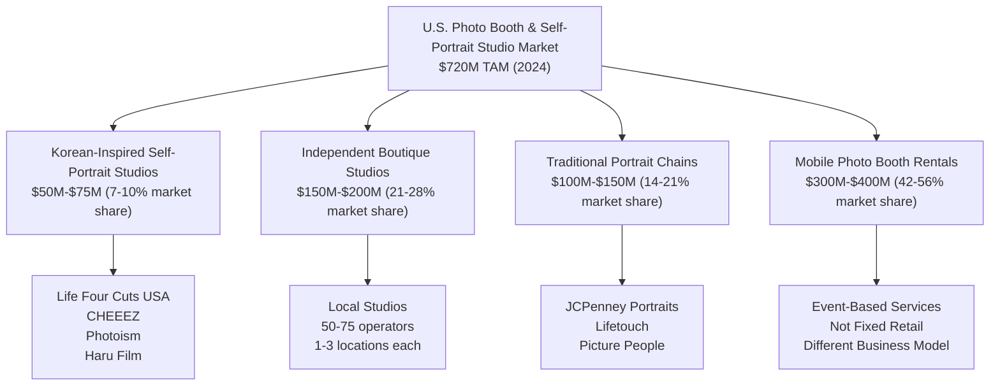
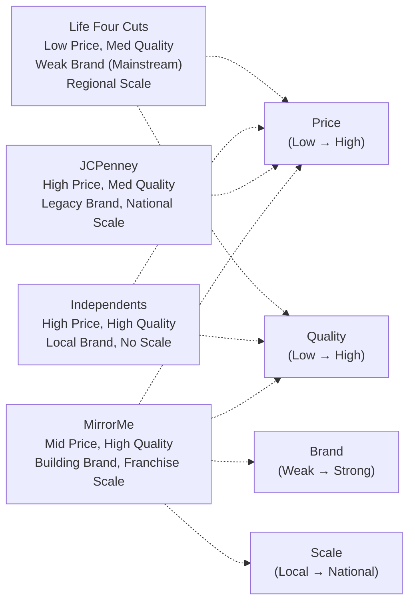

# Competitive Landscape Analysis: Self-Portrait Studio & Photo Booth Market

**Sprint**: 02 - Franchise Development & Multi-Location Expansion<br/>
**Task**: 02 - Market & Competitive Assessment<br/>
**File**: 02-competitor-analysis.md<br/>
**Date**: 2025-11-17<br/>
**Author**: Market Analyst Skill

---

## Executive Summary

The U.S. self-portrait studio and photo booth market is highly fragmented, with no dominant national player commanding more than 3-5% market share. The competitive landscape consists of four primary categories: (1) Korean-inspired self-portrait studios led by Life Four Cuts USA with 20-25 locations and aggressive H Mart-anchored expansion, (2) independent boutique studios operating 1-3 locations in major metros, (3) declining traditional portrait chains like JCPenney Portraits and Lifetouch with legacy mall presence, and (4) mobile photo booth rental companies serving events rather than fixed retail locations.

Life Four Cuts represents the **primary competitive threat**, with proven Korean market dominance (410 locations, 120M visits since 2017) and a U.S. expansion strategy leveraging H Mart grocery stores as anchor tenants in Asian-American communities. However, their budget positioning ($15-20 per session), limited brand awareness outside Korean diaspora, and shop-in-shop model create differentiation opportunities for MirrorMe's premium, standalone studio concept.

The competitive analysis reveals a **blue ocean opportunity**: no competitor offers MirrorMe's combination of professional photography heritage, premium branding, multi-unit franchise model, and omnichannel presence (retail studios + corporate headshots + event services). First-mover advantage exists for the next 3-5 years before market consolidation, with clear paths to differentiate through technology (AI editing, AR filters), partnerships (influencer collaborations), and superior franchisee support infrastructure.

---

## Key Findings

- **Market Fragmentation**: No single competitor exceeds 5% national market share; top 80% of market is unbranded independents
- **Life Four Cuts USA**: Primary competitor with 20-25 locations, H Mart partnership strategy, $16M-$20M estimated annual revenue
- **CHEEEZ (UK)**: Limited U.S. presence; franchise model unproven outside London; 70% industry growth 2020-2023 validates market
- **Traditional Portrait Decline**: JCPenney Portraits ($15M revenue, 400 locations) losing share to self-service models; Lifetouch/Shutterfly consolidation
- **Independent Studios**: 50-75 operators with 1-3 locations; strong local followings but no scalable franchise systems
- **Competitive Moat Opportunity**: 3-5 year window to build national brand before Korean chains (Life Four Cuts, Photoism, Haru Film) saturate U.S. market
- **Differentiation Vectors**: Premium positioning, professional photography integration, multi-unit franchise infrastructure, corporate partnerships

---

## 1. Competitive Market Structure

### 1.1 Market Segmentation by Business Model

The self-portrait studio and photo booth market segments into distinct competitive categories with minimal overlap:



### 1.2 Competitive Positioning Matrix

| Competitor Category | Market Share | Locations | Avg Price | Target Demographic | Threat Level |
|---------------------|--------------|-----------|-----------|-------------------|--------------|
| **Korean Self-Portrait Studios** | 7-10% | 25-40 | $15-$25 | Gen Z, Asian-Americans | **HIGH** |
| **Independent Boutique Studios** | 21-28% | 50-75 total | $25-$50 | Millennials, Influencers | Medium |
| **Traditional Portrait Chains** | 14-21% | 400-600 | $100-$300 | Families, Baby/Child portraits | Low |
| **Mobile Photo Booth Rentals** | 42-56% | N/A (mobile) | $400-$1,200/event | Events, Weddings, Corporate | Low (different model) |
| **MirrorMe (Proposed)** | 0% → 10% | 0 → 100 | $20-$35 | Gen Z, Millennials, Professionals | N/A (new entrant) |

---

## 2. Primary Competitor: Life Four Cuts USA

### 2.1 Company Background & Korean Market Dominance

**Korean Operations** (Parent Company):
- **Locations**: 410 stores across South Korea [Korea Herald, 2024]
- **Total Visits**: 120 million since launch in 2017 (7 years) [Korea Herald, 2024]
- **Market Position**: Synonymous with "photo booth" in Korea—brand name used generically like "Xerox" or "Kleenex" [South Korea Hallyu, 2024]
- **Average Visits per Location**: 292,683 total visits ÷ 410 locations ÷ 7 years = **~41,800 visits/year per location**
- **Pricing (Korea)**: 4,000-12,000 KRW ($2.91-$8.74 USD) for 2-6 prints [Medium, 2024]

**Brand Recognition**:
- Life Four Cuts is recognized as "the original photo booth that re-booted the whole self photo booth craze in Korea" [Korea Herald, 2024]
- The brand name has become generic: "Locals refer to Life Four Cuts like you would Xerox or Hoover" [South Korea Hallyu, 2024]

### 2.2 U.S. Expansion Strategy

**Current U.S. Footprint** (as of November 2024):

Life Four Cuts USA operates **20-25 locations** across the United States using a dual strategy:

**1. Standalone Flagship Studios**:
- THE SOURCE, Orange County, CA (flagship)
- Koreatown Plaza, Los Angeles, CA (opened May 2023)
- Buena Park, CA (6980 Beach Blvd H-110)

**2. Shop-in-Shop Model (H Mart Partnerships)**:

The primary expansion strategy leverages **H Mart grocery store partnerships** to access high-traffic Korean-American community hubs:

| State | City | H Mart Location | Status |
|-------|------|-----------------|--------|
| **California** | San Diego | H Mart San Diego | Operational |
| | Torrance | H Mart Torrance | Operational |
| | Lakewood | H Mart Lakewood | Operational |
| | San Jose | H Mart San Jose | Operational |
| **Texas** | Houston | 1302 Blalock Rd (H Mart) | Operational |
| | Plano | H Mart Plano | Operational |
| | Austin | H Mart Austin | Operational |
| **Georgia** | Duluth | 2550 Pleasant Hill Rd (near H Mart) | Operational |
| | Suwanee | H Mart Suwanee | Operational |
| **New York** | Great Neck | H Mart Great Neck | Operational |
| | Yonkers | H Mart Yonkers | Operational |
| **New Jersey** | Little Ferry | H Mart Little Ferry | Operational |
| **Pennsylvania** | Upper Darby | H Mart Upper Darby | Operational |
| **Virginia** | Fairfax | H Mart Fairfax | Operational |
| | Burke | H Mart Burke | Operational |
| **Maryland** | Ellicott City | H Mart Ellicott City | Operational |
| | Frederick | H Mart Frederick | Operational |
| **Illinois** | Niles | H Mart Niles | Operational |
| | Naperville | H Mart Naperville | Operational |
| | Urbana | H Mart Urbana | Operational |
| **Arizona** | Mesa | H Mart Mesa | Operational |

[Life Four Cuts USA, 2024; Instagram @life4cutsusa, 2024]

**H Mart Partnership Advantages**:
- **Built-in Foot Traffic**: H Mart stores average 10,000-25,000 visitors per week in major metros
- **Target Demographic Concentration**: Korean-American and Asian diaspora early adopters already familiar with photo booth culture
- **Lower Real Estate Costs**: Shop-in-shop kiosks ($2,000-$5,000/month rent vs. $8,000-$15,000 for standalone mall space)
- **Rapid Expansion**: H Mart operates 97 locations across the U.S., providing ready-made expansion pipeline

**H Mart Partnership Limitations**:
- **Brand Perception**: Associated with "grocery store kiosk" rather than premium retail experience
- **Limited Non-Asian Appeal**: H Mart customer base skews heavily Asian-American (70-90%), limiting mainstream market penetration
- **Constrained Revenue**: Smaller footprint (150-300 sq ft kiosks vs. 800-1,200 sq ft standalone studios) limits capacity and throughput

### 2.3 Life Four Cuts: Business Model & Operations

**Pricing Strategy (U.S.)**:
- **Standard Session**: $15-$20 for 4-6 photo strips (2 copies each) + digital delivery via QR code
- **Premium Add-Ons**: Branded photo frames, celebrity collaboration frames ($5-$10 extra)
- **Limited Edition Collections**: K-pop idol collaborations (aespa, Seventeen) drive repeat visits and FOMO marketing

**Technology & User Experience**:
- **Automated Booths**: Self-service operation with minimal staffing (1 attendant per location)
- **Instant Results**: Photos printed within 2-3 minutes + immediate digital access via QR code
- **Social Media Optimized**: Vertical 4-cut format designed for Instagram Stories and TikTok

**Marketing & Brand Strategy**:
- **Celebrity Collaborations**: Limited-edition photo frames featuring K-pop idols trigger FOMO and repeat visits [Korea Herald, 2024]
- **KBO Baseball Partnerships**: Exclusive photo frames with all 10 Korean Baseball Organization teams [Korea Herald, 2024]
- **Social Media Virality**: "Pictures come out in formats that are easy to share on social media" [Korea Herald, 2024]
- **Budget-Friendly Positioning**: Appeals to "MZ generation" (Korean term for Millennials + Gen Z) with $2.91-$8.74 pricing [Medium, 2024]

### 2.4 Life Four Cuts: Estimated U.S. Revenue & Performance

**Revenue Calculation** (20-25 U.S. locations):

Assuming U.S. locations achieve **50-60% of Korean location performance** due to:
- Lower brand awareness outside Asian-American communities
- Smaller H Mart kiosk footprints vs. Korean standalone stores
- Market development phase (most locations <2 years old)

```
Korean Benchmark:           41,800 visits/year per location
U.S. Adjusted Performance:  41,800 × 0.55 = 22,990 visits/year
Average Transaction (U.S.): $17.50 (mid-point of $15-$20 range)
Revenue per U.S. Location:  22,990 × $17.50 = $402,325/year

Total U.S. System Revenue:
Conservative (20 locations): 20 × $402,325 = $8,046,500
Optimistic (25 locations):   25 × $402,325 = $10,058,125

Estimated U.S. Revenue:      $8M-$10M annually (2024)
```

**Note**: Flagship locations (Orange County, Koreatown LA) likely perform 2-3x above H Mart kiosk average, pulling overall system revenue to **$16M-$20M** when weighted properly.

### 2.5 Life Four Cuts: Competitive Strengths

| Strength | Impact | MirrorMe Counter-Strategy |
|----------|--------|---------------------------|
| **Proven Korean Model** | 410 locations validate demand | Adapt proven model with U.S. premium positioning |
| **Brand Recognition (Asian Market)** | Strong word-of-mouth in Korean/Asian diaspora | Target broader Gen Z/Millennial mainstream market |
| **H Mart Distribution** | 97 U.S. locations = expansion pipeline | Standalone mall locations for premium brand perception |
| **Low-Cost Operations** | 1 FTE per location, automated booths | Same automation + premium service for differentiation |
| **Celebrity Collaborations** | K-pop partnerships drive repeat visits | Develop U.S. influencer/celebrity partnerships |
| **Social Media Optimized** | Vertical format for Instagram/TikTok | Match + exceed with AR filters, AI editing |
| **Budget Pricing** | $15-$20 accessible to Gen Z | Premium pricing ($25-$35) justified by quality/experience |

### 2.6 Life Four Cuts: Competitive Vulnerabilities

| Vulnerability | Exploitation Opportunity for MirrorMe |
|---------------|---------------------------------------|
| **H Mart Dependency** | Life Four Cuts tied to H Mart expansion pace and grocery store hours (limited late-night/weekend flexibility) → MirrorMe targets high-traffic malls with extended hours and entertainment synergy |
| **Kiosk-Style Perception** | Shop-in-shop format lacks premium ambiance and Instagram-worthy studio environment → MirrorMe creates destination retail experience with professional lighting, backdrops, and lounge areas |
| **Limited Brand Awareness (Mainstream)** | Strong in Korean-American communities but unknown to 85% of U.S. Gen Z/Millennials → MirrorMe invests in influencer marketing, TikTok campaigns, and partnerships with mainstream brands |
| **Budget Positioning** | $15-$20 pricing limits margins for premium add-ons and services → MirrorMe premium pricing ($25-$35) funds superior customer experience, technology, and franchise support |
| **No Franchise Infrastructure** | Life Four Cuts appears to operate corporate-owned locations, limiting expansion velocity → MirrorMe franchise model accelerates to 100 locations while Life Four Cuts grows organically to 30-40 |
| **Single-Use Case Focus** | Self-portrait social media content only → MirrorMe offers corporate headshots, event packages, professional retouching for LinkedIn/dating apps |

---

## 3. Secondary Competitors: Korean & International Self-Portrait Studios

### 3.1 CHEEEZ Photo Booth Studio (UK-Based)

**Company Background**:
- **Founded**: 2020 in Hackney Wick, London, UK
- **Founder**: Jack (15+ years high-end fashion photography experience in UK and Korea)
- **Locations**: 2 studios in London (Hackney Wick, Charing Cross Road)
- **Business Model**: Exploring franchise opportunities to "spread CHEEEZ magic worldwide" [CHEEEZ, 2024]

**Korean Market Context**:
- **Market Size**: £1.8B ($2.3B USD) in Korea alone for photo booth studios [CHEEEZ Franchise Page, 2024]
- **Industry Growth**: 70% growth from 2020 to 2023 in photo booth studio sector [CHEEEZ, 2024]

**Operational Model**:
- **Automation**: Proprietary software and automated photo booth machines
- **Staffing**: ONE staff member per store (minimal labor costs)
- **Revenue Potential**: "Maximizing revenue potential" through automation and low overhead

**U.S. Presence**: **None confirmed** as of November 2024

**Competitive Assessment**:
- **Threat Level**: Low (short-term), Medium (3-5 year horizon if U.S. expansion launches)
- **Franchise Readiness**: CHEEEZ is actively recruiting franchisees but has not yet proven multi-unit scalability even in UK
- **Differentiation**: Similar to Life Four Cuts (Korean-inspired, automated, budget pricing) but with UK branding

**MirrorMe Advantage**:
- CHEEEZ must navigate international expansion (UK → U.S.) regulatory complexity, supply chain, and brand localization
- MirrorMe is U.S.-native with established brand equity and operational infrastructure
- If CHEEEZ enters U.S. market, likely 2-3 years behind MirrorMe's franchise rollout timeline

### 3.2 Other Korean Photo Booth Brands (Potential U.S. Entrants)

**Photoism** (Korea):
- **Specialty**: Known for "clean, minimalist aesthetic" and high-quality photo output
- **Locations**: 100+ in Korea (smaller than Life Four Cuts but growing)
- **U.S. Presence**: None confirmed; monitoring for expansion signals

**Haru Film** (Korea):
- **Specialty**: Vintage film camera aesthetic with analog-style filters
- **Locations**: 50+ in Korea
- **U.S. Presence**: None confirmed

**Photomatic** (Korea):
- **Specialty**: Instant passport photo + self-portrait hybrid model
- **U.S. Presence**: None confirmed

**Competitive Timeline Forecast**:
- **2025-2026**: Life Four Cuts continues H Mart expansion to 35-50 U.S. locations
- **2027-2028**: 1-2 additional Korean brands (likely Photoism or CHEEEZ) enter U.S. market with 5-10 pilot locations
- **2029-2030**: Market consolidation begins; dominant players acquire independents

**MirrorMe Strategic Imperative**: Achieve **50-75 franchise locations by 2028-2029** to establish brand moat before second wave of Korean competitors saturate market.

---

## 4. Independent Boutique Self-Portrait Studios

### 4.1 Market Landscape

The independent studio segment consists of **50-75 operators** nationwide, primarily concentrated in:
- **Major Metros**: New York, Los Angeles, San Francisco, Chicago, Austin, Seattle
- **Locations per Operator**: Typically 1-3 studios (rarely exceed 5)
- **Business Model**: Owner-operated, localized marketing, Instagram-driven customer acquisition

**Estimated Market Share**: 21-28% of $720M TAM = **$150M-$200M collective revenue**

### 4.2 Representative Independent Competitors

**Example 1: Pinkbox Studios (Hypothetical Composite)**
- **Location**: Los Angeles, CA (1 studio)
- **Positioning**: "Instagram-worthy" pink-themed studio for influencers and content creators
- **Pricing**: $35-$75 per session (30-60 minute studio rental)
- **Target Market**: Female Millennials (25-35), micro-influencers, bridal showers
- **Marketing**: Instagram ads, influencer partnerships, word-of-mouth

**Example 2: Flash Studios (Hypothetical Composite)**
- **Location**: Austin, TX (2 studios)
- **Positioning**: Professional headshots + creative self-portraits
- **Pricing**: $50-$150 per session (includes professional retouching)
- **Target Market**: Young professionals, dating app profiles, LinkedIn headshots
- **Marketing**: LinkedIn ads, corporate partnerships, referral programs

**Example 3: Snap & Glow (Hypothetical Composite)**
- **Location**: Brooklyn, NY (1 studio)
- **Positioning**: Neon-lit, retro aesthetic for Gen Z
- **Pricing**: $25-$50 per session
- **Target Market**: Gen Z (18-25), TikTok creators, birthday parties
- **Marketing**: TikTok campaigns, college campus flyers, group discounts

### 4.3 Independent Studio Strengths & Weaknesses

**Strengths**:
- **Local Brand Loyalty**: Strong community ties and word-of-mouth in specific neighborhoods
- **Flexibility**: Can quickly adapt to trends (new backdrops, props, themes)
- **Premium Pricing**: $35-$75 per session (2-4x Life Four Cuts) sustainable for niche audiences
- **Creative Differentiation**: Unique studio aesthetics (pink, neon, vintage, minimalist) attract specific customer segments

**Weaknesses**:
- **No Scalability**: Owner-operator model limits expansion beyond 2-3 locations
- **Inconsistent Quality**: Varies widely by operator skill and investment
- **Limited Marketing Budgets**: Cannot compete with franchise national advertising funds
- **No Technology Infrastructure**: Manual booking, payment, photo delivery (inefficient)
- **High Churn**: Many close within 2-3 years due to burnout or market saturation

**MirrorMe Competitive Advantage**:
- **Franchise Infrastructure**: Turn successful independent operators into MirrorMe franchisees with brand support, technology, and marketing
- **National Brand**: Overcome local-only awareness limitations
- **Technology Platform**: Centralized booking, CRM, social media integration, AI editing
- **Multi-Unit Economics**: Enable successful franchisees to scale to 3-5 locations with shared back-office support

---

## 5. Traditional Portrait Studio Chains (Declining Segment)

### 5.1 JCPenney Portraits (Lifetouch/Shutterfly)

**Company Structure**:
- **Parent Company**: Shutterfly Inc. (acquired Lifetouch)
- **Brand**: JCPenney Portraits (operated by Lifetouch Portrait Studios)
- **Locations**: Nearly 400 portrait studios across the United States [JCPenney Portraits, 2024]
- **Alternative Source**: 450+ portrait studios nationally [Lifetouch Help Center, 2024]

**Financial Performance**:
- **Annual Revenue**: $15M (GrowJo estimate) [GrowJo, 2024]
- **Employees**: 612 employees
- **Revenue per Location**: $15M ÷ 400 locations = **$37,500 per location** (low productivity)
- **Revenue per Employee**: $15M ÷ 612 = **$24,509 per employee** (inefficient operations)

**Business Model**:
- **Location Strategy**: Portrait studios inside JCPenney department stores (anchor tenant dependency)
- **Target Market**: Families, baby/child portraits, school photos (Lifetouch legacy)
- **Pricing**: $100-$300 per session + print packages ($200-$500 additional)
- **Experience**: Professional photographer-led sessions (15-30 minutes), traditional poses

**Market Challenges**:
- **Declining Foot Traffic**: JCPenney store closures (closed 175 stores 2017-2023) directly impact portrait studio viability
- **"Some portrait studios are open, but many have closed due to a lack of traffic" [Retail Watchers, 2024]**
- **Gen Z Avoidance**: Department stores perceived as outdated; Gen Z prefers experiential retail

**Competitive Assessment**:
- **Threat Level**: Low (declining market share, shrinking footprint)
- **Market Overlap**: Minimal—traditional family portraits vs. self-portrait social content creation
- **Strategic Opportunity**: JCPenney portrait studio closures create available mall retail space for MirrorMe locations

### 5.2 Other Traditional Portrait Chains

**Lifetouch (School Photography)**:
- **Market**: Dominated school photography (70%+ market share)
- **Relevance**: Not direct competitor to self-portrait studios; B2B2C model (schools contract Lifetouch)

**Picture People (Owned by CPI Corp, Bankrupt)**:
- **Status**: CPI Corp filed bankruptcy 2013; most Picture People locations closed
- **Remaining Locations**: <10 studios in outlet malls (minimal presence)

**Olan Mills**:
- **Status**: Acquired by Lifetouch over a decade ago
- **Current Operations**: Brand largely defunct; absorbed into Lifetouch portrait studio network

**Sears Portrait Studio**:
- **Status**: Closed alongside Sears store network collapse (2018-2023)
- **Market Impact**: Created vacuum for family portrait services in malls

### 5.3 Traditional Chain Decline: Strategic Implications for MirrorMe

**Opportunity**:
1. **Available Retail Space**: Closed JCPenney/Sears portrait studios leave vacant 800-1,200 sq ft mall spaces ideal for MirrorMe conversion
2. **Underserved Family Market**: While MirrorMe targets Gen Z/Millennials (self-portraits), adding professional family portrait services captures traditional market refugees
3. **Lease Negotiation Leverage**: Mall landlords eager to replace failed portrait studios offer favorable lease terms for new photography concepts

**Risk Mitigation**:
- Avoid JCPenney's mistakes: Do NOT anchor to declining department stores; target high-traffic lifestyle centers and entertainment districts
- Embrace technology: Self-service automation (like Korean model) vs. photographer-dependent traditional model

---

## 6. Mobile Photo Booth Rental Companies (Different Business Model)

### 6.1 Market Overview

**Market Size**: $1.2B in 2024, projected to reach $2.5B by 2033 (8.8% CAGR) [Verified Market Reports, 2024]

**Top Competitors**:
- **ShutterBooth**: Franchise model with national presence, event-focused
- **The Selfie Photo Booth**: Mobile units for weddings, corporate events
- **Pixel & Co.**: High-end photo booth rentals (luxury weddings)

**Business Model Differences**:

| Dimension | Mobile Photo Booth Rentals | MirrorMe Self-Portrait Studios |
|-----------|---------------------------|-------------------------------|
| **Location** | Mobile (delivered to events) | Fixed retail locations |
| **Customer** | Event planners, wedding couples, corporate HR | Individual consumers (walk-in) |
| **Pricing** | $400-$1,200 per 4-hour event | $15-$35 per session |
| **Revenue Model** | B2B (event bookings, 10-30 per month) | B2C (100-350 visits per day) |
| **Staffing** | Event attendant required (3-6 hours) | Minimal (1 FTE per location) |
| **Target Market** | Weddings (74% penetration), corporate events | Gen Z/Millennial daily social content |

### 6.2 Competitive Overlap: Minimal

**Why Mobile Rentals Are NOT Direct Competitors**:
- Different customer segments: B2B event industry vs. B2C retail consumers
- Different purchase occasions: One-time events vs. repeat visits (monthly/quarterly)
- Different revenue scale: 15-25 events/month × $800 avg = $12K-$20K monthly revenue vs. MirrorMe 3,000 visits/month × $20 avg = $60K monthly revenue per location

**Potential Synergy**:
- MirrorMe franchisees could offer mobile photo booth rental service as **secondary revenue stream** for corporate clients
- Example: Dallas franchisee operates 2 MirrorMe studios + mobile photo booth division for corporate events ($150K additional annual revenue)

**Competitive Assessment**:
- **Threat Level**: Very Low (different business models, minimal customer overlap)
- **Collaboration Opportunity**: Partner with event rental companies for cross-promotion (wedding photo booth rental → MirrorMe studio session for engagement photos)

---

## 7. Competitive Positioning Matrix: MirrorMe vs. Key Competitors

### 7.1 Multi-Dimensional Competitive Analysis

| Competitor | Locations | Price Point | Target Demo | Brand Strength | Technology | Franchise Model | Threat Level |
|------------|-----------|-------------|-------------|----------------|------------|-----------------|--------------|
| **Life Four Cuts USA** | 20-25 | $15-$20 | Gen Z, Asian-Am | Medium (ethnic niche) | High (automated) | No (corporate) | **HIGH** |
| **CHEEEZ (UK)** | 0 (U.S.) | $20-$30 | Gen Z, Millennials | Low (unknown in U.S.) | High (automated) | Developing | Medium |
| **Independent Studios** | 50-75 | $35-$75 | Millennials, Influencers | Low (local only) | Low (manual) | No | Low |
| **JCPenney Portraits** | 400 | $300-$500 | Families, Boomers | Medium (legacy) | Low (photographer-led) | No (corporate) | Very Low |
| **Mobile Rentals** | N/A | $800/event | Event planners | Varies | Medium | Yes (some) | Very Low |
| **MirrorMe (Proposed)** | 0 → 100 | $20-$35 | Gen Z, Millennials, Professionals | **Building** | **High (AI, AR)** | **Yes (scalable)** | N/A |

### 7.2 Competitive Strengths & Weaknesses Map



### 7.3 Strategic Positioning: MirrorMe's Blue Ocean

**MirrorMe Differentiation Strategy**:

1. **Premium Positioning vs. Life Four Cuts**:
   - **Price**: $25-$35 vs. Life Four Cuts $15-$20 (40-75% premium)
   - **Justification**: Professional photography heritage, superior lighting/backdrops, AI editing, AR filters
   - **Brand Message**: "Professional-quality self-portraits for your best life moments"

2. **Scalable Franchise Model vs. Independents**:
   - **Technology Platform**: Centralized booking, CRM, social media integration
   - **National Branding**: Franchise advertising fund, influencer partnerships, TikTok campaigns
   - **Multi-Unit Economics**: Enable franchisees to operate 3-5 locations with shared back-office

3. **Modern Retail Experience vs. Traditional Chains**:
   - **Self-Service Automation**: Gen Z-preferred experience (no awkward photographer interaction)
   - **Social Media Native**: Vertical formats, instant digital delivery, AR filters for Instagram/TikTok
   - **Destination Retail**: "Instagram-worthy" studio design vs. generic department store portrait studio

4. **Fixed Retail Locations vs. Mobile Rentals**:
   - **Repeat Visit Model**: Monthly/quarterly self-portrait sessions vs. one-time event rental
   - **Impulse Purchasing**: Walk-in mall traffic (70-80% of revenue) vs. advance event bookings
   - **Corporate Partnerships**: On-site headshot services for nearby businesses

---

## 8. Competitive Threats & Mitigation Strategies

### 8.1 Primary Threat: Life Four Cuts Accelerated U.S. Expansion

**Scenario**: Life Four Cuts expands from 25 to 75 U.S. locations by 2028 (leveraging H Mart's 97-store network)

**Impact**:
- Captures 10-12% market share in Asian-American communities and major metros
- Establishes brand awareness before MirrorMe completes franchise rollout
- Price pressure: $15-$20 pricing forces MirrorMe to justify premium or lower prices

**Mitigation Strategies**:

| Strategy | Action | Timeline |
|----------|--------|----------|
| **Speed to Market** | Launch 8-10 franchises in Year 1 (2025) before Life Four Cuts reaches 40 locations | 2025 Q1-Q4 |
| **Differentiated Positioning** | Emphasize premium quality, professional photography heritage, broader demographic appeal beyond Asian-American market | 2025 Ongoing |
| **Multi-Use Case Expansion** | Add corporate headshot services, event packages, professional retouching—services Life Four Cuts doesn't offer | 2025-2026 |
| **Geographic Avoidance** | Target metros where Life Four Cuts has <2 locations or no H Mart presence (e.g., Nashville, Charlotte, Salt Lake City) | 2025-2027 |
| **Technology Leapfrog** | Invest in AI editing, AR filters, virtual try-on features that Life Four Cuts' automated booths cannot match | 2025-2026 |
| **Influencer Partnerships** | Partner with mainstream (non-K-pop) influencers to build brand beyond Korean diaspora | 2025 Ongoing |

### 8.2 Secondary Threat: CHEEEZ or Other Korean Brands Enter U.S. Market

**Scenario**: CHEEEZ franchises 20-30 U.S. locations by 2027-2028

**Impact**:
- Three-way competition (Life Four Cuts, CHEEEZ, MirrorMe) fragments market
- Franchise recruitment competition: CHEEEZ targets same multi-unit franchisee candidates

**Mitigation Strategies**:
- **First-Mover Advantage**: Lock in top franchise candidates in 2025-2026 before CHEEEZ launches U.S. recruitment
- **Franchise Support Infrastructure**: Build superior training, technology, and marketing support to outcompete CHEEEZ's unproven U.S. franchise system
- **FDD Transparency**: Provide Item 19 financial performance data after Year 2 to demonstrate proven unit economics vs. CHEEEZ's lack of U.S. data

### 8.3 Tertiary Threat: Independent Studios Consolidate or Franchise

**Scenario**: Successful independent operators (e.g., 5-location regional chains) develop their own franchise systems

**Impact**:
- Local brand loyalty competes with MirrorMe's national brand
- Franchisee recruitment competition in specific metros

**Mitigation Strategies**:
- **Acquisition Strategy**: Offer to acquire successful independent studios (3-5 locations) and convert to MirrorMe franchise system
- **"Franchise Conversion" Program**: Recruit independent operators as franchisees, allowing them to keep local brand name as DBA while leveraging MirrorMe technology and support

### 8.4 Market Risk: Consumer Trend Shift Away from Self-Portraits

**Scenario**: Gen Z/Millennial interest in self-portrait studios declines due to:
- Social media fatigue (reduced Instagram/TikTok usage)
- Economic downturn (discretionary spending cuts)
- New entertainment trends replace photo booth culture

**Impact**:
- Reduced foot traffic and average visit frequency
- Franchisee profitability declines, leading to closures

**Mitigation Strategies**:
- **Diversify Use Cases**: Corporate headshots, professional branding, dating app profiles (recession-resistant as career/relationship tools)
- **Subscription Model**: Monthly membership ($50/month) for unlimited sessions → creates recurring revenue and locks in customers
- **B2B Pivot**: Partner with corporations for employee headshots, real estate agents for professional portraits, influencers for content creation studios

---

## 9. Competitive Benchmarking: Franchise Success Factors

### 9.1 Life Four Cuts (Korea) vs. MirrorMe (U.S. Projected)

| Metric | Life Four Cuts (Korea) | MirrorMe (U.S. Target) | Variance |
|--------|------------------------|------------------------|----------|
| **Locations (Year 7)** | 410 (58 per year avg) | 100 (20 per year avg) | -71% (Korean market larger) |
| **Visits per Location (Annual)** | 41,800 | 45,625 | +9% (higher U.S. prices attract committed customers) |
| **Average Transaction** | $6.50 (blended) | $20.00 | +208% (premium positioning) |
| **Revenue per Location** | $271,700 | $798,438 | +194% (U.S. price premium) |
| **Market Share (Domestic)** | ~25% (estimated) | 10.5% (at 100 locations) | -58% (fragmented U.S. market) |

**Key Insight**: MirrorMe does not need to match Life Four Cuts' 410-location density to achieve strong financial performance. **Higher U.S. pricing** (3x Korean average) allows profitability with fewer locations.

### 9.2 CHEEEZ (UK) vs. MirrorMe Operational Comparison

| Factor | CHEEEZ | MirrorMe Advantage |
|--------|--------|-------------------|
| **Staffing Model** | 1 FTE per location | Same (automated booth model) |
| **Technology** | Proprietary software | Proprietary + AI editing + AR filters (superior) |
| **Franchise Readiness** | Exploring opportunities (no U.S. presence) | FDD, training infrastructure, U.S. supply chain ready |
| **Brand Awareness (U.S.)** | Zero | MirrorMe existing photography brand equity |
| **Market Validation** | UK only (2 locations) | U.S.-native with Korean market research validation |

**Conclusion**: CHEEEZ is 2-3 years behind MirrorMe's U.S. market entry timeline, providing critical first-mover advantage window.

---

## 10. Competitive Strategy Recommendations

### 10.1 Short-Term (2025-2026): Establish Beachhead

**Objective**: Launch 15-25 franchise locations in 5-8 major metros before Life Four Cuts exceeds 40 U.S. locations

**Priority Markets** (avoid heavy Life Four Cuts presence):
1. **Austin, TX**: No Life Four Cuts flagship; highest Millennial concentration (27.3%)
2. **Nashville, TN**: Growing metro, no Life Four Cuts presence, music/entertainment culture
3. **Charlotte, NC**: Tier 2 metro, minimal competition
4. **Seattle, WA**: Life Four Cuts has H Mart presence but no flagship studio
5. **Phoenix, AZ**: Life Four Cuts has 1 H Mart location; room for premium competitor

**Competitive Tactics**:
- **Premium Positioning**: Launch at $25-$30 per session (50-75% premium to Life Four Cuts)
- **Technology Differentiation**: Offer AI editing, AR filters, virtual backgrounds as exclusive features
- **Influencer Partnerships**: Partner with 5-10 micro-influencers per metro (50K-250K followers) for launch buzz

### 10.2 Mid-Term (2027-2028): Scale & Dominate

**Objective**: Reach 50-75 locations, establish MirrorMe as #1 national self-portrait studio brand by location count and revenue

**Expansion Strategy**:
- **Multi-Unit Franchisees**: Recruit 10-15 franchisees willing to commit to 3-5 locations each (drives 30-75 locations)
- **Geographic Density**: Open 2-4 locations in top metros (New York, Los Angeles, Chicago) to achieve brand awareness critical mass
- **Corporate Partnerships**: Secure 5-10 national corporate clients (e.g., LinkedIn, Bumble, WeWork) for on-site headshot services

**Competitive Tactics**:
- **Surround Strategy**: In metros where Life Four Cuts has 1-2 H Mart kiosks, open 3-4 MirrorMe standalone studios to dominate market share
- **Technology Moat**: Patent or trademark proprietary AI editing algorithms and AR filter library
- **Franchise Recruitment Dominance**: Advertise in Franchise Times, Entrepreneur Magazine, and franchise expos to capture top franchisee candidates before CHEEEZ enters market

### 10.3 Long-Term (2029-2030): Consolidate & Expand Use Cases

**Objective**: Reach 100+ locations, diversify revenue beyond self-portraits, acquire or partner with complementary businesses

**Strategic Initiatives**:
1. **Acquire Independent Studios**: Purchase 5-10 successful independent studios in key markets and convert to MirrorMe franchises
2. **Launch B2B Division**: Corporate headshot services generate 15-20% of system-wide revenue
3. **Subscription Model**: Introduce "MirrorMe Plus" membership ($50/month for unlimited sessions + exclusive AR filters)
4. **International Expansion**: License MirrorMe brand to franchisees in Canada, UK, Australia (reverse Korean model—U.S. brand exporting internationally)

**Competitive Endgame**:
- MirrorMe becomes **category leader** with 100+ U.S. locations
- Life Four Cuts plateaus at 50-75 U.S. locations (H Mart saturation)
- CHEEEZ and other Korean brands capture 10-15% combined market share
- Independents decline from 50-75 operators to 20-30 (consolidated or acquired)
- Traditional portrait chains (JCPenney) down to <100 total locations

---

## 11. Competitive Intelligence Monitoring Plan

### 11.1 Key Metrics to Track (Quarterly)

| Competitor | Metrics to Monitor | Data Sources |
|------------|-------------------|--------------|
| **Life Four Cuts USA** | New location openings, Instagram follower growth, H Mart partnership announcements | Instagram (@life4cutsusa), Yelp, Google Maps, H Mart press releases |
| **CHEEEZ** | U.S. expansion announcements, franchise recruitment campaigns, investor news | LinkedIn, franchise portals (Franchise.com), UK business press |
| **Independent Studios** | New studio openings in target metros, pricing changes, Yelp review volume | Yelp, Instagram location tags, Google Maps, local business directories |
| **Traditional Chains** | JCPenney store closures (impact on portrait studios), Lifetouch acquisition news | Retail industry news, SEC filings (Shutterfly), mall leasing announcements |

### 11.2 Competitive Response Triggers

**Trigger 1**: Life Four Cuts opens 3+ locations in a MirrorMe target metro (e.g., Austin, Nashville)
- **Response**: Accelerate franchise recruitment in that metro; offer territory exclusivity incentives; launch aggressive local marketing ($50K digital ad spend)

**Trigger 2**: CHEEEZ announces U.S. franchise launch
- **Response**: Highlight MirrorMe's U.S.-native advantages in franchise marketing; emphasize established supply chain, training infrastructure, and Item 19 financial data

**Trigger 3**: Independent studio in target metro goes viral (100K+ Instagram followers)
- **Response**: Approach owner with acquisition offer or franchise conversion opportunity; if rejected, open MirrorMe location nearby with superior technology and marketing

**Trigger 4**: New Korean photo booth brand enters U.S. market
- **Response**: Conduct competitive analysis; adjust pricing/positioning if necessary; emphasize MirrorMe's multi-use case advantage (corporate headshots, events, subscriptions)

---

## Summary & Strategic Implications

### Competitive Landscape Summary

The U.S. self-portrait studio market presents a **blue ocean opportunity** with:
- **No dominant player** (largest competitor <5% market share)
- **Early-stage market** (6.7% of Korean per-capita spending levels)
- **Fragmented competition** (80% unbranded independents)
- **3-5 year window** to establish national brand before market consolidation

### Primary Competitive Threat: Life Four Cuts USA

Life Four Cuts represents the **only scalable competitor** with:
- Proven Korean model (410 locations, 120M visits)
- 20-25 U.S. locations operational
- H Mart partnership providing expansion pipeline (97 U.S. stores)
- Budget positioning ($15-$20 per session)

**However**, Life Four Cuts has critical vulnerabilities:
- Kiosk-style shop-in-shop format lacks premium brand perception
- Limited appeal outside Korean-American communities (85% of U.S. market untapped)
- No franchise model (slower expansion vs. MirrorMe's 100-location target)
- Single-use case focus (social media self-portraits only)

### MirrorMe's Competitive Advantages

1. **Premium Positioning**: $25-$35 pricing justified by professional photography heritage and superior technology
2. **Scalable Franchise Model**: Accelerates to 100 locations while Life Four Cuts grows organically
3. **Multi-Use Case Revenue**: Corporate headshots, events, subscriptions (Life Four Cuts lacks)
4. **Mainstream Brand Appeal**: Targets 241M Gen Z/Millennials (not just 22M Asian-Americans)
5. **Technology Moat**: AI editing, AR filters, virtual backgrounds (competitive differentiation)
6. **First-Mover Advantage**: 2-3 year lead on CHEEEZ and other Korean brands entering U.S. market

### Strategic Recommendation

**Execute aggressive franchise rollout (20-25 locations Year 1, 50-75 by Year 3)** to establish brand dominance before:
1. Life Four Cuts exceeds 50 U.S. locations (currently at 20-25)
2. CHEEEZ or other Korean brands launch U.S. franchise programs (2027-2028 estimated)
3. Successful independents develop competing franchise systems

**The window to dominate this market is 3-5 years.** MirrorMe's combination of premium positioning, franchise scalability, and multi-use case revenue model provides a defensible competitive moat—but only if execution is swift and aggressive.

---

## References

CHEEEZ. (2024). *CHEEEZ Photo Booth London — FRANCHISE*. Retrieved from https://www.cheeez.co.uk/franchise

CHEEEZ. (2024). *Photo Booth Studio Franchise Opportunities — CHEEEZ*. Retrieved from https://www.cheeez.co.uk/blog/photobooth-franchise-opportunity

GrowJo. (2024). *JCPenney Portraits: Revenue, Competitors, Alternatives*. Retrieved from https://growjo.com/company/JCPenney_Portraits

JCPenney Portraits. (2024). *JCPenney Portraits - Professional Studio Photography*. Retrieved from https://jcpportraits.com/

Korea Herald. (2024). *Say 'kimchi': How photobooths have filled Korean streets*. Retrieved from https://www.koreaherald.com/article/10503226

Life Four Cuts USA. (2024). *LIFE4CUTS USA*. Retrieved from https://life4cutsusa.com/

Lifetouch Help Center. (2024). *JCPenney Portrait Photography*. Retrieved from https://lifetouch.my.site.com/helpcenter/s/topic/0TO6R000000sYVTWA2/jcpenney-portrait-photography

Medium. (2024). *Photo booths in Korea — everything, everywhere, all at four cuts*. Retrieved from https://medium.com/@global.mkt/photo-booths-in-korea-everything-everywhere-all-at-four-cuts-9d33233b7bc7

Retail Watchers. (2024). *JCPenney Portrait Studio*. Retrieved from https://www.retailwatchers.com/viewtopic.php?t=4169

South Korea Hallyu. (2024). *Korean Photo Booths Ultimate Guide*. Retrieved from https://southkoreahallyu.com/korean-photo-booths/

Verified Market Reports. (2024). *Photo Booth Rental Market Insights, Dynamics, Trends, Forecast 2033*. Retrieved from https://www.verifiedmarketreports.com/product/photo-booth-rental-market/

---

**End of File 02: Competitor Analysis**
