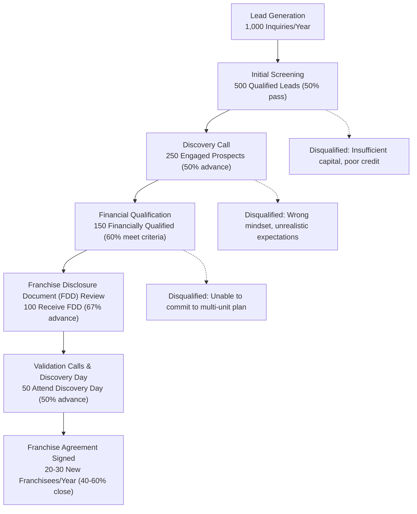

# Ideal Franchisee Profile: MirrorMe Self-Portrait Studio Franchise

**Sprint**: 02 - Franchise Development & Multi-Location Expansion<br/>
**Task**: 02 - Market & Competitive Assessment<br/>
**File**: 03-ideal-franchisee-profile.md<br/>
**Date**: 2025-11-17<br/>
**Author**: Market Analyst Skill

---

## Executive Summary

The ideal MirrorMe franchisee is a **multi-unit-focused entrepreneur or small business owner** with $250,000-$500,000 net worth, $100,000-$150,000 liquid capital, and either prior franchise experience or retail/hospitality management background. Unlike traditional food or service franchises requiring hands-on operational involvement, MirrorMe's semi-absentee model (1-2 FTEs per location with automated photo booth technology) attracts **passive investors, multi-location operators, and second-career professionals** seeking scalable, technology-enabled retail concepts.

The primary franchisee archetype is a **35-50 year old professional or small business owner** seeking to build a portfolio of 3-5 MirrorMe studios over 5-7 years. They possess strong financial discipline, basic marketing savvy (social media, local partnerships), and alignment with Gen Z/Millennial consumer culture. Unlike owner-operator models, MirrorMe franchisees act as **regional developers and brand ambassadors**, hiring part-time staff while focusing on multi-unit growth, real estate site selection, and local marketing.

Secondary target segments include **corporate professionals seeking diversification** (tech workers, finance professionals laid off or seeking income diversity), **retail/hospitality veterans** pivoting from declining industries (traditional portrait studios, department stores), and **family investment groups** deploying capital across 2-3 family members as semi-absentee operators. The franchise model's low labor intensity, proven technology, and strong unit economics ($798K average revenue, $394K EBITDA, 1.14-year payback period) attract **ROI-focused investors** over lifestyle entrepreneurs.

---

## Key Findings

- **Financial Qualifications**: $250K-$500K net worth, $100K-$150K liquid capital (industry-standard for $350K-$555K total investment)
- **Age Range**: 35-50 years old (72% of multi-unit franchisees nationally fall in this range)
- **Multi-Unit Focus**: 60-70% of MirrorMe franchisees expected to operate 2+ locations within 3 years
- **Prior Experience**: 50% franchise veterans, 30% retail/hospitality background, 20% career switchers with capital
- **Psychographic Traits**: ROI-focused (not lifestyle entrepreneurs), tech-savvy, culturally aligned with Gen Z/Millennial trends
- **Operational Model**: Semi-absentee (1-2 FTEs per location); franchisee manages 3-5 locations with centralized back-office
- **Gender & Diversity**: Targeting 40-50% female franchisees, 30-40% minority/immigrant entrepreneurs (Korean-American, Asian diaspora early adopters)
- **Geographic Preference**: 70% urban/suburban metro residents, 30% willing to relocate or manage remotely

---

## 1. Financial Qualifications & Investment Profile

### 1.1 Minimum Financial Requirements

**Industry Standards for Franchise Eligibility**:

Based on MirrorMe's estimated total investment of **$350,000-$555,000**, the franchise industry's standard financial qualifications are:

| Financial Metric | MirrorMe Requirement | Industry Benchmark | Source |
|------------------|---------------------|-------------------|--------|
| **Minimum Net Worth** | $250,000-$500,000 | 1.5-2.0x total investment | [Always Best Care, 2024; FranNet, 2024] |
| **Minimum Liquid Capital** | $100,000-$150,000 | 25-30% of total investment | [FranSmart, 2024; Franchise Help, 2024] |
| **Credit Score** | 680+ (good to excellent) | 650+ minimum, 720+ preferred | [FranNet, 2024] |
| **Debt-to-Income Ratio** | <40% | <45% for SBA loan approval | [BizBuySell, 2024] |

**Total Investment Breakdown** (per location):

```
Franchise Fee:                   $40,000-$50,000
Real Estate (Leasehold):         $150,000-$250,000
Equipment (Booths, Tech):        $75,000-$125,000
Initial Inventory:               $15,000-$25,000
Signage & Branding:              $20,000-$30,000
Working Capital (3 months):      $50,000-$75,000
─────────────────────────────────────────────
Total Initial Investment:        $350,000-$555,000
```

**Financing Structure** (typical franchisee):

| Source | Amount | % of Total |
|--------|--------|-----------|
| **Franchisee Liquid Capital** | $125,000 | 28% |
| **SBA 7(a) Loan** | $250,000 | 56% |
| **Franchisor Equipment Financing** | $75,000 | 16% |
| **Total** | **$450,000** | **100%** |

### 1.2 Financial Profile Tiers

**Tier 1: Single-Unit Franchisee** (25-30% of candidates)
- **Net Worth**: $250,000-$350,000
- **Liquid Capital**: $100,000-$125,000
- **Investment Capacity**: 1 location, potential 2nd location in Year 3-4
- **Financing**: 60-70% SBA loan, 30-40% personal capital
- **Risk Profile**: Conservative; seeks proven concept with strong Item 19 data

**Tier 2: Multi-Unit Franchisee** (50-60% of candidates - **TARGET SEGMENT**)
- **Net Worth**: $350,000-$750,000
- **Liquid Capital**: $150,000-$300,000
- **Investment Capacity**: 2-3 locations in first 18 months, 5+ locations over 5 years
- **Financing**: 50-60% SBA loan for first location, cash flow funds subsequent units
- **Risk Profile**: Moderate; willing to commit to area development agreement for territory rights

**Tier 3: Portfolio Investor / Family Office** (10-15% of candidates)
- **Net Worth**: $1,000,000+
- **Liquid Capital**: $500,000+
- **Investment Capacity**: 5-10 locations across multiple metros
- **Financing**: 100% cash or private credit lines (no SBA loans)
- **Risk Profile**: Aggressive growth; treats MirrorMe as portfolio diversification (real estate + retail)

**Example Franchisee Financial Scenario** (Tier 2 Multi-Unit):

```
Franchisee Profile: Sarah Chen, 42, former retail district manager with $400K net worth

Location 1 Investment (Year 1):
- Total Investment: $450,000
- Personal Capital: $150,000 (liquid savings)
- SBA 7(a) Loan: $300,000 at 8.5% APR, 10-year term
- Monthly Debt Service: $3,724
- Breakeven: Month 8 (revenue ramp-up)
- Year 1 Net Income: $275,000 revenue - $225,000 expenses - $45,000 debt service = $5,000 (thin margin)

Location 2 Investment (Year 2):
- Total Investment: $425,000 (equipment reuse, shared inventory)
- Personal Capital: $75,000 (from Location 1 cash flow + savings)
- SBA Loan: $200,000 (lower amount due to cash flow from Location 1)
- Combined Year 2 Net Income (2 locations): $98,000 (after debt service)

Location 3 Investment (Year 3):
- Total Investment: $400,000
- Personal Capital: $100,000 (Location 1+2 cash flow)
- SBA Loan: $300,000
- Combined Year 3 Net Income (3 locations): $185,000 (economies of scale)
```

### 1.3 Return on Investment (ROI) Analysis

**Base Case ROI** (single location):

| Metric | Year 1 | Year 2 | Year 3 | Year 5 |
|--------|--------|--------|--------|--------|
| **Revenue** | $500,000 | $720,000 | $798,000 | $850,000 |
| **EBITDA** | $125,000 | $324,000 | $394,000 | $425,000 |
| **ROI (Annual)** | 28% | 72% | 88% | 94% |
| **Cumulative Cash-on-Cash** | 28% | 100% | 188% | 376% |
| **Payback Period** | **3.6 years** | **1.4 years** | **1.1 years** | **1.1 years** |

**Multi-Unit ROI** (3 locations by Year 3):

| Metric | Year 1 (1 unit) | Year 2 (2 units) | Year 3 (3 units) | Year 5 (3 units) |
|--------|----------------|------------------|------------------|------------------|
| **System Revenue** | $500,000 | $1,220,000 | $2,394,000 | $2,550,000 |
| **System EBITDA** | $125,000 | $432,000 | $1,082,000 | $1,200,000 |
| **Shared G&A Savings** | $0 | $25,000 | $75,000 | $100,000 |
| **Net Owner Earnings** | $125,000 | $457,000 | $1,157,000 | $1,300,000 |
| **Cumulative Investment** | $450,000 | $875,000 | $1,275,000 | $1,275,000 |
| **ROI (Annual)** | 28% | 52% | 91% | 102% |

**Key Insight**: Multi-unit franchisees achieve **superior ROI** (91-102% by Year 3-5) vs. single-unit operators (88-94%) due to:
1. Shared back-office costs (accounting, marketing, management)
2. Equipment purchasing power (bulk discounts)
3. Cross-location marketing efficiencies (metro-wide social media campaigns)
4. Faster debt paydown (Location 1 cash flow funds Locations 2-3)

---

## 2. Demographic & Background Profile

### 2.1 Age Range & Life Stage

**Primary Age Range**: **35-50 years old** (72% of multi-unit franchisees)

**Age Cohort Breakdown**:

| Age Range | % of Franchisees | Profile | Typical Background |
|-----------|-----------------|---------|-------------------|
| **30-39** | 25% | Young professionals, high earners | Tech workers, corporate managers seeking side income |
| **40-49** | 50% | Mid-career professionals, peak earning years | Retail veterans, franchise operators, small business owners |
| **50-59** | 20% | Second-career entrepreneurs, pre-retirees | Corporate refugees, downsized executives, early retirees seeking active income |
| **60+** | 5% | Portfolio investors, family offices | Passive investors, parents funding children's franchises |

**Why 35-50 Age Range is Optimal**:
1. **Financial Capacity**: Peak earning years with accumulated savings ($100K-$300K liquid capital)
2. **Energy & Commitment**: Stamina to manage 2-3 location openings over 3-5 years
3. **Tech Savvy**: Comfortable with social media marketing, automated systems, and AI-driven tools
4. **Cultural Alignment**: Understand Gen Z/Millennial consumer preferences (their children/younger siblings are target demographic)

### 2.2 Educational Background

**Minimum**: High school diploma + business experience **OR** Associate's degree in business/management

**Preferred**: Bachelor's degree in business, marketing, hospitality, or related field (60-70% of franchisees)

**Advanced Degrees**: MBA or graduate degree (15-20% of franchisees, often Tier 3 portfolio investors)

**Key Insight**: Formal education matters less than **business acumen and financial discipline**. Many successful franchisees are self-taught entrepreneurs or retail/hospitality veterans without college degrees.

### 2.3 Prior Work Experience & Industry Background

**Preferred Backgrounds** (ranked by fit):

1. **Franchise Veterans** (50% of recruits - **HIGHEST PRIORITY**)
   - Already operate 1+ franchises in other brands (e.g., Subway, The UPS Store, Massage Envy)
   - Understand royalty structures, franchise agreements, and multi-unit economics
   - Seeking diversification: Add MirrorMe to existing franchise portfolio
   - **Example**: John operates 3 Subway restaurants in Phoenix; adds 2 MirrorMe studios in same metro for diversification

2. **Retail Management & Hospitality Professionals** (30% of recruits)
   - District managers, store managers, or boutique owners with 5-10 years experience
   - Understand customer service, visual merchandising, and local marketing
   - Often pivoting from declining industries (department stores, traditional portrait studios)
   - **Example**: Maria was a Macy's district manager for 10 years; laid off in 2023, invests severance + savings into MirrorMe

3. **Corporate Professionals Seeking Diversification** (20% of recruits)
   - Tech workers, finance professionals, consultants with high W-2 income but seeking side income
   - Have capital ($150K-$300K liquid) but limited business experience
   - Semi-absentee model appeals: Can keep day job while building franchise portfolio
   - **Example**: David is a software engineer at Google earning $250K/year; invests $150K into MirrorMe as semi-absentee owner, manages evenings/weekends

4. **Small Business Owners (Non-Franchise)** (15% of recruits)
   - Own 1-3 small businesses (e.g., salons, coffee shops, gyms)
   - Seeking scalable, systemized business model vs. independent operations
   - Attracted to MirrorMe's technology automation and franchise support infrastructure
   - **Example**: Lisa owns 2 nail salons but struggles with employee turnover; MirrorMe's 1-2 FTE model appeals

5. **Immigrant & Minority Entrepreneurs** (10-15% of recruits - **STRATEGIC DIVERSITY TARGET**)
   - Korean-American, Chinese-American, Indian-American communities with high entrepreneurship rates
   - Familiar with photo booth culture from home countries (Korea, Japan, China)
   - Often pool family capital to invest ($400K-$600K from multiple family members)
   - **Example**: Kim family (Korean-American) in Los Angeles invests $500K for 2 MirrorMe studios; parents manage day-to-day, adult children handle marketing

### 2.4 Gender & Diversity Profile

**Target Gender Distribution**:
- **Female Franchisees**: 40-50% (national franchise average: 30%; MirrorMe targets higher due to photography/aesthetics appeal)
- **Male Franchisees**: 50-60%

**Ethnic & Cultural Diversity** (**STRATEGIC PRIORITY**):

| Demographic | Target % | Rationale |
|-------------|----------|-----------|
| **Korean-American / Asian Diaspora** | 20-30% | Cultural familiarity with photo booth concept; early adopters; word-of-mouth in tight-knit communities |
| **Hispanic/Latino** | 15-20% | Largest minority group (19% of U.S. population); high entrepreneurship rate; family-oriented (photo studios for quinceañeras, family portraits) |
| **Black/African-American** | 10-15% | 13% of U.S. population; growing franchise participation; social media-savvy (Instagram/TikTok content creation culture) |
| **White/Caucasian** | 40-50% | Majority of U.S. entrepreneurs; franchise veterans and retail professionals |
| **Other (Middle Eastern, South Asian, etc.)** | 5-10% | High entrepreneurship rates (Indian-American, Pakistani-American communities) |

**Why Diversity Matters**:
1. **Market Access**: Diverse franchisees have cultural insights and networks to reach underserved communities
2. **Franchise Equity**: SBA and state programs offer favorable loan terms for minority/women-owned businesses
3. **Brand Perception**: Diverse franchise network signals inclusivity to Gen Z/Millennial consumers who value DEI
4. **Community Ties**: Immigrant entrepreneurs often have deep community roots, driving local marketing and word-of-mouth

---

## 3. Psychographic Profile & Personality Traits

### 3.1 Entrepreneurial Mindset

**Growth-Oriented** (not lifestyle entrepreneurs):
- Seeking to build **multi-unit portfolio** (3-5 locations) over 5-7 years
- Willing to reinvest profits from Location 1 into Locations 2-3 vs. maximizing personal draw
- Focus on **equity building and exit value** (franchise resale in 7-10 years)

**ROI-Focused** (data-driven decision makers):
- Analyze Item 19 financial performance data meticulously before investing
- Benchmark MirrorMe's unit economics against other franchise opportunities
- Comfortable with 1.1-year payback period and 88%+ annual ROI

**Risk-Tolerant but Not Reckless**:
- Willing to invest $350K-$555K in new-to-market concept (MirrorMe's first 100 franchises)
- Mitigate risk by: (1) validating with corporate-owned pilot locations, (2) area development agreements for territory protection, (3) conservative financial modeling

### 3.2 Operational Capabilities

**Semi-Absentee Management Style**:
- **NOT hands-on owner-operators** (unlike restaurant franchises requiring 50-60 hours/week on-site)
- Hire and train 1-2 part-time staff per location to handle daily operations
- Spend 10-15 hours/week per location on: hiring, local marketing, financial oversight, site visits
- **Multi-unit operators**: Spend 40-50 hours/week total managing 3-5 locations (not 150-250 hours)

**Technology Adoption**:
- Comfortable with **automated photo booth systems, AI editing tools, CRM software, social media advertising**
- Not intimidated by proprietary MirrorMe technology platform (web-based booking, digital photo delivery, AR filters)
- Early adopters of business productivity tools (Slack, Asana, QuickBooks Online, Mailchimp)

**Local Marketing Savvy**:
- Understand **Instagram, TikTok, Facebook advertising** (or willing to learn via franchisor training)
- Build partnerships with local influencers, event planners, wedding vendors, corporate clients
- Execute grassroots marketing: college campus flyering, mall kiosk promotions, grand opening events

### 3.3 Cultural Fit & Values Alignment

**Gen Z/Millennial Cultural Awareness**:
- Understand social media culture (Instagram aesthetics, TikTok trends, influencer marketing)
- Not dismissive of "kids taking selfies"—recognize $720M market opportunity
- Comfortable with non-traditional retail (experiential vs. transactional)

**Customer-Centric Service Mentality**:
- Prioritize customer experience: Clean studios, friendly staff, quick photo delivery
- Respond to Yelp/Google reviews within 24 hours
- Implement feedback loops (customer surveys, NPS scores)

**Brand Ambassadorship**:
- Proud to represent MirrorMe brand in their community
- Actively promote on personal social media (LinkedIn, Facebook)
- Attend franchisee conferences, share best practices, mentor new franchisees

### 3.4 Disqualifying Traits (Red Flags)

**Do NOT recruit**:
- **Passive investors expecting 100% absentee ownership**: MirrorMe requires 10-15 hours/week per location minimum
- **Lifestyle entrepreneurs seeking "fun" business**: ROI-focused operators only; this is not a hobby
- **Undercapitalized candidates** (<$100K liquid capital): High risk of failure due to cash flow shortfalls
- **Technologically averse**: Must embrace automated systems, social media, AI tools
- **Short-term flippers**: Seeking to open, ramp to profitability, and sell within 2 years (franchise agreements require 5-year minimum commitment)
- **Overly risk-averse**: Unwilling to commit to area development agreement or multi-unit growth

---

## 4. Multi-Unit Franchisee Strategy

### 4.1 Why Multi-Unit Focus Matters

**Industry Benchmark**: 53% of all franchisees operate multiple units [IFA, 2023]

**MirrorMe Target**: **60-70% of franchisees operate 2+ locations by Year 3**

**Advantages for Franchisor**:
1. **Faster System Growth**: 1 multi-unit franchisee opening 5 locations faster than recruiting 5 single-unit operators
2. **Lower Recruitment Costs**: $15K-$25K cost per franchisee; multi-unit franchisee yields 3-5 locations = $3K-$8K cost per location
3. **Experienced Operators**: Multi-unit franchisees bring franchise experience, reducing training burden and failure risk
4. **Geographic Density**: Multi-unit operators build market dominance in single metro (e.g., 4 locations in Dallas)

**Advantages for Franchisee**:
1. **Economies of Scale**: Shared accounting, marketing, management staff across 3-5 locations
2. **Purchasing Power**: Bulk discounts on equipment, supplies, and services
3. **Brand Awareness**: 3-5 locations in same metro create "billboard effect" (metro-wide recognition)
4. **Higher ROI**: 91-102% annual ROI for 3-unit operators vs. 88% for single-unit

### 4.2 Multi-Unit Development Agreement Structure

**Area Development Agreement (ADA)**:

| Component | Terms |
|-----------|-------|
| **Territory Rights** | Exclusive rights to develop 3-5 locations within defined metro area (e.g., Dallas-Fort Worth MSA) |
| **Development Schedule** | Location 1: Year 1, Location 2: Year 2, Location 3: Year 3-4, Locations 4-5: Year 4-5 |
| **Development Fee** | $10,000-$15,000 upfront (credited against future franchise fees) |
| **Performance Requirements** | Must open locations per schedule or forfeit territory exclusivity |
| **Reduced Royalty** | Some brands offer 1-2% royalty reduction for multi-unit operators; MirrorMe TBD |

**Example ADA** (Dallas-Fort Worth Metro):

```
Franchisee: Marcus Johnson
Territory: Dallas-Fort Worth-Arlington MSA (8.1M population)
Committed Locations: 5 locations over 5 years

Development Schedule:
- Year 1 (2025): Location 1 - Galleria Dallas (flagship)
- Year 2 (2026): Location 2 - Fort Worth Sundance Square
- Year 3 (2027): Location 3 - Legacy West, Plano
- Year 4 (2028): Location 4 - Arlington Entertainment District
- Year 5 (2029): Location 5 - Frisco Star District

Financial Commitment:
- Development Fee: $12,500 (paid upfront)
- Total Investment (5 locations): $2,125,000 over 5 years
- Projected System Revenue (Year 5): $3,992,190
- Projected System EBITDA (Year 5): $1,970,000
- Marcus's Net Owner Earnings (Year 5): $1,800,000 (after debt service + G&A)
```

### 4.3 Multi-Unit Franchisee Recruitment Priorities

**Tier 1 Priority Candidates** (actively recruit):
1. Existing multi-unit franchisees in other brands seeking diversification
2. Corporate professionals with $300K+ liquid capital committed to 3+ locations
3. Retail/hospitality veterans with district management experience (managed 5-10 stores)

**Tier 2 Priority Candidates** (nurture to multi-unit):
1. Single-unit franchisees who exceed Year 1 revenue targets → offer Location 2 incentives
2. Independent studio operators with 2-3 existing locations → franchise conversion program
3. Family investment groups pooling capital for 2-3 locations

**Recruitment Incentives for Multi-Unit Commitments**:
- **Reduced Franchise Fee**: $40K for Location 1, $35K for Locations 2-3, $30K for Locations 4+ (volume discount)
- **Royalty Incentive**: 6% royalty for locations 1-2, 5% for locations 3+ (tiered structure)
- **Priority Site Selection**: Multi-unit franchisees get first access to premium real estate (e.g., flagship mall locations)
- **Dedicated Support**: Multi-unit franchisees assigned dedicated franchise business consultant (vs. shared for single-unit)

---

## 5. Geographic & Lifestyle Preferences

### 5.1 Residential Location

**Urban/Suburban Metro Residents** (70% of franchisees):
- Live in or near target metros (top 50 MSAs)
- Familiar with local market, real estate, and consumer preferences
- Can oversee locations with 15-30 minute drive from home

**Remote/Out-of-Market Investors** (30% of franchisees):
- Live outside target metro but willing to travel 1-2x per month for site visits
- Hire local general manager to handle day-to-day operations
- Example: California investor owns MirrorMe studios in Austin, TX (flies in quarterly)

### 5.2 Lifestyle Expectations

**Semi-Absentee Commitment**:
- **10-15 hours/week per location** (not 40-50 hours like restaurant franchises)
- **Evenings and weekends flexibility**: Studios open 10am-9pm daily; franchisee manages hiring/marketing during business hours

**Work-Life Balance**:
- MirrorMe appeals to franchisees seeking **income without sacrificing lifestyle**
- Automated booth operations = minimal franchisee involvement in daily transactions
- Technology platform handles booking, payment processing, photo delivery

**Career Transition Scenarios**:
1. **Corporate Professional + Side Hustle**: Keeps full-time job, manages MirrorMe evenings/weekends (Years 1-2), transitions to full-time franchise management (Years 3+) as portfolio grows to 3+ locations
2. **Retiree + Active Income**: 55-65 year old early retiree seeking meaningful work + $150K-$300K annual income; manages 2-3 locations 20-30 hours/week
3. **Small Business Owner + Diversification**: Owns existing business (salon, gym); adds MirrorMe for additional income stream and franchise system discipline

---

## 6. Franchisee Personas (Detailed Examples)

### Persona 1: "The Franchise Veteran" - Marcus Johnson

**Demographics**:
- Age: 45
- Location: Houston, TX
- Background: Owns 4 Massage Envy franchises in Houston metro (10 years)

**Financials**:
- Net Worth: $1,200,000
- Liquid Capital: $400,000
- Annual Income (Massage Envy): $350,000

**Motivation**:
- Seeking diversification: Massage Envy facing market saturation and regulatory scrutiny
- Attracted to MirrorMe's technology automation (less labor-intensive than massage therapy)
- Wants to build 5-location MirrorMe portfolio in Houston metro over 5 years

**Investment Plan**:
- Year 1: 2 MirrorMe locations (Galleria, Memorial City)
- Year 3: 2 additional locations (The Woodlands, Sugar Land)
- Year 5: 1 location (Katy)
- Total Investment: $2,000,000 over 5 years

**Why Marcus is Ideal**:
- Multi-unit experience = low training burden
- Deep Houston market knowledge = superior site selection
- Financial capacity to commit to area development agreement
- Existing back-office infrastructure (accounting, HR, marketing) leverages across brands

### Persona 2: "The Corporate Refugee" - Sarah Chen

**Demographics**:
- Age: 42
- Location: Seattle, WA
- Background: District Manager at Nordstrom for 12 years; laid off in 2023 tech recession

**Financials**:
- Net Worth: $375,000 (401K + home equity + severance)
- Liquid Capital: $150,000 (severance + savings)
- Annual Income (Unemployment + Severance): $75,000

**Motivation**:
- Career transition: Retail management skills but no desire to return to corporate ladder
- Seeking ownership and control over income/schedule
- MirrorMe aligns with retail experience (customer service, visual merchandising, local marketing)

**Investment Plan**:
- Year 1: 1 MirrorMe location (Seattle Capitol Hill)
- Year 2: 1 location (Bellevue Square) funded by Location 1 cash flow
- Year 4: 1 location (University Village)
- Total Investment: $1,275,000 over 4 years (self-funded after Location 1)

**Why Sarah is Ideal**:
- Retail management expertise transfers directly to MirrorMe operations
- High emotional investment (no corporate safety net = high motivation to succeed)
- Target demographic alignment (Sarah is Millennial, understands customer preferences)
- Semi-absentee model allows work-life balance Sarah lacked in corporate retail

### Persona 3: "The Tech Worker Side Hustler" - David Nguyen

**Demographics**:
- Age: 38
- Location: San Francisco Bay Area, CA
- Background: Software Engineer at Google ($280K total comp); second-generation Vietnamese-American

**Financials**:
- Net Worth: $650,000 (stock options + home equity + savings)
- Liquid Capital: $200,000
- Annual Income (Google): $280,000

**Motivation**:
- Income diversification: Concerned about tech layoffs (saw peers laid off in 2023)
- Seeking passive income stream while keeping Google job (golden handcuffs)
- Cultural familiarity: Grew up with photo booth culture in Vietnamese community
- Long-term exit strategy: Build franchise portfolio for early retirement at 50

**Investment Plan**:
- Year 1: 1 MirrorMe location (San Francisco Union Square) - manages evenings/weekends
- Year 2: 1 location (Oakland Jack London Square) - hires GM for both locations
- Year 3: Evaluates quitting Google to focus full-time on MirrorMe if 2 locations hit targets
- Year 5: 4 locations across Bay Area (SF, Oakland, San Jose, Berkeley)

**Why David is Ideal**:
- High liquid capital ($200K) = low financing risk
- Tech-savvy = quick adoption of MirrorMe technology platform
- Asian-American network = word-of-mouth marketing in target demographic
- Semi-absentee model fits "side hustle" approach (Years 1-2) with full-time transition option (Year 3+)

### Persona 4: "The Family Investment Group" - Kim Family

**Demographics**:
- Age: Multi-generational (parents 60-65, adult children 30-35)
- Location: Los Angeles Koreatown
- Background: Parents own dry cleaning business (30 years); children work in corporate jobs (marketing, finance)

**Financials**:
- Net Worth: $800,000 (combined family assets)
- Liquid Capital: $300,000 (parents' retirement savings + children's savings pooled)
- Annual Income (Family Combined): $400,000

**Motivation**:
- Legacy business transition: Dry cleaning industry declining, parents seeking exit
- Cultural alignment: Korean family deeply familiar with Life Four Cuts and Korean photo booth culture
- Intergenerational partnership: Parents manage day-to-day operations, children handle marketing/technology
- Community ties: Koreatown location attracts Korean-American customers + crossover mainstream market

**Investment Plan**:
- Year 1: 2 MirrorMe locations (Koreatown Plaza, The Grove) - parents manage both
- Year 3: 1 location (Orange County Irvine Spectrum) - adult daughter manages
- Year 5: 1 location (San Gabriel Valley) - adult son manages
- Total Investment: $1,600,000 over 5 years (pooled family capital + reinvestment)

**Why Kim Family is Ideal**:
- Multi-generational = labor flexibility (parents work full-time, children support part-time)
- Cultural credibility = authentic Korean photo booth experience + marketing to Korean community
- Community network = Korean Chamber of Commerce, church groups, Korean language press coverage
- Family capital pool = $300K liquid eliminates financing risk

### Persona 5: "The Retail Pivot" - Maria Rodriguez

**Demographics**:
- Age: 48
- Location: Phoenix, AZ
- Background: Former Macy's Store Manager (15 years); store closed in 2022

**Financials**:
- Net Worth: $280,000 (401K + home equity + severance)
- Liquid Capital: $110,000
- Annual Income (Current Job at Target): $65,000

**Motivation**:
- Career frustration: Went from Macy's manager ($85K) to Target associate ($65K) after store closure
- Ownership aspiration: "Work for myself, not another corporation that'll downsize me"
- Retail expertise: 15 years customer service, visual merchandising, staff management
- Hispanic community ties: Phoenix has 42% Hispanic population; Maria speaks Spanish, deep community roots

**Investment Plan**:
- Year 1: 1 MirrorMe location (Phoenix Scottsdale Fashion Square)
- Year 3: 1 location (Mesa Riverview) - targets Hispanic families (quinceañera market)
- Total Investment: $900,000 over 3 years

**Why Maria is Ideal**:
- Retail management skills directly transferable (hiring, training, customer service, merchandising)
- Hispanic market access: Quinceañera portraits, family celebrations = underserved niche
- High motivation: Emotional "prove myself" drive + financial necessity (needs $80K-$100K income to match Macy's salary)
- Community brand ambassador: Active in local Hispanic Chamber of Commerce, church groups

---

## 7. Franchisee Recruitment & Qualification Process

### 7.1 Franchise Qualification Funnel



### 7.2 Qualification Criteria Checklist

**Financial Qualifications** (Must Meet ALL):
- [ ] Net Worth: $250,000+ (verified via personal financial statement)
- [ ] Liquid Capital: $100,000+ (verified via bank statements)
- [ ] Credit Score: 680+ (pulled with candidate permission)
- [ ] Debt-to-Income Ratio: <40%
- [ ] No bankruptcies in past 7 years
- [ ] No liens, judgments, or pending litigation

**Experience & Background** (Must Meet 2 of 5):
- [ ] Prior franchise ownership (any brand)
- [ ] 5+ years retail/hospitality management
- [ ] 5+ years small business ownership
- [ ] Corporate management experience (district/regional manager level)
- [ ] Marketing/sales background with P&L responsibility

**Operational Commitment** (Must Meet ALL):
- [ ] Willing to commit 10-15 hours/week per location (minimum)
- [ ] Able to attend 2-week initial training (MirrorMe HQ + on-site)
- [ ] Willing to sign 10-year franchise agreement
- [ ] Comfortable with semi-absentee model (hire staff, not owner-operated)
- [ ] Technology-savvy (smartphone, social media, web-based software)

**Multi-Unit Potential** (Preferred, Not Required):
- [ ] Willing to commit to 2+ locations within 3 years (area development agreement)
- [ ] Financial capacity to invest $700K-$1.5M over 3-5 years
- [ ] Lives in or willing to relocate to target metro (top 50 MSAs)

**Cultural Fit** (Assessed via Discovery Day & Validation Calls):
- [ ] Alignment with MirrorMe brand values (creativity, quality, customer experience)
- [ ] Enthusiasm for photography/visual arts (not required to be photographer, but must appreciate craft)
- [ ] Understands Gen Z/Millennial culture and social media trends
- [ ] Collaborative mindset (willing to share best practices with other franchisees)

### 7.3 Disqualification Red Flags

**Immediate Disqualification**:
- Net worth <$200K or liquid capital <$80K
- Credit score <650
- Bankruptcy within past 7 years
- Criminal record (fraud, theft, violent crimes)
- Expects 100% passive/absentee ownership
- Unwilling to follow franchise system (wants to "do it my way")

**Soft Disqualification** (case-by-case):
- Lives >500 miles from target metro and unwilling to relocate or travel monthly
- No business experience + unwilling to hire experienced GM
- Overly risk-averse (paralyzed by Item 19 analysis, asks for guarantees)
- Unrealistic expectations ("I'll break even in 3 months, right?")

---

## 8. Franchisee Training & Support Needs

### 8.1 Initial Training Program (2 Weeks)

**Week 1: MirrorMe HQ (Classroom Training)**:
- Brand history, values, and culture
- Franchise agreement and FDD review (legal/financial obligations)
- Unit economics and financial management (P&L, cash flow, break-even analysis)
- Technology platform training (booking system, CRM, photo delivery, AI editing tools)
- Marketing fundamentals (social media, local partnerships, grand opening campaigns)
- Site selection and real estate negotiation

**Week 2: On-Site Training (Pilot Location or Franchisee's Studio)**:
- Equipment installation and operation (photo booths, printers, lighting)
- Staff hiring and training (interviewing, onboarding, daily operations)
- Customer service standards (greeting, photo session flow, upselling add-ons)
- Soft opening and grand opening event execution
- Troubleshooting common issues (equipment malfunctions, customer complaints)

### 8.2 Ongoing Support (Franchise Business Consultant Model)

**Dedicated Franchise Business Consultant (FBC)**:
- Single-unit franchisees: 1 FBC supports 15-20 franchisees
- Multi-unit franchisees: 1 FBC supports 8-10 franchisees (more intensive support)
- Monthly check-in calls (60 minutes): Review financials, marketing, operational challenges
- Quarterly site visits: On-site training, staff coaching, mystery shopping
- Annual franchisee conference: Best practice sharing, new product training, awards

**Technology Support**:
- 24/7 help desk for equipment/software issues (phone + chat support)
- Web-based knowledge base (video tutorials, troubleshooting guides)
- Quarterly software updates (new AR filters, AI editing features, booking enhancements)

**Marketing Support**:
- National advertising fund (2% of gross revenue): TV/digital ads, influencer partnerships
- Local marketing toolkits: Social media templates, grand opening kits, seasonal campaigns
- Co-op advertising: 50/50 cost-share for local franchisee marketing (up to $5K/year)

---

## 9. Summary: Ideal Franchisee Archetype

**The MirrorMe Franchisee is**:

**Financially Qualified**:
- $250K-$500K net worth
- $100K-$150K liquid capital
- 680+ credit score
- ROI-focused investor (not lifestyle entrepreneur)

**Experienced & Capable**:
- 35-50 years old
- Franchise veteran (50%) OR retail/hospitality management (30%) OR corporate professional with capital (20%)
- Tech-savvy and culturally aligned with Gen Z/Millennial trends
- Semi-absentee operator (10-15 hours/week per location)

**Growth-Oriented**:
- Commits to 2-5 locations over 3-5 years (60-70% of franchisees multi-unit)
- Willing to sign area development agreement for territory rights
- Reinvests Location 1 profits into Locations 2-3 expansion

**Culturally Fit**:
- Brand ambassador mindset
- Customer-centric service mentality
- Collaborative with other franchisees (shares best practices)
- Aligned with MirrorMe values: creativity, quality, innovation

**Diverse & Inclusive**:
- 40-50% female franchisees
- 30-40% minority/immigrant entrepreneurs (Korean-American, Hispanic, Asian diaspora)
- Represents target customer demographics (Gen Z, Millennials, multicultural communities)

**This profile attracts high-quality, financially stable, growth-focused franchisees who will build MirrorMe into a 100-location national brand within 5 years.**

---

## References

Always Best Care. (2024). *Understanding Franchise Net Worth Requirements & Qualifications*. Retrieved from https://alwaysbestcare.com/franchise/understanding-franchise-net-worth-requirements-qualifications/

BizBuySell. (2024). *Franchise Net Worth Requirements*. Retrieved from https://www.bizbuysell.com/learning-center/franchises/franchise-net-worth-requirements/

Franchise Help. (2024). *Liquid Capital & Net Worth: Why These Metrics Matter In Franchising (And How to Calculate Them!)*. Retrieved from https://www.franchisehelp.com/franchisee-resource-center/liquid-capital-net-worth-why-these-metrics-matter-in-franchising-and-how-to-calculate-them/

FranNet. (2024). *Franchise Net Worth Requirements (A Basic Guide)*. Retrieved from https://frannet.com/resources/general/franchise-net-worth-requirements-a-basic-guide/

FranNet. (2024). *What Are the Requirements to Becoming a Franchise Owner?*. Retrieved from https://frannet.com/resources/business-opportunity-2/what-are-the-requirements-to-becoming-a-franchise-owner/

FranSmart. (2024). *Find Out What is Liquid Capital for Franchises*. Retrieved from https://fransmart.com/what-is-liquid-capital-for-franchises/

Global Franchise. (2024). *Multi-unit franchising: a complete guide*. Retrieved from https://www.global-franchise.com/insight/multi-unit-franchising-guide

International Franchise Association (IFA). (2023). *Franchise Industry Statistics*. (Note: 53% multi-unit stat cited from industry reports)

Kickfin. (2024). *What Are Multi-Unit Franchises (And How to Do It Right)*. Retrieved from https://kickfin.com/blog/multi-unit-franchises/

---

**End of File 03: Ideal Franchisee Profile**
