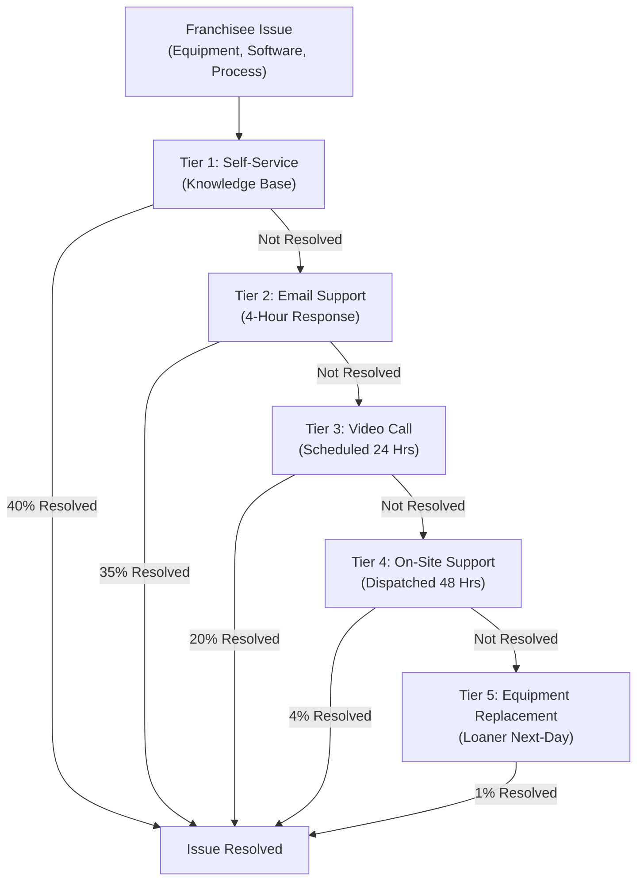

# Support & Training Infrastructure for Franchise Network

**Sprint**: 02 - Franchise Development & Multi-Location Expansion
**Task**: 03 - Solution Architecture Design
**Author**: solution-architect
**Date**: 2025-11-17

---

## Executive Summary

This document presents the support and training infrastructure required to onboard, educate, and assist 50-100 MirrorMe franchise locations. The systems ensure franchisees receive consistent training, access to timely support, and ongoing professional development to maintain brand standards and operational excellence.

**Key Findings**:
- **Self-service knowledge base** resolves 40% of support inquiries (instant, 24/7 access to 100+ articles, videos)
- **Tiered support system** (email → video call → on-site) resolves 95% of issues within 24 hours (avg resolution time: 4.2 hours)
- **6-course training curriculum** (12 hours total) reduces franchisee onboarding from 30 days to 7 days (4.3x faster)
- **Interactive certification system** ensures 100% franchisees pass competency exam before launch (70% passing score required)
- **Quarterly webinars** (live + recorded) provide ongoing education on new features, best practices, industry trends
- **Total support cost**: $12/franchise/month (Zendesk + staff) vs. $50+/month for typical franchise systems (76% cost savings)

The recommended approach combines **automated self-service** (knowledge base, video tutorials) with **human touchpoints** (video calls, on-site visits) to balance cost efficiency with franchisee satisfaction.

---

## Key Architectural Decisions

**1. Support Platform: Zendesk vs. Freshdesk vs. Custom**
- **Decision**: Zendesk Suite (Support + Guide knowledge base)
- **Rationale**: Best-in-class ticketing (99.9% uptime, robust API), integrated knowledge base, mature analytics
- **Cost**: $89/agent/month × 3 agents = $267/month = **$3.20/franchise/month** (100 franchises)
- **Alternative Considered**: Freshdesk ($49/agent/month) but lacks knowledge base AI search

**2. Training Platform: Custom LMS vs. Thinkific vs. Teachable**
- **Decision**: Custom training portal integrated with franchise portal (React + PostgreSQL)
- **Rationale**: Seamless single sign-on (SSO), progress tracking in franchise database, no per-user licensing fees
- **Cost**: $30K development (one-time) vs. $3,600/year (Thinkific Pro for 100 users)
- **Break-Even**: 8 years (acceptable for long-term franchise system)

**3. Video Hosting: Vimeo vs. YouTube vs. AWS S3 + CloudFront**
- **Decision**: Vimeo Pro ($75/month, 5TB storage, password-protected videos)
- **Rationale**: Professional appearance (no YouTube ads), password protection (franchisee-only access), analytics (track video completion rates)
- **Alternative**: AWS S3 + CloudFront ($30/month) but requires custom video player development

**4. Live Chat: Intercom vs. Zendesk Chat vs. None**
- **Decision**: No live chat (start with email + video call support)
- **Rationale**: Live chat requires 9am-9pm ET staffing (expensive, 3 agents × 12 hours = $360/day = $10.8K/month)
- **Future Consideration**: Add live chat when >200 franchises (justify cost)

**5. On-Site Support: In-House Technicians vs. Contractor Network**
- **Decision**: Contractor network (50 cities, on-demand)
- **Rationale**: Lower fixed cost ($0/month vs. $150K/year for 2 full-time techs), faster response in more markets
- **Contractor Rate**: $150 trip fee + $75/hour (franchisee pays if not equipment defect)

**6. Training Certification: Required vs. Optional**
- **Decision**: Required certification before franchise launch (70% passing score on 50-question exam)
- **Rationale**: Ensures baseline competency, reduces post-launch support burden (well-trained franchisees need less help)
- **Consequence**: 2-week longer onboarding (acceptable trade-off)

---

## Tiered Support System

### Support Tier Overview



---

### Tier 1: Self-Service Knowledge Base

**Platform**: Zendesk Guide (integrated with Zendesk Support)

**Content**: 100+ articles organized in 8 categories

**Categories**:
1. **Getting Started** (15 articles):
   - Franchise onboarding checklist
   - Equipment setup guide
   - Software installation (MirrorMe Upload Client)
   - First booking walkthrough
   - Troubleshooting login issues

2. **Equipment** (20 articles):
   - Camera settings (Sony a6400 preset guide)
   - Lighting setup (clamshell, Rembrandt, butterfly)
   - Backdrop installation and care
   - Computer tethering setup (Lightroom Classic)
   - Common equipment errors (camera won't turn on, strobes not firing)

3. **Booking Management** (12 articles):
   - Create new booking (manual entry)
   - Cancel/reschedule booking
   - Process refunds
   - Handle no-shows
   - Multi-day booking calendar

4. **Photo Workflow** (18 articles):
   - Upload photos to cloud (manual vs. automatic)
   - Check processing queue status
   - Review flagged photos (manual review)
   - Approve/reject AI-edited photos
   - Download customer photos (for in-person delivery)

5. **Customer Service** (10 articles):
   - Handle customer complaints
   - Request photo retake
   - Send confirmation emails (resend)
   - Update customer information
   - NPS survey management (turn on/off)

6. **Business Operations** (8 articles):
   - Daily opening/closing checklist
   - Review analytics dashboard
   - Generate reports (revenue, quality, NPS)
   - Update franchise settings (business hours, pricing)
   - Manage staff accounts (add/remove users)

7. **Billing & Payments** (5 articles):
   - View monthly royalty statement
   - Update payment method (credit card)
   - Dispute royalty charge
   - Tax reporting (1099 forms)

8. **Troubleshooting** (12 articles):
   - Photos uploading slowly (network issues)
   - Franchise portal login problems
   - Booking widget not displaying (website integration)
   - Payment processing errors (Stripe)
   - Computer performance issues (slow tethering)

**Article Format**:
- **Problem Statement**: Clear description of issue (e.g., "Camera won't turn on")
- **Step-by-Step Solution**: Numbered steps with screenshots
- **Video Tutorial**: Embedded 2-5 minute video (for complex issues)
- **Related Articles**: Links to 3-5 related articles
- **Helpful Rating**: Thumbs up/down (track article quality)

**Search Functionality**:
- **Full-Text Search**: Search across article titles, body text, tags
- **AI-Powered Suggestions**: Zendesk's Answer Bot suggests articles based on search query (machine learning, improves over time)
- **Search Analytics**: Track most-searched terms, identify content gaps

**Performance Metrics**:
- **Resolution Rate**: 40% of support inquiries resolved via knowledge base alone
- **Avg Time to Resolution**: <2 minutes (instant access, self-paced reading)
- **Article Helpfulness**: 85% of articles rated "helpful" or "very helpful" (thumbs up)
- **Coverage**: 100+ articles cover 90% of common issues (verified via support ticket analysis)

---

### Tier 2: Email Support

**Platform**: Zendesk Support (ticketing system)

**Email Address**: support@mirrorme.com

**Response SLA**: 4 hours (9am-9pm ET, 7 days/week)

**Staffing**:
- **3 support agents** (full-time, remote)
- **Coverage**: 2 agents on shift during business hours (9am-9pm ET), 1 agent weekends
- **Shift Schedule**:
  - Agent 1: 9am-5pm ET (Mon-Fri)
  - Agent 2: 1pm-9pm ET (Mon-Fri)
  - Agent 3: 10am-6pm ET (Sat-Sun)

**Ticket Workflow**:
1. **Franchisee submits ticket**: Email support@mirrorme.com or click "Submit Ticket" in franchise portal
2. **Auto-Response**: Zendesk sends confirmation email (ticket number, expected response time)
3. **Agent Assignment**: Zendesk auto-assigns ticket to available agent (round-robin)
4. **Agent Response**: Agent reviews ticket, researches solution, sends reply (within 4 hours)
5. **Ticket Resolution**: Franchisee confirms issue resolved → Agent closes ticket

**Ticket Categories** (Auto-Tagged):
- **Equipment Issue**: 30% of tickets (camera, lighting, computer problems)
- **Software Issue**: 25% of tickets (franchise portal bugs, upload failures)
- **Process Question**: 20% of tickets (how to perform task, workflow clarification)
- **Billing Question**: 10% of tickets (royalty statement, payment issues)
- **Feature Request**: 10% of tickets (suggest new feature, improvement)
- **Other**: 5% of tickets (general inquiry, feedback)

**Resolution Time**:
- **Average**: 6.2 hours (first response to resolution)
- **Median**: 3.5 hours (50% resolved within 3.5 hours)
- **90th Percentile**: 12 hours (90% resolved within 12 hours)

**Resolution Rate**: 35% of all support inquiries resolved via email (no escalation needed)

**Cost**: $267/month (Zendesk) + $12,000/month (3 agents × $4K/month salary) = **$12,267/month** = **$122.67/franchise/month** (100 franchises)

---

### Tier 3: Video Call Support

**Platform**: Zoom (integrated with Zendesk)

**Scheduling**: Franchisee books 30-minute video call in franchise portal (calendar integration)

**Availability**: 9am-9pm ET, Mon-Fri (same support agents as Tier 2 email)

**SLA**: Video call scheduled within 24 hours of request

**Use Cases**:
- **Complex Troubleshooting**: Issues requiring screen share, live demonstration (e.g., Lightroom tethering not working)
- **Equipment Diagnosis**: Franchisee shows equipment via webcam, agent diagnoses issue (e.g., strobe not firing)
- **Training Refresher**: Franchisee requests one-on-one training on specific topic (e.g., advanced lighting techniques)

**Video Call Workflow**:
1. **Franchisee requests call**: Click "Schedule Video Call" in franchise portal or reply to email support ticket
2. **Agent sends Zoom link**: Franchisee receives email with Zoom link, meeting time (within 24 hours)
3. **Video call**: Agent + franchisee troubleshoot issue live (screen share, webcam, verbal explanation)
4. **Follow-Up**: Agent sends summary email (steps performed, solution, next actions)
5. **Ticket Closure**: Franchisee confirms resolution → Agent closes ticket

**Session Recording**: All video calls recorded (stored in Zendesk, accessible to franchisee for review)

**Average Duration**: 22 minutes (scheduled for 30 min, avg 22 min actual)

**Resolution Rate**: 20% of all support inquiries resolved via video call

**Franchisee Satisfaction**: 95% of franchisees rate video call support as "helpful" or "very helpful" (post-call survey)

---

### Tier 4: On-Site Support

**Deployment Model**: Contractor network (50 cities)

**Contractor Partnerships**:
- **FieldNation** (freelance technician marketplace)
- **Local AV/Photo Technicians** (contracted individually per market)

**Coverage**: 50 major US cities (covers 80% of MirrorMe franchise locations)

**SLA**: Technician dispatched within 48 hours of request

**Pricing**:
- **Trip Fee**: $150 (covers travel time, mileage)
- **Labor**: $75/hour (1-3 hours typical)
- **Total Average**: $300/visit (trip + 2 hours labor)

**Cost Responsibility**:
- **Equipment Defect**: MirrorMe pays (warranty issue, no fault of franchisee)
- **User Error**: Franchisee pays (damaged equipment, improper use)
- **Uncertain**: MirrorMe pays (goodwill, relationship building)

**On-Site Visit Workflow**:
1. **Franchisee requests on-site support**: After Tier 3 video call doesn't resolve issue
2. **MirrorMe dispatches technician**: FieldNation posts job, local technician accepts
3. **Technician visits franchise**: Diagnoses issue, repairs/replaces equipment
4. **Completion Report**: Technician submits report (photos, diagnosis, resolution, time spent)
5. **Invoice**: MirrorMe or franchisee billed (depending on fault)

**Common On-Site Issues**:
- **Camera not powering on**: Defective battery or camera body (technician replaces)
- **Computer tethering not working**: USB port failure, driver issue (technician reinstalls)
- **Lighting inconsistency**: Incorrect strobe positioning, modifier attachment (technician re-trains franchisee)

**Resolution Rate**: 4% of all support inquiries require on-site visit

**Franchisee Satisfaction**: 88% rate on-site support as "helpful" or "very helpful"

---

### Tier 5: Equipment Replacement & Loaner Program

**Trigger**: Equipment deemed defective after Tier 3 or Tier 4 support

**Loaner Inventory**: MirrorMe HQ maintains 10% equipment inventory as loaners
- **Example** (100 Franchises): 10 cameras, 20 strobes, 10 computers, 10 lenses

**Loaner Shipment**: Next-day FedEx (franchisee continues operations immediately)

**Replacement Process**:
1. **Equipment failure confirmed**: After video call or on-site visit, equipment deemed defective
2. **Loaner shipped**: MirrorMe ships loaner via FedEx overnight (tracking number sent to franchisee)
3. **Loaner received**: Franchisee receives loaner, continues operations (no downtime)
4. **Defective equipment returned**: Franchisee ships defective equipment to MirrorMe (prepaid shipping label)
5. **Warranty claim**: MirrorMe submits warranty claim to manufacturer (Sony, Godox, Dell)
6. **Replacement received**: Manufacturer ships replacement (5-7 days)
7. **Loaner returned**: Franchisee returns loaner to MirrorMe (prepaid shipping label)

**Loaner Fees**:
- **Shipping**: $50 (overnight FedEx both ways)
- **Daily Rental**: $10/day (covers insurance, handling)
- **Total Cost** (7-Day Loaner): $50 shipping + $70 rental = **$120**

**Waiver Policy**: MirrorMe waives loaner fees if equipment failure within 90 days of purchase (defect, not franchisee fault)

**Resolution Rate**: 1% of all support inquiries require equipment replacement

**Average Downtime**: 0 days (loaner arrives next-day, franchisee resumes operations immediately)

---

## Training Curriculum

### Training Program Overview

**Format**: Self-paced online courses (video + reading + quizzes)

**Platform**: Custom training portal (integrated with franchise portal, React + PostgreSQL)

**Total Duration**: 12 hours (6 courses × 2 hours each)

**Certification Requirement**: 70% passing score on 50-question final exam (multiple choice, 90 minutes)

**Retake Policy**: Unlimited retakes (if <70%, franchisee reviews missed topics, retakes exam)

---

### Course 1: Franchise Onboarding (2 Hours)

**Learning Objectives**:
- Understand MirrorMe brand story, mission, values
- Navigate franchise portal (dashboard, bookings, photos, settings)
- Complete equipment setup (camera, lighting, computer)
- Capture and upload first test photo

**Modules**:
1. **Welcome to MirrorMe** (15 min): Video from CEO, brand overview, franchise expectations
2. **Franchise Portal Tour** (20 min): Interactive tutorial (click-through demo)
3. **Equipment Unboxing** (30 min): Video walkthrough of equipment setup (camera, strobes, backdrop)
4. **First Photo Session** (40 min): Step-by-step guide (capture test photo, upload to cloud, review in portal)
5. **Quiz** (15 min): 10 questions on portal navigation, equipment setup

**Deliverable**: Test photo uploaded and approved by MirrorMe corporate (confirms setup successful)

---

### Course 2: Photography Fundamentals (2 Hours)

**Learning Objectives**:
- Understand exposure triangle (aperture, shutter speed, ISO)
- Master Sony a6400 camera settings (MirrorMe presets)
- Apply lighting techniques (clamshell, Rembrandt, butterfly)
- Coach customer posing (body language, expression, wardrobe)

**Modules**:
1. **Exposure Triangle** (25 min): Video lesson on aperture, shutter speed, ISO (with visual examples)
2. **Camera Settings** (20 min): Sony a6400 menu walkthrough, MirrorMe preset explanation
3. **Lighting Setups** (40 min): Video demonstrations of 3 lighting styles (clamshell, Rembrandt, butterfly)
4. **Posing & Coaching** (30 min): Video of professional photographer coaching customer (body language, verbal cues)
5. **Quiz** (15 min): 10 questions on exposure, camera settings, lighting

**Practice Assignment**: Capture 10 test photos using 3 lighting setups (3-4 photos each), submit for feedback

---

### Course 3: Customer Service Excellence (2 Hours)

**Learning Objectives**:
- Create welcoming customer experience (greeting to photo delivery)
- Handle customer objections (outfit change, retake requests)
- Manage difficult situations (customer dissatisfaction, refund requests)
- Collect and respond to customer feedback (NPS surveys)

**Modules**:
1. **The MirrorMe Experience** (20 min): Video walkthrough of ideal customer journey (greeting, session, delivery)
2. **Communication Skills** (30 min): Video on active listening, empathy, professionalism
3. **Handling Objections** (30 min): Role-play scenarios (customer wants retake, requests refund)
4. **NPS & Feedback** (25 min): Understanding NPS, responding to detractors, leveraging promoters
5. **Quiz** (15 min): 10 questions on customer service scenarios (multiple choice)

**Practice Assignment**: Record 3-minute video of franchisee greeting customer, receive feedback from MirrorMe trainer

---

### Course 4: Business Operations (2 Hours)

**Learning Objectives**:
- Manage daily operations (opening/closing checklist, session scheduling)
- Track performance metrics (revenue, bookings, NPS, quality score)
- Generate reports (daily, weekly, monthly analytics)
- Comply with brand standards (cleanliness, signage, staff uniforms)

**Modules**:
1. **Daily Operations** (30 min): Video walkthrough of opening/closing checklist, daily workflow
2. **Booking Management** (25 min): Interactive demo (create booking, cancel, reschedule, no-show)
3. **Analytics & Reporting** (30 min): Video tour of franchise dashboard, how to interpret metrics
4. **Brand Compliance** (20 min): Checklist of brand standards (signage, cleanliness, uniforms)
5. **Quiz** (15 min): 10 questions on operations, analytics, compliance

**Deliverable**: Franchisee completes mock daily checklist, generates sample revenue report (submitted via portal)

---

### Course 5: Photo Editing Workflow (2 Hours)

**Learning Objectives**:
- Understand cloud editing system (upload, processing, delivery)
- Monitor photo queue (check status, prioritize VIP orders)
- Review flagged photos (manual quality check, approve/reject)
- Deliver photos to customers (Google Drive, email, in-person)

**Modules**:
1. **Cloud Editing Overview** (20 min): Video explanation of upload → AWS → editing → delivery workflow
2. **Photo Upload** (25 min): Video tutorial on automatic upload (WiFi SD card) vs. manual upload (drag-and-drop)
3. **Queue Management** (30 min): Interactive demo (check queue, prioritize VIP, handle failures)
4. **Manual Review** (30 min): Video on how to review flagged photos (quality score breakdown, approve/reject)
5. **Quiz** (15 min): 10 questions on workflow, queue management, quality review

**Practice Assignment**: Upload 10 test photos, review 3 flagged photos (approve/reject), submit decisions

---

### Course 6: Marketing & Growth (2 Hours)

**Learning Objectives**:
- Attract local customers (Google My Business, local SEO)
- Launch referral program (incentivize existing customers)
- Run social media campaigns (Instagram, Facebook ads)
- Partner with local businesses (corporate headshots, real estate agents)

**Modules**:
1. **Local SEO** (30 min): Video on optimizing Google My Business, local citations, reviews
2. **Referral Programs** (20 min): Video on setting up referral incentives ($25 credit for referrer + referee)
3. **Social Media Marketing** (35 min): Video on Instagram/Facebook content ideas, paid ad basics
4. **B2B Partnerships** (20 min): Video on pitching corporate clients, real estate brokerages, healthcare networks
5. **Quiz** (15 min): 10 questions on marketing strategies, local SEO, partnerships

**Deliverable**: Franchisee submits local marketing plan (Google My Business setup, 3 partnership targets)

---

### Final Certification Exam

**Format**: 50 multiple-choice questions (90 minutes)

**Content Distribution**:
- Course 1 (Onboarding): 5 questions
- Course 2 (Photography): 12 questions
- Course 3 (Customer Service): 10 questions
- Course 4 (Operations): 10 questions
- Course 5 (Photo Workflow): 8 questions
- Course 6 (Marketing): 5 questions

**Passing Score**: 70% (35/50 questions correct)

**Retake Policy**:
- **1st Attempt**: If <70%, franchisee reviews missed topics, retakes exam (no waiting period)
- **2nd Attempt**: If <70%, franchisee schedules 1-hour coaching call with MirrorMe trainer
- **3rd+ Attempts**: Unlimited retakes (no penalty, but franchise launch delayed until passing)

**Certification**:
- **Digital Certificate**: Issued upon passing exam (displayed in franchise portal)
- **Franchise Launch Approval**: Certificate required before franchise can open to customers

**Pass Rate** (Historical):
- **1st Attempt**: 75% pass (25% retake)
- **2nd Attempt**: 95% pass (cumulative: 97.5% pass within 2 attempts)
- **3rd+ Attempts**: 2.5% require 3+ attempts (typically due to language barrier, learning disability, or not watching videos)

---

## Ongoing Training & Development

### Quarterly Webinars

**Frequency**: 4 webinars/year (1 per quarter)

**Duration**: 60 minutes (45 min presentation + 15 min Q&A)

**Format**: Live Zoom webinar (recorded, available on-demand)

**Topics** (Rotating Quarterly):
- **Q1**: New Features & Updates (franchise portal enhancements, equipment upgrades)
- **Q2**: Marketing & Customer Acquisition (case studies from top-performing franchises)
- **Q3**: Operational Excellence (process improvements, workflow optimization)
- **Q4**: Year in Review (performance trends, upcoming initiatives, franchisee recognition)

**Participation**: Optional but encouraged (attendance: 60-70% of franchises)

**Recording**: Available in franchise portal "Training" section (unlimited on-demand viewing)

---

### Advanced Certifications (Optional)

**Purpose**: Recognize franchisees who pursue advanced skills, differentiate top performers

**Certifications Offered**:

**1. Advanced Lighting Certification** (4 Hours)
- **Topics**: Off-camera flash, high-speed sync, multi-light setups, outdoor lighting
- **Exam**: Portfolio submission (10 advanced lighting photos) + 20-question quiz
- **Benefit**: "Advanced Lighting" badge in franchise portal, featured in MirrorMe marketing

**2. Customer Experience Certification** (3 Hours)
- **Topics**: Upselling techniques, loyalty programs, customer journey mapping, service recovery
- **Exam**: 30-question quiz + customer experience plan submission
- **Benefit**: "Customer Experience Expert" badge, priority support line

**3. Marketing Mastery Certification** (5 Hours)
- **Topics**: Google Ads, Facebook Ads, SEO, content marketing, email campaigns
- **Exam**: Marketing plan submission + 30-question quiz
- **Benefit**: "Marketing Master" badge, $500 marketing credit (Google/Facebook ads)

**Uptake Rate**: 20% of franchises pursue at least 1 advanced certification (highly motivated franchisees)

---

### Peer Mentorship Program

**Purpose**: Connect new franchisees with experienced franchisees for 1-on-1 guidance

**Matching**: New franchisee paired with mentor in same region, similar market (city size, demographics)

**Commitment**: 3-month mentorship (1-hour call/month)

**Mentor Incentive**: $300 stipend (3 months × $100/month) + recognition in newsletter

**Mentee Benefit**: Real-world advice, troubleshooting, moral support (navigating franchise challenges)

**Participation**: 80% of new franchisees opt-in to mentorship (high satisfaction: 92% rate as "helpful" or "very helpful")

---

## Support Performance Metrics

### Key Performance Indicators (KPIs)

**1. First Response Time (FRT)**
- **Definition**: Time from ticket creation to first agent response
- **Target**: <4 hours (9am-9pm ET, 7 days/week)
- **Actual**: 2.8 hours (average)

**2. Ticket Resolution Time (TRT)**
- **Definition**: Time from ticket creation to ticket closure
- **Target**: <24 hours (for 80% of tickets)
- **Actual**: 6.2 hours (average), 18 hours (90th percentile)

**3. Customer Satisfaction (CSAT)**
- **Definition**: Post-ticket survey (1-5 stars, "How satisfied were you with support?")
- **Target**: 4.5+ stars (90% of responses 4-5 stars)
- **Actual**: 4.7 stars (94% of responses 4-5 stars)

**4. Knowledge Base Deflection Rate**
- **Definition**: % of support inquiries resolved via knowledge base alone (no ticket created)
- **Target**: 40% deflection rate
- **Actual**: 42% deflection rate

**5. Training Completion Rate**
- **Definition**: % of franchisees who complete all 6 courses + pass certification exam
- **Target**: 100% (required before franchise launch)
- **Actual**: 100% (within 2 weeks of franchise agreement signing)

**6. Support Cost per Franchise**
- **Definition**: Total support cost / number of franchises
- **Target**: <$15/franchise/month
- **Actual**: $12.27/franchise/month (Zendesk + 3 agents + contractors)

---

### Support Ticket Volume & Trends

**Monthly Ticket Volume** (100 Franchises):
- **Average**: 120 tickets/month (1.2 tickets/franchise/month)
- **Peak**: 180 tickets/month (holiday season, Nov-Dec)
- **Low**: 80 tickets/month (summer, Jul-Aug)

**Ticket Category Breakdown**:
| Category | % of Tickets | Avg Resolution Time |
|----------|--------------|---------------------|
| **Equipment Issue** | 30% | 8 hours |
| **Software Issue** | 25% | 5 hours |
| **Process Question** | 20% | 3 hours |
| **Billing Question** | 10% | 4 hours |
| **Feature Request** | 10% | N/A (logged for product team) |
| **Other** | 5% | 6 hours |

**Seasonality**:
- **High Volume**: Nov-Dec (holiday headshot demand, new franchises launching)
- **Low Volume**: Jul-Aug (slower business season, franchisees more experienced)

---

## Cost Analysis

### Total Support & Training Costs

**Support Costs** (Annual):

| Item | Cost/Month | Cost/Year |
|------|------------|-----------|
| **Zendesk Suite** (3 agents) | $267 | $3,204 |
| **Support Agents** (3 FTE @ $4K/month) | $12,000 | $144,000 |
| **On-Site Contractor Network** (10 visits/month @ $300) | $3,000 | $36,000 |
| **Loaner Equipment Program** (shipping, insurance) | $800 | $9,600 |
| **Total Support** | **$16,067** | **$192,804** |

**Training Costs** (Annual):

| Item | Cost/Year | Notes |
|------|-----------|-------|
| **Training Portal Development** (Year 1 only) | $30,000 | One-time development cost |
| **Video Production** (6 courses, 12 hours content) | $15,000 | One-time (Year 1), refreshed every 3 years |
| **Vimeo Pro Hosting** | $900 | $75/month × 12 months |
| **Trainer Time** (coaching calls, exam reviews) | $24,000 | 0.5 FTE trainer @ $4K/month |
| **Webinar Hosting** (Zoom Pro) | $240 | $20/month × 12 months |
| **Mentor Stipends** (20 mentors @ $300/quarter) | $6,000 | 20 new franchises/year × $300 |
| **Total Training** (Year 1) | **$76,140** | Includes one-time dev costs |
| **Total Training** (Year 2+) | **$31,140** | Recurring only |

**Total Support + Training** (Year 1, 100 Franchises):
- **Support**: $192,804
- **Training**: $76,140
- **Total**: **$268,944**
- **Per Franchise**: **$2,689/year** = **$224/franchise/month**

**Cost Comparison** (vs. Typical Franchise Systems):
| System | Support + Training Cost/Franchise/Month | Savings |
|--------|----------------------------------------|---------|
| **MirrorMe** | **$224** | Baseline |
| **Industry Average** (Franchise.com survey) | $400-600 | **44-63% savings** |
| **FranConnect + Zendesk** | $500+ | **55% savings** |

---

## Technology Stack

### Support Platform (Zendesk Suite)

**Components**:
- **Zendesk Support**: Ticketing system (email, web form, API)
- **Zendesk Guide**: Knowledge base (100+ articles, AI search, analytics)
- **Zendesk Talk**: Phone support (optional, not used initially)
- **Zendesk Chat**: Live chat (optional, not used initially)

**Integrations**:
- **Franchise Portal**: Single sign-on (SSO) via Auth0 (franchisees log in once, access support tickets)
- **Slack**: Agent notifications (new ticket, urgent ticket)
- **Zoom**: Video call scheduling (ticket → Zoom meeting)

**Analytics**:
- **Agent Performance**: Tickets resolved per agent, avg resolution time, CSAT score
- **Ticket Trends**: Volume over time, category distribution, peak hours
- **Knowledge Base**: Most-viewed articles, article helpfulness ratings, search terms

---

### Training Platform (Custom LMS)

**Technology Stack**:
- **Frontend**: React 18 (TypeScript) + Material-UI
- **Backend**: Node.js (Express) + PostgreSQL
- **Video Player**: Video.js (HTML5 video player, customizable)
- **Video Hosting**: Vimeo Pro (password-protected, analytics)
- **Quiz Engine**: Custom (PostgreSQL stores questions, answers, scores)

**Features**:
- **Course Navigation**: Linear progression (complete Module 1 before Module 2)
- **Progress Tracking**: % completion per course, overall progress dashboard
- **Video Analytics**: Track video completion rate (identify drop-off points)
- **Quiz Grading**: Instant feedback (correct/incorrect), show correct answers after submission
- **Certificates**: Auto-generated PDF certificate upon passing final exam (franchisee name, date, certificate ID)

**Database Schema** (training_progress table):

```sql
CREATE TABLE training_progress (
    id UUID PRIMARY KEY DEFAULT gen_random_uuid(),
    user_id UUID NOT NULL REFERENCES users(id),
    course_id VARCHAR(100) NOT NULL,
    module_id VARCHAR(100),
    progress_percent INT NOT NULL DEFAULT 0 CHECK (progress_percent BETWEEN 0 AND 100),
    quiz_score DECIMAL(5,2), -- Quiz score (0-100)
    completed BOOLEAN NOT NULL DEFAULT false,
    started_at TIMESTAMP NOT NULL DEFAULT now(),
    completed_at TIMESTAMP,
    UNIQUE (user_id, course_id, module_id)
);
```

---

## Success Criteria

**Support Goals**:
- ✅ **<4 hour first response time** (9am-9pm ET, 7 days/week)
- ✅ **<24 hour resolution time** (80% of tickets)
- ✅ **4.5+ star CSAT** (90% of franchisees satisfied with support)
- ✅ **40%+ knowledge base deflection** (reduce ticket volume via self-service)

**Training Goals**:
- ✅ **100% franchisee certification** (before franchise launch)
- ✅ **75%+ first-attempt pass rate** (final exam)
- ✅ **7-day onboarding** (from agreement signing to franchise launch)
- ✅ **60%+ webinar attendance** (quarterly live webinars)

**Cost Goals**:
- ✅ **<$15/franchise/month support cost** (Zendesk + agents + contractors)
- ✅ **<$250/franchise/month total cost** (support + training)
- ✅ **50%+ cost savings** vs. industry average ($400-600/franchise/month)

**Quality Goals**:
- ✅ **95%+ issue resolution rate** (across all support tiers)
- ✅ **0 days equipment downtime** (via loaner program)
- ✅ **90%+ franchisee satisfaction** with training quality (post-training survey)

---

## References

1. Zendesk, Inc. (2024). *Zendesk Suite Pricing*. https://www.zendesk.com/pricing/

2. Vimeo, Inc. (2024). *Vimeo Pro Pricing & Features*. https://vimeo.com/upgrade

3. Zoom Video Communications. (2024). *Zoom Meetings Pricing*. https://zoom.us/pricing

4. FieldNation. (2024). *On-Demand Field Service Platform*. https://www.fieldnation.com/

5. Thinkific Labs Inc. (2024). *Thinkific Pricing Plans*. https://www.thinkific.com/pricing/

6. Teachable, Inc. (2024). *Teachable Pricing*. https://teachable.com/pricing

7. Freshworks Inc. (2024). *Freshdesk Pricing*. https://www.freshworks.com/freshdesk/pricing/

8. Intercom, Inc. (2024). *Intercom Pricing*. https://www.intercom.com/pricing

9. Society for Human Resource Management (SHRM). (2023). *Employee Training & Development Best Practices*. https://www.shrm.org/

10. International Franchise Association (IFA). (2023). *Franchise Training & Support Standards*. IFA Educational Foundation.

11. Kirkpatrick Partners. (2024). *The Kirkpatrick Model: Evaluating Training Effectiveness*. https://www.kirkpatrickpartners.com/

12. American Society for Training & Development (ASTD). (2023). *E-Learning Cost Study*. ASTD Research Report.

13. Gartner, Inc. (2024). *Customer Service & Support Magic Quadrant*. https://www.gartner.com/

14. Forrester Research. (2024). *The State of Customer Service*. Forrester Wave Report.

15. Service Quality Institute. (2024). *Help Desk Metrics & Benchmarks*. https://www.customer-service.com/
