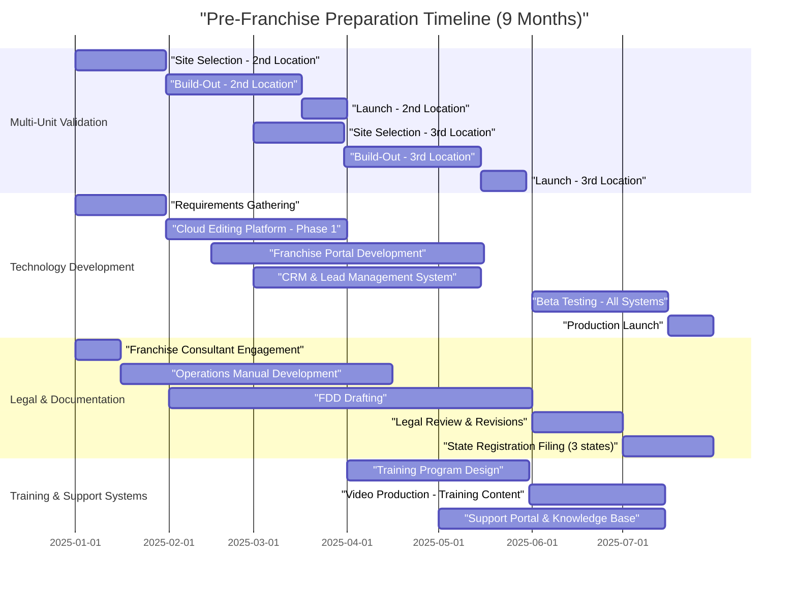
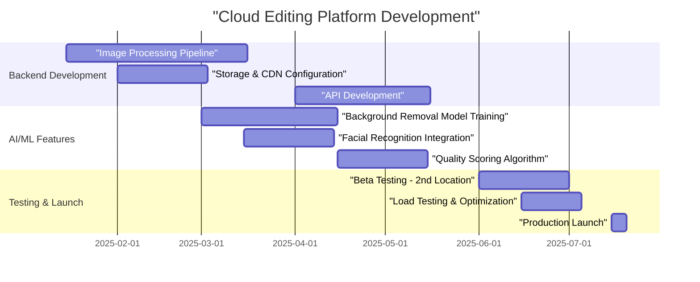
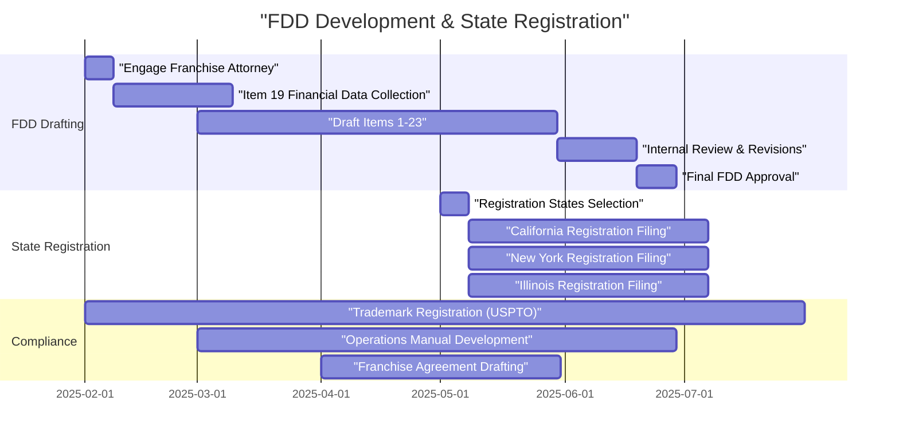

# Pre-Franchise Preparation Roadmap (Months 1-9)

**Sprint**: 02 - Franchise Development & Multi-Location Expansion
**Task**: 05 - Implementation Roadmap
**Date**: 2025-11-17
**Author**: roadmap-planner

## Executive Summary

The pre-franchise preparation phase (Months 1-9) is the **most critical foundation** for successful franchise system launch. This 9-month period focuses on three parallel workstreams: **multi-unit validation** (opening 2nd and 3rd company-owned locations), **technology infrastructure development** (cloud editing platform, franchise portal, CRM), and **legal/operational documentation** (FDD, operations manual, training systems).

Investment required: **$150K-$300K**. This phase de-risks the franchise model by proving replicability, building scalable systems, and ensuring regulatory compliance before accepting a single franchise fee.

**Critical Success Factor**: Complete all three workstreams in parallel to enable Month 10 franchise sales launch. Any delay in FDD filing pushes entire timeline back 3-6 months due to state registration requirements.

## Key Milestones

- **Month 3**: 2nd location operational, initial technology prototype deployed
- **Month 6**: 3rd location operational, franchise portal beta launch, FDD drafted
- **Month 9**: All locations profitable, technology production-ready, FDD filed in 3 target states
- **Go/No-Go Decision (Month 9)**: Proceed to franchise sales if 2nd/3rd locations achieve 80%+ of flagship metrics

## Phase 1 Timeline Overview

## Multi-Unit Validation Roadmap

### Month 1-3: Second Location Launch

**Objective**: Prove the MirrorMe model is replicable outside the flagship location.

| Activity | Duration | Owner | Budget | Success Criteria |
|----------|----------|-------|--------|------------------|
| Site Selection & Lease Negotiation | 30 days | CEO | $5K-$10K (broker fees) | Lease signed, 800-1200 sq ft, $3K-$5K/mo rent |
| Build-Out & Equipment Installation | 45 days | Operations Manager | $60K-$80K | On-time, on-budget completion |
| Hiring & Training (2-3 staff) | 30 days | GM | $8K-$12K (recruiting + wages) | Staff certified in MirrorMe process |
| Soft Launch & Testing | 15 days | GM | $3K-$5K (marketing) | 50+ test sessions completed |
| Grand Opening | 1 day | Marketing Director | $5K-$8K (event + advertising) | 20+ bookings in first week |

**Total Investment**: **$81K-$115K**

**Key Learnings to Capture**:
- Build-out timeline accuracy (compare to projections)
- Equipment setup challenges (documentation for franchisees)
- Local marketing effectiveness (channel mix, CAC)
- Staffing requirements (hours, skill levels, training duration)
- Customer demographics (compare to flagship location)

**Go/No-Go Checkpoint (Month 3)**:
- ✅ **GO**: 2nd location achieves 60%+ of flagship revenue within 30 days of opening
- ❌ **NO-GO**: Revenue <40% of flagship → investigate market fit issues before continuing

### Month 4-6: Third Location Launch

**Objective**: Validate the **replication process itself** - can we open locations faster/cheaper with documented systems?

| Activity | Duration | Owner | Budget | Target Improvement |
|----------|----------|-------|--------|-------------------|
| Site Selection (using refined criteria) | 30 days | CEO | $5K-$10K | 20% faster than 2nd location |
| Build-Out (using documented process) | 45 days | Operations Manager | $55K-$75K | 10-15% cost reduction |
| Hiring & Training (using training system) | 25 days | GM | $7K-$10K | 5 days faster than 2nd location |
| Soft Launch | 10 days | GM | $2K-$4K | Faster ramp using proven tactics |
| Grand Opening | 1 day | Marketing Director | $4K-$6K | Lower cost with playbook |

**Total Investment**: **$73K-$105K** (10-15% lower than 2nd location)

**Documentation Outputs**:
1. **Site Selection Checklist** (demographics, traffic, competition, lease terms)
2. **Build-Out Blueprint** (floor plan, equipment list, vendor contacts, timeline)
3. **Training Manual** (week-by-week curriculum, certification tests)
4. **Marketing Playbook** (pre-launch, launch, post-launch campaigns)
5. **Opening Checklist** (100+ items, assigned owners, deadlines)

**Success Metrics by Month 6**:
- 3rd location opens on-time and within budget
- Training time reduced by 20% vs. 2nd location
- All documentation complete and tested
- 2nd location at 80%+ of flagship revenue

## Technology Infrastructure Development

### Cloud Editing Platform (Months 1-6)

**Business Requirement**: Franchisees need cloud-based photo editing to eliminate local hardware costs and ensure consistent quality.

**Development Roadmap**:

| Phase | Timeline | Features | Cost | Tech Stack |
|-------|----------|----------|------|------------|
| **Phase 1: Core Editing** | Months 1-3 | Basic retouching (skin smoothing, blemish removal, color correction), batch processing, preset templates | $30K-$50K | AWS Lambda (image processing), S3 (storage), CloudFront (CDN) |
| **Phase 2: Advanced Features** | Months 4-5 | AI background removal, auto-cropping, facial recognition, quality scoring | $20K-$35K | OpenCV, TensorFlow Lite, Rekognition API |
| **Phase 3: Integration** | Month 6 | API for franchise portal, mobile app preview, customer delivery portal | $15K-$25K | REST API, React Native SDK, SendGrid integration |
| **Testing & QA** | Months 6-7 | Beta testing with 2nd/3rd locations, load testing (1000 concurrent users), security audit | $10K-$15K | Selenium, JMeter, penetration testing |

**Total Development Cost**: **$75K-$125K**

**Performance Targets**:
- Processing speed: 30 seconds per image (vs. 2-5 minutes manual)
- Quality: 95%+ customer satisfaction (A/B test vs. manual editing)
- Uptime: 99.5% SLA
- Cost per image: <$0.50 (economies of scale with volume)

**Deployment Timeline**:

### Franchise Portal (Months 2-6)

**Purpose**: Centralized hub for franchisee operations, training, support, and reporting.

**Core Modules**:

1. **Dashboard** (Month 2-3, $15K-$25K)
   - Revenue tracking (daily/weekly/monthly)
   - Booking calendar (integrated with Square Appointments)
   - Customer metrics (new vs. repeat, satisfaction scores)
   - Inventory alerts (backdrops, props, supplies)

2. **Training & Certification** (Month 3-4, $20K-$30K)
   - Video library (50+ training videos)
   - Interactive quizzes and certification tests
   - Progress tracking for staff onboarding
   - Continuing education modules (new poses, trends, equipment)

3. **Marketing Tools** (Month 4-5, $15K-$25K)
   - Brand asset library (logos, templates, social media graphics)
   - Email campaign templates (Mailchimp integration)
   - Local SEO tools (Google My Business optimization)
   - Co-op advertising fund management

4. **Support & Communication** (Month 5-6, $10K-$20K)
   - Ticketing system (technical, operational, marketing issues)
   - Knowledge base (searchable FAQs, troubleshooting guides)
   - Community forum (peer-to-peer franchisee support)
   - Monthly webinar scheduling and recordings

**Total Development Cost**: **$60K-$100K**

**User Experience Requirements**:
- Mobile-responsive (franchisees access on-site via tablet/phone)
- Single sign-on (SSO) with cloud editing platform
- Role-based access (owner, manager, staff, franchisor support)
- Real-time data sync (max 5-minute delay for reports)

### CRM & Lead Management (Months 3-6)

**Objective**: Automate lead capture, nurturing, and conversion tracking for franchisees.

| Feature | Description | Cost | Timeline |
|---------|-------------|------|----------|
| **Lead Capture** | Web forms, Facebook Lead Ads, Instagram DM automation | $5K-$10K | Month 3-4 |
| **Automated Nurturing** | Drip email campaigns (7-touch sequence), SMS reminders, abandoned booking recovery | $8K-$12K | Month 4-5 |
| **Conversion Tracking** | Source attribution, ROI by marketing channel, booking funnel analytics | $7K-$10K | Month 5-6 |
| **Integration** | HubSpot or Salesforce, Square Appointments, Google Analytics, Facebook Pixel | $5K-$8K | Month 6 |

**Total Cost**: **$25K-$40K**

**Expected Impact**:
- Lead-to-booking conversion rate: 30% → 45% (automated follow-up)
- Average response time: 4 hours → 5 minutes (auto-responder)
- Marketing ROI visibility: None → Full attribution by channel

## Legal & Operational Documentation

### Franchise Disclosure Document (FDD)

**Timeline**: Months 2-7 (150 days total)

**Legal Team Structure**:
- **Franchise Attorney** ($25K-$40K): FDD drafting, state registration
- **Accountant/CPA** ($5K-$8K): Item 19 financial performance representations
- **Franchise Consultant** ($15K-$25K): FDD strategy, operations manual, training systems

**FDD Development Process**:

**FDD Items - Resource Requirements**:

| Item | Description | Data Source | Effort |
|------|-------------|-------------|--------|
| **Item 7** | Estimated Initial Investment | 2nd/3rd location actual costs | 20 hours |
| **Item 19** | Financial Performance Representations | Flagship + 2nd location (6 months data) | 40 hours |
| **Item 20** | Outlet & Franchisee Information | Company-owned locations only (pre-launch) | 10 hours |
| **Item 21** | Financial Statements | Audited financials (required in some states) | $10K-$15K |

**State Registration Strategy**:

**Year 1 Target States** (3 states):
1. **California** (largest market, registration state)
2. **Texas** (notice filing state, fast approval)
3. **Florida** (notice filing state, franchisee-friendly)

**Why these states?**
- Combined population: 90M (27% of US)
- Pro-business franchise laws
- Large headshot/professional services markets
- Avoid complex registration states initially (NY, IL, MD) - add in Year 2

**Registration Costs**:
- Filing fees: $1,500-$3,000 per state
- Legal fees: $5K-$10K per state (first-time filings)
- Total: **$20K-$40K** for 3 states

### Operations Manual Development

**Objective**: Create a comprehensive, step-by-step guide for franchisee operations (150-300 pages).

**Manual Structure**:

1. **Section 1: Pre-Opening** (30-40 pages)
   - Site selection criteria and process
   - Lease negotiation guidelines
   - Build-out specifications (floor plans, electrical, lighting)
   - Equipment ordering and installation
   - Hiring and training initial team

2. **Section 2: Daily Operations** (50-70 pages)
   - Opening/closing procedures
   - Customer booking and check-in process
   - Session workflow (setup, shooting, editing, delivery)
   - Quality control standards
   - Inventory management

3. **Section 3: Marketing & Sales** (30-40 pages)
   - Local marketing playbook (pre-launch, grand opening, ongoing)
   - Social media content calendar and templates
   - Corporate client outreach (LinkedIn, cold email, partnerships)
   - Pricing and promotional guidelines
   - Customer retention programs (referrals, memberships)

4. **Section 4: Financial Management** (20-30 pages)
   - POS system setup and usage (Square)
   - Daily reconciliation procedures
   - Royalty and fee payment schedule
   - P&L review and benchmarking
   - Tax compliance and reporting

5. **Section 5: Technology Systems** (20-30 pages)
   - Cloud editing platform usage
   - Franchise portal navigation
   - CRM and lead management
   - Customer delivery portal
   - IT troubleshooting and support

6. **Section 6: Support & Communication** (10-20 pages)
   - Franchisor contact information
   - Support ticket submission process
   - Monthly call and quarterly review structure
   - Annual conference and continuing education
   - Field support visit procedures

**Development Timeline**:
- **Months 3-4**: Outline and first draft (based on 2nd location learnings)
- **Months 5-6**: Refinement with 3rd location feedback
- **Month 7**: Legal review and compliance check
- **Month 8**: Final version with photos, diagrams, screenshots
- **Month 9**: Digital version in franchise portal, print copies for first franchisees

**Development Cost**: **$20K-$35K**
- Franchise consultant: $15K-$25K
- Graphic designer (layouts, diagrams): $3K-$5K
- Photography (process documentation): $2K-$5K

## Training Systems Development

### Initial Franchisee Training Program

**Duration**: 2 weeks (80 hours total)

**Week 1: Corporate Headquarters Training** (40 hours)
- **Days 1-2**: MirrorMe brand, culture, and business model
- **Day 3**: Technology systems (cloud editing, portal, CRM)
- **Day 4**: Marketing and customer acquisition strategies
- **Day 5**: Financial management and reporting

**Week 2: On-Site Training at Flagship Location** (40 hours)
- **Days 1-2**: Hands-on photo sessions (shooting, posing, lighting)
- **Day 3**: Customer service and sales techniques
- **Day 4**: Operational procedures (opening, closing, troubleshooting)
- **Day 5**: Final certification and go-live planning

**Training Materials Development**:

| Component | Format | Production Timeline | Cost |
|-----------|--------|-------------------|------|
| **Training Videos** (50 videos, 3-10 min each) | High-quality video + screencasts | Months 5-7 | $25K-$40K |
| **Training Manual** (200 pages) | PDF + interactive online version | Months 4-6 | $10K-$15K |
| **Certification Tests** (5 modules) | Online quizzes in franchise portal | Month 6 | $5K-$8K |
| **Job Aids & Checklists** (20+ tools) | Laminated cards, digital downloads | Month 7 | $3K-$5K |

**Total Training Development Cost**: **$43K-$68K**

**Ongoing Training Programs**:
- **Monthly Webinars**: New trends, best practices, Q&A (launch Month 10)
- **Annual Conference**: 2-day event for all franchisees (launch Year 2)
- **Advanced Certifications**: Corporate headshots, families, LinkedIn optimization (launch Year 2)

## Resource Requirements

### Team Structure for Phase 1

| Role | Responsibility | FTE | Salary/Cost | Timeline |
|------|----------------|-----|-------------|----------|
| **CEO** | Strategy, site selection, franchise sales prep | 0.5 | $50K (6 months) | Months 1-9 |
| **Operations Manager** | 2nd/3rd location build-out, operations manual | 1.0 | $60K-$75K | Months 1-9 |
| **General Manager - 2nd Location** | Daily operations, local marketing | 1.0 | $45K-$55K (pro-rated) | Months 2-9 |
| **General Manager - 3rd Location** | Daily operations, local marketing | 1.0 | $45K-$55K (pro-rated) | Months 5-9 |
| **Marketing Director** | Brand development, marketing playbook, grand openings | 0.5 | $35K-$45K | Months 1-9 |
| **Technology Lead** (contractor) | Cloud editing, franchise portal, CRM development | Contract | $100K-$150K (project-based) | Months 1-7 |
| **Franchise Consultant** (external) | FDD, operations manual, training systems | Contract | $40K-$60K | Months 2-8 |
| **Franchise Attorney** (external) | FDD drafting, state registration | Contract | $30K-$50K | Months 2-7 |

**Total Personnel Cost**: **$405K-$545K** (9 months)

### Phase 1 Budget Summary

| Category | Investment | Notes |
|----------|-----------|-------|
| **Multi-Unit Validation** | $154K-$220K | 2nd and 3rd locations (build-out, equipment, launch) |
| **Technology Development** | $160K-$265K | Cloud editing, franchise portal, CRM, testing |
| **Legal & Documentation** | $75K-$125K | FDD, operations manual, state registration, trademarks |
| **Training Systems** | $43K-$68K | Video production, training manual, certification tests |
| **Personnel** | $405K-$545K | Team salaries and contractor fees (9 months) |
| **Contingency** (15%) | $125K-$185K | Unexpected delays, cost overruns, market research |
| **TOTAL PHASE 1 INVESTMENT** | **$962K-$1.41M** | **Includes all costs to reach franchise launch readiness** |

**Note**: The original task estimate of $150K-$300K covered **incremental franchise-specific costs only** (legal, documentation, technology). The full Phase 1 budget above includes **all operational costs** (salaries, locations, etc.) for a complete picture.

**Funding Strategy**:
- Company cash flow from flagship location: $150K-$250K (retained earnings)
- SBA loan or equipment financing: $300K-$500K (for 2nd/3rd locations)
- Technology development credit line: $100K-$150K
- Owner equity injection: $200K-$400K (gap funding)

## Risk Factors & Mitigation

### Critical Path Risks

| Risk | Probability | Impact | Mitigation Strategy |
|------|-------------|--------|---------------------|
| **2nd/3rd location underperforms** | Medium (30%) | High - delays franchise launch | Choose low-risk markets (proven demographics), invest in pre-launch marketing, extend validation period if needed |
| **FDD registration delays** | Medium (40%) | High - pushes franchise sales timeline | Engage experienced franchise attorney early, file in notice states first (TX, FL), allow 90-day buffer |
| **Technology development overruns** | High (60%) | Medium - increases costs, delays launch | Use MVP approach (core features first), choose proven tech stack (AWS), hire experienced dev team |
| **Cash flow shortfall** | Medium (35%) | High - stalls entire program | Secure financing commitments upfront, phase spending (delay non-critical items), explore franchisor credit lines |
| **Operations manual inadequacy** | Low (20%) | Medium - franchisee confusion, support burden | Test manual with 2nd/3rd location teams, hire experienced franchise consultant, peer review with franchisees |

### Contingency Plans

**Scenario 1: 2nd Location Fails to Reach 60% of Flagship Revenue**
- **Action**: Extend validation period by 3 months
- **Investigation**: Market research (demographics, competition), pricing tests, marketing channel experiments
- **Decision Point**: If still <50% at Month 6, abort franchise plans or pivot to different market/model

**Scenario 2: FDD Registration Denied or Delayed**
- **Action**: Shift to notice filing states only (TX, FL, GA, NC, SC, TN, UT, VA)
- **Impact**: Smaller addressable market (40% of US population vs. 100%)
- **Timeline**: Saves 3-6 months vs. full registration states (CA, NY, IL, MD)

**Scenario 3: Technology Development 3+ Months Behind Schedule**
- **Action**: Launch franchise sales with manual editing process (temporary)
- **Commitment**: Deliver cloud editing within 6 months of first franchise opening
- **Discount**: Offer $5K-$10K credit on franchise fee for "beta franchisees"

## Go/No-Go Decision Framework (Month 9)

**Proceed to Franchise Sales (Month 10) IF**:

✅ **Multi-Unit Validation**:
- 2nd location at 80%+ of flagship revenue (Month 6+ data)
- 3rd location at 60%+ of flagship revenue (Month 3+ data)
- Combined profitability positive (after debt service)

✅ **Technology Readiness**:
- Cloud editing platform live and tested with 500+ images
- Franchise portal deployed with all core modules functional
- CRM integrated and processing leads successfully

✅ **Legal Compliance**:
- FDD drafted and approved by franchise attorney
- Filed in 3+ states (registered or notice filed)
- Operations manual complete (150+ pages)
- Franchise agreement finalized

✅ **Financial Position**:
- $100K+ cash reserves remaining (for franchise sales launch)
- Access to $200K+ credit line (for growth capital)
- No material defaults on existing debt

**If ANY criteria not met**:
- **Delay franchise sales launch by 3 months**
- **Address gaps systematically** (additional validation, technology completion, legal remediation)
- **Re-assess at Month 12** (allow one delay cycle)

## Success Metrics - Month 9 Scorecard

| Metric | Target | Minimum Acceptable | Stretch Goal |
|--------|--------|-------------------|--------------|
| **2nd Location Monthly Revenue** | $35K-$40K | $28K+ | $45K+ |
| **3rd Location Monthly Revenue** | $25K-$30K | $20K+ | $35K+ |
| **Combined EBITDA Margin** | 15-20% | 10%+ | 25%+ |
| **Cloud Editing Uptime** | 99%+ | 98%+ | 99.9%+ |
| **Operations Manual Completeness** | 100% | 95%+ | 100% + video library |
| **FDD Registration States** | 3 states | 2 states | 5 states |
| **Training Program Ready** | 80% complete | 70%+ | 100% + advanced modules |
| **Cash Reserves** | $150K+ | $100K+ | $250K+ |

**Final Checkpoint**: CEO + Board review (Month 9, Week 3) to authorize franchise sales launch.

## References

1. Franchise Update Media. (2024). *Franchise Development Timeline: From Concept to Launch*. Retrieved from https://www.franchiseupdatemedia.com
2. International Franchise Association. (2024). *FDD Preparation Guide for New Franchisors*. IFA Press.
3. Entrepreneur. (2024). *Multi-Unit Validation: The Key to Franchise Success*. Entrepreneur Media.
4. American Bar Association. (2024). *State Franchise Registration Requirements*. ABA Forum on Franchising.
5. FranChoice. (2024). *Technology Infrastructure for Modern Franchise Systems*. FranChoice Research.
6. Small Business Administration. (2024). *SBA Financing for Franchise Expansion*. SBA.gov.
7. FRANdata. (2024). *Franchise Operations Manual Best Practices*. FRANdata Insights.
8. Amazon Web Services. (2024). *Cloud Architecture for Multi-Tenant SaaS Applications*. AWS Whitepapers.

---

**Next Steps**: Proceed to Month 10-18 Franchise Launch Roadmap (file 02).
