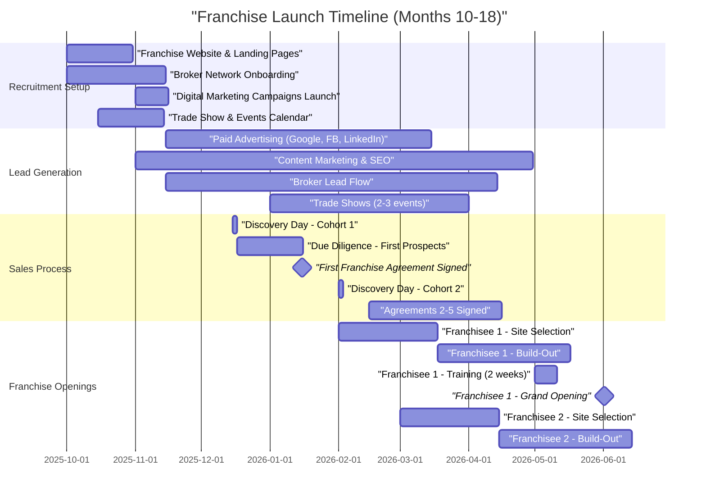
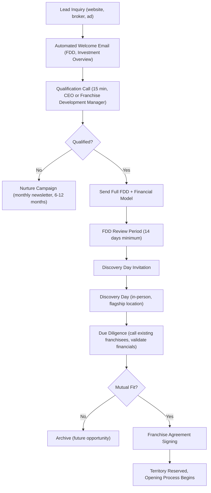

# Franchise Launch Roadmap (Months 10-18)

**Sprint**: 02 - Franchise Development & Multi-Location Expansion
**Task**: 05 - Implementation Roadmap
**Date**: 2025-11-17
**Author**: roadmap-planner

## Executive Summary

The franchise launch phase (Months 10-18) transforms MirrorMe from a **multi-unit operator** into a **franchisor**. This 9-month period focuses on three critical objectives: **franchisee recruitment** (generating 50-100 qualified leads), **franchise sales** (converting 3-5 franchisees), and **franchise openings** (successfully launching first locations with full support).

Investment required: **$75K-$150K** (marketing, broker commissions, opening support). 
Expected outcomes: **3-5 signed franchise agreements**, **1-3 locations opened**, **$75K-$125K in franchise fees collected**.

**Critical Success Factor**: First franchisee opening must be **flawless** - sets tone for entire system, generates testimonials, and proves replicability to future prospects. Under-promise and over-deliver on support.

## Key Milestones

- **Month 10**: Franchise recruitment launch, first 20 leads generated
- **Month 12**: First franchise agreement signed (validation of sales process)
- **Month 15**: First franchisee training completed, build-out underway
- **Month 18**: First franchise location opens, 3-5 total agreements signed
- **Go/No-Go Decision (Month 18)**: Proceed to aggressive growth if first openings achieve 70%+ of projections

## Phase 2 Timeline Overview

## Franchise Recruitment Setup (Months 10-11)

### Franchise Development Website

**Objective**: Create dedicated franchise recruitment website (separate from customer-facing site).

**Website Structure**:

1. **Homepage**
   - Hero: "Own a MirrorMe Franchise - Capture Success in the $2B Headshot Industry"
   - Value proposition: Low overhead, recurring revenue, proven model
   - CTA: "Download Franchise Information Packet" (lead capture)
   - Success metrics: "3 Locations, $500K+ Annual Revenue, 95% Customer Satisfaction"

2. **Why MirrorMe Page**
   - Market opportunity (corporate headshots, LinkedIn demand)
   - Competitive advantages (fast sessions, affordable pricing, tech-enabled)
   - Franchisee ROI model (Item 19 financial performance data)
   - Testimonials (from 2nd/3rd location managers transitioning to franchisees)

3. **Investment & Fees Page**
   - Total initial investment breakdown ($150K-$200K)
   - Franchise fee ($40K) and royalty structure (6-7%)
   - Financing options (SBA 7(a) loan, equipment financing)
   - Cost savings vs. independent startup ($50K-$100K lower)

4. **Support & Training Page**
   - 2-week training program overview
   - Cloud editing platform demo
   - Marketing support (website, local SEO, social media)
   - Ongoing support structure (monthly calls, field visits, annual conference)

5. **Discovery Process Page**
   - Step-by-step timeline (inquiry → discovery day → FDD review → signing → opening)
   - Discovery day agenda (visit flagship location, meet existing franchisees, financial review)
   - FAQs (20+ common questions)

6. **Territories Available Page**
   - Interactive map showing available territories
   - Market demographics for key cities (population, median income, business density)
   - "Reserve Your Territory" CTA (lead form)

**Development Cost**: **$15K-$25K**
- Website design and development: $10K-$15K
- Copywriting and content creation: $3K-$5K
- Video production (franchise overview video): $2K-$5K

**Launch Timeline**: Month 10, Weeks 1-4

**Key Performance Indicators**:
- Website traffic: 500+ visitors/month by Month 12
- Lead conversion rate: 10-15% (download franchise packet)
- Lead quality: 30%+ meet minimum qualification criteria (net worth, liquid capital)

### Franchise Broker Network

**Strategy**: Partner with 3-5 franchise brokers to generate qualified leads.

**Broker Economics**:
- **Commission**: 50% of franchise fee ($20K per sale)
- **Exclusivity**: Non-exclusive (multiple brokers can compete)
- **Payment Terms**: 50% at signing, 50% at opening (ensures quality referrals)

**Broker Selection Criteria**:
1. **FranChoice, Franchise Ventures, The Franchise Consulting Company** (top-tier brokers)
2. **5+ years experience** in franchise sales
3. **Active candidate database** of 500+ pre-qualified prospects
4. **Specialization** in service-based or retail franchises ($100K-$300K investment range)
5. **References** from other franchisors (check close rate, candidate quality)

**Broker Onboarding Process** (Month 10):

| Week | Activity | Deliverable |
|------|----------|-------------|
| **Week 1** | Broker outreach and selection | LOIs signed with 3-5 brokers |
| **Week 2** | Broker training (MirrorMe model, sales materials, FDD review) | Brokers certified to present franchise |
| **Week 3** | Candidate database upload (import prospects into CRM) | 200+ prospects in pipeline |
| **Week 4** | First broker calls to candidates | 10-20 inquiries generated |

**Broker Activation Cost**: **$5K-$10K**
- Broker training materials: $2K-$3K
- CRM integration and data import: $1K-$2K
- Broker portal access setup: $2K-$5K

**Expected Lead Volume from Brokers**: 30-50 leads over 6 months (Months 10-15)

### Digital Marketing Campaigns

**Objective**: Generate 50-100 franchise leads through paid advertising and content marketing.

**Channel Strategy**:

1. **Google Ads - Search** (Months 11-18, $2K-$3K/month)
   - Keywords: "photography franchise," "headshot franchise," "low-cost service franchise," "home-based photography business"
   - Ad copy: "MirrorMe Franchise - $150K Investment, $300K+ Revenue Potential, SBA Financing Available"
   - Landing page: Franchise website (with lead capture form)
   - Expected CTR: 3-5%, CPC: $8-$15, Leads: 15-25/month

2. **Facebook & Instagram Ads** (Months 11-18, $1.5K-$2.5K/month)
   - Targeting: Age 30-55, household income $100K+, interests (entrepreneurship, photography, small business)
   - Ad formats: Video (franchise overview), carousel (franchisee testimonials), lead gen forms
   - Creative: "Tired of the 9-5? Own a MirrorMe franchise and build a business you love."
   - Expected CPL: $50-$80, Leads: 20-30/month

3. **LinkedIn Ads** (Months 11-18, $1K-$2K/month)
   - Targeting: Job titles (corporate professionals transitioning to entrepreneurship), industries (sales, marketing, HR)
   - Ad formats: Sponsored content (franchise opportunity articles), InMail (personalized outreach)
   - Creative: "From Corporate to Franchise Owner - MirrorMe Success Stories"
   - Expected CPL: $75-$125, Leads: 10-15/month

4. **Content Marketing & SEO** (Months 11-18, $500-$1K/month)
   - Blog posts: "How to Evaluate a Photography Franchise," "MirrorMe ROI Model Explained," "SBA Loan Guide for Franchisees"
   - SEO optimization: Rank for "best photography franchise," "headshot franchise opportunity"
   - Guest posts: Franchise industry publications (Franchise Times, Entrepreneur)
   - Expected organic traffic: 200-300 visitors/month by Month 15, Leads: 5-10/month

**Total Digital Marketing Spend**: **$35K-$60K** (8 months, Months 11-18)

**Lead Generation Targets by Source**:

| Source | Leads (Months 10-18) | Cost Per Lead | Total Cost |
|--------|---------------------|---------------|------------|
| **Google Ads** | 120-200 | $80-$120 | $16K-$24K |
| **Facebook/Instagram** | 160-240 | $50-$80 | $12K-$20K |
| **LinkedIn** | 80-120 | $75-$125 | $8K-$15K |
| **Organic/Content** | 40-80 | $50-$100 | $4K-$8K |
| **Franchise Brokers** | 30-50 | $200-$400 | $10K-$15K |
| **Trade Shows/Events** | 20-40 | $500-$1,000 | $10K-$20K |
| **TOTAL** | **450-730 leads** | **~$100/lead avg** | **$60K-$102K** |

### Franchise Trade Shows & Events

**Strategy**: Attend 2-3 franchise expos to generate high-intent leads and build credibility.

**Target Events** (Months 12-18):

1. **International Franchise Expo (IFE)** - New York (June 2026)
   - Cost: $5K-$8K (booth, travel, materials)
   - Expected leads: 10-15 qualified prospects
   - Benefits: Press coverage, investor meetings, broker networking

2. **Franchise Expo West** - Los Angeles (March 2026)
   - Cost: $4K-$6K (smaller booth, regional event)
   - Expected leads: 8-12 qualified prospects
   - Benefits: California market focus (large addressable market)

3. **Multi-Unit Franchising Conference** - Las Vegas (April 2026)
   - Cost: $3K-$5K (speaking opportunity + booth)
   - Expected leads: 5-10 multi-unit operators (high-quality prospects)
   - Benefits: Attract experienced franchisees (faster growth trajectory)

**Total Trade Show Investment**: **$12K-$19K**

**Booth Strategy**:
- Live headshot demos (on-site mini-studio)
- iPad lead capture (digital brochures, video testimonials)
- Franchise calculator (ROI model, SBA financing estimator)
- Giveaway: Free professional headshot session (100+ entries, follow-up opportunity)

## Franchise Sales Process (Months 10-18)

### Lead Qualification & Nurturing

**Qualification Criteria** (minimum requirements):
- **Net Worth**: $300K+ (2x total investment)
- **Liquid Capital**: $75K+ (50% of total investment)
- **Credit Score**: 680+ (SBA loan requirement)
- **Business Experience**: 3+ years management or entrepreneurship (preferred, not required)
- **Geographic Fit**: Located in or willing to relocate to available territory

**Nurturing Workflow**:

**Timeline from Inquiry to Signing**: 60-90 days (average)

**Lead Nurturing Tools**:
- **CRM**: HubSpot or Salesforce (track all interactions, automate follow-ups)
- **Email Drip Campaign**: 12-email sequence over 90 days (education, testimonials, financing tips)
- **Webinars**: Monthly "Franchise Overview" webinar (30-45 min, Q&A, FDD download CTA)
- **Video Library**: Franchisee testimonials, day-in-the-life, training program preview

**Expected Conversion Rates**:
- Inquiry → Qualified Lead: 30-40%
- Qualified Lead → Discovery Day: 20-30%
- Discovery Day → Signing: 40-60%
- **Overall Inquiry → Signing**: 3-5% (industry benchmark: 2-4%)

**Example Funnel (Months 10-18)**:
- 500 total leads
- 175 qualified leads (35%)
- 45 discovery day attendees (25% of qualified)
- 20 franchises sold (45% of discovery day, 4% of total leads)

### Discovery Day Program

**Objective**: Provide immersive, in-person experience at flagship location to close high-intent prospects.

**Frequency**: Monthly (Months 11-18), max 5 attendees per session

**Agenda** (8-hour day):

| Time | Activity | Location | Presenter |
|------|----------|----------|-----------|
| **8:00 AM** | Registration & Breakfast | Conference Room | Marketing Director |
| **8:30 AM** | Welcome & MirrorMe Story | Conference Room | CEO |
| **9:00 AM** | Market Opportunity & Financial Model | Conference Room | CFO (or Franchise Consultant) |
| **10:00 AM** | Break | | |
| **10:15 AM** | Operations Deep Dive | Studio Floor | Operations Manager |
| **11:15 AM** | Live Headshot Session Demo | Studio | Lead Photographer |
| **12:00 PM** | Lunch with Existing Franchisees | Restaurant | Franchisees (2nd/3rd location owners) |
| **1:30 PM** | Technology Platform Demo | Conference Room | Tech Lead |
| **2:15 PM** | Marketing & Support Programs | Conference Room | Marketing Director |
| **3:00 PM** | Territory Selection & Site Criteria | Conference Room | Real Estate Consultant |
| **3:45 PM** | Q&A & Next Steps | Conference Room | CEO |
| **4:30 PM** | One-on-One Meetings (optional) | Conference Room | CEO + Team |

**Discovery Day Costs**:
- Venue rental (if not at flagship): $500-$1,000
- Catering (breakfast, lunch, snacks): $300-$500 (5 attendees)
- Printed materials (FDD, operations manual excerpts): $100-$200
- Franchisee travel reimbursement (optional, for top prospects): $500-$1,500
- **Total per Discovery Day**: $1,400-$3,200

**Expected Discovery Days**: 6-8 events (Months 11-18) 
**Total Discovery Day Investment**: **$8K-$25K**

**Post-Discovery Day Follow-Up**:
- Same-day email: Thank you, recap key points, send additional materials
- Day 3: Personal call from CEO (answer lingering questions, gauge interest)
- Day 7: Invitation to call existing franchisees (validation calls)
- Day 14: FDD Item 20 contact list (talk to other franchisees)
- Day 21: Final decision call (address objections, discuss financing, set signing date)

**Close Rate Target**: 50%+ of discovery day attendees sign within 60 days

### Franchise Agreement Signing & Onboarding

**Signing Process**:
1. **Final FDD Review** (attorney-advised, 14-day waiting period post-receipt)
2. **Franchise Agreement Execution** (wet signatures or DocuSign)
3. **Franchise Fee Payment** ($40K, typically via wire transfer)
4. **Territory Assignment** (signed addendum with specific ZIP codes or radius)
5. **Welcome Packet** (next steps, timeline, team introductions)

**Post-Signing Onboarding** (Days 1-30):

| Week | Activity | Owner | Deliverable |
|------|----------|-------|-------------|
| **Week 1** | Franchisee portal access setup | Tech Team | Login credentials, portal orientation |
| **Week 1** | Site selection criteria review | Real Estate Consultant | Site selection manual, market research |
| **Week 2** | Equipment ordering kickoff | Operations Manager | Equipment checklist, vendor contacts |
| **Week 2** | Financing application support (SBA loan) | CFO | Business plan, financial projections |
| **Week 3** | Marketing plan development | Marketing Director | Local marketing playbook, pre-launch calendar |
| **Week 4** | Build-out design review | Operations Manager | Floor plan approval, contractor bids |

**First Franchisee Signing Target**: Month 12 (validates sales process and pricing)

**Signing Goals by Month 18**:
- **Conservative**: 3 agreements ($120K franchise fees)
- **Target**: 5 agreements ($200K franchise fees)
- **Stretch**: 8 agreements ($320K franchise fees)

## Franchise Openings (Months 13-18+)

### Pre-Opening Support (Months 1-4 post-signing)

**Site Selection & Lease Negotiation** (Weeks 1-6)

**Process**:
1. **Market Research** (Week 1): Analyze demographics, competition, traffic patterns in franchisee's territory
2. **Site Tours** (Weeks 2-4): Visit 5-10 potential locations with franchisee and real estate consultant
3. **Site Evaluation** (Week 4): Score each site using criteria (rent, visibility, parking, build-out costs)
4. **Lease Negotiation** (Weeks 5-6): Negotiate terms (5-year lease, 2x 5-year options, $3K-$5K/mo rent, 3 months free rent for build-out)

**Franchisor Support**:
- Provide site selection manual (40+ pages, demographics criteria, lease checklist)
- Review and approve all sites before lease signing (quality control)
- Introduce franchisee to preferred real estate brokers (commission paid by landlord)
- Attend lease negotiation (if needed, for complex deals)

**Build-Out & Equipment Installation** (Weeks 7-14)

**Timeline**:
- **Weeks 7-8**: Contractor selection (3 bids, franchisor-approved vendors preferred)
- **Weeks 9-12**: Build-out execution (flooring, paint, lighting, backdrops, signage)
- **Week 12**: Equipment delivery and installation (cameras, lighting, computers, furniture)
- **Week 13**: Technology setup (cloud editing, CRM, POS system, internet/WiFi)
- **Week 14**: Final inspection and punch list completion

**Franchisor Support**:
- Provide build-out specifications (floor plans, equipment list, signage specs)
- Negotiate volume discounts with equipment suppliers (10-15% savings for franchisees)
- Field visit (Operations Manager, 2 days) during build-out to ensure compliance
- Virtual inspections via Zoom (weekly check-ins)

**Build-Out Cost**: $60K-$80K (consistent with projections from Phase 1)

**Hiring & Training** (Weeks 10-16)

**Staffing Requirements**:
- **General Manager** (1 FTE, $40K-$50K/year): Hired Week 10, starts Week 15
- **Photographers** (2-3 part-time, $18-$25/hour): Hired Week 13, start Week 16
- **Administrative Assistant** (part-time, $15-$18/hour, optional): Hired Week 15, start Week 16

**Recruitment Support**:
- Job description templates and posting on Indeed, ZipRecruiter
- Interview question guides and candidate scorecards
- Background check and reference check services

**Training Program** (Weeks 15-16, 2 weeks, 80 hours):
- **Week 1**: Franchisee + GM train at flagship location (hands-on, all systems)
- **Week 2**: On-site training at new location (practice sessions, soft opening)
- **Certification**: Franchisee and GM must pass certification test (90%+ score) before opening

**Training Cost** (covered by franchisee):
- Travel and lodging for Week 1: $2K-$3K
- Franchisor training fee: Included in franchise fee (no additional cost)
- On-site trainer (Week 2): Franchisor provides at no cost (first franchisee), $2K-$3K for subsequent franchisees

**Pre-Launch Marketing** (Weeks 14-16)

**Objectives**: Generate 50+ bookings before grand opening, build local brand awareness.

**Tactics**:
- **Website & Local SEO**: Launch location-specific website (subdomain: city.mirrorme.com), Google My Business setup, Yelp, Facebook page
- **Social Media**: Create Instagram/Facebook accounts, post daily (behind-the-scenes build-out), run giveaway (10 free headshots)
- **Partnerships**: Outreach to 20-30 local businesses (real estate agents, recruiters, consultants) for corporate client referrals
- **PR**: Press release to local media (new business opening, jobs created), pitch feature story to local business journal
- **Paid Advertising**: Google Ads ($500-$1K), Facebook Ads ($500-$1K) targeting local zip codes

**Pre-Launch Marketing Budget**: $5K-$8K (franchisee-funded, franchisor provides templates and guidance)

**Franchisor Marketing Support**:
- Provide pre-written press releases, social media templates, email copy
- Design grand opening flyers, posters, lawn signs
- Coordinate national brand PR (if available, e.g., Entrepreneur feature)

### Grand Opening (Week 17)

**Grand Opening Strategy**:
- **Soft Opening** (Week 16): Invite friends, family, local influencers for free sessions (test systems, generate social proof)
- **Grand Opening Event** (Week 17, Saturday): Ribbon cutting, live music, refreshments, free mini-sessions (5-min headshots), raffle prizes
- **Post-Opening Promotion** (Weeks 17-20): 20% off discount for first 100 customers, referral program launch

**Grand Opening Budget**: $5K-$8K
- Event expenses (catering, entertainment, signage): $2K-$3K
- Promotional discounts (revenue loss): $1K-$2K
- Paid advertising (boost event on social media): $1K-$2K
- Gifts/prizes for raffle: $500-$1K

**Franchisor Support**:
- **On-site support**: Operations Manager + Marketing Director present for grand opening (2-3 days)
- **Quality assurance**: Review first 50 customer sessions, provide feedback
- **Troubleshooting**: Address any technology, operational, or customer service issues immediately

**Success Metrics - First 30 Days**:
- 100+ customer sessions completed
- $15K-$20K revenue (60-80% of flagship first-month performance)
- 4.5+ star average rating (Google, Yelp, Facebook)
- 20%+ repeat/referral rate

### Post-Opening Support (Months 4-6 post-signing)

**Ongoing Support Structure**:
- **Weekly Calls** (first 4 weeks): Check-in on operations, marketing, customer feedback
- **Monthly Calls** (ongoing): Review P&L, discuss marketing campaigns, address challenges
- **Quarterly Business Reviews** (QBR): In-depth performance analysis, goal setting, action plans
- **Annual Conference** (Year 2+): 2-day event, best practices sharing, advanced training

**Field Support Visits**:
- **30-Day Visit**: Operations Manager on-site (2 days) to review operations, refine processes
- **90-Day Visit**: Marketing Director on-site (1 day) to audit marketing efforts, optimize campaigns
- **6-Month Visit**: CEO visit (1 day) to celebrate success, discuss growth plans (e.g., multi-unit development)

**Technology & Systems Support**:
- **Help Desk**: Ticketing system for tech issues (24-hour response time)
- **Platform Updates**: Monthly software releases (new features, bug fixes)
- **Training Webinars**: Monthly webinars on new features, best practices

**Continuous Improvement**:
- **Franchisee Feedback**: Quarterly surveys to identify pain points, opportunities
- **Best Practices Sharing**: Monthly newsletter highlighting top performers, case studies
- **Innovation Pipeline**: Franchisee input on new services (e.g., family photos, events), equipment upgrades

## Resource Requirements (Months 10-18)

### Franchise Development Team

| Role | Responsibility | FTE | Salary/Cost | Timeline |
|------|----------------|-----|-------------|----------|
| **CEO** | Sales leadership, discovery days, signing | 0.75 | $75K (9 months) | Months 10-18 |
| **Franchise Development Manager** (new hire) | Lead qualification, nurturing, broker coordination | 1.0 | $60K-$75K | Months 10-18 |
| **Operations Manager** | Opening support, field visits, quality assurance | 0.5 | $30K-$38K | Months 10-18 |
| **Marketing Director** | Digital campaigns, trade shows, grand opening support | 0.75 | $50K-$60K | Months 10-18 |
| **Real Estate Consultant** (contractor) | Site selection, lease negotiation | Contract | $10K-$20K (project-based, per franchisee) | As needed |
| **Franchise Attorney** (external) | FDD updates, agreement reviews | Contract | $5K-$10K (annual retainer) | Months 10-18 |

**Total Personnel Cost**: **$230K-$278K** (9 months)

### Phase 2 Budget Summary

| Category | Investment | Notes |
|----------|-----------|-------|
| **Franchise Website & Recruitment Materials** | $15K-$25K | Website, videos, brochures, sales collateral |
| **Digital Marketing & Advertising** | $35K-$60K | Google, Facebook, LinkedIn ads (8 months) |
| **Franchise Broker Commissions** | $40K-$100K | 50% of franchise fee per sale (2-5 sales) |
| **Trade Shows & Events** | $12K-$19K | 2-3 franchise expos (booth, travel, materials) |
| **Discovery Days** | $8K-$25K | 6-8 events (catering, materials, travel reimbursement) |
| **Opening Support (3-5 franchisees)** | $30K-$75K | Field visits, training, on-site support (3-5 openings) |
| **Personnel** | $230K-$278K | Franchise development team (9 months) |
| **Legal & Compliance** | $5K-$10K | FDD updates, agreement reviews, state filings |
| **Contingency** (10%) | $38K-$59K | Unexpected marketing costs, additional support needs |
| **TOTAL PHASE 2 INVESTMENT** | **$413K-$651K** | **Includes all costs for franchise launch and first openings** |

**Revenue Offsets**:
- Franchise fees collected (3-5 franchisees): $120K-$200K
- Royalties from first openings (Months 16-18, 3 months): $8K-$15K
- **Net Investment** (after franchise fees): $213K-$451K

**Break-Even Analysis**:
- Phase 2 investment: $413K-$651K
- Franchise fees collected: $120K-$200K
- **Additional franchises needed to break even**: 6-11 total (including first 3-5)
- **Timeline to break even**: Month 24-30 (Year 2-2.5)

## Sales & Opening Targets

### Month-by-Month Sales Targets

| Month | Lead Generation | Qualified Leads | Discovery Days | Agreements Signed | Cumulative Signed |
|-------|----------------|----------------|----------------|-------------------|-------------------|
| **Month 10** | 30-50 | 10-15 | 0 | 0 | 0 |
| **Month 11** | 50-80 | 20-30 | 1 (5 attendees) | 0 | 0 |
| **Month 12** | 60-90 | 25-35 | 1 (5 attendees) | 1 | 1 |
| **Month 13** | 60-90 | 25-35 | 1 (5 attendees) | 1 | 2 |
| **Month 14** | 60-90 | 25-35 | 1 (5 attendees) | 1 | 3 |
| **Month 15** | 60-90 | 25-35 | 1 (5 attendees) | 0 | 3 |
| **Month 16** | 60-90 | 25-35 | 1 (5 attendees) | 1 | 4 |
| **Month 17** | 60-90 | 25-35 | 1 (5 attendees) | 1 | 5 |
| **Month 18** | 60-90 | 25-35 | 1 (5 attendees) | 0 | 5 |
| **TOTAL** | **500-730** | **200-285** | **8 (40 attendees)** | **5** | **5** |

**Conversion Rates**:
- Inquiry → Qualified: 40%
- Qualified → Discovery Day: 14% (40 attendees / 285 qualified)
- Discovery Day → Signing: 13% (5 signed / 40 attendees)
- **Overall Inquiry → Signing**: 0.7% (5 / 730 leads)

**Note**: Industry benchmark is 2-4% inquiry-to-signing. Lower rate here reflects first-year franchise launch (brand awareness building, proof of concept). Expected to improve to 2-3% by Year 2.

### Opening Timeline (First 5 Franchisees)

| Franchisee | Signed | Site Selection | Build-Out | Training | Grand Opening | Revenue (Month 1) |
|------------|--------|---------------|-----------|----------|---------------|-------------------|
| **#1** | Month 12 | Months 13-14 | Months 14-16 | Month 16 | Month 17 | $15K-$20K |
| **#2** | Month 13 | Months 14-15 | Months 15-17 | Month 17 | Month 18 | $12K-$18K |
| **#3** | Month 14 | Months 15-16 | Months 16-18 | Month 18 | Month 19 | $10K-$15K |
| **#4** | Month 16 | Months 17-18 | Months 18-20 | Month 20 | Month 21 | $10K-$15K |
| **#5** | Month 17 | Months 18-19 | Months 19-21 | Month 21 | Month 22 | $10K-$15K |

**Key Insight**: 4-5 month lag between signing and opening (site selection, build-out, training). First opening in Month 17 (7 months after franchise sales launch).

## Risk Factors & Mitigation

### Sales Risks

| Risk | Probability | Impact | Mitigation Strategy |
|------|-------------|--------|---------------------|
| **Slow lead generation** (< 50 leads/month) | Medium (40%) | High - delays sales timeline | Increase digital ad spend by 50%, add 2-3 additional brokers, attend extra trade show |
| **Low discovery day conversion** (< 30%) | Medium (35%) | High - insufficient sales | Improve discovery day experience (better demos, franchisee testimonials), extend FDD review period, offer financing assistance |
| **Franchisee financing rejections** (SBA loan denials) | Medium (30%) | Medium - qualified prospects can't proceed | Partner with franchise-specific lenders (ApplePie Capital, Benetrends), offer franchisor financing (5-10% down, 5-year note) |
| **Competitor undercutting** (lower franchise fees) | Low (20%) | Medium - price pressure | Emphasize value (technology, support, brand), target quality over quantity, validate ROI with Item 19 data |

### Opening Risks

| Risk | Probability | Impact | Mitigation Strategy |
|------|-------------|--------|---------------------|
| **First franchisee opening failure** (< 50% of projections) | Medium (30%) | **Critical** - kills momentum, scares prospects | Over-invest in first opening support (3x normal field visits), choose ideal market (proven demographics), provide extra marketing budget ($5K-$10K grant) |
| **Build-out delays** (> 90 days) | High (50%) | Medium - frustrated franchisees, delayed revenue | Pre-approve contractors (preferred vendor list), provide detailed build-out specs, weekly project management check-ins |
| **Staffing challenges** (can't hire quality photographers) | Medium (40%) | Medium - poor customer experience, low ratings | Provide recruitment training, expand hiring to gig workers (Thumbtack, Upwork), offer franchisor-led recruitment support |
| **Technology failures** (cloud editing downtime) | Low (15%) | High - service disruption, refunds | Invest in 99.9% uptime SLA (redundant servers, 24/7 monitoring), provide manual editing backup process, incident response plan (< 1 hour resolution) |

### Financial Risks

| Risk | Probability | Impact | Mitigation Strategy |
|------|-------------|--------|---------------------|
| **Phase 2 budget overrun** (> 150% of plan) | Medium (40%) | Medium - cash flow strain | Secure $200K line of credit (pre-approved), phase spending (delay non-critical items), negotiate payment terms with vendors (Net 60-90) |
| **Lower franchise fee revenue** (< 3 sales) | Medium (35%) | High - can't fund operations | Reduce personnel costs (part-time FDM, outsource lead gen), extend timeline (accept 12-month payback vs. 9-month), seek investor capital ($100K-$250K bridge loan) |
| **Franchisee failures** (< 6 months) | Low (10%) | **Critical** - legal liability, brand damage | Rigorous franchisee screening (financial + character), intensive opening support, early intervention if metrics decline (weekly calls, troubleshooting) |

## Go/No-Go Decision Framework (Month 18)

**Proceed to Aggressive Growth (Year 2: 8 new franchises) IF**:

✅ **Sales Performance**:
- 5+ franchise agreements signed
- 50+ qualified leads in pipeline
- 30%+ discovery day conversion rate (improving)

✅ **Opening Performance**:
- 2+ locations opened by Month 18
- First franchisee achieving 70%+ of flagship revenue (Month 3 post-opening)
- 4.5+ star average rating across all franchisee locations

✅ **Financial Performance**:
- $120K+ franchise fees collected (cash flow positive on franchise development operations)
- Royalty revenue: $10K+ (3 months from first openings)
- Break-even path visible (6-12 months)

✅ **Operational Readiness**:
- Operations manual refined based on franchisee feedback
- Technology platform stable (99%+ uptime, no critical bugs)
- Support team scaling plan in place (hire additional FDMs, field trainers)

**If ANY criteria not met**:
- **Slow growth mode** (Year 2: 3-5 new franchises vs. 8)
- **Address gaps systematically** (improve sales process, enhance support, stabilize operations)
- **Re-assess at Month 24** (allow one delay cycle before aggressive growth)

## Success Metrics - Month 18 Scorecard

| Metric | Target | Minimum Acceptable | Stretch Goal |
|--------|--------|-------------------|--------------|
| **Franchise Agreements Signed** | 5 | 3 | 8 |
| **Franchise Fees Collected** | $200K | $120K | $320K |
| **Locations Opened** | 2 | 1 | 3 |
| **Franchisee 1 Monthly Revenue (Month 3)** | $28K-$35K | $20K+ | $40K+ |
| **Qualified Lead Pipeline** | 50+ | 30+ | 75+ |
| **Discovery Day Conversion Rate** | 30%+ | 20%+ | 40%+ |
| **Franchisee Satisfaction Score** | 8.5/10 | 7.5/10 | 9.5/10 |
| **Technology Platform Uptime** | 99.5%+ | 99%+ | 99.9%+ |

**Final Checkpoint**: CEO + Board + First Franchisees review (Month 18, Week 2) to authorize Year 2 growth plan.

## References

1. Franchise Update Media. (2024). *Franchise Sales Best Practices: From Lead to Opening*. Retrieved from https://www.franchiseupdatemedia.com
2. International Franchise Association. (2024). *Discovery Day Playbook for New Franchisors*. IFA Press.
3. Entrepreneur. (2024). *Digital Marketing Strategies for Franchise Recruitment*. Entrepreneur Media.
4. FranChoice. (2024). *Franchise Broker Partnership Guide*. FranChoice Research.
5. Franchise Times. (2024). *First Franchisee Opening: Make or Break Moment*. Franchise Times Publishing.
6. Small Business Administration. (2024). *SBA 7(a) Loan Program for Franchisees*. SBA.gov.
7. ApplePie Capital. (2024). *Franchise Financing Trends and Approval Rates*. ApplePie Capital Insights.
8. FRANdata. (2024). *Franchise Sales Conversion Benchmarks by Industry*. FRANdata Research.

---

**Next Steps**: Proceed to Five-Year Growth Roadmap (file 03).
