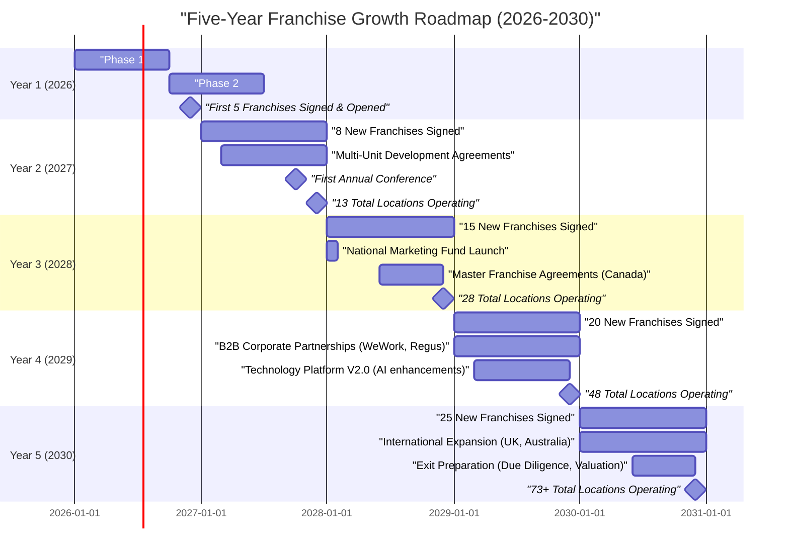

# Five-Year Franchise Growth Roadmap (Years 2-5)

**Sprint**: 02 - Franchise Development & Multi-Location Expansion
**Task**: 05 - Implementation Roadmap
**Date**: 2025-11-17
**Author**: roadmap-planner

## Executive Summary

The five-year growth plan transforms MirrorMe from a **startup franchisor** (5 franchises, Year 1) into a **regional/national brand** (68+ total locations, Year 5). This roadmap outlines aggressive but achievable growth: **Year 2: 8 new**, **Year 3: 15 new**, **Year 4: 20 new**, **Year 5: 25 new** franchises.

**Cumulative Outcomes by Year 5**:
- **68+ total franchise locations** (plus 3 company-owned)
- **$6.29M-$9.65M total franchisor revenue** (franchise fees + royalties)
- **$340M-$470M total system sales** (all franchise + company locations)
- **National brand recognition** in corporate headshot category
- **Exit-ready** (acquisition valuation: $15M-$30M at 5-8x EBITDA)

**Strategic Priorities**: Market penetration (Tier 1/2 cities), franchisee success (average $350K+ revenue per location), operational excellence (support team scaling, technology innovation), and strategic partnerships (corporate clients, B2B channels).

## Key Milestones by Year

- **Year 2 (2027)**: 13 total franchises, first multi-unit franchisee, annual conference launched
- **Year 3 (2028)**: 28 total franchises, 15 states penetrated, $1.5M+ franchisor revenue
- **Year 4 (2029)**: 48 total franchises, national B2B partnerships (WeWork, Regus), $3M+ franchisor revenue
- **Year 5 (2030)**: 73+ total franchises (68 franchise + 3 company-owned + 2 closed), Series A or acquisition offer
- **Exit Event (Year 5-6)**: Strategic acquisition by HR tech, photography, or franchise portfolio company

## Five-Year Growth Timeline

## Year-by-Year Growth Plan

### Year 2 (2027): Foundation Building

**Growth Target**: **8 new franchise agreements**, 13 total locations (5 from Year 1 + 8 new)

**Strategic Focus**: Prove franchisee profitability, refine support systems, establish multi-unit program.

**Key Initiatives**:

1. **Franchisee Success Program**
   - **Objective**: Ensure Year 1 franchisees achieve 80%+ of flagship performance
   - **Tactics**:
     - Monthly performance reviews (revenue, customer satisfaction, marketing ROI)
     - Quarterly on-site visits to top/bottom performers (share best practices, troubleshoot)
     - Franchisee advisory council (3-5 members, quarterly meetings, input on operations/marketing)
   - **Investment**: $20K-$30K (travel, advisory council stipends)

2. **Multi-Unit Development Program**
   - **Objective**: Sign first multi-unit franchisee (2-3 locations in same metro area)
   - **Benefits**: Faster growth, economies of scale (shared management, marketing), higher-quality operators
   - **Incentives**:
     - Reduced franchise fee for 2nd+ location: $30K (vs. $40K)
     - Protected territory (larger radius, prevents cannibalization)
     - Dedicated multi-unit support specialist
   - **Target**: 1-2 multi-unit agreements in Year 2

3. **First Annual Franchise Conference** (October 2027)
   - **Location**: Flagship city (centralized, cost-effective)
   - **Duration**: 2 days (Friday-Saturday)
   - **Agenda**:
     - Keynote: MirrorMe vision and Year 3 growth plans (CEO)
     - Workshops: Advanced photography techniques, social media marketing, corporate sales
     - Vendor expo: Equipment suppliers, marketing agencies, financing partners
     - Awards: Top revenue, highest growth, best customer satisfaction
     - Networking: Peer-to-peer learning, mastermind sessions
   - **Cost**: $50K-$75K (venue, catering, speakers, travel for franchisor team)
   - **Franchisee cost**: $500-$750/person (covers expenses, builds commitment)
   - **Expected attendance**: 25-30 (13 franchisees + staff)

4. **State Expansion** (FDD Registrations)
   - **Year 1 States**: California, Texas, Florida (3 states)
   - **Year 2 Additions**: New York, Illinois, Georgia, North Carolina (4 states)
   - **Total**: 7 states (covers 50% of U.S. population)
   - **Investment**: $20K-$35K (registration fees + legal)

**Sales & Marketing**:
- Lead generation target: 800-1,000 leads
- Discovery days: 12 events (monthly)
- Conversion rate: 1.0% (8 / 1,000 leads, improving from Year 1's 0.7%)

**Financial Projections - Year 2**:

| Revenue Source | Amount | Notes |
|----------------|--------|-------|
| **Franchise Fees** (8 new) | $320K | $40K per franchise |
| **Royalties** (13 locations, avg 9 months operating) | $175K-$265K | 6-7% of $350K avg franchise revenue |
| **Technology Fees** (13 locations) | $26K-$39K | $200-$250/month per location |
| **National Marketing Fund** (not yet launched) | $0 | Launching Year 3 |
| **TOTAL YEAR 2 REVENUE** | **$521K-$624K** | |

**Expenses**:
- Franchise development (personnel, marketing, support): $400K-$500K
- **Net Profit**: $21K-$124K (near break-even, reinvest in growth)

**Key Metrics - Year 2**:
- Average franchisee revenue: $350K-$400K (mature locations)
- Franchisee profitability: 15-20% EBITDA margin
- Franchisee satisfaction score: 8.0+/10
- System-wide customer satisfaction: 4.6+ stars (Google average)

### Year 3 (2028): Regional Expansion

**Growth Target**: **15 new franchise agreements**, 28 total locations (13 from Year 2 + 15 new)

**Strategic Focus**: Regional density (multiple franchises per state), national marketing fund, master franchise exploration.

**Key Initiatives**:

1. **Regional Density Strategy**
   - **Objective**: Build clusters in top markets (5+ franchises per metro area)
   - **Target Markets**:
     - **California**: Los Angeles (3 locations), San Francisco (2 locations), San Diego (2 locations)
     - **Texas**: Dallas (3 locations), Houston (2 locations), Austin (2 locations)
     - **Florida**: Miami (2 locations), Tampa (2 locations), Orlando (1 location)
   - **Benefits**:
     - Shared marketing costs (metro-wide campaigns)
     - Brand awareness (customers see MirrorMe ads consistently)
     - Operational efficiency (regional manager oversees cluster)

2. **National Marketing Fund Launch** (January 2028)
   - **Structure**: 1-2% of gross sales contributed by all franchisees
   - **Use of Funds**:
     - National PR campaigns (press releases, media outreach)
     - Social media advertising (Facebook, Instagram, LinkedIn) at national level
     - SEO and content marketing (blog posts, video library, guest articles)
     - Trade show presence (HR conferences, small business expos)
   - **Governance**: Marketing advisory board (3 franchisees + franchisor marketing director)
   - **Expected Fund Size**: $85K-$135K (1-2% of $7M-$9M system sales)

3. **Master Franchise Agreements** (Canada Pilot)
   - **Objective**: Test international expansion with low-risk, similar market
   - **Structure**: Master franchisee gets exclusive rights to develop 10-20 locations in Canada over 5 years
   - **Economics**:
     - Master franchise fee: $100K-$150K (upfront)
     - Master franchisee receives 50% of sub-franchisee fees + 2-3% of sub-franchisee royalties
     - Franchisor receives 50% of sub-franchisee fees + 4% of sub-franchisee royalties
   - **Target**: 1 master franchise agreement (Toronto or Vancouver)
   - **Support**: Master franchisee responsible for local FDD, recruitment, training, support (franchisor provides systems, brand, technology)

4. **Technology Platform Enhancements**
   - **AI Background Replacement**: Auto-detect and replace backgrounds with branded MirrorMe templates (saves 50% editing time)
   - **Mobile App for Franchisees**: On-the-go booking management, customer check-in, session notes
   - **Customer Self-Scheduling**: Online booking (integrated with Google Calendar, Outlook) reduces administrative burden
   - **Investment**: $75K-$125K (development, testing, rollout)

**Sales & Marketing**:
- Lead generation target: 1,500-2,000 leads
- Discovery days: 15 events (more frequent to handle volume)
- Conversion rate: 0.75% (15 / 2,000 leads, lower rate but higher volume)

**Financial Projections - Year 3**:

| Revenue Source | Amount | Notes |
|----------------|--------|-------|
| **Franchise Fees** (15 new) | $600K | $40K per franchise |
| **Royalties** (28 locations, avg 10 months operating) | $525K-$785K | 6-7% of $350K avg franchise revenue, more mature locations |
| **Technology Fees** (28 locations) | $56K-$84K | $200-$250/month per location |
| **National Marketing Fund** (pass-through, not revenue) | $85K-$135K | Separate accounting, franchisee-funded |
| **Master Franchise Fee** (1 agreement) | $100K-$150K | One-time, Canada |
| **TOTAL YEAR 3 REVENUE** | **$1.28M-$1.62M** | |

**Expenses**:
- Franchise development (personnel, marketing, support, technology): $850K-$1.1M
- **Net Profit**: $180K-$520K (profitable, reinvest in team/infrastructure)

**Key Metrics - Year 3**:
- Average franchisee revenue: $375K-$425K (mature locations improving)
- System-wide sales: $9M-$12M (28 locations × $350K avg)
- Franchisee count by state: CA (10), TX (8), FL (5), NY (2), IL (1), other (2)
- Franchisee retention rate: 95%+ (max 1-2 closures)

### Year 4 (2029): National Scale

**Growth Target**: **20 new franchise agreements**, 48 total locations (28 from Year 3 + 20 new)

**Strategic Focus**: National footprint (20+ states), B2B partnerships, technology differentiation.

**Key Initiatives**:

1. **B2B Corporate Partnerships**
   - **WeWork Partnership**:
     - **Opportunity**: WeWork has 50+ U.S. locations, 100K+ members (startups, freelancers, SMBs)
     - **Proposal**: MirrorMe on-site headshot days (monthly or quarterly at each WeWork location)
     - **Economics**: WeWork members get 20% discount, WeWork gets 10% commission on revenue
     - **Expected Revenue**: $500K-$1M annually (if 20 WeWork locations × $2K-$4K/event × 12 events/year)
   - **Regus/IWG Partnership**:
     - Similar model to WeWork, larger footprint (3,000+ global locations, 600+ U.S. locations)
     - Focus on top 20 U.S. metros initially
   - **LinkedIn Premium Partnership**:
     - **Opportunity**: LinkedIn Premium members (30M+ globally) need professional headshots
     - **Proposal**: MirrorMe discount code in LinkedIn Premium welcome email
     - **Economics**: LinkedIn affiliate fee (5-10% of session revenue) or co-marketing (brand visibility)
   - **Investment**: $50K-$100K (partnership development, legal agreements, integration costs)

2. **Franchisee Financing Program** (Captive Finance)
   - **Objective**: Reduce barriers to entry, accelerate sales
   - **Structure**: Franchisor provides financing for franchise fee ($40K loan, 5-year term, 8-10% interest)
   - **Qualification**: 700+ credit score, $50K+ liquid capital, SBA loan approved for build-out costs
   - **Benefits**:
     - Franchisees: Lower upfront cash requirement ($10K down + $30K financed)
     - Franchisor: Earn interest income ($5K-$8K per loan), faster sales velocity
   - **Investment**: $200K-$400K (capital to fund 5-10 loans)
   - **Risk Mitigation**: Personal guarantee, first lien on franchise assets, SBA loan subordination agreement

3. **Advanced Training & Certification Programs**
   - **Corporate Headshot Specialist**: Advanced posing, executive presence, on-site corporate shoots
   - **Family & Group Photography**: Expand services to family portraits (additional revenue stream)
   - **Video Headshots**: Short introduction videos for LinkedIn, websites (15-30 seconds)
   - **Cost**: $10K-$20K (curriculum development, video production, certification tests)
   - **Franchisee Benefit**: 20-30% revenue increase from expanded services

4. **Franchisee Buyback Program** (Resale Support)
   - **Objective**: Help struggling franchisees exit gracefully, find qualified buyers
   - **Process**:
     - Franchisee lists location for sale (with franchisor approval)
     - Franchisor markets to existing franchisees (multi-unit expansion) and new prospects
     - Franchisor provides valuation guidance (1-2x EBITDA + inventory)
     - Buyer pays transfer fee to franchisor ($10K-$15K)
   - **Benefits**: Maintains brand reputation (no public failures), protects territory value

**Sales & Marketing**:
- Lead generation target: 2,000-2,500 leads
- Discovery days: 20 events
- Conversion rate: 0.8% (20 / 2,500 leads, slight improvement with brand awareness)

**Financial Projections - Year 4**:

| Revenue Source | Amount | Notes |
|----------------|--------|-------|
| **Franchise Fees** (20 new) | $800K | $40K per franchise |
| **Royalties** (48 locations, avg 11 months operating) | $1.2M-$1.8M | 6-7% of $375K avg franchise revenue |
| **Technology Fees** (48 locations) | $96K-$144K | $200-$250/month per location |
| **B2B Partnership Revenue** (WeWork, Regus) | $250K-$500K | Commission revenue from corporate partnerships |
| **Financing Interest Income** (5-10 loans outstanding) | $10K-$25K | Interest on franchisee loans |
| **Transfer Fees** (1-2 resales) | $10K-$30K | Franchisee resale transfer fees |
| **TOTAL YEAR 4 REVENUE** | **$2.37M-$3.50M** | |

**Expenses**:
- Franchise development + B2B partnerships + technology: $1.5M-$2.0M
- **Net Profit**: $370K-$1.5M (highly profitable, cash flow positive)

**Key Metrics - Year 4**:
- Average franchisee revenue: $400K-$450K (mature + advanced services)
- System-wide sales: $18M-$22M (48 locations × $400K avg)
- States penetrated: 20+ (national footprint)
- Multi-unit franchisees: 5-8 (20-30% of total franchises)

### Year 5 (2030): Exit Preparation

**Growth Target**: **25 new franchise agreements**, 73 total locations (48 from Year 4 + 25 new)

**Strategic Focus**: Maximize valuation metrics (EBITDA, growth rate, franchisee performance), prepare for acquisition or Series A funding.

**Key Initiatives**:

1. **International Expansion** (UK & Australia)
   - **Markets**: London (UK), Sydney/Melbourne (Australia)
   - **Rationale**: English-speaking, professional services culture, LinkedIn penetration, similar pricing
   - **Structure**: Master franchise agreements (similar to Canada)
   - **Economics**:
     - Master franchise fee: $150K-$200K per country
     - Expected sub-franchises: 5-10 per country over 5 years
   - **Investment**: $50K-$100K (legal, compliance, adaptation costs per country)

2. **Franchise System Optimization** (Acquirer Readiness)
   - **Objective**: Clean up operations, maximize EBITDA, demonstrate scalability
   - **Tactics**:
     - Close underperforming locations (if any, buy back or facilitate resale)
     - Standardize all processes (operations manual, training, support)
     - Automate support functions (AI chatbots, self-service portal, video libraries)
     - Document all intellectual property (trademarks, technology, processes)
   - **Investment**: $100K-$150K (consultants, automation, IP protection)

3. **Exit Preparation & Valuation**
   - **Hire Investment Banker** (Month 6): Engage M&A advisor to prepare business for sale
   - **Buyer Profiles**:
     - **Strategic Acquirers**: HR technology platforms (LinkedIn, Indeed, ZipRecruiter), photography companies (Shutterfly, Snappr), franchise portfolio companies (Driven Brands, Propelled Brands)
     - **Financial Acquirers**: Private equity firms specializing in franchises (FranServe Capital, Argonne Capital)
   - **Valuation Methodology**:
     - **EBITDA Multiple**: 5-8x EBITDA (franchise industry standard)
     - **Revenue Multiple**: 1.5-2.5x revenue (for high-growth, tech-enabled concepts)
     - **Comparable Transactions**: Analyze recent franchise acquisitions (e.g., Massage Envy sold for 6x EBITDA in 2019)
   - **Expected Valuation Range**: $15M-$30M (based on Year 5 financials below)

**Sales & Marketing**:
- Lead generation target: 2,500-3,000 leads
- Discovery days: 24 events (2 per month, multiple markets)
- Conversion rate: 0.83% (25 / 3,000 leads)

**Financial Projections - Year 5**:

| Revenue Source | Amount | Notes |
|----------------|--------|-------|
| **Franchise Fees** (25 new U.S. + 2 master international) | $1.3M | $40K × 25 U.S. + $150K-$200K × 2 international |
| **Royalties** (73 locations, avg 12 months operating) | $2.2M-$3.3M | 6-7% of $425K avg franchise revenue |
| **Technology Fees** (73 locations) | $146K-$219K | $200-$250/month per location |
| **B2B Partnership Revenue** (expanded) | $500K-$1M | WeWork, Regus, LinkedIn, new partners |
| **Financing Interest Income** (10-15 loans) | $25K-$50K | Interest on franchisee loans |
| **Transfer Fees** (2-4 resales) | $20K-$60K | Franchisee resale transfer fees |
| **TOTAL YEAR 5 REVENUE** | **$4.19M-$5.93M** | |

**Expenses**:
- Franchise development + international + exit prep: $2.0M-$2.8M
- **Net Profit (EBITDA)**: $1.39M-$3.13M (highly profitable, attractive to acquirers)

**Key Metrics - Year 5**:
- Average franchisee revenue: $425K-$475K
- System-wide sales: $30M-$35M (73 locations × $425K avg)
- Franchisee retention rate: 97%+ (max 2-3 closures over 5 years)
- International locations: 2-4 (master franchises beginning development)
- EBITDA margin: 33-53% (very attractive for M&A)

### Cumulative 5-Year Performance

**Total Franchises Sold**: 73+ (5 Year 1 + 8 Year 2 + 15 Year 3 + 20 Year 4 + 25 Year 5)

**Total Franchise Fee Revenue**: $2.92M (73 × $40K)

**Total 5-Year Franchisor Revenue**: $6.29M-$9.65M (franchise fees + royalties + technology + partnerships)

**Total System Sales** (all franchise locations, 5 years): $340M-$470M

**Franchisor Valuation at Exit** (Year 5): $15M-$30M (5-8x EBITDA of $1.4M-$3.1M)

**ROI to Founder**: 10-20x (assuming $1.5M-$2M total invested over 5 years)

## Territory Development Strategy

### Tier 1 Cities (Years 1-3 Focus)

**High-Priority Markets** (5+ franchises per metro):
- **Los Angeles, CA**: 8-10 franchises (downtown, West LA, Orange County, Pasadena, Long Beach)
- **New York City, NY**: 6-8 franchises (Manhattan, Brooklyn, Queens, Westchester)
- **Chicago, IL**: 5-7 franchises (Loop, North Side, Suburbs)
- **Dallas-Fort Worth, TX**: 5-7 franchises (Dallas, Fort Worth, Plano, Frisco)
- **Houston, TX**: 4-6 franchises (downtown, Galleria, The Woodlands)

**Criteria**: Population 3M+, median household income $75K+, 500K+ LinkedIn users, strong professional services market.

### Tier 2 Cities (Years 2-4 Focus)

**Medium-Priority Markets** (2-4 franchises per metro):
- **San Diego, CA**, **San Francisco, CA**, **Phoenix, AZ**, **Denver, CO**, **Seattle, WA**
- **Austin, TX**, **San Antonio, TX**, **Miami, FL**, **Tampa, FL**, **Orlando, FL**
- **Atlanta, GA**, **Charlotte, NC**, **Raleigh, NC**, **Washington, DC**, **Boston, MA**

**Criteria**: Population 1M-3M, median household income $65K+, growing professional services sector.

### Tier 3 Cities (Years 3-5 Focus)

**Expansion Markets** (1-2 franchises per metro):
- **Nashville, TN**, **Indianapolis, IN**, **Columbus, OH**, **Cleveland, OH**, **Milwaukee, WI**
- **Kansas City, MO**, **Salt Lake City, UT**, **Las Vegas, NV**, **Portland, OR**, **Sacramento, CA**

**Criteria**: Population 500K-1M, median household income $55K+, emerging startup/tech scenes.

**Total Addressable U.S. Markets**: 50+ metros (supports 200-300 franchise locations long-term)

## Support Team Scaling

### Organizational Growth

**Year 1-2 Team** (Small, Centralized):
- CEO (strategy, sales)
- Franchise Development Manager (lead gen, sales, onboarding)
- Operations Manager (openings, field support)
- Marketing Director (campaigns, grand openings, national brand)
- Part-time CFO (financials, reporting, franchise fees)

**Year 3 Team Additions**:
- **Regional Director - West** (CA, AZ, NV, WA, OR) - oversees 10-15 franchises
- **Regional Director - South** (TX, FL, GA, NC) - oversees 10-15 franchises
- **Franchise Training Manager** - develops curriculum, leads training programs
- **Technology Support Specialist** - help desk, platform maintenance, bug fixes

**Year 4 Team Additions**:
- **Regional Director - Midwest/East** (IL, NY, MA, OH, MI) - oversees 10-15 franchises
- **B2B Partnership Manager** - manages WeWork, Regus, LinkedIn relationships, develops new partnerships
- **Franchise Compliance Manager** - FDD updates, state registrations, legal compliance
- **Customer Success Manager** - franchisee onboarding, satisfaction surveys, retention programs

**Year 5 Team Additions**:
- **VP of Franchise Development** (oversees all franchise sales, replaces CEO day-to-day involvement)
- **International Development Manager** (master franchise recruitment, international support)
- **Data Analyst** (franchisee performance metrics, predictive analytics, benchmarking)
- **Executive Assistant to CEO** (support exit preparation, investor relations)

**Total Headcount by Year 5**: 20-25 employees (franchisor HQ) + 200-250 franchisee employees (system-wide)

**Personnel Costs**:
- Year 1: $405K-$545K (9 months)
- Year 2: $550K-$700K
- Year 3: $900K-$1.2M
- Year 4: $1.3M-$1.7M
- Year 5: $1.8M-$2.4M

## Technology Roadmap (Years 2-5)

### Year 2: Enhancements

- **Mobile app** for franchisees (iOS + Android): Booking management, customer check-in, session notes
- **Customer self-scheduling**: Online booking integrated with franchise calendars
- **Automated email campaigns**: Post-session follow-up, review requests, referral incentives
- **Investment**: $50K-$75K

### Year 3: AI & Automation

- **AI background replacement**: Auto-detect and replace backgrounds with branded templates
- **AI quality scoring**: Automatically score photos (composition, lighting, expression) and flag low-quality images
- **Chatbot support**: AI-powered help desk for common franchisee questions (reduce support tickets by 40%)
- **Investment**: $75K-$125K

### Year 4: Platform Expansion

- **Video headshots**: Record and edit 15-30 second introduction videos (LinkedIn, websites)
- **Enterprise portal**: Multi-location corporate clients can book headshots across franchise network
- **API integrations**: Connect to HRIS systems (Workday, BambooHR) for automated employee headshot workflows
- **Investment**: $100K-$150K

### Year 5: Data & Intelligence

- **Predictive analytics**: Forecast franchisee revenue, identify at-risk locations (churn prevention)
- **Dynamic pricing**: AI-recommended pricing based on local market, demand, competition
- **Customer lifetime value tracking**: Measure repeat rates, referrals, upsells per franchisee
- **Investment**: $75K-$125K

**Total 5-Year Technology Investment**: $300K-$475K

**Technology ROI**: 50-100% increase in franchisee operational efficiency, 20-30% increase in revenue per location, 30-40% reduction in support costs.

## Exit Strategy & Valuation

### Potential Acquirers

**1. HR Technology Platforms**
- **LinkedIn** (Microsoft): Add headshot services as premium member benefit, integrate into profile updates
- **Indeed, ZipRecruiter**: Career services expansion (resume writing, headshots, interview coaching)
- **Workday, BambooHR**: HRIS integration (employee directory photos, new hire onboarding)

**Acquisition Rationale**: Vertical integration, recurring revenue from existing user base, brand differentiation.

**2. Photography & Visual Services Companies**
- **Shutterfly** (recently acquired Snappr for $40M): Add franchise model to existing on-demand photography platform
- **Snappr**: Expand from freelance photographers to franchise locations (predictable supply)
- **SmugMug, Zenfolio**: Add headshot services to portfolio photography platforms

**Acquisition Rationale**: Market share growth, franchise revenue stream, technology IP.

**3. Franchise Portfolio Companies**
- **Driven Brands** (owns Maaco, Meineke, Take 5 Oil Change): Add service-based franchise to automotive portfolio
- **Propelled Brands** (owns Fastsigns, NerdsToGo): Complementary B2B services (signage + headshots)
- **Self Esteem Brands** (owns Anytime Fitness, Waxing the City): Personal services portfolio diversification

**Acquisition Rationale**: Portfolio diversification, franchise expertise, cross-selling opportunities.

**4. Private Equity Firms**
- **FranServe Capital**, **Argonne Capital**, **Bertram Capital** (franchise-focused PE firms)

**Acquisition Rationale**: Roll-up strategy (acquire MirrorMe + competitors, consolidate market), professionalize operations, scale to 500+ locations, exit to strategic acquirer in 5-7 years.

### Valuation Methodology

**Earnings-Based Valuation** (EBITDA Multiple):
- Year 5 EBITDA: $1.39M-$3.13M
- Industry multiple: 5-8x (franchise service businesses)
- **Valuation**: $6.95M-$25M

**Revenue-Based Valuation** (Revenue Multiple):
- Year 5 revenue: $4.19M-$5.93M
- Tech-enabled franchise multiple: 2.5-4x
- **Valuation**: $10.5M-$23.7M

**Asset-Based Valuation** (Intangible Assets):
- Brand value: $2M-$5M (national recognition, trademark portfolio)
- Technology platform: $3M-$7M (cloud editing, franchise portal, proprietary IP)
- Franchise agreements: $5M-$10M (73 franchises × $75K-$150K value each)
- Customer database: $1M-$3M (100K+ customers system-wide)
- **Total Asset Value**: $11M-$25M

**Comparable Transactions**:
- **Massage Envy** (2019): Sold to Roark Capital for ~$1B (6x EBITDA, 550 locations)
- **The Little Gym** (2017): Sold to Zeavion for undisclosed sum (4-6x EBITDA estimated, 400 locations)
- **Snappr** (2024): Acquired by Shutterfly for $40M (3-4x revenue, tech-enabled photography)

**Expected MirrorMe Valuation Range**: **$15M-$30M** (midpoint of all methodologies, 73 locations, proven profitability, growth trajectory)

### Exit Timeline

**Year 5, Q2 (April-June 2030)**: Engage M&A advisor, prepare marketing materials (CIM - Confidential Information Memorandum)

**Year 5, Q3 (July-September 2030)**: Buyer outreach (20-30 potential acquirers), NDA execution, management presentations

**Year 5, Q4 (October-December 2030)**: LOI negotiations, due diligence, legal documentation

**Year 6, Q1 (January-March 2031)**: Deal closing, transition period (3-6 months CEO retention), earn-out period (1-3 years)

**Exit Proceeds** (assuming $20M sale price):
- Upfront cash: $15M-$18M (75-90%)
- Earn-out (3-year): $2M-$5M (10-25%, contingent on growth)
- Total potential proceeds: $17M-$23M

**Founder Net Proceeds** (after taxes, fees):
- Capital gains tax (20% federal + 5% state): $4M-$5M
- M&A advisory fees (3-5%): $600K-$1M
- **Net to founder**: $12M-$18M (8-12x initial investment of $1.5M-$2M)

## Risk Management

### Growth Risks

| Risk | Probability | Impact | Mitigation Strategy |
|------|-------------|--------|---------------------|
| **Franchisee quality degradation** (too fast growth, poor screening) | High (60%) | Critical - brand damage, closures | Maintain qualification standards (net worth, experience), limit growth to absorption capacity (max 30 new/year), rigorous training |
| **Support team can't scale** (overwhelmed, poor franchisee service) | Medium (50%) | High - franchisee dissatisfaction | Hire regional directors proactively (before reaching capacity), invest in technology (self-service portal, AI chatbots) |
| **Market saturation** (too many franchises in same metro) | Medium (40%) | Medium - cannibalization, franchisee conflicts | Protected territories (5-mile radius or ZIP code exclusivity), density limits (max 10 franchises per 1M population) |
| **Economic downturn** (recession, corporate budget cuts) | Medium (35%) | High - revenue decline across system | Diversify revenue streams (B2B + consumer), offer recession-proof services (LinkedIn headshots, job seekers), adjust pricing |

### Operational Risks

| Risk | Probability | Impact | Mitigation Strategy |
|------|-------------|--------|---------------------|
| **Technology platform failure** (extended outage, data breach) | Low (15%) | Critical - franchisee revenue loss, legal liability | Invest in 99.9% uptime SLA, data encryption, regular security audits, cyber insurance ($2M-$5M policy) |
| **Franchisee lawsuits** (misrepresentation, FDD errors, territory disputes) | Medium (30%) | High - legal costs, regulatory scrutiny | Accurate FDD Item 19 (conservative projections), franchise attorney review (annual), franchisee advisory council (reduce conflicts) |
| **Key employee turnover** (CEO, regional directors) | Medium (40%) | Medium - operational disruption | Equity incentives (5-10% ownership for key team), succession planning, cross-training |

### Exit Risks

| Risk | Probability | Impact | Mitigation Strategy |
|------|-------------|--------|---------------------|
| **Lower-than-expected valuation** (market multiples compress) | Medium (40%) | Medium - $10M-$15M vs. $20M-$30M | Delay exit until market recovers, pursue multiple buyers (competitive bidding), emphasize growth trajectory |
| **Buyer due diligence uncovers issues** (franchisee complaints, financial irregularities) | Low (20%) | High - deal collapse or price reduction | Proactive compliance (annual FDD audits), financial transparency (audited statements), franchisee satisfaction surveys |
| **Earn-out disputes** (growth targets not met) | Medium (35%) | Medium - $2M-$5M at risk | Negotiate achievable earn-out metrics, maintain CEO involvement during transition, document baseline assumptions |

## Success Metrics - 5-Year Scorecard

| Metric | Year 1 | Year 2 | Year 3 | Year 4 | Year 5 |
|--------|--------|--------|--------|--------|--------|
| **New Franchises Signed** | 5 | 8 | 15 | 20 | 25 |
| **Total Locations** | 5 | 13 | 28 | 48 | 73 |
| **Franchisor Revenue** | $200K | $521K | $1.28M | $2.37M | $4.19M |
| **System-Wide Sales** | $1.5M | $4.5M | $9M | $18M | $30M |
| **Avg Franchisee Revenue** | $300K | $350K | $375K | $400K | $425K |
| **Franchisee Profitability (EBITDA %)** | 10-15% | 15-20% | 18-23% | 20-25% | 22-27% |
| **Franchisee Satisfaction Score** | 7.5/10 | 8.0/10 | 8.5/10 | 8.7/10 | 9.0/10 |
| **Franchisor EBITDA** | ($200K) | $21K | $180K | $370K | $1.39M |

**By Year 5, MirrorMe achieves**:
- ✅ National brand (20+ states, 73 locations)
- ✅ Profitable franchisor operations ($1.4M-$3.1M EBITDA)
- ✅ High franchisee satisfaction (9.0/10 average)
- ✅ Exit-ready ($15M-$30M valuation)

## References

1. Franchise Update Media. (2024). *Five-Year Franchise Growth Benchmarks*. Retrieved from https://www.franchiseupdatemedia.com
2. International Franchise Association. (2024). *Multi-Unit Franchise Development Best Practices*. IFA Press.
3. FRANdata. (2024). *Franchise Valuation Multiples by Industry*. FRANdata Insights.
4. PwC. (2024). *M&A in Franchising: Trends and Valuations*. PwC Transaction Services.
5. Entrepreneur. (2024). *Master Franchise Agreements: Structure and Economics*. Entrepreneur Media.
6. Franchise Times. (2024). *Scaling Support Infrastructure for Growing Franchise Systems*. Franchise Times Publishing.
7. CB Insights. (2024). *HR Tech M&A Landscape and Strategic Acquirers*. CB Insights Research.
8. Argonne Capital. (2024). *Private Equity Investment Thesis for Franchise Platforms*. Argonne Capital Whitepaper.

---

**Next Steps**: Proceed to Partnership & Vendor Strategy (file 04).
