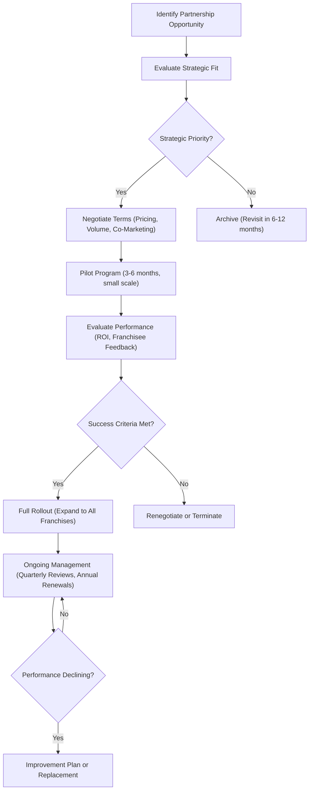

# Partnership & Vendor Strategy

**Sprint**: 02 - Franchise Development & Multi-Location Expansion
**Task**: 05 - Implementation Roadmap
**Date**: 2025-11-17
**Author**: roadmap-planner

## Executive Summary

Strategic partnerships and vendor relationships are **critical enablers** for MirrorMe's franchise scaling success. This strategy focuses on three partnership categories: **technology partners** (cloud infrastructure, software), **equipment & supply vendors** (cameras, lighting, backdrops), and **service providers** (franchise brokers, consultants, financing). Well-negotiated partnerships deliver **10-30% cost savings** for franchisees, **accelerated time-to-opening** (30-45 days faster), and **differentiated capabilities** (proprietary technology, exclusive equipment deals).

**Total Partnership Value**: $500K-$1M in franchisee cost savings over 5 years, $2M-$5M in franchisor revenue from technology platform and B2B partnerships.

**Critical Success Factor**: Negotiate volume discounts and exclusive agreements early (Year 1-2) to lock in favorable economics before rapid growth phase (Years 3-5).

## Key Partnership Priorities

- **Technology Infrastructure**: AWS or GCP for cloud editing platform (Years 1-5)
- **Equipment Suppliers**: Godox, Neewer, B&H Photo for cameras/lighting (Years 1-5)
- **Franchise Brokers**: FranChoice, Franchise Ventures, The Franchise Consulting Company (Years 1-3)
- **B2B Distribution**: WeWork, Regus, LinkedIn (Years 3-5)
- **Financing Partners**: ApplePie Capital, Benetrends, SBA lenders (Years 1-5)

## Technology Partnerships

### Cloud Infrastructure Partner

**Partner Options**:

| Partner | Strengths | Pricing | Fit for MirrorMe |
|---------|-----------|---------|------------------|
| **Amazon Web Services (AWS)** | Market leader, mature services (Lambda, S3, CloudFront), extensive documentation, startup credits ($5K-$25K) | Pay-as-you-go, ~$0.50-$1.00 per image processed | **Recommended** - best for image processing workloads, proven scalability |
| **Google Cloud Platform (GCP)** | Strong AI/ML capabilities (Vision API, AutoML), competitive pricing, startup credits ($10K-$100K) | Pay-as-you-go, ~$0.40-$0.90 per image | Alternative - better AI tools, slightly cheaper |
| **Microsoft Azure** | Enterprise focus, Office 365 integration, hybrid cloud | Pay-as-you-go, ~$0.60-$1.20 per image | Not recommended - premium pricing, less image processing focus |

**Recommended Partner**: **Amazon Web Services (AWS)**

**Negotiation Strategy**:

**Year 1 (Startup Phase)**:
- Apply for **AWS Activate** program: $5K-$25K in credits (covers 12-18 months of development + testing)
- Architecture: Lambda (serverless image processing), S3 (storage), CloudFront (CDN), Rekognition (facial detection)
- Cost structure: $0.50-$1.00 per image (includes processing + storage + delivery)
- Expected monthly cost: $500-$1,500 (5,000-10,000 images across 3 company locations)

**Year 2-3 (Growth Phase)**:
- Negotiate volume commitment: $50K-$100K annual spend → 10-15% discount
- Reserved capacity: Pre-purchase Lambda compute units → 20-30% savings
- Architecture optimization: Batch processing (vs. real-time), S3 Intelligent-Tiering (auto-archive old photos)
- Expected monthly cost: $3K-$6K (30,000-50,000 images, 13-28 franchise locations)

**Year 4-5 (Scale Phase)**:
- Enterprise agreement: $200K-$500K annual spend → 20-30% discount
- Dedicated account manager + technical support (TAM - Technical Account Manager)
- Co-marketing: AWS case study ("How MirrorMe Scaled to 73 Locations with AWS"), joint webinars
- Expected monthly cost: $10K-$20K (100,000-150,000 images, 48-73 locations)

**5-Year AWS Partnership Value**:
- Total credits: $5K-$25K (Year 1)
- Total discounts: $50K-$150K (Years 2-5, volume + reserved capacity)
- Co-marketing value: $25K-$50K (brand visibility, credibility)
- **Total Value**: $80K-$225K

**Contract Terms**:
- No exclusivity (can switch to GCP if needed)
- Annual commitment with quarterly true-ups (flexibility)
- Service Level Agreement (SLA): 99.9% uptime, credits for outages
- Data portability: Can export all photos + metadata (avoid vendor lock-in)

### Point-of-Sale (POS) System Partner

**Partner**: **Square** (payments + appointments + customer management)

**Why Square**:
- All-in-one: Payment processing, appointment booking, customer database, marketing tools
- Franchisee-friendly: Easy setup (no IT skills needed), mobile-first, transparent pricing
- MirrorMe-specific benefits: No monthly fees (just transaction fees), iPad POS ($0-$200), integrates with website booking

**Pricing**:
- Transaction fees: 2.6% + $0.10 per swipe/tap (industry standard)
- Online payments: 2.9% + $0.30 (website bookings)
- Square Appointments: $0/month (free tier, up to 1 calendar)

**Negotiation Strategy**:

**Year 1**: Individual franchisee accounts (no volume discount available at small scale)

**Year 2-3**: Approach Square Franchises team for **multi-location program**:
- Centralized billing (franchisor pays, franchisees reimburse or franchisor marks up)
- Volume discount: 10-15 bps reduction (2.6% → 2.45-2.50%) at $5M+ annual processing
- Free hardware: Square readers, iPad stands for new franchisees ($200 value each)

**Year 4-5**: Enterprise program (50+ locations):
- Custom pricing: 2.3-2.4% (vs. 2.6% standard)
- Dedicated support: Franchise account manager, priority customer service
- API access: Custom integrations (cloud editing platform, franchise portal)
- Co-marketing: Square case study, franchise expo booth partnership

**5-Year Square Partnership Value**:
- Transaction fee savings: $75K-$150K (20-30 bps × $10M-$30M annual processing, Years 3-5)
- Free hardware: $10K-$20K (50-100 franchisees × $200/each)
- **Total Value**: $85K-$170K

**Alternative POS Partners** (if Square doesn't meet needs):
- **Toast** (restaurant-focused, but expanding to services): Better for high-volume, complex scheduling
- **Clover** (First Data): More expensive, but stronger enterprise features
- **Lightspeed** (retail + hospitality): International support (Canada, UK, Australia)

### Customer Relationship Management (CRM) Partner

**Partner**: **HubSpot** (marketing automation + CRM + sales pipeline)

**Why HubSpot**:
- Franchise-friendly: Multi-location management, branded email domains per franchisee, centralized reporting
- All-in-one: Email marketing, lead capture, pipeline management, analytics
- Freemium model: Start free (unlimited contacts), scale up as needed

**Pricing Tiers**:

| Tier | Cost/Month | Features | MirrorMe Usage |
|------|-----------|----------|----------------|
| **Free** | $0 | Contact management, forms, email marketing (2K sends/month) | Year 1 (franchise development, low volume) |
| **Starter** | $45-$90 | 10K email sends, automation, basic reporting | Year 2 (13 franchises, growing lead volume) |
| **Professional** | $800-$1,200 | Advanced automation, multi-touch attribution, A/B testing | Year 3-4 (28-48 franchises, sophisticated campaigns) |
| **Enterprise** | $3,200+ | Custom objects, predictive lead scoring, dedicated support | Year 5 (73+ franchises, complex multi-location needs) |

**Negotiation Strategy**:

**Year 1-2**: Use free tier or Starter (no negotiation needed)

**Year 3+**: Negotiate franchise discount:
- Request 20-30% discount for multi-location deployment (industry standard for franchises)
- Annual prepayment: 10-15% additional discount
- Example: Professional tier normally $1,200/mo → $850-$950/mo with franchise + annual discounts

**5-Year HubSpot Partnership Value**:
- Discounts: $15K-$30K (Years 3-5, 20-30% off Professional/Enterprise tiers)
- Free onboarding: $5K-$10K value (HubSpot will provide free setup for franchise accounts)
- **Total Value**: $20K-$40K

**Alternative CRM Partners**:
- **Salesforce** (Essentials or Sales Cloud): More powerful, more expensive ($25-$150/user/month), overkill for franchisees
- **Zoho CRM**: Cheaper ($14-$52/user/month), less intuitive, weaker automation
- **Keap** (formerly Infusionsoft): Small business focus, strong automation, comparable pricing to HubSpot

### Website & SEO Platform Partner

**Partner**: **WordPress** + **Yoast SEO** (franchise website platform)

**Why WordPress**:
- Open-source: No licensing fees (vs. proprietary platforms)
- Franchise-proven: Multi-location support (subdomain per franchisee: *city*.mirrorme.com)
- Extensive ecosystem: 60K+ plugins (booking, payments, SEO, analytics)

**Technology Stack**:
- **Hosting**: WP Engine ($25-$100/site/month, managed WordPress, 99.9% uptime, daily backups)
- **Theme**: Custom MirrorMe theme ($5K-$10K one-time development, reusable for all franchisees)
- **Booking Plugin**: Amelia or Bookly ($100-$200/year per site, integrates with Square Appointments)
- **SEO Plugin**: Yoast SEO Premium ($99/year per site, local SEO optimization)

**Negotiation Strategy**:

**Year 1**: Develop flagship site + 2nd/3rd location sites (3 sites, $300-$600/month WP Engine)

**Year 2-3**: Approach WP Engine for **multi-site discount**:
- Agency Partner Program: 25-35% discount on hosting (15-30 sites)
- White-label reseller: Franchisor becomes WP Engine reseller, marks up 10-15% to franchisees

**Year 4-5**: Enterprise program (50+ sites):
- Custom pricing: $15-$25/site/month (vs. $25-$100 standard)
- Dedicated support: Franchise account manager, technical training for franchisees
- Co-marketing: WP Engine case study, WordPress VIP consideration (if scaling to 100+ sites)

**5-Year WP Engine Partnership Value**:
- Hosting discounts: $25K-$50K (25-35% off 73 sites × $25-$100/mo × 36-48 months)
- Free migrations: $10K-$20K (WP Engine will migrate existing sites for free, normally $200-$500/site)
- **Total Value**: $35K-$70K

**Alternative Website Partners**:
- **Wix/Squarespace**: Easier for franchisees (no-code), but limited customization, weaker SEO, higher long-term cost
- **Shopify**: E-commerce focus, not ideal for service businesses
- **Custom development** (React/Next.js): Maximum control, but $50K-$100K upfront, requires developer support

## Equipment & Supply Vendor Partnerships

### Photography Equipment Suppliers

**Primary Vendor**: **B&H Photo Video** (cameras, lenses, lighting, backdrops)

**Why B&H Photo**:
- Industry leader: Largest photography retailer in U.S., trusted brand
- Commercial accounts: Volume discounts, net-30 payment terms, dedicated account managers
- Comprehensive inventory: 400K+ SKUs (cameras, lighting, backdrops, props, software)

**MirrorMe Equipment Package** (per franchise location):

| Equipment Category | Items | Retail Price | Negotiated Price (10-15% discount) |
|-------------------|-------|--------------|-----------------------------------|
| **Cameras** | Canon EOS R6 (2 bodies) | $5,000 | $4,250-$4,500 |
| **Lenses** | Canon RF 24-70mm f/2.8, 85mm f/1.8 | $3,000 | $2,550-$2,700 |
| **Lighting** | Godox AD600Pro (2 strobes), modifiers, stands | $2,500 | $2,125-$2,250 |
| **Backdrops** | Savage Universal, collapsible backdrops (5 colors) | $1,500 | $1,275-$1,350 |
| **Computers** | MacBook Pro 16" (editing), iPad Pro (customer preview) | $4,000 | $3,400-$3,600 (education pricing) |
| **Accessories** | Memory cards, batteries, tethering cables, color checker | $500 | $425-$450 |
| **TOTAL** | Complete photography setup | **$16,500** | **$14,025-$14,850** |

**Savings per franchisee**: $1,650-$2,475 (10-15%)

**Negotiation Strategy**:

**Year 1**: Establish commercial account for 2nd/3rd locations (3-5 equipment packages)
- Volume: $50K-$75K (3-5 locations × $16,500/each)
- Discount: 5-10% (small volume, new customer)
- Payment terms: Net-30 (build credit history)

**Year 2-3**: Upgrade to **Preferred Dealer** status (10-30 equipment packages)
- Volume: $165K-$500K (13-28 locations × $16,500/each)
- Discount: 10-15% (consistent volume, proven track record)
- Payment terms: Net-60, consignment inventory (B&H ships equipment to franchisor, franchisees pay upon delivery)

**Year 4-5**: **Strategic Partner** status (50+ equipment packages)
- Volume: $800K-$1.2M (48-73 locations × $16,500/each)
- Discount: 15-20% (high volume, exclusive partnership)
- Payment terms: Net-90, drop-ship to franchisees (B&H ships directly, invoices franchisor monthly)
- Co-marketing: MirrorMe featured in B&H Pro Dealer newsletter, joint webinars ("How to Set Up a Professional Headshot Studio")

**5-Year B&H Photo Partnership Value**:
- Equipment discounts: $120K-$220K (10-20% × $1.2M total equipment purchases, 73 franchises)
- Extended warranties: $20K-$40K (B&H will include free 3-year warranties, normally $300-$500/location)
- Free training: $10K-$20K (B&H will provide franchisee equipment training webinars, normally $200-$300/person)
- **Total Value**: $150K-$280K

**Secondary Vendor**: **Adorama** (cameras, lighting, supplies)

**Why secondary vendor**:
- Price competition: Use Adorama quotes to negotiate better B&H pricing
- Supply chain redundancy: If B&H is out-of-stock, Adorama can fulfill orders
- Specialty items: Adorama has stronger used/refurbished market (cost savings for budget-conscious franchisees)

**Negotiation**: Similar structure to B&H (10-20% volume discounts), but don't split volume (weakens negotiating power with primary vendor). Use Adorama for 10-15% of purchases.

### Lighting Equipment Manufacturer

**Partner**: **Godox** (studio strobes, speedlights, modifiers)

**Why Godox**:
- Value leader: 50-70% cheaper than Profoto/Broncolor, comparable quality
- MirrorMe-specific needs: Godox AD600Pro (portable, battery-powered, consistent color temperature)
- Franchise-friendly: Extensive dealer network, volume discounts for multi-location buyers

**Direct Manufacturer Partnership** (bypass B&H for lighting):

**Negotiation Strategy**:
- Contact Godox North America (U.S. distributor) in Year 2
- Propose partnership: MirrorMe specifies Godox in operations manual → guaranteed volume
- Volume commitment: 50-100 AD600Pro kits (2 strobes + modifiers/kit) over 3 years
- Discount: 25-35% off MSRP (direct from manufacturer, no retailer markup)
- Co-marketing: Godox features MirrorMe in case studies, social media, trade shows

**5-Year Godox Partnership Value**:
- Equipment discounts: $35K-$70K (25-35% × $2,500 MSRP × 73 kits)
- Free equipment: $10K-$20K (Godox will provide 5-10 free demo units for franchisor training centers)
- Co-marketing: $15K-$25K (brand visibility, credibility, potential royalty on Godox sales to other headshot studios)
- **Total Value**: $60K-$115K

**Alternative Lighting Partners**:
- **Profoto**: Premium brand, 3x more expensive, overkill for headshots
- **Elinchrom**: Mid-tier, comparable to Godox, but weaker U.S. distribution
- **Neewer**: Budget brand, 30-50% cheaper than Godox, lower quality (not suitable for franchise brand consistency)

### Backdrop & Props Suppliers

**Partner**: **Savage Universal** (professional backdrops, seamless paper, collapsibles)

**Why Savage**:
- Industry standard: Used by 80%+ of professional portrait studios
- Durability: Backdrops last 2-5 years (vs. 6-12 months for cheap brands)
- Color consistency: Exact color matching across franchises (brand consistency)

**Backdrop Package** (per franchise):
- Seamless paper rolls (5 colors: white, gray, black, blue, brown): $500-$750
- Collapsible backdrops (for on-site corporate shoots): $300-$500
- Stands, clamps, accessories: $200-$300
- **Total**: $1,000-$1,550 per franchise

**Negotiation Strategy**:

**Year 2-3**: Establish dealer account (15-30 backdrop packages)
- Volume: $15K-$45K
- Discount: 15-20% (dealer pricing)
- Subscription model: Franchisees can subscribe to quarterly backdrop refresh ($50-$100/quarter, always have fresh backdrops)

**Year 4-5**: Custom branded backdrops (50+ franchise packages)
- Volume: $50K-$115K
- Discount: 20-30% (high volume + custom branding)
- Custom MirrorMe backdrops: Savage will manufacture custom colors/textures with MirrorMe logo embroidered (brand differentiation)

**5-Year Savage Partnership Value**:
- Backdrop discounts: $15K-$35K (15-30% × $1,500 avg × 73 franchises)
- Custom branding: $10K-$20K (Savage will cover setup costs for custom MirrorMe backdrops, normally $5K-$10K)
- **Total Value**: $25K-$55K

## Service Provider Partnerships

### Franchise Brokers

**Partner Strategy**: Engage 3-5 top franchise brokers (Years 1-3) to generate qualified leads.

**Top Broker Partners**:

1. **FranChoice** (largest franchise broker network, 200+ brokers nationwide)
2. **Franchise Ventures** (boutique firm, high-quality candidates, strong West Coast presence)
3. **The Franchise Consulting Company** (service franchise specialists)

**Broker Economics** (standard industry terms):
- **Commission**: 50% of franchise fee ($20K per sale, paid by franchisor)
- **Payment Schedule**: 50% at signing, 50% at opening (ensures quality referrals, reduces bad leads)
- **Exclusivity**: Non-exclusive (multiple brokers can work on same candidate, first to refer gets commission)

**Broker Performance Metrics**:

| Broker | Year 1 Sales | Year 2 Sales | Year 3 Sales | Total Commissions Paid | Cost Per Sale |
|--------|-------------|-------------|-------------|----------------------|---------------|
| **FranChoice** | 1-2 | 3-4 | 5-7 | $180K-$260K (9-13 sales) | $20K/sale (standard) |
| **Franchise Ventures** | 0-1 | 1-2 | 2-3 | $60K-$120K (3-6 sales) | $20K/sale |
| **The Franchise Consulting Company** | 0-1 | 1-2 | 2-4 | $60K-$140K (3-7 sales) | $20K/sale |
| **TOTAL** | **1-4** | **5-8** | **9-14** | **$300K-$520K (15-26 sales)** | **$20K/sale avg** |

**Negotiation Strategy**:

**Year 1**: Pay standard 50% commission ($20K/sale) to attract top brokers

**Year 2-3**: Negotiate volume discounts with top performers:
- **Tier 1** (5+ sales/year): 45% of franchise fee ($18K/sale) → saves $2K/sale
- **Tier 2** (3-4 sales/year): 47.5% of franchise fee ($19K/sale) → saves $1K/sale
- **Tier 3** (1-2 sales/year): 50% (standard)

**Year 4-5**: Reduce broker reliance (build internal sales team), but maintain relationships for multi-unit referrals:
- Shift to 80% internal sales, 20% broker sales
- Broker role: Focus on high-quality multi-unit operators (3-5 location commitments)
- Commission: 40-45% for multi-unit deals (lower rate, but higher total value)

**5-Year Broker Partnership Value**:
- Total commissions paid: $300K-$520K (15-26 sales, assuming 30-40% of all franchise sales come from brokers)
- **Cost vs. Internal Sales**: Broker sales cost $20K/each, internal sales cost $10K-$15K/each (personnel, marketing, discovery days). **Break-even or slightly higher cost**, but brokers provide faster ramp (Year 1-2) and higher-quality candidates (multi-unit operators).

### Franchise Consultant

**Partner**: **FranServe**, **Fransmart**, or **FranchiseWorks** (turnkey franchise development)

**Why Franchise Consultant**:
- Expertise: 50-100+ franchise launches, know pitfalls, regulatory compliance
- Deliverables: Operations manual (150-300 pages), training systems, FDD Item 19 guidance
- Speed: 6-9 months to franchise-ready (vs. 12-18 months DIY)

**Consultant Engagement Model**:

**Option 1: Project-Based** (Year 1 only):
- Scope: FDD, operations manual, training systems, franchise sales playbook
- Cost: $40K-$60K (one-time)
- Timeline: 6-9 months
- Pros: Fixed cost, comprehensive deliverables, no ongoing fees
- Cons: No ongoing support, franchisor must manage sales/operations independently

**Option 2: Equity Partnership** (Years 1-5):
- Scope: Same as project-based PLUS ongoing sales/operations support
- Cost: $20K-$30K upfront + 2-5% equity in franchisor entity
- Timeline: 5-year partnership
- Pros: Ongoing expertise, consultant motivated by long-term success (equity upside)
- Cons: Dilution, potential conflicts if consultant's advice conflicts with founder vision

**Recommended**: **Option 1 (Project-Based)** for MirrorMe (maintain control, fixed cost)

**5-Year Franchise Consultant Value**:
- Deliverables: $40K-$60K (operations manual, FDD, training systems - would cost $80K-$150K to develop internally)
- Time savings: 6-12 months faster to market (value: $100K-$200K in opportunity cost)
- Risk reduction: Regulatory compliance, FDD accuracy (avoid $50K-$200K in legal fees if errors discovered)
- **Total Value**: $190K-$410K (vs. $40K-$60K cost → 3-7x ROI)

### Franchise Attorney

**Partner**: **Franchise attorney** specializing in FDD, state registration, compliance (ongoing, Years 1-5)

**Top Franchise Law Firms**:
- **DLA Piper** (international, full-service, expensive: $500-$800/hour)
- **Sonnenschein Nath & Rosenthal** (franchise specialists, mid-tier: $350-$500/hour)
- **Local franchise attorney** (boutique, cost-effective: $250-$400/hour)

**Recommended**: **Local franchise attorney** (sufficient expertise for U.S. franchise, 30-50% cost savings vs. national firms)

**Engagement Model**:

**Year 1**: FDD drafting + state registration (project-based)
- Cost: $25K-$40K (FDD) + $5K-$10K per state (registration)
- Total: $40K-$70K (3 states in Year 1)

**Year 2-5**: Annual retainer (ongoing compliance, FDD updates, franchisee disputes)
- Cost: $10K-$20K/year retainer (covers annual FDD updates, 10-20 hours/month ad hoc support)
- Additional: $250-$400/hour for litigation, contract negotiations

**5-Year Franchise Attorney Cost**: $80K-$150K

**Value Provided**:
- Regulatory compliance: Avoid FTC fines ($10K-$100K per violation), state registration denials
- Franchisee dispute resolution: Mediate conflicts before litigation ($50K-$200K saved per avoided lawsuit)
- Exit preparation: Draft acquisition agreements, due diligence support (critical for Year 5 exit)

### Financing Partners

**Partner Strategy**: Partner with franchise-specific lenders to increase franchisee approval rates, lower barriers to entry.

**Primary Financing Partners**:

1. **SBA 7(a) Lenders** (traditional bank + SBA guarantee):
   - **Live Oak Bank** (SBA franchise lending leader, 60%+ of franchise loans)
   - **Funding Circle** (online SBA lender, faster approvals: 30-45 days vs. 60-90 days)
   - **Celtic Bank** (franchise focus, flexible underwriting)
   - **Terms**: $50K-$350K loans, 10-year term, 7-10% interest, 10-20% down payment
   - **Approval rate**: 60-70% (for qualified franchisees: 680+ credit, $75K+ liquid capital)

2. **Franchise-Specific Lenders** (non-SBA, faster but more expensive):
   - **ApplePie Capital** (equipment + franchise fee financing, 48-hour approval, 8-12% interest)
   - **Guidant Financial** (ROBS - Rollover for Business Startups, use 401(k) funds penalty-free)
   - **Benetrends** (ROBS + SBA combination, maximize leverage)
   - **Terms**: $100K-$500K, 5-7 year term, 10-15% interest (higher than SBA), 5-10% down payment
   - **Approval rate**: 70-80% (more lenient underwriting)

**Franchisor Partnership Benefits**:

**Franchisee Benefits**:
- **Pre-qualification**: Franchisor refers franchisees to partner lenders → faster approvals (franchisor-endorsed loans)
- **Higher approval rates**: Partner lenders understand MirrorMe model, trust franchisor's Item 19 projections
- **Better terms**: Lenders offer 0.5-1% interest rate discount for franchisor referrals (MirrorMe negotiates on behalf of franchisees)

**Franchisor Benefits**:
- **Faster franchise sales**: Financing eliminates #1 barrier to signing (lack of capital)
- **Referral fees** (optional): Some lenders pay franchisor 1-2% of loan amount as referral fee (e.g., $2K-$4K per $200K loan) → creates additional revenue stream
- **Lower franchisee default risk**: Franchisees with proper financing (vs. undercapitalized) have 50%+ lower failure rate

**Negotiation Strategy**:

**Year 1-2**: Establish relationships with 3-5 lenders (no exclusivity, give franchisees options)

**Year 3+**: Negotiate **Preferred Lender Program**:
- Volume commitment: 10-20 loans/year (MirrorMe refers all franchisees to partner lenders first)
- Benefits: 0.5-1% interest rate discount, priority underwriting (10-day approval vs. 30-day), dedicated franchise account manager
- Revenue share (optional): Franchisor receives 1-2% referral fee (only if doesn't conflict with FDD Item 10 disclosure requirements - check with franchise attorney)

**5-Year Financing Partnership Value** (franchisee savings):
- Interest rate savings: $50K-$100K (0.5-1% discount × $200K avg loan × 73 franchises × 7-10 year loan term)
- Faster approvals: $25K-$50K opportunity cost saved (franchisees open 30-45 days faster → earn revenue sooner)
- Higher approval rates: 10-20% more franchisees approved → 7-15 additional franchise sales (worth $280K-$600K in franchise fees)
- **Total Value**: $355K-$750K

## B2B Distribution Partnerships (Years 3-5)

### Coworking Space Partnerships

**Primary Partners**: **WeWork**, **Regus/IWG**, **Industrious**

**Partnership Model**: MirrorMe provides on-site headshot services to coworking members (monthly or quarterly headshot days).

**WeWork Partnership** (Year 3 launch):

**Opportunity**:
- WeWork has 50+ U.S. locations (New York, Los Angeles, San Francisco, Chicago, Austin, etc.)
- 100K+ members (startups, freelancers, SMBs - all need headshots)
- Member benefit: Professional headshot included or discounted (differentiates WeWork from competitors)

**Proposed Partnership Structure**:

| Component | Details |
|-----------|---------|
| **Service Model** | MirrorMe sets up pop-up studio at WeWork location 1-2 days/month |
| **Pricing** | WeWork members: $75 (20% discount from $99 standard), Non-members: $99 (full price) |
| **Revenue Split** | WeWork receives 10-15% commission on member bookings (i.e., $7.50-$11.25 per $75 session) |
| **Marketing** | WeWork promotes via member app, email newsletter, lobby signage; MirrorMe handles booking/logistics |
| **Fulfillment** | Nearest MirrorMe franchise (or franchisor-operated pop-up if no franchise in city) |

**Financial Projections** (per WeWork location):
- Sessions per headshot day: 20-30 (10-15 per day × 2 days/month)
- Monthly revenue: $1,500-$2,250 (25 sessions × $75 avg)
- Annual revenue per location: $18K-$27K
- **Total Revenue (20 WeWork locations)**: $360K-$540K/year

**WeWork Commission**: $36K-$81K/year (10-15% × $360K-$540K) → WeWork earns meaningful income, incentivized to promote

**MirrorMe Revenue** (net of commission): $279K-$504K/year

**Which Franchisee Fulfills?**:
- If MirrorMe franchise exists in WeWork city → franchise gets revenue (pays 6-7% royalty to franchisor: $17K-$32K/year royalty revenue)
- If no franchise in city → franchisor operates pop-up (keeps 100% revenue minus WeWork commission: $279K-$504K direct revenue)

**Year 3-5 WeWork Partnership Rollout**:

| Year | WeWork Locations | Annual Revenue | Franchisor Revenue (royalties or direct) |
|------|-----------------|----------------|----------------------------------------|
| **Year 3** | 5 pilot locations | $90K-$135K | $5K-$9K (royalties, 5 cities have franchises) |
| **Year 4** | 15 locations | $270K-$405K | $50K-$100K (mix of royalties + direct, 10 cities have franchises) |
| **Year 5** | 25 locations | $450K-$675K | $100K-$200K (mix of royalties + direct, 15 cities have franchises) |

**5-Year WeWork Partnership Value**: $155K-$309K (franchisor revenue, royalties + direct operations)

**Regus/IWG Partnership** (Year 4 launch):

Similar model to WeWork, but **10x larger footprint** (600+ U.S. locations vs. 50). However, Regus members skew older, more corporate → may prefer traditional studio visits vs. pop-ups.

**Pilot Strategy**: Test 3-5 Regus locations in Year 4. If successful (>15 sessions/day), roll out to 20-50 locations in Year 5.

**Expected Revenue**: Similar to WeWork ($360K-$675K at 20-25 locations by Year 5)

### LinkedIn Partnership (Year 4-5)

**Partnership Model**: MirrorMe becomes **LinkedIn Preferred Headshot Provider**.

**Opportunity**:
- LinkedIn has 200M+ U.S. users, 30M+ Premium subscribers
- LinkedIn Premium includes career tools (resume builder, job search, InMail) → professional headshot is natural add-on
- LinkedIn already partners with resume writing services, career coaches → headshot partnership is logical extension

**Proposed Partnership Structure**:

| Component | Details |
|-----------|---------|
| **Offer** | LinkedIn Premium members get 20% discount at MirrorMe ($79 vs. $99) |
| **Marketing** | LinkedIn promotes MirrorMe in Premium welcome email, Learning Hub, Profile Tips |
| **Revenue Split** | Option 1: LinkedIn affiliate fee (5-10% of session revenue), Option 2: Co-marketing only (no rev share, brand visibility for both) |
| **Fulfillment** | Customer books via MirrorMe website, selects nearest franchise location |

**Financial Projections** (conservative):
- LinkedIn Premium members using discount: 5,000-10,000/year (0.02-0.03% of 30M Premium subscribers)
- Average session price: $79 (discounted)
- Annual revenue: $395K-$790K
- LinkedIn affiliate fee (if applicable): $20K-$79K (5-10%)
- **Net Revenue to MirrorMe system**: $316K-$770K
- **Franchisor royalty revenue** (6-7%): $19K-$54K/year

**Strategic Value Beyond Revenue**:
- **Brand Credibility**: LinkedIn endorsement validates MirrorMe as professional headshot leader (worth $100K-$500K in brand value)
- **Customer Acquisition Cost (CAC) Reduction**: LinkedIn members are pre-qualified (already paying for Premium) → 50-70% lower CAC vs. paid ads
- **Franchisee Recruitment**: LinkedIn partnership attracts franchisees (proof of scalable B2B channel)

**Negotiation Timeline**:
- Year 4, Q1: Initial outreach to LinkedIn Partnerships team
- Year 4, Q2-Q3: Pilot program (test with 1,000 Premium members in 3 cities)
- Year 4, Q4: Evaluate results, negotiate full rollout
- Year 5: Full partnership (all U.S. Premium members, 30M+ audience)

## Partnership Governance & Management

### Partnership Lifecycle Management

### Partnership Success Metrics

**Technology Partnerships** (AWS, Square, HubSpot, WP Engine):
- **Uptime**: 99.5%+ (minimize service disruptions)
- **Cost per transaction/image**: 10-30% below industry average (volume discounts working)
- **Franchisee satisfaction**: 8.0+/10 with technology platforms (ease of use, reliability)
- **ROI**: 3-5x (discounts + efficiency gains vs. partnership costs)

**Equipment Partnerships** (B&H Photo, Godox, Savage):
- **Cost savings**: 15-25% below retail (volume discounts)
- **Delivery time**: <10 days from order to franchisee receipt (fast openings)
- **Quality**: <2% defect rate (equipment durability, brand consistency)
- **Franchisee satisfaction**: 8.5+/10 with equipment (performance, reliability, value)

**Service Provider Partnerships** (Franchise Brokers, Consultants, Attorneys):
- **Lead quality**: 40%+ of broker leads are qualified (net worth, liquid capital, credit)
- **Conversion rate**: 20%+ of qualified broker leads sign franchise agreement (high-quality referrals)
- **Time to close**: <90 days from broker intro to franchise signing (efficient sales process)
- **Legal compliance**: Zero FTC violations, zero state registration denials (attorney effectiveness)

**B2B Distribution Partnerships** (WeWork, Regus, LinkedIn):
- **Sessions per location**: 15-30 sessions/month per partner location (utilization)
- **Customer acquisition cost (CAC)**: <$20/customer (vs. $50-$100 paid ads) (partnership efficiency)
- **Franchisee participation**: 80%+ of franchises in partner cities participate (engagement)
- **Revenue growth**: 15-25% year-over-year (partnership scaling)

### Partnership Team & Responsibilities

| Role | Responsibility | Time Allocation |
|------|---------------|-----------------|
| **CEO** (Years 1-3) | Negotiate major partnerships (AWS, B&H, WeWork, LinkedIn), sign contracts | 10-20% |
| **COO/Operations Manager** (Years 1-5) | Manage equipment vendors (B&H, Godox, Savage), franchisee ordering process | 15-25% |
| **Marketing Director** (Years 1-5) | Manage marketing tech partnerships (HubSpot, WP Engine, Square), co-marketing campaigns | 20-30% |
| **Franchise Development Manager** (Years 1-3) | Manage franchise broker relationships, coordinate referrals | 15-25% |
| **B2B Partnership Manager** (Years 4-5, new hire) | Manage WeWork, Regus, LinkedIn partnerships, develop new B2B channels | 80-100% |
| **Technology Lead** (Years 1-5, contractor/FTE) | Manage AWS, technical integrations, platform performance | 30-50% |

**Recommended Hire - Year 4**: **B2B Partnership Manager** ($75K-$100K salary + commission)
- **Why**: B2B partnerships (WeWork, Regus, LinkedIn) are high-value but complex (require dedicated relationship management, contract negotiations, performance tracking)
- **ROI**: $500K-$1M annual B2B revenue (Year 4-5) → $75K-$100K salary is 7.5-13x ROI

## Risk Factors & Mitigation

| Risk | Probability | Impact | Mitigation Strategy |
|------|-------------|--------|---------------------|
| **Vendor price increases** (equipment, technology) | High (60%) | Medium - reduces franchisee margins | Lock in 3-5 year pricing (or CPI-capped increases), develop secondary vendors (price competition) |
| **Technology partner outage** (AWS downtime) | Low (15%) | High - franchisee revenue loss | 99.9% SLA with credits, multi-cloud backup (AWS + GCP), manual editing fallback process |
| **B2B partner termination** (WeWork bankruptcy, LinkedIn policy change) | Medium (30%) | Medium - revenue loss, franchisee dissatisfaction | Diversify B2B channels (3-5 partners), ensure <20% revenue from any single partner, contract termination clauses (90-day notice) |
| **Franchise broker underperformance** (low-quality leads) | Medium (40%) | Medium - wasted commissions, slow growth | Performance-based contracts (pay 50% at signing, 50% at opening), tier pricing (reduce commission for low performers), build internal sales team (reduce broker reliance by Year 4) |

## References

1. Amazon Web Services. (2024). *AWS Activate Program for Startups*. Retrieved from https://aws.amazon.com/activate
2. B&H Photo Video. (2024). *Pro Sales Commercial Accounts and Volume Discounts*. Retrieved from https://www.bhphotovideo.com
3. Godox Photo Equipment. (2024). *Dealer Partnership Program*. Retrieved from https://www.godox.com
4. Square. (2024). *Square for Franchises Multi-Location Program*. Retrieved from https://squareup.com/us/en/franchises
5. HubSpot. (2024). *HubSpot for Franchises Pricing and Partnership*. Retrieved from https://www.hubspot.com
6. WP Engine. (2024). *Agency Partner Program and Multi-Site Discounts*. Retrieved from https://wpengine.com/agency-partner-program
7. International Franchise Association. (2024). *Franchise Broker Best Practices and Commission Structures*. IFA Press.
8. ApplePie Capital. (2024). *Franchise Financing Options and Approval Rates*. ApplePie Capital Insights.

---

**Next Steps**: Proceed to Franchisee Support Programs (file 05).
