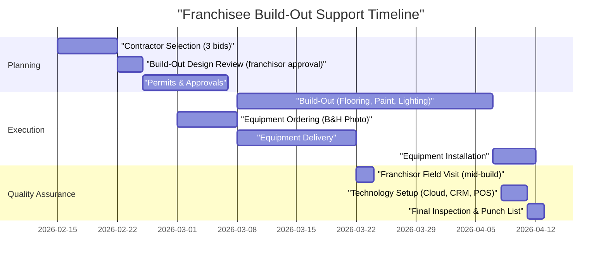
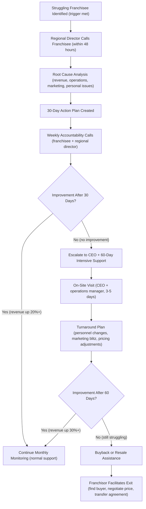

# Franchisee Support Programs

**Sprint**: 02 - Franchise Development & Multi-Location Expansion
**Task**: 05 - Implementation Roadmap
**Date**: 2025-11-17
**Author**: roadmap-planner

## Executive Summary

Comprehensive franchisee support is the **#1 driver of franchise system success** - directly impacting franchisee profitability, satisfaction, retention, and brand reputation. MirrorMe's support strategy encompasses **four lifecycle stages**: **pre-opening** (site selection to grand opening, 12-16 weeks), **opening** (first 90 days, intensive support), **growth** (months 4-24, scaling revenue), and **maturity** (years 2+, optimization and innovation).

**Support Investment**: $50K-$100K annually (Years 1-2) scaling to $400K-$700K annually (Year 5) as franchise count grows to 73+ locations.

**Expected Outcomes**: 95%+ franchisee retention rate, 8.5+/10 satisfaction score, 80%+ of franchises achieving profitability within 12 months.

**Critical Success Factor**: **Proactive support** (anticipate issues before franchisees struggle) vs. reactive support (respond only when problems arise). Proactive support costs 2-3x more but delivers 5-10x ROI in retention and brand reputation.

## Key Support Programs

- **Pre-Opening**: Site selection, build-out, training, grand opening (12-16 weeks)
- **Ongoing**: Monthly calls, quarterly business reviews, annual conference
- **Marketing**: National fund, co-op advertising, local SEO, social media templates
- **Technology**: Cloud editing platform, franchise portal, CRM, help desk
- **Performance Improvement**: Struggling franchisee intervention, best practices sharing

## Pre-Opening Support (Weeks 1-16)

### Site Selection & Real Estate (Weeks 1-6)

**Objective**: Help franchisee secure ideal location (demographics, visibility, rent) within 6 weeks of signing.

**Support Activities**:

| Week | Activity | Franchisor Resources | Deliverables |
|------|----------|---------------------|--------------|
| **Week 1** | Kick-off call (franchisee + CEO + real estate consultant) | 1-hour call, site selection manual (40 pages) | Territory map, demographic targets, site criteria |
| **Weeks 2-3** | Market research (demographics, competition, traffic patterns) | GIS mapping software, competitor analysis | 5-10 potential sites identified |
| **Week 4** | Site tours (franchisee + real estate consultant) | On-site support (1-2 days, travel expenses covered by franchisee) | Site evaluation scorecards (1-10 rating per site) |
| **Week 5** | Site selection (franchisee decision, franchisor approval) | Final approval call, lease review checklist | Top 2 sites selected, lease negotiation begins |
| **Week 6** | Lease negotiation & signing | Lease template review, attorney referral (if needed) | Lease signed (5-year term + 2x 5-year options) |

**Site Selection Criteria** (franchisor-approved):

- **Demographics**: Population 100K+ within 5-mile radius, median household income $60K+, 20K+ LinkedIn users locally
- **Visibility**: Ground-floor retail, street-facing entrance, signage-friendly zoning, 50+ car parking spaces nearby
- **Accessibility**: <5 minutes from major highway, public transit access (bus/train within 0.5 miles)
- **Competition**: No direct competitors (headshot studios) within 3-mile radius, complementary businesses nearby (real estate offices, corporate parks)
- **Rent**: $3K-$5K/month ($36-$60/sq ft annually), 800-1,200 sq ft, 3 months free rent for build-out
- **Lease Terms**: 5-year initial term, 2x 5-year renewal options, rent escalation <3% annually, assignment clause (franchisee can resell)

**Franchisor Rejection Reasons** (quality control):
- Demographics below criteria (too small population, low income)
- Rent above $5K/month (franchisee profitability risk)
- Lease term <5 years (insufficient time to recoup build-out investment)
- No signage rights (limits visibility, marketing effectiveness)

**Success Metrics**:
- 90%+ of franchisees secure lease within 6 weeks
- 95%+ of sites meet all criteria (demographics, rent, visibility)
- <5% of leases require re-negotiation (franchisor catches issues in review)

### Build-Out & Equipment (Weeks 7-14)

**Objective**: Complete build-out and equipment installation on-time and within budget ($60K-$80K).

**Support Activities**:

**Week-by-Week Support**:

| Week | Activity | Franchisor Resources | Cost (Franchisee) |
|------|----------|---------------------|-------------------|
| **Week 7** | Contractor selection | Approved contractor list (10-15 vendors, pre-vetted), RFP template, bid evaluation scorecard | $0 (bids are free) |
| **Week 7** | Build-out design review | Floor plan approval (franchisor architect reviews, provides feedback within 48 hours) | $0 (included in franchise fee) |
| **Week 8** | Permits & approvals | Permit checklist, sample permit applications, local permit expediter referrals | $1K-$3K (permit fees) |
| **Weeks 9-12** | Build-out execution | Weekly Zoom check-ins (20-30 min, review progress photos), troubleshooting (contractor delays, budget overruns) | $40K-$60K (contractor fees) |
| **Week 10** | Franchisor field visit | Operations Manager on-site (2 days, review build-out quality, ensure brand compliance) | $0 (franchisor covers travel) |
| **Week 11** | Equipment ordering | Equipment checklist (cameras, lighting, backdrops, computers), B&H Photo order submission | $16K-$20K (equipment) |
| **Week 13** | Equipment installation | Video tutorial library (20+ videos, equipment setup), tech support hotline (1-hour phone support) | $0 (DIY installation) |
| **Week 14** | Technology setup | Cloud editing onboarding (30-min training), CRM/POS setup (1-hour training), franchise portal access | $0 (included in franchise fee) |
| **Week 14** | Final inspection | Franchisor virtual walkthrough (Zoom/FaceTime), punch list review, grand opening approval | $0 (included in franchise fee) |

**Build-Out Quality Assurance**:
- **Brand Standards**: Franchisee must use approved colors (paint swatches), signage (logo specs), backdrops (Savage Universal exact colors)
- **Photo Documentation**: Franchisee submits progress photos weekly (franchisor reviews for compliance)
- **Mid-Build Inspection**: Franchisor visits at 50% completion (catch issues early, avoid costly rework)
- **Final Approval**: Franchisee cannot open without franchisor approval (ensures brand consistency, customer experience)

**Common Build-Out Issues & Franchisor Solutions**:

| Issue | Probability | Franchisor Support |
|-------|-------------|-------------------|
| **Contractor delays** (30-60 days behind schedule) | High (50%) | Provide backup contractor referrals, negotiate late-completion penalties in contract template, weekly accountability calls |
| **Budget overruns** ($10K-$20K over estimate) | Medium (40%) | Require 3 bids (competitive pricing), review bids before franchisee signs (catch inflated prices), contingency fund guidance (10-15% buffer) |
| **Permit denials** (zoning issues, signage restrictions) | Low (20%) | Pre-screen sites for zoning compliance, provide permit expediter referrals, escalate to city planning office if needed |
| **Equipment damage in shipping** (cameras, lights broken) | Low (15%) | B&H Photo partnership includes insurance, expedited replacement (3-5 days), loaner equipment if critical |

**Success Metrics**:
- 80%+ of build-outs complete on-time (within 60 days)
- 90%+ complete on-budget (within 10% of estimate)
- 100% pass final inspection (brand compliance)

### Training Program (Weeks 15-16)

**Objective**: Certify franchisee + staff on MirrorMe operations, photography, customer service, technology systems.

**Training Structure**: **2 weeks, 80 hours total** (Week 1: HQ classroom, Week 2: on-site hands-on)

**Week 1: Corporate Training (40 hours, at franchisor HQ)**

| Day | Topic | Instructor | Format | Learning Objectives |
|-----|-------|-----------|--------|-------------------|
| **Monday** | MirrorMe Brand & Business Model | CEO | Lecture + Q&A | Understand brand values, customer promise, financial model (revenue drivers, profitability targets) |
| **Monday PM** | Technology Systems (Cloud Editing, Portal, CRM, POS) | Tech Lead | Hands-on lab | Navigate franchise portal, upload/edit photos, manage CRM leads, process Square payments |
| **Tuesday** | Photography Fundamentals (Lighting, Composition, Posing) | Lead Photographer | Studio session | Shoot 20+ headshots (practice lighting setups, posing techniques, camera settings) |
| **Tuesday PM** | Customer Service & Sales | GM (flagship location) | Role-play | Handle customer inquiries, upsell packages (LinkedIn Premium, corporate packages), manage complaints |
| **Wednesday** | Marketing & Local Advertising | Marketing Director | Workshop | Create social media calendar, run Google Ads campaign, optimize Google My Business listing |
| **Wednesday PM** | Financial Management (POS, P&L, Royalty Payments) | CFO | Spreadsheet training | Reconcile daily sales, review P&L, calculate royalty payments, tax compliance |
| **Thursday** | Operations Manual Deep Dive | Operations Manager | Interactive tutorial | Review opening/closing procedures, inventory management, equipment maintenance, safety protocols |
| **Thursday PM** | Franchisee Panel (Q&A with Existing Franchisees) | 2-3 Franchisees | Open discussion | Learn from peers (best practices, common mistakes, local marketing tactics) |
| **Friday** | Certification Exam (Written + Practical) | All Instructors | Testing | 100-question exam (90%+ to pass), hands-on photo shoot evaluation (3+ shots rated 8/10+) |

**Week 2: On-Site Training (40 hours, at franchisee's location)**

| Day | Activity | Franchisor Trainer | Learning Objectives |
|-----|----------|-------------------|-------------------|
| **Monday** | Studio Setup & Equipment Calibration | Operations Manager (on-site) | Set up lighting (consistent color temperature, exposure), calibrate cameras (white balance, focus), test backdrops |
| **Tuesday** | Mock Photo Sessions (Friends/Family as Test Subjects) | Lead Photographer (on-site) | Practice full session workflow (greeting, posing, shooting, editing, delivery), identify bottlenecks |
| **Wednesday** | Soft Opening (Invite Local Businesses for Free Sessions) | Marketing Director (on-site) | Generate buzz, capture testimonials, refine customer experience, troubleshoot issues |
| **Thursday** | Grand Opening Preparation (Marketing Blitz, Final Touches) | Full Franchisor Team (on-site) | Finalize signage, social media posts, press release, event logistics (catering, entertainment, raffle prizes) |
| **Friday** | Grand Opening Day (Ribbon Cutting, Live Sessions, Customer Acquisition) | Full Franchisor Team (on-site) | Execute grand opening event, book 20+ customers, celebrate launch, capture content for case studies |

**Training Materials Provided**:
- **Training Manual** (200 pages, PDF + printed): Week-by-week curriculum, step-by-step procedures, troubleshooting guides
- **Video Library** (50 videos, 3-10 min each): Equipment setup, photography techniques, software tutorials, customer service scripts
- **Certification Tests** (5 modules): Brand knowledge, photography, technology, operations, financials (must pass all 5 with 90%+)
- **Job Aids** (20+ laminated cards): Daily checklists, camera settings cheat sheet, posing guide, customer service scripts

**Training Cost**:
- **Franchisee Cost**: $2K-$3K (travel + lodging for Week 1, Week 2 on-site trainer covered by franchisor)
- **Franchisor Cost**: $5K-$8K (trainer salaries, travel, materials) - **included in franchise fee** (no additional charge to franchisee)

**Certification Requirements**:
- ✅ **Pass written exam** (90%+ score on 100-question test)
- ✅ **Pass practical exam** (shoot 5 headshots rated 8/10+ by lead photographer)
- ✅ **Attend 100% of training** (no absences, full engagement)
- ✅ **Complete pre-opening checklist** (100+ items, signed off by franchisor)

**If Franchisee Fails Certification**:
- Re-training (1 additional week at franchisor HQ, franchisee pays travel)
- Re-test (must pass before opening)
- If fails twice, franchisor can terminate franchise agreement (refund 50% of franchise fee, protects brand quality)

**Success Metrics**:
- 95%+ of franchisees pass certification on first attempt
- 100% of franchisees rate training 8/10+ (satisfaction survey)
- <5% require re-training

### Grand Opening Support (Week 17)

**Objective**: Generate 100+ customers in first 30 days, establish local brand awareness, capture testimonials.

**Grand Opening Timeline**:

| Phase | Timeline | Activities | Franchisor Support |
|-------|----------|-----------|-------------------|
| **Pre-Launch** (Weeks 14-16) | 3 weeks before grand opening | Social media teasers (countdown posts, behind-the-scenes), local PR (press release to newspapers, business journals), partnership outreach (real estate agents, recruiters, consultants) | Provide press release template, social media calendar (30 posts pre-written), partnership email scripts |
| **Soft Opening** (Week 16) | 1 week before grand opening | Invite 20-30 friends, family, local influencers for free sessions (test operations, generate word-of-mouth) | On-site support (marketing director, 1 day), help capture testimonials, photo/video content |
| **Grand Opening Event** (Week 17, Saturday) | 1 day, 10am-6pm | Ribbon cutting ceremony (mayor, chamber of commerce), live music/entertainment, free mini-sessions (5-min headshots, first 50 people), raffle prizes ($500 value) | Full franchisor team on-site (CEO, operations manager, marketing director, photographer, 2-3 days total) |
| **Post-Opening** (Weeks 17-20) | 4 weeks after grand opening | Promotional discount (20% off first 100 customers), referral program launch (refer friend, get $20 credit), email nurture campaign (7 emails over 30 days) | Provide email templates, referral program software (ReferralCandy integration), weekly performance review calls |

**Grand Opening Budget** (franchisee-funded):

| Expense Category | Cost | Expected ROI |
|-----------------|------|-------------|
| **Event Expenses** (catering, entertainment, decorations) | $2K-$3K | 50+ attendees → 20-30 bookings ($2K-$3K revenue) → break-even |
| **Promotional Discounts** (20% off × 100 customers) | $2K-$3K | Revenue loss offset by volume (100 customers vs. 30 without promo) |
| **Paid Advertising** (Facebook/Google ads, 4 weeks) | $2K-$3K | 500-1,000 website visits, 50-100 bookings ($5K-$10K revenue) → 2-3x ROI |
| **Raffle Prizes** (gift cards, tech gadgets, free sessions) | $500-$1K | Capture 100+ email addresses (future marketing), social media buzz |
| **Signage & Collateral** (lawn signs, posters, flyers) | $500-$1K | Drive-by visibility, local awareness (hard to quantify, but critical for foot traffic) |
| **TOTAL GRAND OPENING BUDGET** | **$7K-$11K** | **$7K-$13K revenue in first 30 days** (break-even to +$2K profit) |

**Franchisor On-Site Support** (Grand Opening Week):

| Role | Days On-Site | Activities | Cost (franchisor absorbs) |
|------|-------------|-----------|-------------------------|
| **CEO** | 1 day (grand opening event) | Ribbon cutting, media interviews, customer meet-and-greet | $1K (travel, lodging) |
| **Operations Manager** | 2 days (setup + event) | Final studio setup, troubleshoot equipment, observe first sessions | $1.5K (travel, lodging, salary) |
| **Marketing Director** | 2 days (pre-launch + event) | Social media live-streaming, capture photos/videos, press coordination | $1.5K (travel, lodging, salary) |
| **Lead Photographer** | 1 day (event day) | Assist with high-volume mini-sessions, quality control, train staff on-the-fly | $1K (travel, lodging, salary) |
| **TOTAL FRANCHISOR COST** | **4-6 person-days** | **Comprehensive on-site support** | **$5K-$6K per franchisee grand opening** |

**Grand Opening Success Metrics**:

| Metric | Target | Minimum Acceptable | Stretch Goal |
|--------|--------|-------------------|--------------|
| **Event Attendance** | 50-75 people | 30+ | 100+ |
| **Bookings (First 7 Days)** | 30-50 | 20+ | 75+ |
| **Revenue (First 30 Days)** | $15K-$20K | $10K+ | $25K+ |
| **Google Reviews** | 10-15 (avg 4.5+ stars) | 5+ | 20+ |
| **Social Media Followers** | 200-300 (Instagram + Facebook) | 100+ | 500+ |
| **Email List Growth** | 150-250 subscribers | 100+ | 300+ |

**If Grand Opening Underperforms** (< 20 bookings in first week):
- **Immediate Intervention**: Franchisor extends on-site support (1 additional week), provides $2K-$5K emergency marketing budget (Facebook ads, influencer partnerships)
- **Root Cause Analysis**: Review location (traffic, visibility), marketing execution (ad creative, targeting), operations (customer experience, pricing)
- **Recovery Plan**: 30-day action plan (increase ad spend, partnerships with 10-20 local businesses, social media blitz), weekly accountability calls with CEO

## Ongoing Support (Months 1-24+)

### Monthly Performance Calls (All Franchisees)

**Objective**: Proactive coaching, identify issues early, share best practices.

**Call Structure** (30-45 min, franchisee + assigned regional director):

| Agenda Item | Time | Purpose |
|-------------|------|---------|
| **Wins & Challenges** | 5-10 min | Celebrate successes (high-revenue week, great review), surface problems (slow bookings, equipment failure) |
| **Financial Review** (Revenue, Expenses, Profitability) | 10-15 min | Review P&L, compare to projections, identify variances (higher/lower revenue, unexpected costs) |
| **Marketing Performance** (Website Traffic, Leads, Conversion) | 10-15 min | Review Google Analytics, CRM metrics, ROI by channel (Google Ads, Facebook, referrals) |
| **Operational Issues** (Staffing, Equipment, Technology) | 5-10 min | Troubleshoot problems (staff turnover, camera issues, cloud editing bugs) |
| **Action Items & Next Steps** | 5 min | Assign tasks (franchisee: increase ad spend, franchisor: send equipment replacement), set goals for next month |

**Call Frequency**:
- **Months 1-3 (Opening Phase)**: Weekly calls (franchisee needs intensive support during ramp-up)
- **Months 4-12 (Growth Phase)**: Bi-weekly calls (franchisee is stable but still learning)
- **Months 13+ (Maturity Phase)**: Monthly calls (franchisee is self-sufficient, calls focus on optimization and innovation)

**Regional Director Assignment**:
- **Year 1-2**: CEO handles all calls (5-13 franchisees, manageable)
- **Year 3+**: Regional Directors hired (each manages 15-20 franchisees)
  - **Regional Director - West** (CA, AZ, NV, WA, OR)
  - **Regional Director - South** (TX, FL, GA, NC)
  - **Regional Director - Midwest/East** (IL, NY, MA, OH, MI)

**Success Metrics**:
- 95%+ of franchisees attend monthly calls (high engagement)
- 80%+ of action items completed by next call (accountability)
- Franchisees rate calls 8/10+ useful (satisfaction survey)

### Quarterly Business Reviews (QBRs)

**Objective**: Deep-dive performance analysis, strategic planning, goal-setting.

**QBR Structure** (90-120 min, franchisee + regional director + CEO/COO, quarterly):

| Section | Time | Activities |
|---------|------|-----------|
| **Executive Summary** | 10 min | Review quarterly highlights (revenue growth, profitability, customer satisfaction, challenges) |
| **Financial Deep Dive** | 30 min | Analyze P&L line-by-line (revenue trends, cost variances, cash flow, profitability vs. projections) |
| **Marketing Performance** | 20 min | Review customer acquisition (CAC by channel, conversion rates, LTV), website analytics (traffic sources, bounce rate, booking funnel) |
| **Operational Metrics** | 20 min | Staffing (turnover, productivity), equipment utilization (sessions/day, camera uptime), customer satisfaction (NPS, reviews) |
| **Strategic Planning** | 20 min | Set quarterly goals (revenue targets, marketing initiatives, operational improvements), identify growth opportunities (corporate partnerships, new services) |
| **Action Plan** | 10 min | Document commitments (franchisee: hire additional photographer, franchisor: provide video headshot training), assign deadlines |

**QBR Deliverables**:
- **QBR Report** (10-15 pages): Financial dashboards, marketing analytics, operational benchmarks, action plan
- **Benchmarking**: Compare franchisee's performance to system average (revenue, profitability, customer satisfaction)
- **Best Practices**: Share top-performer tactics (e.g., Franchisee A achieves 50% repeat rate via email nurture campaign → share templates with all franchisees)

**Success Metrics**:
- 90%+ of franchisees complete QBRs on time
- 75%+ of quarterly goals achieved (by next QBR review)
- Franchisees rate QBRs 9/10+ valuable (strategic planning clarity)

### Annual Franchise Conference

**Objective**: Network with peers, learn advanced techniques, celebrate successes, build community.

**Conference Structure** (2 days, Friday-Saturday, centralized location):

**Day 1: Education & Training**

| Time | Session | Format | Speaker |
|------|---------|--------|---------|
| **8:00 AM** | Registration & Breakfast | Networking | N/A |
| **9:00 AM** | Opening Keynote: MirrorMe Vision & Growth Plan | Presentation | CEO |
| **10:00 AM** | Workshop 1: Advanced Photography (Corporate Headshots, LinkedIn Optimization) | Hands-on | Lead Photographer |
| **11:00 AM** | Workshop 2: Social Media Marketing (Instagram Reels, TikTok, Influencer Partnerships) | Interactive | Marketing Director |
| **12:00 PM** | Lunch + Vendor Expo (B&H Photo, Godox, Savage, Square, HubSpot) | Networking | Vendors |
| **1:00 PM** | Workshop 3: Financial Optimization (Reducing COGS, Increasing Profit Margins) | Case Study | CFO + Top Franchisee |
| **2:00 PM** | Workshop 4: Corporate Sales (How to Land 10+ Corporate Clients) | Panel Discussion | 3 Top-Performing Franchisees |
| **3:00 PM** | Franchisee Roundtables (Small Groups by Region/Performance) | Peer Sharing | Self-Facilitated |
| **4:00 PM** | Technology Roadmap (Platform Updates, AI Features, Mobile App) | Demo | Tech Lead |
| **5:00 PM** | Cocktail Reception | Networking | N/A |

**Day 2: Strategy & Community**

| Time | Session | Format | Speaker |
|------|---------|--------|---------|
| **8:00 AM** | Breakfast + Franchisee Awards | Recognition | CEO |
| **9:00 AM** | Keynote: Industry Trends (Future of Professional Headshots, AI Photography) | Presentation | External Expert (e.g., LinkedIn Executive, Photography Industry Leader) |
| **10:00 AM** | Workshop 5: Video Headshots (Record and Edit Introduction Videos) | Hands-on | Video Production Specialist |
| **11:00 AM** | Franchisee Advisory Council Meeting (Elected Representatives + Franchisor Leadership) | Strategic Discussion | CEO, COO, Marketing Director |
| **12:00 PM** | Lunch + Open Forum (Q&A with Franchisor Team) | Interactive | All Franchisor Leadership |
| **1:00 PM** | Breakout Sessions (Choose 1 of 3: Multi-Unit Expansion, International Opportunities, Technology Deep Dive) | Small Group | Regional Directors |
| **2:30 PM** | Closing Keynote: Year Ahead Priorities | Presentation | CEO |
| **3:30 PM** | Conference Wrap-Up & Travel | N/A | N/A |

**Conference Budget** (franchisor-funded):

| Expense Category | Cost | Notes |
|-----------------|------|-------|
| **Venue Rental** (conference center, breakout rooms) | $10K-$15K | 2 days, 100-150 attendees |
| **Catering** (breakfast, lunch, snacks, cocktail reception) | $15K-$25K | $100-$150/person × 2 days |
| **Speakers & External Experts** | $5K-$10K | Keynote speaker fees, travel |
| **Materials** (workbooks, swag, name badges) | $3K-$5K | $30-$50/person |
| **AV & Technology** (projectors, microphones, live streaming) | $5K-$8K | Professional AV setup |
| **TOTAL FRANCHISOR COST** | **$38K-$63K** | **Assumes 50-100 franchisees attending** |

**Franchisee Cost**: $500-$750/person (covers some expenses, builds commitment, offset franchisor costs)

**Conference ROI**:
- **Knowledge Transfer**: 10+ hours of training → franchisees implement 2-3 new tactics → 5-10% revenue increase (worth $15K-$40K/franchisee)
- **Community Building**: Franchisees connect with peers → reduce isolation, increase retention (1-2% retention improvement worth $40K-$80K in avoided closure costs)
- **Brand Loyalty**: Franchisees feel valued, invested in system → 20-30% increase in system-wide innovation (franchisees share ideas, co-develop new services)

**Conference Frequency**:
- **Year 1**: No conference (only 5 franchisees, too small)
- **Year 2**: First annual conference (13 franchisees)
- **Years 3+**: Annual conference (every October, 28-73+ franchisees)

## Marketing Support Programs

### National Marketing Fund (Years 3-5)

**Objective**: Pool franchisee contributions for national marketing campaigns (brand awareness, lead generation).

**Fund Structure**:
- **Contribution**: 1-2% of gross sales (all franchisees contribute equally)
- **Governance**: Marketing advisory board (3 elected franchisees + franchisor marketing director)
- **Use of Funds**: National PR, social media advertising, SEO, content marketing, trade shows

**Year 3 National Marketing Fund**:
- **Contributions**: $85K-$135K (1-2% × $7M-$9M system sales, 28 franchises)
- **Campaigns**:
  - National PR: Press releases (Forbes, Entrepreneur, Inc. feature articles) → $20K-$30K
  - Social Media Ads: Facebook/Instagram/LinkedIn national campaigns → $30K-$50K
  - SEO & Content: Blog posts, video library, guest articles on industry sites → $15K-$25K
  - Trade Shows: HR Tech Conference, SHRM Annual Conference (2-3 events) → $20K-$30K

**Expected ROI**: 50-100 national leads/year (qualified prospects from national campaigns) → 10-20 franchise sales (20% conversion) → $400K-$800K franchise fees (5-10x ROI on marketing fund investment)

### Local Marketing Support (All Years)

**Objective**: Provide franchisees with tools, templates, and guidance for local customer acquisition.

**Marketing Toolkit** (provided to all franchisees):

1. **Website** (city.mirrorme.com subdomain):
   - Custom WordPress site (MirrorMe branded theme)
   - Booking integration (Square Appointments)
   - Local SEO optimization (Google My Business, schema markup, local keywords)
   - **Cost**: $25-$50/month (WP Engine hosting + Yoast SEO)

2. **Social Media Templates**:
   - 365-day content calendar (pre-written captions, image templates, posting schedule)
   - Canva templates (Instagram posts, Facebook ads, LinkedIn articles)
   - Hashtag strategy (local + industry hashtags, 30-50 per platform)
   - **Cost**: $0 (franchisor provides, franchisee executes)

3. **Google Ads & Facebook Ads Templates**:
   - Pre-built campaigns (targeting, ad creative, budget recommendations)
   - Franchisee customizes for local market (ZIP codes, demographics)
   - Performance benchmarks (expected CTR, CPC, conversion rate)
   - **Cost**: $500-$2K/month (franchisee ad spend)

4. **Email Marketing Templates**:
   - Welcome series (5 emails, new subscribers)
   - Nurture campaign (7 emails over 30 days, leads who haven't booked)
   - Referral program (refer friend, get $20 credit)
   - Post-session follow-up (review request, upsell LinkedIn Premium package)
   - **Cost**: $0-$50/month (HubSpot free tier or Starter tier)

5. **Partnership Outreach Scripts**:
   - Email templates for corporate partnerships (real estate agents, recruiters, consultants)
   - LinkedIn cold outreach scripts (personalized, non-spammy)
   - Proposal templates (corporate headshot packages, bulk pricing)
   - **Cost**: $0 (franchisor provides, franchisee executes)

**Marketing Support Calls** (monthly, separate from performance calls):
- **Topic**: Review marketing campaigns (what's working, what's not)
- **Attendees**: Franchisee + marketing director (or regional marketing specialist)
- **Duration**: 30 min
- **Deliverables**: Action plan (adjust ad targeting, try new channel, increase budget)

### Co-Op Advertising Program (Years 2-5)

**Objective**: Franchisor subsidizes local advertising to boost franchisee revenue (shared risk/reward).

**Program Structure**:
- **Franchisee Spend**: $1K-$3K on local marketing campaign (Google Ads, Facebook Ads, direct mail)
- **Franchisor Match**: 25-50% of franchisee spend (up to $500-$1,500 match)
- **Approval Process**: Franchisee submits campaign plan (targeting, creative, budget) → franchisor approves → franchisee executes → franchisor reimburses 25-50%
- **Performance Requirement**: Campaign must generate 3x ROI (revenue vs. cost) for franchisor to reimburse

**Example**:
- Franchisee spends $2K on Facebook Ads (grand opening promotion)
- Campaign generates $8K revenue (100 bookings × $80 avg)
- ROI: 4x ($8K revenue / $2K cost)
- Franchisor reimburses $500-$1K (25-50% match) → Franchisee net cost $1K-$1.5K → Net ROI 5-8x

**Co-Op Budget** (franchisor allocation):
- **Year 2**: $10K-$20K total (13 franchises × $750-$1,500 avg match)
- **Year 3**: $30K-$60K total (28 franchises × $1K-$2K avg match)
- **Year 4**: $60K-$120K total (48 franchises × $1.25K-$2.5K avg match)
- **Year 5**: $100K-$200K total (73 franchises × $1.4K-$2.75K avg match)

**Co-Op ROI** (for franchisor):
- Franchisees spend $3M-$6M total on local marketing (Years 2-5)
- Franchisor subsidizes $200K-$400K (6-13% of franchisee spend)
- Incremental revenue: $15M-$30M system sales (5x ROI on co-op marketing vs. no subsidy)
- Franchisor royalty revenue: $900K-$2.1M (6-7% × $15M-$30M) → **4.5-8x ROI on co-op investment**

## Technology Support Programs

### Cloud Editing Platform Support

**Support Channels**:

1. **Help Desk** (24/7, ticket-based):
   - **Response Time**: <4 hours for critical issues (platform down, photos not uploading), <24 hours for non-critical
   - **Staffing**: 2 FTE tech support specialists (Year 3+), escalate to dev team if needed
   - **Cost**: $150K-$200K/year (2 FTE salaries + ticketing system software)

2. **Video Tutorial Library** (self-service):
   - **Content**: 50+ videos (how to upload, edit, export, troubleshoot common issues)
   - **Platform**: Hosted in franchise portal, searchable, tagged by topic
   - **Updates**: Quarterly (new features, bug fixes, best practices)

3. **Monthly Webinars** (live training):
   - **Topics**: Platform updates, new features, power-user tips, Q&A
   - **Frequency**: Monthly, 45-60 min
   - **Attendance**: 20-40% of franchisees (voluntary, recorded for later viewing)

**Platform Uptime SLA**: 99.5% (max 3.65 hours downtime/month)
- **Monitoring**: 24/7 automated monitoring (AWS CloudWatch, PagerDuty alerts)
- **Incident Response**: <1 hour to diagnose, <4 hours to resolve critical outages
- **Compensation**: If uptime <99.5%, franchisees receive credits (proportional to revenue loss)

### Franchise Portal Support

**Portal Features**:
- **Dashboard**: Revenue tracking, booking calendar, customer metrics, inventory alerts
- **Training Library**: Video tutorials, certification tests, operations manual (searchable PDF)
- **Marketing Tools**: Brand asset library (logos, templates, social media graphics), email campaign templates
- **Support**: Ticketing system, knowledge base, community forum

**Portal Training**:
- **Onboarding**: 1-hour training during initial franchisee training (Week 1)
- **Ongoing**: Monthly webinars (portal updates, new features, best practices)
- **Self-Service**: 100+ knowledge base articles, video tutorials

**Portal Cost** (franchisor absorbs):
- **Development**: $60K-$100K (Year 1, one-time)
- **Hosting**: $500-$1K/month (AWS, grows with franchise count)
- **Maintenance**: $20K-$40K/year (bug fixes, feature updates, security patches)

## Performance Improvement Programs

### Struggling Franchisee Intervention

**Trigger Criteria** (automatic intervention if ANY met):
- Revenue <50% of system average for 2+ consecutive months
- Negative cash flow for 3+ consecutive months
- Customer satisfaction <4.0 stars (Google/Yelp average)
- Late royalty payments (2+ in 6 months)

**Intervention Process**:

**Intervention Tactics**:

| Issue | Root Cause | Franchisor Solution |
|-------|-----------|-------------------|
| **Low Revenue** | Weak marketing, poor location, competition | Provide $2K-$5K emergency marketing budget (Facebook ads, partnerships), on-site marketing consultant (1 week), consider relocation support |
| **Negative Cash Flow** | High costs, overstaffing, poor pricing | Financial audit (line-by-line expense review), staffing optimization (reduce hours, cross-train), pricing increase (10-20%) |
| **Low Customer Satisfaction** | Poor photography, bad customer service, slow delivery | Re-training (send franchisee to flagship location, 1 week), quality control (franchisor reviews all photos for 30 days), hire better staff (recruitment support) |
| **Personal Issues** (franchisee burnout, health, family) | Franchisee overwhelmed, under-resourced | Hire general manager (franchisor subsidizes 50% of salary for 3 months), reduce workload (franchisor handles marketing, allows franchisee to focus on operations) |

**Intervention Success Rate Target**: 60-70% (6-7 out of 10 struggling franchisees recover to profitability within 90 days)

**If Intervention Fails**: Franchisor facilitates graceful exit (buyback franchisee assets at fair value, find new buyer, transfer agreement, protect brand reputation)

### Best Practices Sharing Program

**Objective**: Identify and replicate top-performer tactics across entire franchise system.

**Process**:

1. **Identify Best Practices** (quarterly):
   - Analyze franchisee performance data (revenue, profitability, customer satisfaction, marketing ROI)
   - Identify outliers (top 10-20% performers)
   - Interview top performers (30-60 min, understand what they're doing differently)

2. **Document Best Practices**:
   - **Case Studies** (5-10 pages): "How Franchisee A Achieved 50% Repeat Rate via Email Nurture Campaign"
   - **Playbooks** (10-20 pages): Step-by-step replication guide (email templates, targeting criteria, budget allocation)
   - **Video Tutorials** (10-20 min): Top performer demonstrates tactic (e.g., social media Reels strategy, corporate sales pitch)

3. **Share with All Franchisees**:
   - **Monthly Newsletter**: Feature 1-2 best practices per month (link to full case study/playbook)
   - **Quarterly Webinars**: Top performer presents tactic, Q&A with other franchisees
   - **Annual Conference**: Best practice workshops (hands-on training, break into small groups)

4. **Measure Adoption & Impact**:
   - Track how many franchisees implement best practice (20-40% adoption rate typical)
   - Measure revenue impact (franchisees who adopt see 10-20% revenue increase on average)
   - Iterate (refine playbook based on feedback, create v2.0)

**Best Practice Examples**:

| Best Practice | Originator | Result | Adoption Rate | Impact |
|--------------|-----------|--------|---------------|---------|
| **LinkedIn Cold Outreach Script** | Franchisee #3 (New York) | Landed 12 corporate clients, $45K annual revenue | 30% (10 franchisees) | +$15K avg revenue increase per franchisee |
| **Instagram Reels Strategy** | Franchisee #7 (Los Angeles) | 5,000 followers in 6 months, 20% of bookings from Instagram | 40% (15 franchisees) | +10K followers avg, +$8K revenue increase |
| **Referral Program (Refer Friend, Get $20)** | Franchisee #5 (Chicago) | 35% of customers refer someone, 50% repeat rate | 60% (25 franchisees) | +$12K avg revenue increase per franchisee |

**Best Practices ROI** (system-wide):
- Franchisor invests $20K-$40K/year (time to document, produce videos, facilitate sharing)
- Franchisees implement 3-5 best practices/year on average
- Revenue increase: $30K-$60K per franchisee (10-15% lift)
- **System-wide revenue increase**: $2M-$4M (73 franchises × $30K-$60K) → **50-100x ROI on best practices program**

## Support Team Scaling

### Organizational Structure by Year

**Year 1-2** (5-13 franchises):
- CEO (franchise sales + franchisee support, 50% time)
- Operations Manager (openings + field visits, 50% time)
- Marketing Director (campaigns + grand openings, 30% time)
- **Total Support FTEs**: 1.3

**Year 3** (28 franchises):
- Regional Director - West (15 franchises)
- Regional Director - South (13 franchises)
- Franchise Training Manager
- Technology Support Specialist
- **Total Support FTEs**: 4.5 (plus Year 1-2 team)

**Year 4** (48 franchises):
- Regional Director - Midwest/East (15 franchises, new hire)
- B2B Partnership Manager (new hire)
- Franchise Compliance Manager (new hire)
- Customer Success Manager (franchisee onboarding + retention, new hire)
- **Total Support FTEs**: 8.5

**Year 5** (73 franchises):
- VP of Franchise Development (oversees all support, new hire)
- International Development Manager (master franchises, new hire)
- Data Analyst (franchisee performance metrics, new hire)
- Additional Regional Directors (1-2 FTEs as needed)
- **Total Support FTEs**: 12-15

**Support Cost Scaling**:

| Year | Franchises | Support FTEs | Annual Support Cost | Cost Per Franchise |
|------|-----------|-------------|-------------------|-------------------|
| **Year 1** | 5 | 1.3 | $100K-$150K | $20K-$30K |
| **Year 2** | 13 | 2.5 | $200K-$300K | $15K-$23K |
| **Year 3** | 28 | 6 | $450K-$600K | $16K-$21K |
| **Year 4** | 48 | 10 | $750K-$1.0M | $16K-$21K |
| **Year 5** | 73 | 14 | $1.1M-$1.5M | $15K-$21K |

**Key Insight**: Cost per franchise **decreases** as system scales (economies of scale in support team, technology automation).

## Success Metrics - Support Program Scorecard

| Metric | Year 1 Target | Year 3 Target | Year 5 Target |
|--------|--------------|--------------|--------------|
| **Franchisee Retention Rate** | 90%+ | 95%+ | 97%+ |
| **Franchisee Satisfaction Score** | 7.5/10 | 8.5/10 | 9.0/10 |
| **% Franchises Profitable (Month 12)** | 70%+ | 80%+ | 85%+ |
| **Avg Franchisee Revenue (Year 1)** | $300K-$350K | $350K-$400K | $400K-$450K |
| **Support Call Attendance** | 85%+ | 90%+ | 95%+ |
| **QBR Completion Rate** | 80%+ | 90%+ | 95%+ |
| **Conference Attendance** | N/A (no conf) | 75%+ | 85%+ |
| **Technology Platform Uptime** | 99%+ | 99.5%+ | 99.9%+ |
| **Help Desk Response Time** | <24 hours | <12 hours | <4 hours |
| **Best Practice Adoption Rate** | 20%+ | 30%+ | 40%+ |

## References

1. International Franchise Association. (2024). *Franchisee Support Best Practices*. IFA Press.
2. Franchise Update Media. (2024). *Pre-Opening Support Playbook for New Franchisors*. Retrieved from https://www.franchiseupdatemedia.com
3. Entrepreneur. (2024). *How Top Franchisors Support Struggling Franchisees*. Entrepreneur Media.
4. FRANdata. (2024). *Franchisee Retention Strategies and ROI*. FRANdata Insights.
5. Franchise Times. (2024). *Annual Franchise Conferences: Structure and Value Creation*. Franchise Times Publishing.
6. Harvard Business Review. (2024). *The Economics of Franchise Support Systems*. HBR Article.
7. Zendesk. (2024). *Multi-Location Customer Support Scaling Guide*. Zendesk Resources.
8. HubSpot. (2024). *Franchise Marketing Fund Management and Governance*. HubSpot Academy.

---

**Next Steps**: Proceed to Risk Mitigation & Contingency Planning (file 06).
