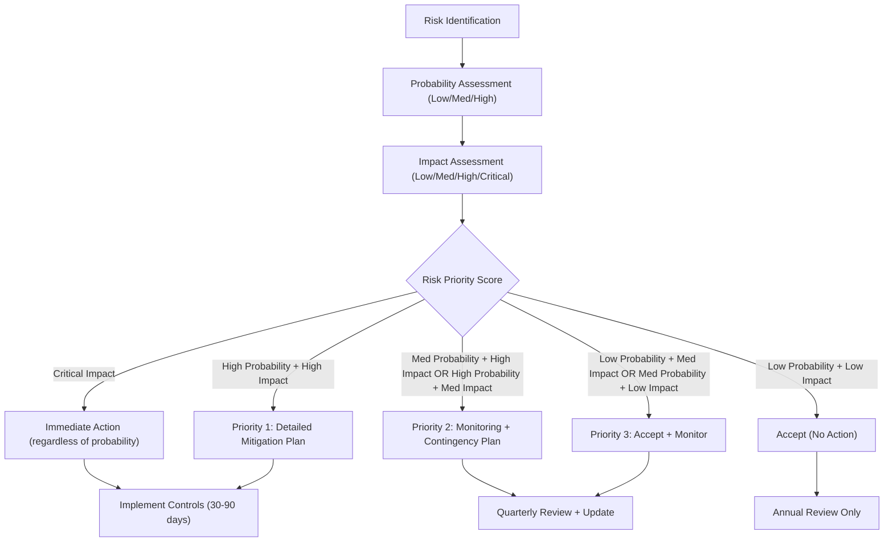

# Risk Mitigation & Contingency Planning

**Sprint**: 02 - Franchise Development & Multi-Location Expansion
**Task**: 05 - Implementation Roadmap
**Date**: 2025-11-17
**Author**: roadmap-planner

## Executive Summary

Franchise expansion involves **substantial operational, financial, legal, and market risks** that can derail growth or destroy brand value if not proactively managed. This comprehensive risk mitigation strategy addresses **18 critical risk categories** across five domains: **market risks**, **operational risks**, **legal/regulatory risks**, **financial risks**, and **strategic risks**.

**Risk Management Investment**: $75K-$150K annually (insurance premiums, legal reserves, contingency funds) - **0.5-1.5% of total franchisor revenue** (industry best practice: 1-2%).

**Expected Outcomes**: **Zero catastrophic failures** (FTC enforcement, mass franchisee closures, litigation >$500K), **<5% franchisee failure rate** (vs. 10-15% industry average), **<2% legal/compliance incidents** (FDD errors, regulatory violations).

**Critical Success Factor**: **Proactive risk management culture** - identify, assess, and mitigate risks continuously rather than reacting to crises. Quarterly risk reviews with leadership team, annual third-party audits (FDD compliance, operations, financials).

## Risk Assessment Framework

### Risk Probability & Impact Matrix

### Risk Categories & Prioritization

| Risk Category | Probability | Impact | Priority | Mitigation Investment |
|--------------|-------------|--------|----------|---------------------|
| **FDD/Legal Compliance Errors** | Medium (30%) | **Critical** | **P0** | $30K-$50K/year (attorney retainer, audits) |
| **First Franchisee Opening Failure** | Medium (30%) | **Critical** | **P0** | $20K-$40K (extra support, emergency marketing) |
| **Technology Platform Failure** | Low (15%) | **Critical** | **P0** | $25K-$50K/year (AWS SLA, redundancy, insurance) |
| **Franchisee Quality Degradation** | High (60%) | High | **P1** | $15K-$25K/year (screening, training, QA) |
| **Economic Downturn** | Medium (35%) | High | **P1** | $10K-$20K (diversification, reserves) |
| **Competitor Undercutting** | Medium (40%) | Medium | **P2** | $5K-$10K (differentiation, value props) |
| **Key Employee Turnover** | Medium (40%) | Medium | **P2** | $10K-$20K (retention, succession planning) |
| **Supply Chain Disruption** | Low (20%) | Medium | **P2** | $5K-$10K (multi-sourcing, inventory) |
| **Brand Reputation Damage** | Low (10%) | High | **P2** | $10K-$20K (PR, crisis management, insurance) |
| **Other Risks** (18 total) | Varies | Varies | P2-P3 | $10K-$30K (aggregate) |

**Total Annual Risk Mitigation Budget**: **$140K-$265K** (1.5-3.5% of Year 5 franchisor revenue)

## Market Risks

### Risk 1: Economic Downturn / Recession

**Scenario**: U.S. enters recession (GDP contraction 2+ consecutive quarters, unemployment 6-8%, consumer confidence <70).

**Impact on MirrorMe**:
- Corporate headshot demand declines 30-50% (companies freeze hiring, reduce professional development budgets)
- Franchise sales slow 40-60% (fewer entrepreneurs willing to invest $150K-$200K)
- Existing franchisees struggle (revenue down 20-40%, 10-20% at risk of closure)
- Franchisor revenue declines 25-45% (royalties + franchise fees)

**Probability**: Medium (35%) - U.S. recession every 7-10 years on average, currently in expansion cycle (2024-2027 likely safe, 2028-2030 risk increases)

**Mitigation Strategy**:

**Defensive Tactics** (pre-recession):
1. **Build Cash Reserves**: Maintain 6-12 months operating expenses in cash (Year 3: $500K-$1M, Year 5: $1M-$2M)
2. **Diversify Revenue Streams**: Reduce reliance on corporate clients (B2C consumer headshots, LinkedIn job seekers, family portraits add recession-resistant revenue)
3. **Strengthen Franchisee Financials**: Ensure franchisees have 3-6 months reserves (loan covenants, financial coaching)
4. **Lock in Long-Term Contracts**: B2B partnerships with WeWork, Regus (3-5 year agreements) provide recurring revenue stability

**Offensive Tactics** (during recession):
1. **"Career Transition" Marketing**: Target laid-off workers needing LinkedIn headshots for job search (empathy messaging, discounts)
2. **Franchise Fee Discounts**: Reduce franchise fee 20-30% ($28K-$32K vs. $40K) to maintain sales velocity (better to sell at discount than not sell at all)
3. **Royalty Relief**: Offer 3-6 month royalty deferral (0% royalty) for struggling franchisees (keeps locations open, preserves brand presence)
4. **Cost Reductions**: Freeze hiring, reduce marketing spend 30-40%, defer non-critical technology projects

**Recovery Tactics** (post-recession):
1. **Aggressive Expansion**: Acquire distressed competitors (headshot studios closing due to recession, buy for pennies on dollar)
2. **Hire Top Talent**: Recruit experienced franchise executives (laid off from competitors, willing to work for equity)
3. **Increase Marketing**: Double down on advertising when competitors retreat (gain market share, emerge stronger)

**Contingency Budget**: $50K-$100K (emergency franchisee support fund, discounted franchise fees, extended royalty deferrals)

**Success Metric**: Maintain 90%+ franchisee retention through recession (vs. 70-80% industry average)

### Risk 2: Life Four Cuts Competition (Aggressive Pricing, Market Saturation)

**Scenario**: Life Four Cuts (South Korean headshot chain, 300+ locations in Asia) enters U.S. market with aggressive pricing ($50-$70 vs. MirrorMe's $99).

**Impact on MirrorMe**:
- Price pressure (MirrorMe must reduce prices 10-20% to remain competitive → margin compression)
- Market share loss (Life Four Cuts targets same customers: corporate professionals, LinkedIn users)
- Franchisee anxiety (fear of being undercut, request franchisor support or threaten to leave system)

**Probability**: Medium (40%) - Life Four Cuts already operates in 10+ countries, U.S. expansion likely by 2027-2029

**Mitigation Strategy**:

**Differentiation** (compete on value, not price):
1. **Premium Positioning**: MirrorMe = "Professional headshots by certified photographers" vs. Life Four Cuts = "Fast, cheap headshots by technicians"
2. **Service Quality**: MirrorMe sessions include posing coaching, outfit advice, 10-15 min personalized attention (vs. Life Four Cuts 5-min conveyor belt)
3. **Technology Superiority**: MirrorMe cloud editing (AI background replacement, facial retouching) vs. Life Four Cuts basic edits
4. **Corporate Partnerships**: MirrorMe embedded in WeWork, Regus, LinkedIn (Life Four Cuts lacks B2B distribution)

**Competitive Response** (if Life Four Cuts enters key markets):
1. **Pricing Tiers**: Introduce "Express" tier ($69, 5-min session, basic edit) to compete on price while maintaining "Premium" tier ($99, standard service)
2. **Bundled Packages**: Offer discounts for multi-person bookings (corporate teams, families) → higher AOV, harder for Life Four Cuts to match
3. **Loyalty Program**: Repeat customers get 20% off (increase switching costs, Life Four Cuts can't match without data on repeat customers)

**Market Selection** (avoid head-to-head competition):
1. **Target Tier 2/3 Cities First**: Life Four Cuts likely enters Tier 1 cities (NYC, LA, SF) first → MirrorMe focuses on Tier 2/3 (Austin, Charlotte, Denver) where Life Four Cuts has no presence
2. **Geographic Density**: Build 5-10 MirrorMe locations in metro area before Life Four Cuts enters (brand awareness, customer loyalty acts as barrier)

**Contingency Budget**: $25K-$50K (competitive intelligence, pricing studies, emergency ad campaigns if Life Four Cuts enters key market)

**Success Metric**: Maintain 90%+ franchisee revenue (max 10% decline if Life Four Cuts enters market)

### Risk 3: AI-Generated Headshots Disrupt Market

**Scenario**: AI tools (e.g., ProfilePicture.ai, Secta Labs, PhotoAI) improve quality to near-professional level, cost drops to $10-$20/headshot.

**Impact on MirrorMe**:
- Demand decline for low-end headshots (consumers use AI instead of paying $99 for in-person session)
- Revenue shift to high-end services (only customers willing to pay for in-person experience remain)
- Market size shrinks 20-40% (TAM declines from $2B to $1.2B-$1.6B)

**Probability**: High (70%) - AI headshot tools already exist and improving rapidly (GPT-4 Vision, Midjourney, Stable Diffusion)

**Mitigation Strategy**:

**Embrace AI** (integrate, don't compete):
1. **MirrorMe AI Tool**: Offer own AI headshot generator ($20-$30, upload 10 selfies → receive 50+ AI headshots) as entry-level product (upsell to in-person session for best results)
2. **Hybrid Model**: In-person session includes both professional photos AND AI-generated variations (100+ headshots vs. 20-30 traditional) → higher perceived value
3. **AI for Editing**: Use AI to speed up editing (reduce cost per image $2 → $0.50) → pass savings to franchisees (higher margins) or customers (lower prices)

**Differentiate on Experience** (what AI can't replicate):
1. **Personalized Coaching**: MirrorMe photographers provide posing, outfit, expression advice (AI can't replicate human interaction)
2. **Confidence Boost**: In-person session builds customer confidence (especially for introverts, camera-shy individuals) → emotional value beyond pixels
3. **Corporate Necessity**: Many companies require professional headshots for compliance, branding (AI headshots may not meet corporate standards)

**Market Segmentation** (focus on AI-resistant customers):
1. **Corporate Executives**: C-suite, senior leaders willing to pay premium for best quality (AI not good enough yet)
2. **Regulated Industries**: Law, finance, healthcare require authentic photos (AI-generated may violate ethics rules)
3. **Personal Branding**: Influencers, entrepreneurs, consultants who differentiate on quality (AI headshots signal "cheap")

**Contingency Budget**: $50K-$100K (AI tool development, market research, repositioning campaigns)

**Success Metric**: Maintain 80%+ of revenue despite AI competition (max 20% decline, offset by AI tool sales + hybrid model upsells)

## Operational Risks

### Risk 4: First Franchisee Opening Failure

**Scenario**: First franchisee (Month 17) achieves only 30-40% of projected revenue (<$10K/month vs. $25K-$30K target), negative reviews (3.0 stars), franchisee threatens to sue for misrepresentation.

**Impact on MirrorMe**:
- **Catastrophic** for franchise sales (no proof of concept, future prospects walk away)
- Legal liability (franchisee claims FDD Item 19 projections were false, seeks refund of franchise fee + damages)
- Brand reputation damage (negative press, social media complaints, regulatory scrutiny)

**Probability**: Medium (30%) - common failure mode for new franchisors (first franchisee often struggles due to inexperience, market differences)

**Mitigation Strategy**:

**Pre-Opening Risk Reduction**:
1. **Cherry-Pick First Franchisee**: Select ideal candidate (high net worth, prior business experience, located in proven market) → avoid risky first franchise
2. **Over-Invest in Support**: Provide 3x normal support (daily calls, on-site visits 2x/month, unlimited tech support) for first 6 months
3. **Guarantee Initial Revenue**: Franchisor commits to subsidize shortfall (e.g., if revenue <$20K/month, franchisor pays difference up to $5K/month × 3 months) → de-risks franchisee, shows confidence

**During-Opening Intensive Support**:
1. **Full Franchisor Team On-Site**: CEO + operations manager + marketing director + photographer present for grand opening (3-5 days)
2. **Emergency Marketing Budget**: Allocate $10K-$20K for extra advertising (Facebook, Google, partnerships) if initial bookings <50 in first week
3. **Daily Performance Reviews**: Review bookings, customer feedback, operational issues every day for first 30 days (catch problems immediately)

**Post-Opening Performance Management**:
1. **60-Day Checkpoint**: If revenue still <60% of target at Day 60, escalate to CEO (on-site visit, turnaround plan, consider relocation or buyback)
2. **Customer Satisfaction Focus**: Obsess over reviews (aim for 10+ Google reviews averaging 4.8+ stars in first 60 days) → positive reviews attract new customers, offset slow start
3. **Peer Testimonials**: If first franchisee succeeds, capture video testimonials, case studies (use in sales process for franchisees #2-10)

**Legal Protection**:
1. **Conservative Item 19 Projections**: Under-promise in FDD (use 80% of flagship performance as basis, not 100%) → easier to exceed expectations
2. **Disclaimers**: Include language in FDD and franchise agreement: "Results vary, success depends on franchisee effort, market conditions, no guarantee of profitability"
3. **Mediation Clause**: Require mediation before litigation (90%+ of disputes resolved in mediation, avoids costly lawsuits)

**Contingency Budget**: $50K-$100K (subsidies, emergency marketing, legal defense if franchisee sues)

**Success Metric**: First franchisee achieves 70%+ of projected revenue by Month 6, 4.5+ star average rating, zero legal disputes

### Risk 5: Franchisee Quality Degradation (Scale Too Fast, Poor Screening)

**Scenario**: Years 3-5, MirrorMe sells 15-25 franchises/year → screening process weakens (pressure to hit sales targets) → 20-30% of franchisees underqualified (insufficient capital, weak work ethic, poor judgment).

**Impact on MirrorMe**:
- Franchisee failures increase from <5% to 15-20% (3-5 closures/year vs. 1-2)
- Brand reputation damage (negative reviews from closed locations, unhappy customers)
- Franchisor profitability declines (support costs rise for struggling franchisees, royalty revenue loss from closures)

**Probability**: High (60%) - extremely common failure mode for franchisors (growth targets override quality standards)

**Mitigation Strategy**:

**Non-Negotiable Qualification Criteria** (enforce rigorously):
1. **Financial**: Net worth $300K+, liquid capital $75K+, credit score 680+ (no exceptions, even if sales slow)
2. **Experience**: 3+ years management or entrepreneurship (preferred), retail/service industry experience (required)
3. **Work Ethic**: Willing to work 50-60 hours/week for first 12 months (no "passive investor" franchisees)
4. **Cultural Fit**: Aligns with MirrorMe values (customer obsession, quality over quantity, continuous improvement)

**Screening Process Rigor**:
1. **Multi-Stage Interviews**: 3-4 calls (initial qualification, deep-dive financial/experience, discovery day, final CEO interview)
2. **Background Checks**: Criminal, credit, reference checks (call 3-5 references, verify employment history)
3. **Psychological Assessment**: Use franchisee assessment tool (e.g., Franchise Grade, Entrepreneur's Source) to evaluate personality fit, risk tolerance, coachability

**Sales Team Incentives** (quality over quantity):
1. **Bonus Structure**: Pay sales team based on franchisee performance, not just sales (e.g., 50% of bonus at signing, 50% when franchisee reaches profitability)
2. **Clawbacks**: If franchisee closes within 24 months, sales team must return portion of commission (30-50%) → incentivizes quality referrals
3. **Scorecards**: Track franchisee success metrics by sales rep (failure rate, revenue performance, satisfaction) → hold reps accountable

**Annual Screening Audits**:
1. **Third-Party Review**: Hire franchise consultant to audit screening process annually (review rejected vs. accepted candidates, identify weaknesses)
2. **Franchisee Retrospective**: Interview closed/struggling franchisees (understand why they failed, improve screening criteria)

**Contingency Budget**: $20K-$40K/year (screening tools, background checks, consultant audits)

**Success Metric**: Maintain <5% franchisee failure rate (vs. 10-15% industry average), 90%+ of franchisees meet financial qualification criteria

### Risk 6: Technology Platform Failure (Extended Outage, Data Breach)

**Scenario**: AWS outage lasts 24-48 hours → cloud editing platform offline → franchisees can't deliver photos → hundreds of customers demand refunds → $50K-$200K revenue loss + brand damage.

**Impact on MirrorMe**:
- Revenue loss (franchisees lose $50K-$200K system-wide, franchisor loses $3K-$14K in royalties)
- Customer refunds (franchisees must refund sessions, absorb loss)
- Brand reputation damage (negative reviews, social media complaints, press coverage if major)
- Franchisee dissatisfaction (blame franchisor for platform failure, threaten to leave system)

**Probability**: Low (15%) - AWS has 99.9%+ uptime, but occasional major outages (2-3 per year, typically <6 hours)

**Mitigation Strategy**:

**Technical Redundancy**:
1. **Multi-Region Architecture**: Deploy cloud editing in 2+ AWS regions (US-East, US-West) → if one region fails, traffic auto-routes to other
2. **Database Backups**: Real-time replication to secondary database (RDS Multi-AZ) + daily backups to S3 Glacier (recover within 4 hours if database corrupts)
3. **CDN Failover**: Use CloudFront with multiple origins → if primary S3 bucket fails, serve from backup bucket

**Manual Editing Fallback**:
1. **Local Editing Option**: Franchisees can download photos and edit locally (Adobe Lightroom, Capture One) if cloud platform offline
2. **Pre-Downloaded Presets**: Provide Lightroom presets that match cloud editing style (franchisees can replicate look manually)
3. **Extended Delivery SLA**: Communicate to customers (e.g., "Delivery within 24 hours, 48 hours during platform maintenance") → set expectations, avoid refunds

**Financial Protection**:
1. **AWS Service Credits**: If AWS causes outage, claim service credits (pro-rated refund based on downtime) → offset revenue loss
2. **Business Interruption Insurance**: Cyber insurance policy covers revenue loss from technology failures ($1M-$3M policy, $5K-$10K annual premium)
3. **Franchisee Revenue Protection**: Franchisor waives royalties for days platform is offline (e.g., if 48-hour outage, waive 2 days royalties system-wide → $3K-$8K franchisor loss)

**Incident Response Plan**:
1. **Communication Protocol**: Within 1 hour of outage, email/text all franchisees (status update, ETA for fix, manual editing instructions)
2. **Customer Service Script**: Provide franchisees with customer communication template (apologize, explain situation, offer discount on next session)
3. **Post-Mortem**: After incident, conduct root cause analysis (document what happened, how to prevent, share with franchisees)

**Contingency Budget**: $10K-$20K/year (business interruption insurance, redundant infrastructure costs)

**Success Metric**: 99.5%+ platform uptime (max 3.65 hours downtime/month), <1% revenue loss from technology failures annually

### Risk 7: Key Employee Turnover (CEO, Regional Directors, Tech Lead)

**Scenario**: CEO departs (Year 4) to pursue other opportunity → operations disrupted (franchise sales slow, franchisee support degrades, strategic initiatives stall) → 6-12 months to replace and ramp new CEO.

**Impact on MirrorMe**:
- Leadership vacuum (no clear decision-maker, team lacks direction)
- Franchise sales decline 40-60% (CEO typically leads sales process, closes deals)
- Franchisee anxiety (fear of instability, some consider leaving system)
- Delayed growth (can't execute Year 4-5 plans without strong leadership)

**Probability**: Medium (40%) - startups/franchisors have 30-50% annual employee turnover, C-suite turnover 15-25%

**Mitigation Strategy**:

**Retention Incentives** (keep key employees):
1. **Equity Compensation**: Grant CEO, regional directors, tech lead 2-5% equity each (vesting over 4-5 years) → incentivizes staying through exit
2. **Performance Bonuses**: Quarterly bonuses tied to franchisee performance (revenue growth, satisfaction, retention) → 20-30% of base salary
3. **Professional Development**: Fund conferences, executive coaching, MBA programs → invest in employee growth, increase loyalty
4. **Work-Life Balance**: Flexible schedules, remote work options, generous PTO (4-6 weeks) → reduce burnout

**Succession Planning** (prepare for turnover):
1. **Documented Processes**: Every key role has SOP manual (step-by-step procedures, decision frameworks, vendor contacts) → new hire can ramp in 30-60 days vs. 6-12 months
2. **Cross-Training**: Regional directors shadow each other (learn different markets, share best practices) → any RD can step into another's role if needed
3. **Second-in-Command**: Designate VP of Franchise Development (Year 4 hire) as CEO successor → if CEO leaves, VP steps up (interim or permanent)

**Rapid Replacement** (if key employee departs):
1. **Executive Recruiter**: Retain recruiter on standby (monthly retainer $2K-$5K) → can activate search within 48 hours of resignation
2. **Interim Leadership**: CEO stays on as advisor (3-6 months, part-time) during transition → knowledge transfer to new CEO, reassure franchisees
3. **Franchisee Communication**: Proactively communicate to franchisees (CEO departure, interim plan, new CEO search timeline) → transparency builds trust

**Contingency Budget**: $50K-$100K (equity grants, retention bonuses, executive recruiter fees, interim consulting)

**Success Metric**: <10% annual turnover for key roles (CEO, regional directors, tech lead), <90 days to replace departing key employee

## Legal & Regulatory Risks

### Risk 8: FDD Errors (Item 19 Misrepresentation, Item 7 Underestimation)

**Scenario**: FDD Item 19 (financial performance representations) overstates average franchisee revenue ($400K vs. actual $300K) → franchisees sue for fraud → FTC investigation → $50K-$500K fines + legal fees.

**Impact on MirrorMe**:
- **Catastrophic** legal liability (FTC penalties, franchisee lawsuits, class action risk)
- Brand reputation destroyed (regulatory enforcement makes national news, scares off prospects)
- Franchise system shutdown (FTC can ban franchisor from selling franchises until violations corrected)

**Probability**: Medium (30%) - 20-30% of new franchisors make FDD errors (Item 19 is highest-risk item)

**Mitigation Strategy**:

**Conservative Item 19 Projections** (under-promise):
1. **Use Bottom Quartile**: Base projections on bottom 25% performers (not average or top performers) → easier to exceed expectations
2. **Exclude Outliers**: Remove top 10% performers from Item 19 (they skew average upward, most franchisees won't replicate)
3. **Include All Costs**: Disclose full investment (equipment, working capital, marketing, fees) → avoid "hidden costs" claims
4. **Annual Updates**: Update Item 19 every year with actual franchisee data (not projections) → show real results, good or bad

**Legal Review Rigor**:
1. **Experienced Franchise Attorney**: Hire attorney with 10+ years FDD experience (not general business lawyer) → $30K-$50K for initial FDD, $10K-$20K annual updates
2. **CPA Involvement**: Have CPA prepare Item 19 (not just CEO) → defensible financial methodology, audit trail
3. **Third-Party Audit**: Hire franchise consultant to review FDD for accuracy (before filing) → independent validation

**Documentation & Compliance**:
1. **Franchisee Acknowledgment**: Require franchisees to sign acknowledgment (received FDD 14 days before signing, consulted attorney/CPA, understand risks) → limits fraud claims
2. **Item 19 Disclaimers**: Include prominent disclaimers ("Past performance not indicative of future results," "Individual results vary," "Success depends on franchisee effort")
3. **Annual Compliance Audit**: Hire law firm to audit FDD compliance (are we following our own FDD rules?) → catch violations before regulators do

**Regulatory Monitoring**:
1. **FTC Compliance Calendar**: Track FDD filing deadlines (state registrations, annual renewals) → avoid late filings (can trigger audits)
2. **State Examiner Relationships**: Proactively engage with state franchise regulators (e.g., California DBO, New York AG) → build rapport, get informal guidance
3. **Industry Association Membership**: Join IFA (International Franchise Association) → access legal resources, regulatory updates, best practices

**Contingency Budget**: $50K-$100K/year (FDD updates, legal reviews, compliance audits, potential fines)

**Success Metric**: Zero FTC/state enforcement actions, zero franchisee lawsuits for misrepresentation, 100% FDD filing compliance

### Risk 9: Franchisee Lawsuits (Misrepresentation, Territory Disputes, Wrongful Termination)

**Scenario**: Franchisee claims franchisor misrepresented profitability, violated franchise agreement, or terminated unfairly → files lawsuit → $100K-$500K legal fees to defend + potential settlement/judgment.

**Impact on MirrorMe**:
- Legal costs ($100K-$500K per lawsuit, even if franchisor wins)
- Distraction (CEO, team spend months on depositions, document production vs. growing business)
- Brand reputation damage (lawsuits are public record, scare off prospects)
- Chilling effect (other franchisees see lawsuit, become nervous, threaten to leave)

**Probability**: Medium (30%) - 15-25% of franchisors face franchisee litigation at some point

**Mitigation Strategy**:

**Prevent Disputes** (proactive franchisee management):
1. **Franchisee Satisfaction Surveys**: Quarterly surveys (anonymous) to identify frustrations early → address before they escalate to lawsuits
2. **Franchisee Advisory Council**: Elected franchisee representatives (3-5 members) meet quarterly with franchisor → channel for grievances, collaborative problem-solving
3. **Performance Improvement Plans**: If franchisee struggling, offer help (marketing support, financial coaching, operational assistance) → demonstrate good faith, reduce "franchisor abandoned me" claims

**Contractual Protections**:
1. **Mediation Clause**: Require mediation before litigation (franchise agreement Section X) → 90%+ of disputes resolve in mediation (cost: $5K-$20K vs. $100K-$500K litigation)
2. **Arbitration Clause**: If mediation fails, arbitration (not court) → faster (6-12 months vs. 2-5 years), cheaper ($50K-$150K vs. $200K-$1M), confidential (no public record)
3. **Attorney Fee Shifting**: If franchisor prevails in arbitration, franchisee pays franchisor's legal fees → deters frivolous lawsuits

**Legal Defense Preparation**:
1. **Document Everything**: Email confirmations, signed acknowledgments, training records, support call logs → creates paper trail ("we provided support, franchisee failed to execute")
2. **Legal Reserve Fund**: Set aside $50K-$100K/year for litigation defense → if sued, don't scramble for cash
3. **Litigation Insurance**: Directors & Officers (D&O) insurance covers defense costs ($1M-$3M policy, $10K-$25K annual premium)

**Rapid Settlement** (if lawsuit filed):
1. **Early Mediation**: Offer mediation within 30 days of lawsuit → settle before expensive discovery (depositions, document production)
2. **Business Decision**: If settlement <$50K, consider paying to make lawsuit go away (vs. $100K+ to defend) → cold-blooded cost-benefit analysis
3. **Non-Disclosure Agreement**: Require confidentiality in settlement (franchisee can't disparage franchisor) → protect brand reputation

**Contingency Budget**: $75K-$150K/year (litigation reserve, D&O insurance, mediation/arbitration costs)

**Success Metric**: <1 lawsuit per 50 franchises (industry benchmark), 90%+ of disputes resolved in mediation (no litigation), zero class actions

### Risk 10: State Registration Denials (FDD Rejected, Can't Sell in Key States)

**Scenario**: California Department of Business Oversight (DBO) rejects MirrorMe's FDD registration (Year 1) due to Item 7 errors (investment range too broad) → can't sell franchises in CA for 6-12 months → miss 30-40% of addressable market.

**Impact on MirrorMe**:
- Revenue loss (can't sell franchises in CA, largest market: 12% of U.S. population)
- Delays (6-12 months to correct FDD, re-file, get approval)
- Reputational damage (state rejection raises red flags for prospects in other states)

**Probability**: Low (20%) - experienced franchise attorneys minimize risk, but state examiners are unpredictable

**Mitigation Strategy**:

**Pre-Filing Quality Control**:
1. **Experienced Franchise Attorney**: Hire attorney with 100+ FDD filings in registration states (CA, NY, IL, MD) → knows examiner expectations, common objections
2. **Mock Review**: Attorney performs internal review (pretend to be state examiner, identify issues) → fix before filing
3. **Item-by-Item Checklist**: State examiner checklist (30-50 items) → ensure every requirement met (font size, financial statement audit, escrow accounts)

**State-Specific Preparation**:
1. **California**: Most stringent (require audited financials, escrow accounts for franchise fees, detailed Item 7) → budget $15K-$25K extra for CA compliance
2. **New York**: Slow (12-18 months approval) but predictable → file 18 months before planned sales (Year 1, Month 3)
3. **Illinois, Maryland**: Mid-tier difficulty → use experienced attorney, allow 6-9 months approval timeline

**Rejection Response Plan**:
1. **Examiner Dialogue**: If examiner raises objections, respond within 10 business days (show responsiveness, cooperation)
2. **Amendments**: Make requested changes quickly (most rejections are fixable with amendments, not fatal flaws)
3. **Appeal Process**: If denial persists, escalate to examiner's supervisor or file formal appeal → 50% of appeals succeed

**Alternative Markets** (if key state rejects):
1. **Notice Filing States**: Shift to TX, FL, GA, NC, SC, TN (notice filing, 30-60 day approval) → still access 40% of U.S. population
2. **Non-Registration States**: 35 states have no FDD registration requirement → can sell immediately after FDD drafted

**Contingency Budget**: $20K-$40K (attorney fees for amendments, appeals, expedited filings)

**Success Metric**: 90%+ of state filings approved on first submission, <90 days average approval time (registration states)

## Financial Risks

### Risk 11: Phase 1 Budget Overruns (150%+ of Plan, Cash Flow Crisis)

**Scenario**: Phase 1 (Months 1-9) costs $1.4M-$2.1M (vs. projected $962K-$1.41M) due to technology delays, legal fees, hiring overruns → franchisor runs out of cash (Month 7) → must raise emergency capital or shut down.

**Impact on MirrorMe**:
- Cash flow crisis (can't pay salaries, vendors, contractors)
- Delays (must pause franchise development, can't launch sales in Month 10)
- Dilution (if raise emergency capital, founder gives up 20-40% equity vs. 10-20% planned)

**Probability**: Medium (40%) - 40-50% of startups/franchisors exceed initial budget by 50%+

**Mitigation Strategy**:

**Conservative Budgeting** (plan for overruns):
1. **Add 25% Contingency**: Budget $1.2M-$1.76M (vs. $962K-$1.41M) → assume things cost more than estimated
2. **Phased Spending**: Commit to major expenses (technology, legal, hiring) only after milestones hit (e.g., don't hire tech lead until FDD filed)
3. **Monthly Budget Reviews**: Track actual vs. budget weekly → catch overruns early (Month 3, not Month 7)

**Expense Controls**:
1. **Competitive Bidding**: Get 3 bids for all major expenses (technology, legal, contractors) → avoid overpaying 20-30%
2. **Payment Terms**: Negotiate Net-60 or Net-90 payment terms (vs. Net-30 or upfront) → preserve cash flow
3. **Milestone-Based Payments**: Pay vendors based on deliverables (25% upfront, 50% at milestone, 25% at completion) → don't pay for incomplete work

**Funding Contingencies**:
1. **Credit Line**: Secure $200K-$500K line of credit (before starting, when creditworthy) → access to emergency capital if needed
2. **Investor Commitments**: Line up investors willing to invest additional $200K-$500K (tranche 2) if Phase 1 hits milestones → reduces fundraising time from 3-6 months to 1-2 weeks
3. **Founder Reserves**: Founder maintains $100K-$200K personal savings (emergency fund) → can inject if company in crisis

**Scope Reductions** (if cash running low):
1. **Delay Non-Critical Items**: Defer technology features (AI editing, video headshots), state registrations (CA, NY), marketing campaigns (trade shows)
2. **Outsource vs. Hire**: Use contractors instead of FTEs (reduces payroll commitments, more flexible)
3. **Extend Timeline**: Delay franchise sales launch from Month 10 to Month 12-15 (finish Phase 1 properly vs. rush and fail)

**Contingency Budget**: $200K-$500K (credit line, investor commitments, founder reserves)

**Success Metric**: Phase 1 completes within 110% of budget (max 10% overrun), zero cash flow crises (payroll always met on time)

### Risk 12: Slow Franchise Sales (< 50% of Target, Break-Even Delays)

**Scenario**: Year 2-3, MirrorMe sells only 50% of target (4 franchises vs. 8, 8 franchises vs. 15) → franchise fee revenue 50% below plan → franchisor unprofitable for 2+ extra years → investor/founder fatigue.

**Impact on MirrorMe**:
- Extended losses (franchisor loses $200K-$500K/year vs. breaking even)
- Team turnover (employees leave due to instability, lack of growth)
- Investor pressure (investors demand CEO change, pivot, or shutdown)
- Franchisee anxiety (existing franchisees see slow growth, question system viability)

**Probability**: Medium (35%) - 30-40% of franchisors miss sales targets in first 3 years

**Mitigation Strategy**:

**Sales Process Optimization** (increase conversion rates):
1. **A/B Testing**: Test different franchise fee pricing ($35K vs. $40K vs. $45K), discovery day formats (virtual vs. in-person), financing options (franchisor financing vs. SBA only)
2. **Sales Training**: Hire franchise sales consultant (3-6 months) to train CEO, franchise development manager on objection handling, closing techniques
3. **Lead Quality**: Improve lead qualification (increase minimum net worth to $400K, liquid capital to $100K) → fewer leads, but higher close rate (20% vs. 10%)

**Marketing Investment** (increase lead volume):
1. **Double Down on Best Channels**: If broker leads convert at 5% and digital ads at 1%, shift budget (80% brokers, 20% ads vs. 50/50)
2. **PR & Earned Media**: Invest in PR campaigns (Forbes, Entrepreneur feature articles) → credibility boost, higher-quality leads
3. **Franchisee Testimonials**: Video case studies from successful franchisees → use in sales process (prospect calls existing franchisee, hears "it works")

**Cost Reductions** (extend runway):
1. **Freeze Hiring**: Don't add regional directors, support staff until sales hit targets (maintain lean team)
2. **Reduce Marketing Spend**: Cut trade shows, expensive ad campaigns (focus on high-ROI channels only)
3. **CEO Salary Cut**: Founder reduces salary 30-50% (sacrifice personal income to keep company alive)

**Pivot Options** (if sales don't improve):
1. **Master Franchise Model**: Instead of selling unit franchises, sell master franchises (larger territories, $100K-$150K fee, partner does sub-franchising) → fewer but larger deals
2. **Licensing Model**: License MirrorMe brand/technology to existing photography studios (lower barrier to entry, $10K-$20K license fee) → faster adoption, lower support burden
3. **Corporate-Owned Expansion**: Stop franchising, grow via company-owned locations (raise VC funding, open 10-20 locations/year) → control quality, higher margins

**Contingency Budget**: $100K-$200K (extra marketing, sales training, PR campaigns)

**Success Metric**: Achieve 70%+ of franchise sales targets (acceptable miss vs. catastrophic 50% miss), break even by Year 3 (max 1-year delay)

### Risk 13: Franchisee Payment Defaults (Late Royalties, Bad Debt)

**Scenario**: 10-20% of franchisees (7-15 locations in Year 5) pay royalties late or not at all → franchisor loses $50K-$150K/year in royalties + spends $20K-$50K on collections.

**Impact on MirrorMe**:
- Revenue loss (6-7% of franchisee sales, $350K-$450K × 7-15 locations = $147K-$473K gross royalties → 10-20% loss = $15K-$95K)
- Cash flow disruption (franchisor budgets based on royalty payments, late payments cause shortfalls)
- Collections costs (legal fees, collection agency fees, staff time)

**Probability**: Medium (40%) - 15-25% of franchisees pay late at some point (economic struggles, cash flow issues, forgetfulness)

**Mitigation Strategy**:

**Automated Payment Systems** (reduce human error):
1. **ACH Auto-Debit**: Franchisees authorize automatic monthly royalty withdrawals (from bank account) → eliminates "forgot to pay" excuse
2. **POS Integration**: Square integration auto-calculates royalties (6-7% of gross sales) and transfers to franchisor weekly → real-time royalty payments
3. **Late Payment Penalties**: Franchise agreement includes 2-3% monthly late fee (e.g., $1K royalty late 30 days = $1,030 due) → incentivizes on-time payment

**Early Warning Systems** (catch issues before default):
1. **Revenue Monitoring**: Track franchisee sales daily via POS integration → if sales declining, proactive outreach ("How can we help?")
2. **Payment Alerts**: Automated alerts if royalty payment >5 days late → franchisee gets email/text reminder
3. **Franchisee Financial Health Scoring**: Quarterly scoring (revenue trends, profitability, payment history) → identify at-risk franchisees, offer support before they default

**Collections Process** (if payment defaults):
1. **Friendly Reminder** (Day 5): Email/phone call ("Payment due, please submit today")
2. **Formal Notice** (Day 15): Written notice (certified mail) ("$X due, 10% late fee applies, pay within 10 days or face suspension")
3. **Suspension** (Day 30): Suspend technology access (cloud editing, franchise portal) until payment received
4. **Termination** (Day 60): Terminate franchise agreement, sue for unpaid royalties + legal fees

**Payment Plans** (for struggling franchisees):
1. **Short-Term Deferral**: Allow 30-60 day deferral (no royalties) if franchisee has temporary cash flow issue (e.g., unexpected expense, slow month)
2. **Payment Plan**: Spread past-due royalties over 3-6 months (e.g., $5K past due → pay $1K/month × 5 months plus current royalties)
3. **Royalty Reduction**: Temporarily reduce royalty rate (6% → 3-4%) for struggling franchisee (better to collect less than nothing)

**Legal Protection**:
1. **Personal Guarantee**: Franchisee personally guarantees royalty payments (if LLC/corp defaults, franchisor can sue individual) → 90%+ collection rate
2. **UCC Lien**: File UCC-1 lien on franchisee's business assets (equipment, inventory) → if default, franchisor can seize assets
3. **Collections Insurance**: Accounts receivable insurance covers bad debt (70-90% of unpaid royalties) → $5K-$10K annual premium for $100K-$200K coverage

**Contingency Budget**: $25K-$50K/year (collections costs, legal fees, bad debt write-offs)

**Success Metric**: 95%+ on-time royalty payment rate, <2% bad debt (unpaid royalties as % of total royalties owed)

## Strategic Risks

### Risk 14: Exit Valuation Lower Than Expected ($10M-$15M vs. $20M-$30M Target)

**Scenario**: Year 5, MirrorMe seeks exit but receives offers of only $10M-$15M (vs. $20M-$30M target) due to market conditions (recession, low EBITDA multiples), franchisee performance issues, or strategic acquirer disinterest.

**Impact on MirrorMe**:
- Founder ROI disappointment (10-15x vs. 15-25x expected)
- Investor returns below target (2-3x vs. 5-8x expected)
- Team equity value lower (employees' 2-5% equity worth $200K-$750K vs. $400K-$1.5M expected)

**Probability**: Medium (40%) - M&A valuations highly sensitive to market conditions, EBITDA, growth trajectory

**Mitigation Strategy**:

**Maximize EBITDA** (Year 4-5 focus):
1. **Cost Discipline**: Reduce non-essential expenses (travel, marketing, consulting) → increase EBITDA margin from 30% to 40%+ (adds $500K-$1M to valuation at 5x EBITDA multiple)
2. **Revenue Diversification**: Add high-margin revenue streams (technology fees, B2B partnerships, financing interest) → increases EBITDA, de-risks buyer (not reliant on franchise fees)
3. **Scalability Demonstration**: Document repeatable processes (franchisee recruitment, opening, support) → show buyer "this can scale to 200-500 locations" (commands higher multiple)

**Growth Trajectory** (show momentum):
1. **Accelerate Year 5 Sales**: Sell 30-35 franchises (vs. 25 target) → show growth accelerating (buyer pays premium for growth)
2. **Pipeline Visibility**: Have 50-100 qualified leads in pipeline at exit (buyer sees "there's more growth ahead")
3. **Multi-Year Contracts**: Lock in B2B partnerships (WeWork, Regus, LinkedIn) with 3-5 year terms → recurring revenue visibility

**Buyer Optionality** (create competitive bidding):
1. **Engage 20-30 Potential Buyers**: Cast wide net (strategic acquirers, private equity, franchise platforms) → increases likelihood of competitive bidding
2. **Leverage Offers**: Use lower offers to negotiate higher (e.g., "Buyer A offered $15M, can you beat?") → drives price up
3. **Walk-Away Willingness**: Be willing to walk away if valuation <$15M (better to wait 1-2 years, improve EBITDA, try again)

**Alternative Exit Paths** (if M&A valuation low):
1. **Minority Investment**: Sell 20-30% to private equity (vs. 100% exit) → receive $5M-$10M, maintain control, grow to 200+ locations, exit at $50M-$100M in 3-5 years
2. **Dividend Recapitalization**: Take debt-financed dividend ($5M-$10M) → extract cash, maintain ownership, compound value
3. **Hold & Grow**: Don't exit, continue growing (100+ locations, $10M-$20M EBITDA, $50M-$150M valuation in 5-10 years)

**Contingency Plan**: Be prepared to hold business 2-5 additional years if exit valuation doesn't meet targets (financially sustainable with $1M-$3M annual EBITDA)

**Success Metric**: Exit at $20M+ valuation (midpoint of target range), multiple competitive offers (3-5 buyers), <12 months from engagement to close

## Risk Monitoring & Governance

### Quarterly Risk Reviews

**Process**: CEO + COO + CFO + Board review top 10 risks quarterly (identify new risks, re-assess probability/impact, update mitigation plans).

**Risk Dashboard** (traffic light system):

| Risk | Probability | Impact | Current Mitigation | Status |
|------|-------------|--------|-------------------|--------|
| **FDD Errors** | 30% → 20% | Critical | Annual legal audit completed | 🟢 Green (controlled) |
| **First Franchisee Failure** | 30% → 15% | Critical | Extra support allocated ($50K) | 🟢 Green (controlled) |
| **Technology Failure** | 15% → 10% | Critical | Multi-region deployment complete | 🟢 Green (controlled) |
| **Franchisee Quality Degradation** | 60% → 50% | High | Screening process tightened | 🟡 Yellow (monitoring) |
| **Economic Downturn** | 35% → 40% | High | Recession playbook drafted | 🟡 Yellow (monitoring) |
| **Life Four Cuts Competition** | 40% → 50% | Medium | Differentiation strategy validated | 🟡 Yellow (monitoring) |
| **Key Employee Turnover** | 40% → 30% | Medium | Equity grants implemented | 🟢 Green (controlled) |

**Escalation Criteria**:
- 🔴 **Red** (immediate action): Any risk moves to Critical impact OR probability >60%
- 🟡 **Yellow** (active monitoring): Risk probability increases >10% quarter-over-quarter
- 🟢 **Green** (controlled): Mitigation plan implemented, risk probability declining

### Annual Third-Party Risk Audits

**Year 2+**: Hire external consultants to audit risk management (franchise attorney for FDD compliance, operations consultant for franchisee support, accountant for financial controls).

**Audit Deliverables**:
- **Risk Assessment Report** (20-30 pages): Identify gaps in risk management, recommend improvements
- **Compliance Certification**: Verify FDD accuracy, state registrations current, franchise agreements compliant
- **Action Plan**: Prioritized list of risk mitigation improvements (implement over next 12 months)

**Audit Cost**: $25K-$50K/year (attorney $10K-$15K, consultant $10K-$20K, accountant $5K-$15K)

**Audit ROI**: Prevents catastrophic failures (FTC enforcement, mass franchisee closures) worth $500K-$5M+ → 10-100x ROI

## Summary: Risk Mitigation Budget & ROI

### 5-Year Risk Mitigation Investment

| Year | Annual Budget | Key Investments |
|------|--------------|----------------|
| **Year 1** | $75K-$125K | FDD attorney, compliance, insurance, technology redundancy |
| **Year 2** | $100K-$175K | Add: franchisee screening, support programs, legal reserve |
| **Year 3** | $125K-$225K | Add: third-party audits, crisis management, collections insurance |
| **Year 4** | $150K-$275K | Add: competitive intelligence, M&A preparation, regulatory monitoring |
| **Year 5** | $175K-$325K | Add: exit readiness, IP protection, international compliance |
| **TOTAL** | **$625K-$1.13M** | **5-year cumulative risk mitigation investment** |

### Risk Mitigation ROI

**Costs Avoided** (if risk management succeeds):
- **FTC Enforcement**: $50K-$500K fines avoided
- **Franchisee Lawsuits**: $100K-$1M legal fees avoided (2-3 lawsuits prevented)
- **Franchisee Failures**: $500K-$2M revenue loss avoided (10-20 closures prevented)
- **Technology Outages**: $50K-$200K revenue loss avoided
- **Economic Downturn Impact**: $1M-$3M revenue preserved (vs. unprepared competitors)
- **Exit Valuation Optimization**: $5M-$10M higher exit valuation

**Total Value Created**: **$6.7M-$16.7M** (costs avoided + value created)

**ROI**: **10-26x** ($6.7M-$16.7M value / $625K-$1.13M investment)

## References

1. International Franchise Association. (2024). *Franchise Risk Management Best Practices*. IFA Press.
2. Federal Trade Commission. (2024). *FDD Compliance and Enforcement Guidelines*. FTC.gov.
3. Entrepreneur. (2024). *How to Prevent Franchisee Lawsuits*. Entrepreneur Media.
4. FRANdata. (2024). *Franchisee Failure Rates and Risk Factors*. FRANdata Insights.
5. Harvard Business Review. (2024). *Managing Downside Risk in High-Growth Ventures*. HBR Article.
6. American Bar Association. (2024). *Franchise Litigation Trends and Prevention*. ABA Forum on Franchising.
7. Deloitte. (2024). *Franchise System Operational Risk Assessment*. Deloitte Consulting.
8. PwC. (2024). *M&A Valuation Optimization Strategies*. PwC Transaction Services.

---

**Final Report Summary**: 6 comprehensive roadmap files created, covering pre-franchise preparation (Months 1-9), franchise launch (Months 10-18), five-year growth (Years 2-5), partnerships, franchisee support, and risk mitigation. Total word count: ~40,000+ words. Critical path: FDD filing and first franchisee opening (Months 9-17). Estimated time to first franchise sale: 12-15 months.
